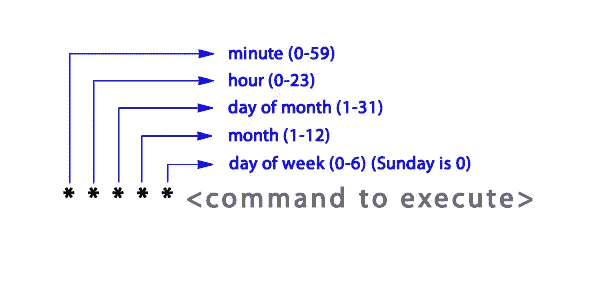
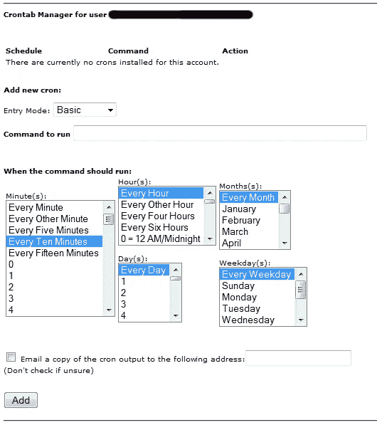
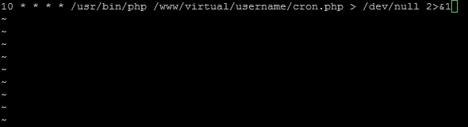
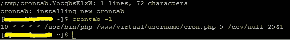
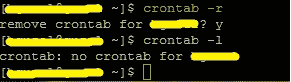
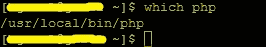
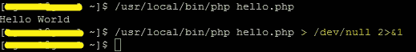
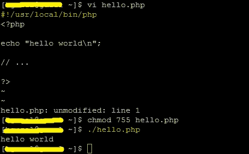

# Cron 作业—用于调度任务

> 原文：<https://levelup.gitconnected.com/cron-jobs-for-scheduling-tasks-1b835d9502b>


由 [Malvestida 杂志](https://unsplash.com/@malvestida?utm_source=unsplash&utm_medium=referral&utm_content=creditCopyText)在 [Unsplash](https://unsplash.com/?utm_source=unsplash&utm_medium=referral&utm_content=creditCopyText) 上拍摄的照片

Cron 作业用于调度在服务器上运行的任务。它们最常用于自动化系统维护或管理。然而，它们也与 web 应用程序开发相关。在许多情况下，web 应用程序可能需要定期运行某些任务。

# 定义

首先，让我们熟悉一下与这门学科相关的术语。

> " **Cron** "是类 Unix 操作系统(Linux、FreeBSD、Mac OS 等)中基于时间的作业调度器。这些作业或任务被称为“Cron 作业”。

有一个 cron“守护进程”运行在这些系统上。守护程序是一直在后台运行的程序，通常由系统启动。这个 cron 守护进程负责按计划启动这些 cron 作业。

该计划驻留在名为“crontab”的配置文件中。那里列出了所有的任务和它们的计时器。

# 为什么要使用 Cron Jobs？

服务器管理员已经使用 cron 作业很长时间了。然而，对于 web 开发，让我们来看一些与这个领域相关的 cron 作业的用例:

*   如果我们有一个会员网站，其中的帐户有到期日期，我们可以安排 cron 作业来定期停用或删除过期的帐户。
*   我们可以每天发送时事通讯电子邮件。
*   如果我们在您的数据库中有汇总表(或物化视图),它们可以用 cron 作业定期更新。例如，我们可以将每个网页的点击率存储在一个表中，但另一个汇总表可能包含每日流量汇总。
*   我们可以在某个时间间隔终止并删除缓存的数据文件。
*   我们可以自动检查我们网站内容中的断开链接，并定期通过电子邮件向我们发送报告。
*   我们可以安排长时间运行的任务从命令行脚本运行，而不是从 web 脚本运行。比如视频编码，或者群发邮件。
*   我们甚至可以做一些简单的事情，比如获取我们最近的推文，并缓存在一个文本文件中。

# 句法

下面是一个简单的 cron 作业:

`10 * * * * /usr/bin/php /www/virtual/username/cron.php > /dev/null 2>&1`

有两个主要部分:

1.  第一部分是“10 * * * *”。这是我们安排计时器的地方。
2.  该行的其余部分是从命令行运行的命令。

本例中的命令本身有三个部分:

1.  "/usr/bin/php "。PHP 脚本本身通常是不可执行的。因此，我们需要通过 PHP 解析器运行它。
2.  "/www/virtual/username/cron.php "。这只是脚本的路径。
3.  " >/dev/null 2>&1 "。这部分处理脚本的输出。稍后将详细介绍。

# 时序语法

如上所述，这是 cron 作业字符串的第一部分。它决定了 cron 作业运行的频率和时间。

它由五部分组成:

1.  分钟
2.  小时
3.  一月中的某一天
4.  月
5.  星期几

下面是一个例子:



## 星号

通常，您会看到星号(*)而不是数字。这代表了该职位所有可能的数字。例如，分钟位置的星号会使它每分钟运行一次。

我们需要看几个例子来完全理解这个语法。

## 示例:

这个 cron 作业将每分钟一直运行:

`* * * * * [command]`

该 cron 作业将在每小时的第 0 分钟运行(即每小时一次的 cron 作业):

`0 * * * * [command]`

这也是一个每小时的 cron 作业，但改为在第 15 分钟运行(即 00:15、01:15、02:15 等。):

`15 * * * * [command]`

这将在每天凌晨 2:30 运行一次:

`30 2 * * * [command]`

这将在每月第二天的午夜运行一次(即 1 月 2 日 12:00am、2 月 2 日 12:00am 等)。):

`0 0 2 * * [command]`

这将在星期一每小时运行一次(即一天 24 次，但仅在星期一):

`0 * * * 1 [command]`

您可以使用多个用逗号分隔的数字。这将每小时运行三次，时间分别为 0 分钟、10 分钟和 20 分钟:

`0,10,20 * * * * [command]`

也使用除法运算符。这将每小时运行 12 次，即每 5 分钟一次:

`*/5 * * * * [command]`

破折号可用于指定范围。这将在上午 5:00 到 10:00 之间每小时运行一次:

`0 5-10 * * * [command]`

此外，有一个特殊的关键字可以让您在每次服务器重新启动时运行 cron 作业:

`@reboot [command]`

# 设置和管理 Cron 作业

有几种不同的方法来创建和管理我们的 cron 作业。

## 控制面板

许多虚拟主机公司为他们的客户提供控制面板。如果我们是其中之一，我们可能能够在控制面板中找到一个部分来管理我们的 cron 作业。



## 编辑 Crontab

运行该命令将启动 vi(文本编辑器),并让我们编辑 crontab 的内容:

`crontab -e`



因此，熟悉[基本 vi 命令](http://www.cbu.edu/ietc/faq/vifaq.html)会很有帮助，因为它与你可能用过的任何其他文本编辑器都很不同。

如果我们只想查看现有的 crontab 而不编辑它，我们可以运行以下命令:

`crontab -l`



要删除 crontab 的内容:

`crontab -r`



## 加载文件

我们可以将您的所有 cron 作业写入一个文件，然后将其推送到 crontab:

`crontab cron.txt`

请小心，因为这将使用该文件的内容覆盖所有现有的 cron 作业，并且不会发出警告。

## 评论

我们可以添加注释，后跟#字符。

`# This cron job does something very important`

`10 * * * * /usr/bin/php /www/virtual/username/cron.php > /dev/null 2>&1`

## 设置电子邮件

正如我前面提到的，缺省情况下，crons 的输出通过电子邮件发送，除非我们丢弃它们或将它们重定向到一个文件。MAILTO 设置允许我们设置或更改将邮件发送到哪个电子邮件地址:

`MAILTO="username@example.com"`

`# This cron job does something very important`

`10 * * * * /usr/bin/php /www/virtual/username/cron.php > /dev/null 2>&1`

# 使用 PHP 解析器

默认情况下，CGI 脚本是可执行的，但 PHP 脚本不是。它们需要运行 PHP 解析器。这就是为什么我们需要把解析器的路径放在脚本的路径之前。

`* * * * * /usr/bin/php [path to php script]`

有时它可能在另一个位置下，比如“/usr/local/bin/php”。为了找到答案，我们可以尝试在命令行中运行:

`which php`



# 处理输出

如果我们不处理 cron 脚本的输出，它会将它们作为电子邮件发送到我们在服务器上的用户帐户。

## 丢弃输出

如果我们将“>/dev/null 2>&1”放在 cron 作业命令(或任何命令)的末尾，输出将被丢弃。



右括号(>)用于重定向输出。“/dev/null”就像一个输出黑洞。任何去那里的东西，都会被系统忽略。

这部分" 2>&1 "导致 STDERR(错误)输出被重定向到 STDOUT(正常)输出。因此，它也以“/dev/null”结束。

## 输出到文件

要将 cron 输出存储在文件中，请再次使用右括号(>):

`10 * * * * /usr/bin/php /www/virtual/username/cron.php > /var/log/cron.log`

每次都会重写输出文件。如果我们想将输出附加到文件的末尾，而不是完全重写，请使用双引号(>>)来代替:

`10 * * * * /usr/bin/php /www/virtual/username/cron.php >> /var/log/cron.log`

# 可执行脚本

通常我们需要在命令的开头指定解析器，就像我们一直做的那样。但是实际上有一种方法可以让你的 PHP 脚本像 CGI 脚本一样从命令行执行。

我们需要将路径添加到解析器，作为脚本的第一行:

```
#!/usr/local/bin/php<?phpecho "hello world\n";// ...?>
```

此外，确保设置正确的 chmod(如 755)使文件可执行。



当我们有一个可执行脚本时，cron 作业可以更短，如下所示:

`10 * * * * /www/virtual/username/hello.php`

# 防止 Cron 作业冲突

在某些情况下，我们可能经常运行 cron 作业，如果它们运行的时间比频率本身长，我们不希望它们发生冲突。

例如，我们可能每分钟都有一个 cron 作业在运行。然而，有时运行时间可能会超过一分钟。这会导致同一 cron 脚本的另一个实例在前一个实例完成之前开始运行。这样我们可能会创建太多繁忙的进程，如果它们不断地互相降低速度，可能会使服务器崩溃，并随着时间的推移导致更多的进程被创建。

这个问题可以通过文件锁定解决，更具体地说，可以通过非阻塞(LOCK_NB)类型的文件锁定解决。(如果你不熟悉文件锁定，我建议你[先阅读一下](https://php.net/manual/en/function.flock.php)。)

我们可以将这段代码添加到 cron 作业脚本中:

```
$fp = fopen('/tmp/lock.txt', 'r+');**if**(!flock($fp, LOCK_EX | LOCK_NB)) {echo 'Unable to obtain lock';exit(-1);}/* ... */fclose($fp);
```

对于常规文件锁定，如果存在锁定，flock()函数调用将阻塞脚本。一旦锁被打开，它就会释放。但是，对于非阻塞锁，比如上面的代码，函数调用不会停止脚本，但是如果存在锁，它会立即返回 FALSE。因此，在这种情况下，当我们看到存在一个锁时，我们可以立即退出脚本，这表明另一个 cron 作业当前正在运行。

# 阻止对 Cron 作业的 Web 访问

当您用 web 脚本语言(如 PHP)编写 cron 作业时，您可能希望确保没有人能够通过从浏览器加载它来执行它。一个简单的选择是将这些脚本存储在 web 文件夹之外。然而，对于一些开发人员来说，如果他们想将 cron 作业脚本保存在 web 应用程序文件夹中，这可能是不切实际或不可取的。

如果您将所有 cron 作业脚本放在一个文件夹中，您可以通过在. htaccess 文件中放置以下行来阻止访问:

`deny from all`

或者，您也可以通过在开头添加以下代码行来拒绝对脚本的访问:

`**if**`

这将确保当从 web 访问脚本时，它会立即中止。

# 结论

感谢您的阅读。尽管 cron 作业看起来只是系统管理员的工具，但它们实际上与许多类型的 web 应用程序相关。