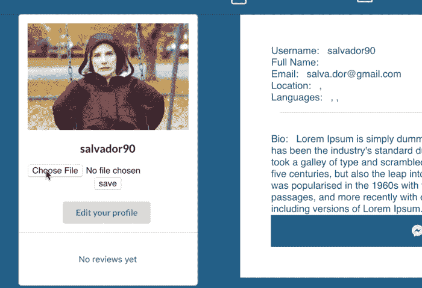
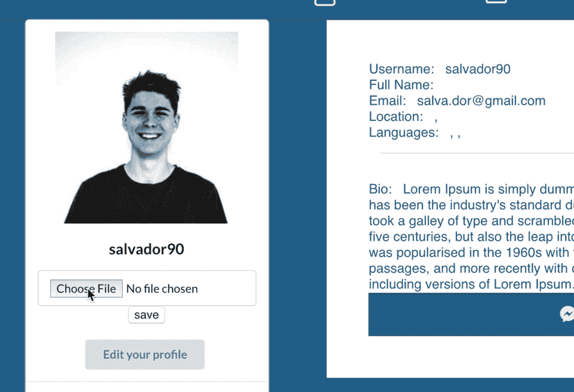

# 使用 react-image-crop 在 React 应用程序中上传裁剪图像

> 原文：<https://levelup.gitconnected.com/crop-images-on-upload-in-your-react-app-with-react-image-crop-5f3cd0ad2b35>


我最近用 Rails 后端构建了我的第一个 React/Redux 应用程序，你可以在我的另一篇文章中了解更多信息:

[](https://medium.com/@justynakuchta/mundoville-my-first-react-redux-app-b3f850545b90) [## mundoville——我的第一个 React/Redux 应用

### 为了我最后的熨斗学校项目，我决定建立一种社会网络。我称之为 Mundoville，意思是…

medium.com](https://medium.com/@justynakuchta/mundoville-my-first-react-redux-app-b3f850545b90) 

我希望我的用户能够上传个人资料图片，然后将这些图片作为 blobs 保存在 Rails 以及 AWS S3 桶中。我将假设你已经有一个工作的照片上传功能。设置 Rails 活动存储以将图像上传到 AWS，并将其与 React frontend 集成是另一篇文章的主题，有无数的资源可以帮助您完成这项工作。我发现最有帮助的是 Vimeo 上 App Academy 的系列视频。这是第一个:

我相信你精通谷歌，可以找到其余的。

这是我上传的个人资料图片在添加“反应-图像-裁剪”到我的应用程序之前的样子



以下是负责个人资料图片上传的 PicUpload 组件:

它工作得很好，但是我已经完成了我的 MVP，是时候实现我的延伸目标和学习新的东西了。这是我上传完个人资料照片后的样子:



为了处理图像裁剪，我的 PicUpload 组件需要做一些改动。

我首先将“react-image-crop”添加到我的应用程序中，并用

```
npm install --save react-image-crop
```

它将使我们能够访问 ReactCrop 组件，稍后我们将在 PicUpload 组件中呈现该组件。

然后我将它包含在我的 PicUpload 组件中

```
import ReactCrop from 'react-image-crop'
```

您还需要包含`dist/ReactCrop.css`或`ReactCrop.scss`。

```
import 'react-image-crop/dist/ReactCrop.css'// or scss:
import 'react-image-crop/lib/ReactCrop.scss'
```

然后，我继续更新我的构造函数:

我不需要 photoFile 或 photoUrl，因为我不会将它们发送到我的后端，而是上传图像的裁剪版本。

我不会详细介绍如何使用“react-image-crop”软件包，如果您想了解更多信息，我建议您阅读官方指南:

[](https://github.com/DominicTobias/react-image-crop) [## 多米尼克托拜厄斯/反应-图像-裁剪

### 一个无依赖反应的图像裁剪工具。沙盒演示响应(您可以使用像素或百分比)…

github.com](https://github.com/DominicTobias/react-image-crop) 

我将 crop 对象添加到我的构造函数中。虽然您最初可以忽略裁剪对象，但是任何后续的更改都需要保存到`onChange`中的状态，并传递到组件中。

我选择了 1/1 的长宽比，因为我希望我的侧面照片是方形的。另一个选项是 16/9。我添加了“croppedImageUrl”和“croppedImage”变量。前者是实际裁剪的图像，后者是从该图像生成的文件(稍后将详细介绍)，因此它可以作为 FormData 对象的一部分附加到我的 fetch 中。

我的 handleFile 和 handleSubmit 函数也需要一些更新:

我们现在将发送 croppedImage，而不是原始文件，但在此之前，先借助这些函数执行一些魔法:

我相信前三个函数不需要太多的解释，但是最后一个函数(我们实际上是在操作图像)看起来非常有趣。下面是在 **getCroppedImage():** 发生的事情

*   我们向函数传递两个参数，一个是图像(或者更确切地说，是我们之前创建的 imageRef，在当前作用域中我们称之为“图像”)和事件提供给我们的裁剪参数
*   我们正在创建一个新的 html 元素“canvas”(你可以在这里了解它是什么以及你可以用它做什么有趣的事情:[https://developer . Mozilla . org/en-US/docs/Web/API/HTMLCanvasElement](https://developer.mozilla.org/en-US/docs/Web/API/HTMLCanvasElement)
*   我们正在创建一个新的变量来表示画布的上下文(在我们的例子中，它是“2d ”,意味着我们正在“画”的是一个二维图像)
*   然后，我们将利用由`**CanvasRenderingContext2D**`接口提供的 drawImage()函数，它是 [Canvas API](https://developer.mozilla.org/en-US/docs/Web/API/Canvas_API) 的一部分，为`[<canvas>](https://developer.mozilla.org/en-US/docs/Web/HTML/Element/canvas)`元素的绘图表面提供 2D 渲染上下文。
*   最后，我们将 canvas 元素转换成一个 blob，然后将它转换成一个数据文件，该文件可以附加到表单数据中，然后我们将表单数据发送到后端

为了实现最后一部分，我们使用了一个方法，我找到并无耻地复制和粘贴，然后进行了一点重构，使其更符合我的喜好，将 dataUrl(从 blob 中获得)转换为一个文件对象:

有更简单的方法吗？也许吧。唉，我还没有找到它，这是我的第一个 React 应用程序，我很高兴对我以前的问题有了一个工作解决方案(我需要以文件对象的形式将我的图像发送到后端，这花了我一段时间来实现)。

最后，我们到达组件的 render()部分:

现在，我知道这是很多代码，但我真的希望它能对正在构建类似功能的人有所帮助，也许能节省他们一些时间！