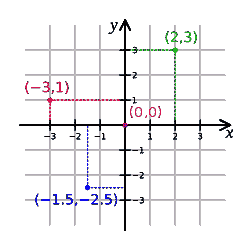
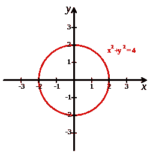
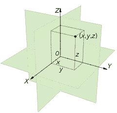
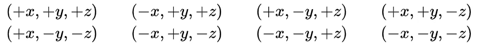
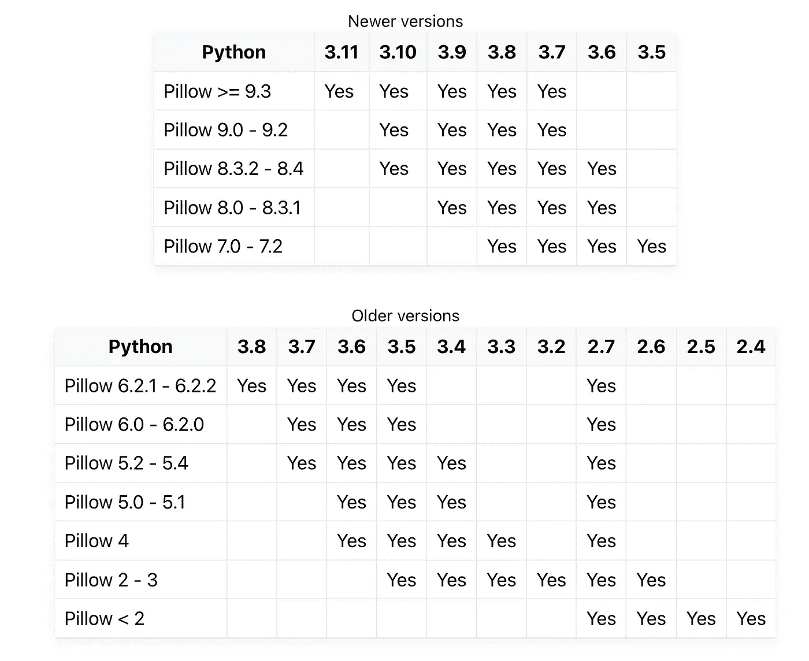
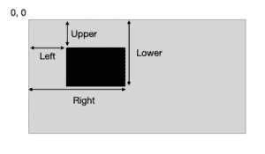

# 用 Pillow 裁剪 Python 中的图像

> 原文：<https://levelup.gitconnected.com/cropping-images-in-python-with-pillow-5b6194ac728c>

Python 和笛卡尔坐标系



https://upload . wikimedia . org/Wikipedia/commons/thumb/0/0e/Cartesian-coordinate-system . SVG/500 px-Cartesian-coordinate-system . SVG . png

# 什么是图像裁剪？

图像裁剪是照片编辑的一种方式，包括删除图像的一部分以强调主题、更改宽高比或改善取景。然后，您可以重构主题或将观众的注意力引向照片的某个部分。**自动图像裁剪**对大量图像执行相同的任务。定义

以下是与图像裁剪相关的关键术语:

*   **裁剪矩形** —由四个坐标定义的区域，将图像裁剪到该区域。裁剪操作会移除裁剪矩形之外的所有细节，提供裁剪矩形大小的修改图像。
*   **长宽比** —图像的宽高比。这个比率由冒号分隔的两个数字表示，例如 4:3 或四比三。
*   **像素** —组成数码照片的垂直和水平像素的网格。裁剪会剪切掉图像的某些部分，从而减少像素数并缩小图像大小。

# **笛卡尔坐标系**

在[平面](https://en.wikipedia.org/wiki/Plane_(geometry))中的一个**笛卡尔坐标系** ( [英国](https://en.wikipedia.org/wiki/British_English) : [/kɑːˈtiːzjən/](https://en.wikipedia.org/wiki/Help:IPA/English) ，[美国](https://en.wikipedia.org/wiki/American_English) : [/kɑːrˈtiʒən/](https://en.wikipedia.org/wiki/Help:IPA/English) )是一个[坐标系](https://en.wikipedia.org/wiki/Coordinate_system)，它通过一对[数值](https://en.wikipedia.org/wiki/Number) **坐标**唯一地指定每个[点](https://en.wikipedia.org/wiki/Point_(geometry))，这是从两个固定[到该点的](https://en.wikipedia.org/wiki/Perpendicular)[符号](https://en.wikipedia.org/wiki/Positive_and_negative_numbers)距离每条参考[坐标线](https://en.wikipedia.org/wiki/Coordinate_line)称为系统的一条 ***坐标轴*** 或简称 ***轴*** (复数 ***轴*** )，它们相交的点就是其 [*原点*](https://en.wikipedia.org/wiki/Origin_(mathematics)) ，在有序对(0，0)。坐标也可以定义为该点的[垂直投影](https://en.wikipedia.org/wiki/Orthogonal_projection)在两个轴上的位置，表示为离原点的有符号距离。

# 一维

为一维空间(即直线)选择笛卡尔坐标系涉及选择直线的点 *O* (原点)、长度单位和直线方向。一个方位选择由 *O* 确定的两条半直线中哪个是正的，哪个是负的；然后我们说，这条线从负半部“指向”(或“指向”)正半部。那么线的每个点 *P* 可以通过其到 *O* 的距离来指定，根据哪条半线包含 *P* 来取+或。

具有选定笛卡尔坐标系的线称为**数轴**。每个实数在线上都有唯一的位置。相反，线上的每个点都可以被解释为有序连续体中的一个[数](https://en.wikipedia.org/wiki/Number)，例如实数。

# 二维

在数学、物理和工程中，第一轴通常被定义或描绘为水平且向右，第二轴是垂直且向上。(然而，在某些[计算机图形](https://en.wikipedia.org/wiki/Computer_graphics)环境中，纵坐标轴可能朝下。)原点常标为 *O* ，两个坐标常以字母 *X* 和 *Y* 表示，或 *x* 和 *y* 表示。这些轴可以称为 *X* 轴和 *Y* 轴。字母的选择来源于最初的约定，即使用字母表的后半部分来表示未知值。字母表的第一部分用来表示已知值。

# 三维



[https://upload . wikimedia . org/Wikipedia/commons/thumb/6/69/Coord _ system _ CA _ 0 . SVG/480 px-Coord _ system _ CA _ 0 . SVG . png](https://upload.wikimedia.org/wikipedia/commons/thumb/6/69/Coord_system_CA_0.svg/480px-Coord_system_CA_0.svg.png)

每对轴定义一个*坐标超平面*。这些超平面将空间分成八个 [*八分圆*](https://en.wikipedia.org/wiki/Octant_(solid_geometry)) 。八分圆是:



# 枕头


[https://pillow . readthe docs . io/en/stable/_ static/pillow-logo-dark-text . png](https://pillow.readthedocs.io/en/stable/_static/pillow-logo-dark-text.png)

## 概观

*   Python 图像库为您的 Python 解释器增加了图像处理功能。
*   这个库提供了广泛的文件格式支持、高效的内部表示和相当强大的图像处理能力。
*   核心图像库旨在快速访问以几种基本像素格式存储的数据。它应该为通用图像处理工具提供坚实的基础。
*   Pillow 支持这些 Python 版本。



## 安装

```
python3 -m pip install --upgrade pip
python3 -m pip install --upgrade Pillow
```

## 坐标系

> Python 图像库使用笛卡尔像素坐标系，左上角为(0，0)。注意，坐标指的是隐含的像素角；寻址为(0，0)的像素的中心实际上位于(0.5，0.5)。坐标通常作为 2 元组(x，y)传递给库。矩形被表示为 4 元组，首先给出左上角。例如，覆盖所有 800x600 像素图像的矩形被写成(0，0，800，600)。

## 用 Pillow 裁剪 Python 中的图像

```
Image.crop(box=None)
```

`box`参数接受一个元组，该元组具有裁剪矩形的四个坐标的四个值:左、上、右和下。裁剪矩形绘制在图像内，它描绘了图像中您要裁剪的部分。`Image.crop`返回一个`image`对象。

```
from PIL import Image
```

1.  从文件系统加载一个图像，用`Image.open()`类将图像转换成`Image`类的一个实例。添加`Image.show()`会在外部查看器中显示图像。

```
img = Image.open('./1672305183.png')
img.show()
```

2.作物图像

```
box = (250, 250, 750, 750)
cropped_image = img.crop(box)
```

3.保存图像

```
cropped_image.save('1672305267.jpg')
cropped_image.show()
```

4.结果


https://media . istock photo . com/id/1344872631/photo/portrait-of-a group-of-confident-young-business persons-work-together-in-a-modern-office . jpg？b = 1&s = 170667 a&w = 0&k = 20&c = b 5s 611 E4 oqhs 67 LV 8 a 8 wsxuiqn 8 ZL 3 MFS dv _ 8 ze 5 aaq =


裁剪后

## 密码

*需要从原始图像中裁剪的区域作为一个元组传递到* `*crop()*` *。元组包含 4 个元素-* ***左*** *，* ***上*** *，* ***右*** *，以及* ***下*** *。这 4 个元素指定了裁剪图像的大小和位置。左边和上边指定左上角的 x 和 y 坐标，而右边和下边指定我们正在裁剪的区域的右下角的 x 和 y 坐标。图像的左上角坐标为 0，0。*

## 幕后

*   *左侧矩形的 X 坐标*
*   ****顶部*** 矩形顶部的 Y 坐标*
*   ****右侧*** 矩形右侧的 X 坐标*
*   ****底部*** 矩形底部的 Y 坐标*

```
 *def crop(self, box=None):
        """
        Returns a rectangular region from this image. The box is a
        4-tuple defining the left, upper, right, and lower pixel
        coordinate. See :ref:`coordinate-system`.

        Note: Prior to Pillow 3.4.0, this was a lazy operation.

        :param box: The crop rectangle, as a (left, upper, right, lower)-tuple.
        :rtype: :py:class:`~PIL.Image.Image`
        :returns: An :py:class:`~PIL.Image.Image` object.
        """

        if box is None:
            return self.copy()

        if box[2] < box[0]:
            raise ValueError("Coordinate 'right' is less than 'left'")
        elif box[3] < box[1]:
            raise ValueError("Coordinate 'lower' is less than 'upper'")

        self.load()
        return self._new(self._crop(self.im, box))*
```

**

*[*https://pillow . readthedocs . io/en/stable/_ modules/PIL/image . html # image . crop*](https://pillow.readthedocs.io/en/stable/_modules/PIL/Image.html#Image.crop)*

# *参考*

1.  *[https://en.wikipedia.org/wiki/Cartesian_coordinate_system](https://en.wikipedia.org/wiki/Cartesian_coordinate_system)*
2.  *罗伯特·比克斯；德索萨，哈里 J. [《解析几何》](https://www.britannica.com/topic/analytic-geometry)。大英百科全书。检索于 2017 年 8 月 6 日。*
3.  *亚历山大·肯特；彼得·武贾科维奇(2017 年 10 月 4 日)。 [*《劳特利奇测绘与制图手册》*](https://books.google.com/books?id=EVRSDwAAQBAJ&q=Nicole+Oresme+coordinate&pg=PT307) 。劳特利奇。[ISBN](https://en.wikipedia.org/wiki/ISBN_(identifier))9781317568216。*
4.  *[https://pillow.readthedocs.io/en/stable/index.html](https://pillow.readthedocs.io/en/stable/index.html)*

# *分级编码*

*感谢您成为我们社区的一员！在你离开之前:*

*   *👏为故事鼓掌，跟着作者走👉*
*   *📰查看[升级编码出版物](https://levelup.gitconnected.com/?utm_source=pub&utm_medium=post)中的更多内容*
*   *🔔关注我们:[Twitter](https://twitter.com/gitconnected)|[LinkedIn](https://www.linkedin.com/company/gitconnected)|[时事通讯](https://newsletter.levelup.dev)*

*🚀👉 [**加入升级人才集体，找到一份神奇的工作**](https://jobs.levelup.dev/talent/welcome?referral=true)*