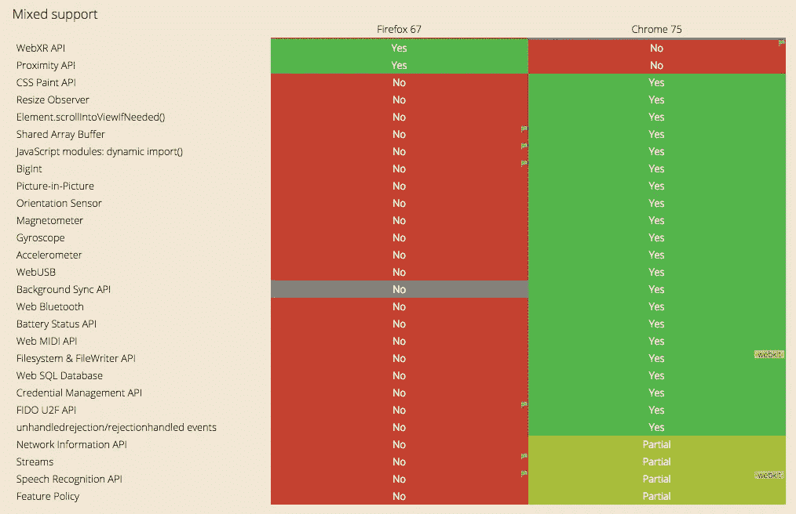
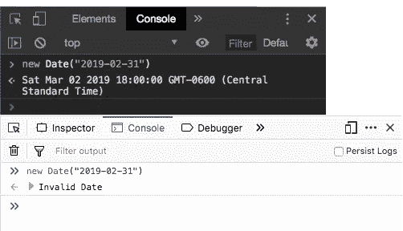
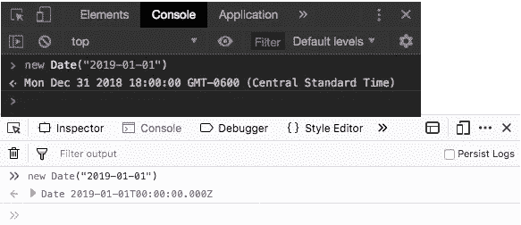
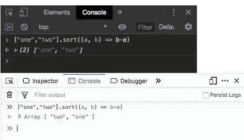
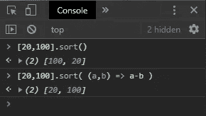
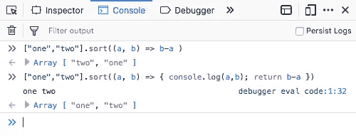
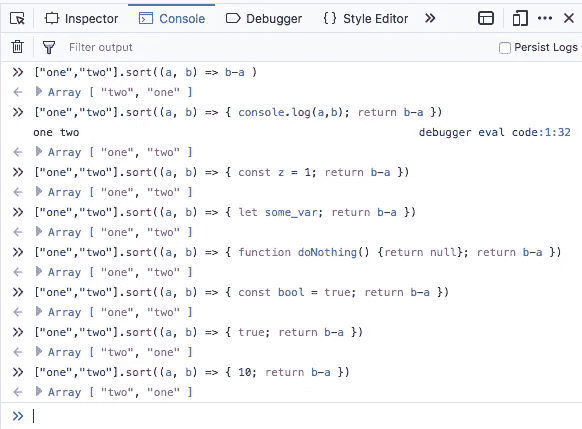
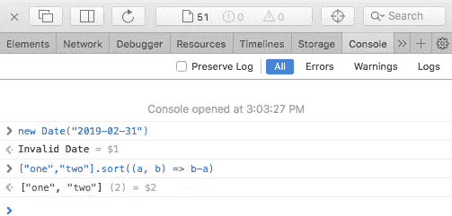
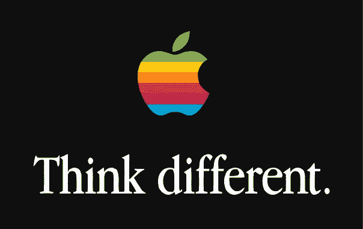

# 跨浏览器疯狂

> 原文：<https://levelup.gitconnected.com/cross-browser-crazy-44e90d61b204>

## Chrome 和 Firefox 中的 JavaScript

"依赖于实现。"从来没有两个词让这么多人如此悲伤。

*这是为了强调而夸张，这是一种文体选择，不要@我*

每个网络浏览器都有自己的 JavaScript 引擎。谷歌为 Chrome 和其他基于 Chrome 的浏览器开发了 [V8](https://v8.dev/) (很快也包括[微软 Edge](https://blogs.windows.com/windowsexperience/2018/12/06/microsoft-edge-making-the-web-better-through-more-open-source-collaboration/) )，Mozilla 为 Firefox 开发了 [SpiderMonkey](https://developer.mozilla.org/en-US/docs/Mozilla/Projects/SpiderMonkey) ，苹果的 Safari 使用了 [JavaScriptCore](https://developer.apple.com/documentation/javascriptcore) 。每个引擎决定实现什么特性，以及如何实现它们。例如:



火狐 vs. Chrome，来自[caniuse.com](https://caniuse.com/#compare=firefox+67,chrome+75&compare_cats=JS,JS%20API)

在最近部署的一个项目中，我发现 Chrome 与 Firefox 在实现 JavaScript 的方式上有两个显著的不同。

*反正对我很重要，不要@我*

## 带你上`Date()`

它们实现日期对象的方式不同。

考虑一下这个:

```
new Date("2019-02-31")
```

显然，没有 2 月 31 日；如果这是令人惊讶的，咨询日历或八岁的孩子。在我们各自浏览器的 Javascript 控制台中输入这一行:



顶部是 Chrome，底部是 Firefox

**事情是这样的:**当你在 Javascript 中创建一个`new Date()`时…好吧，让我们直接去[Date 对象的文档:](https://developer.mozilla.org/en-US/docs/Web/JavaScript/Reference/Global_Objects/Date)

> **注意:**当`Date`被调用为具有多个参数的构造函数时，如果值大于它们的逻辑范围(例如，月值为 13，分钟值为 70)，相邻的值将被调整。例如`new Date(2013, 13, 1)`相当于`new Date(2014, 1, 1)`

因此，根据文档，Javascript 应该自动更正愚蠢/懒惰的时刻，比如要求一个不存在的日期。在 Chrome 中，确实如此。在 Firefox 中，它没有。

附注:我在追踪一个相关的 bug 时也发现了这一点:

> 对 ISO 8601 格式的支持有所不同，因为只有日期的字符串(例如“1970–01–01”)被视为 UTC，而不是本地。

这是它的意思。假设您正在实例化`new Date("2019-01-01")`。很好，ISO 8601 说 YYYY-MM-DD 是一个有效的日期字符串。

同样，让我们将这段代码放入浏览器的控制台:



**事情是这样的:**就像上面说的文档，当你实例化一个没有时间字符串的`new Date()`(像`'December 17, 1995 03:24:00'` 或者`'1995–12–17T03:24:00'`)时，时间被设置为 UTC，也就是以前所谓的格林威治标准时间。当那个`Date`对象在 Chrome 中返回时，它会根据本地系统上设置的时区进行修正。就我而言，我使用的是中部标准时间，比 UTC 晚 6 个小时。所以英国的午夜到凌晨 5 点 59 分是德克萨斯州的昨天。如果像我一样，你发现你的日期在 Chrome 中被推迟了一天，这可能就是原因。Firefox 不校正时区，所以 1 月 1 日仍然是 1 月 1 日。

## 什锦`sort()`

当使用比较函数对字符串进行排序时，它们以不同的方式实现了`sort`函数。考虑一下这个:

```
["one","two"].sort((a, b) => b-a)
```

这里我们试图用一个比较函数对一组字符串进行排序。[根据文档，](https://developer.mozilla.org/en-US/docs/Web/JavaScript/Reference/Global_Objects/Array/sort)排序应该根据字符的 Unicode 值进行。`sort()`的默认行为是升序，所以如果想按降序排序，就得传入一个比较函数:`(a, b)=> b-a`。t '(如' two ')的值比' o '(如' one ')的值大，所以如果您的比较函数返回`b-a`，也就是降序，您可能会期望`sort`反转“one”和“two”的顺序。(实际上，如果你在对字符串进行排序，那是行不通的；稍后会详细介绍。)



顶部是 Chrome，底部是 Firefox。找出不同之处。

**事情是这样的:**如果你试图用 JavaScript 从一个字符串中减去另一个字符串，它会返回`NaN`。(对于用比较函数对字符串进行排序，您可能希望使用`[localeCompare()](https://developer.mozilla.org/en-US/docs/Web/JavaScript/Reference/Global_Objects/String/localeCompare)`。)如果你得到排序函数返回的`NaN`，你得到的是未排序的原始数组，或者至少你应该这样做。Chrome 是对的，Firefox 是错的。

这最初让我感到困惑，因为默认情况下，JavaScript 中的`sort`是为处理字符串而设计的，所以我认为`return b-a`可以很好地按照字母顺序对字符串进行排序。

如果传递了一个整数数组，它将一个数字一个数字地排序，而不是整个整数的值。为了正确地对数字进行排序，您需要*向*传递一个比较函数:



记住，孩子们:电脑是愚蠢的

奇怪的是。如果你在排序函数体中添加一个`console.log`，Firefox 会按照它应该的方式运行。



二，一，一二，麦克风检查

在 Firefox 中的`return`之前，我尝试了很多其他东西，只是为了看看会发生什么:



如果你预见到了，请发表评论；如果你没有预见到，请按下鼓掌按钮。

如果有另一个函数定义，或者一个变量声明，Firefox 会表现出来。如果只有一个值，一个布尔值或者一个整数，我们又回到了开始的地方。和一个比我懂得多的朋友聊天，他也被难倒了；他提到[钻研火狐源代码](https://developer.mozilla.org/en-US/docs/Mozilla/Tech/Viewing_and_searching_Mozilla_source_code_online)，这远远超出了我对这个的兴趣水平。

只是为了好玩，我也在 Safari 的 Javascript 控制台中尝试了上述情况:



哦苹果。你们都疯了。

[](https://levelup.gitconnected.com)[](https://gitconnected.com/learn/javascript) [## 学习 JavaScript -最佳 JavaScript 教程(2019) | gitconnected

### 50 大 JavaScript 教程-免费学习 JavaScript。课程由开发人员提交并投票，从而实现…

gitconnected.com](https://gitconnected.com/learn/javascript)