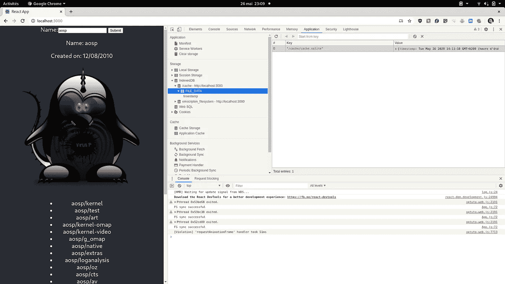

# 用 C++进行跨平台移动和 Web 开发

> 原文：<https://levelup.gitconnected.com/cross-platform-mobile-and-web-development-with-c-explained-7076b84c425b>

## 第 6 部分:添加 SQLite 对离线和数据操作的支持

如果你要编写复杂的软件，你很有可能需要数据存储和操作。我们很幸运 SQLite 是为我们准备的，它有一个小的二进制代码，可移植，并且完全成熟。让我向您展示如何通过简单的设置从 C++代码中使用它。更好的是:无需编写任何 SQL。

本教程的代码可在 https://github.com/skonstant/xptuto/tree/part6_sqlite 获得


# SQLite:满载但小巧

[SQLite](https://www.sqlite.org/index.html) 是一个*关系数据库管理系统*，它支持 SQL-92，提供了很多很酷的东西:全文搜索、JSON、分层、递归查询等等。

它是一个嵌入式数据库，而不是一个服务器系统，非常适合我们的需要，我们将把它包含在我们的构建中。许多主要玩家也在他们自己的包中使用它。

其他系统将使用他们所谓的 [**合并**](https://www.sqlite.org/amalgamation.html) **。**SQLite 的所有代码都在一个单独的**中。c** 文件，虽然很大，但是用我们的 **ccache** 设置编译时间不成问题。

XCode 将 SQLite 作为其 iOS 库的一部分，Mac OS 也是(与 CMake 一起工作)，Android NDK 没有——令人惊讶的是，因为它从一开始就是 Android 上 SQL 存储的主干，所以它没有在 NDK 中公开。Web/Emscripten 当然没有。

对于我们的 iOS 项目，让我们只是在构建阶段添加它🡲链接二进制与库，并添加 **libsqlite3.tbd.** 完成，头是可见的，链接工作。

对于我们的 CMake 项目(Android、本地计算机和 Emscripten)，我们使用 CMake **find_package()** 命令。

```
find_package (**SQLite3**)
**if** (**SQLITE3_FOUND**)
    include_directories(**${SQLITE3_INCLUDE_DIRS}**)
**else** (**SQLITE3_FOUND**)
    *# add amalgamation code and include* set(**SRC ${SRC} sqlite-amalgamation-3310100/sqlite3.c**)
    include_directories(**sqlite-amalgamation-3310100**)
**endif** (**SQLITE3_FOUND**)
```

这就是它的全部内容，现在我们的构建中已经有了它，可以开始在内存中处理数据和 SQL 了，只是到目前为止，因为我们需要解决文件存储问题。

## 存储问题

为了保存数据，我们需要能够写入文件。在 Android 和 iOS 上，我们可以访问只有我们的应用程序才能使用的文件夹，我们将在两者上选择缓存文件夹，因为这只是为了缓存。请注意，应用程序的缓存文件夹中的数据可能会随时消失。如果你需要更可靠的东西，使用文件目录。无论哪种方式，这些都是你的应用程序私有的，不需要特别的许可。

请注意，默认情况下，文件文件夹会备份到 Google 或 Apple cloud，您可以在配置中选择退出。

我们在 Xptuto make_instance()工厂方法中添加了一个文件路径参数。对于 Android，我们做到了:

```
Xptuto.makeInstance(
    **new** JavaHttpClient(getApplicationContext()),
    **new** AndroidThreads(),
    getCacheDir().getAbsolutePath()); // or getFilesDir() 
```

对于 iOS，我们做到了:

```
**auto** cacheDirectory = [NSSearchPathForDirectoriesInDomains(
    NSCachesDirectory, NSUserDomainMask, **true**) lastObject];
// or NSApplicationSupportDirectory x = Xptuto::make_instance(
        std::make_shared<AppleHttpClient>(), 
        std::make_shared<AppleThreads>(),
        djinni::String::toCpp(cacheDirectory));
```

对于 web 来说，难度更大。浏览器没有我们的文件系统，emscript 有 [*文件系统 API*](https://emscripten.org/docs/api_reference/Filesystem-API.html#filesystem-api-persist-data) 有点不连贯。为了创建您需要的文件系统，您需要在 Javascript 层做一些事情。

在我们的初始化代码中，我们做到了:

```
**var *Module*** = {
  onRuntimeInitialized: **function**() {
    FS.mkdir(**'/cache'**);
    FS.mount(IDBFS, {}, **'/cache'**);
    FS.syncfs(**true**, **function** (err) {
      ***window***.**xptuto** = ***Module***.createInstance();
    });
  }
};// then in C++
xptuto::Xptuto::make_instance(
    std::make_shared<WebHttpClient>(),
    std::make_shared<WebThreads>(), **"/cache"**);
```

这看起来很简单。问题还在后面:如果我们写文件，我们需要手动同步。在我们的例子中，当我们写入数据库时。我们可以随时同步，即使没有它，应用程序也可以工作，如果我们没有同步就离开网页，更改将会丢失，记住这一点。并且我们不能在 *onbeforeunload* 中同步，因为 FS.syncfs()是异步的。可以使用各种策略来克服这个问题。在我的例子中，我在回调中同步。

```
**callback** = **new *Module***.JSGetReposCb({
    on_error: (error) => ***console***.error(error),
    on_success: (repos, user) => {
       ... 
       FS.syncfs(**function** (err) {});
```

我觉得，这并不伟大，但这是一个很小的代价。

# 保持面向对象:使用 ORM

尽管我喜欢 SQL，但我不喜欢在代码中使用字符串。我发现对象关系映射器非常有用:我们使用 C++，所以我们可以利用我们的工具在部署之前检查我们的代码，并且我们确信生成的 SQL 总是有效的。

我们将使用一个只有头文件的 C++17 库，非常容易集成和使用。下面是我们对用户表的定义:

```
make_storage(dbFile,
    make_table(**"users"**,
        make_column(**"id"**, &User::id, primary_key()),
        make_column(**"login"**, &User::login, unique()),
        make_column(**"avatar_url"**, &User::avatar_url),
        make_column(**"created_at"**, &User::created_at))
```

它从我们的字段类型中推导出 SQLite 类型，我自己添加了对 **std::chrono::time_point** 的支持(我从 epoch 开始将它们作为毫秒传递)。就像我们的 JSON 库一样，它提供了模板方法，我们只是专门为我们的自定义类型。

现在我们在一个表中有了用户，让我们写一个小测试:

```
**TEST_F**(Xptuto, OrmTest) {
    **auto** instance = std::make_shared<XptutoImpl>(
                        stubHttp,stubThreads, std::nullopt);
    stubHttp->path = **"/responses/users_aosp.json"**;

    **auto** user = instance->get_user_sync(**"aosp"**);

    **auto** storage = SQLStorage(**":memory:"**);
    storage.store_user(user.value());
    **auto** u = storage.get_user(**"aosp"**);
    **EXPECT_EQ**(u.created_at, user->created_at);
    **EXPECT_EQ**(u.login, **"aosp"**);
}// get_user():
User SQLStorage::get_user(**const** std::string &login) {
    **auto** allUsersList = 
        storage.get_all<User, std::vector<User>>(
            where(c(&User::login) == login));
    **return** allUsersList.at(0);
}
```

就这么简单，没有 SQL 字符串。SQLite Orm 当然可以做更复杂的查询，最后，它让你写原始的 SQL。注意，对于测试，我们使用 **":memory:"** 作为数据库文件，这告诉 SQLite 使用内存中的数据库。

我在这个方法中选择返回找到的用户或 throw，因此使用了 **std::vector:::at()** 。我发现异常很有意义，有时比返回空值更有意义。

> Q 先不说这个:出于“优化”的原因，默认情况下，在 Emscripten 中异常是禁用的。在我看来，这是优化的错误地方，C++标准库充满了抛出异常的 API，这是一种比崩溃更干净的获得错误的方式。因此，通过向所有编译和链接标志添加**-s DISABLE _ EXCEPTION _ CATCHING = 0**来启用异常。在其他平台上，默认情况下会启用异常。

我还在一个表中定义了我的 Repo 对象，并为用户提供了一个外键。

```
make_table(**"repos"**,
           make_column(**"id"**, &Repo::id, primary_key()),
           make_column(**"name"**, &Repo::name),
           make_column(**"full_name"**, &Repo::full_name),
           make_column(**"owner"**, &Repo::owner),
           make_column(**"priv"**, &Repo::priv),
           make_column(**"descr"**, &Repo::descr),
           make_column(**"created_at"**, &Repo::created_at),
           foreign_key(&Repo::owner).references(&User::id)));
// get repos for a user:
storage.get_all<Repo, std::vector<Repo>>(
                 where(c(&Repo::owner) == user.id));
```

现在我们可以极大地改进我们的 get_user()方法(以及所有其他 get…方法。

```
**void** XptutoImpl::get_user(**const** std::string &login,
         **const** std::shared_ptr<GetUserCb> &cb) {
    **auto** me = shared_from_this();

    threads->create_thread(**"get_user"**, 
            std::make_shared<ThreadFuncImpl>([me, cb, login]() {
        **try** {
            **try** {
                **auto** user = me->storage.get_user(login);
                me->threads->run_on_main_thread(
                    std::make_shared<ThreadFuncImpl>([cb, user]() {
                        cb->on_success(user);
                }));
            } **catch** (...) {
                **auto** user = me->get_user_sync(login);
                **if** (!user) {
                    me->threads->run_on_main_thread(
                        std::make_shared<ThreadFuncImpl>([cb]() {
                          cb->on_error(**"could not load user"**);
                    }));
                } **else** {
                    me->storage.store_user(user.value());
                    me->threads->run_on_main_thread(
                     std::make_shared<ThreadFuncImpl>([cb, user]() {
                        cb->on_success(user.value());
                    }));
                }
            }
        } **catch** (...) {
            me->threads->run_on_main_thread(
                  std::make_shared<ThreadFuncImpl>([cb]() {
                cb->on_error(**"could not load user"**);
            }));
        }
    }));
}
```

1.  尝试从本地数据库🡲success 回拨获取用户
2.  尝试从网络和存储到数据库🡲成功回拨
3.  错误回调。

所有回调都在主线程上调用。

# 示例应用

## 反应

这次我们创建了一些小的示例应用程序，所以你可以测试一下。对于 web，我创建了一个小小的 React 应用程序，这是用户视图:

```
**class** UserView **extends *React***.Component {

    render() {
        **const** user = **this**.**props**.**user**;
        **if** (user) {
            **return** (
                <**div className="userDetails"**>
                    <**p**>Name: {user.login}</**p**>
                    <**p**>Created on: {**new *Date***(user.created_at.millis()).toLocaleDateString()}</**p**>
                    <**p**><**img className="avatar" alt="avatar" src=**{user.avatar_url}/></**p**>
                </**div**>
            );
        } **else** {
            **return null**;
        }
    }
}
```

唯一值得注意的是，我们从毫秒开始创建日期。

用户是从表单加载的:

```
**if** (!**this**.**callback**) {
    *// eslint-disable-next-line no-undef* **this**.**callback** = **new *Module***.JSGetReposCb({
        on_error: (error) => ***console***.error(error),
        on_success: (repos, user) => {
            **this**.**props**.**onUserChange**(user);
            **this**.**props**.**onReposChange**(repos);

            *// eslint-disable-next-line no-undef* FS.syncfs(**function** (err) {
                ...
            });

        }
    });
}

***window***.**xptuto**.get_repos_for_user_name(
                **this**.**state**.**value**,**this**.**callback**);
```

这里也没什么特别的，工作是在 C++层完成的，视图层不知道后台发生了什么。唯一要记住的是同步伪文件系统。注意，头像是通过设置图像的 **src** 属性自动加载的。

此外，WebAssembly 模块中可用的类和函数对 Javascript 工具(这里是 eslint 和 Babel)是不可见的，所以我们需要在使用它们时禁用检查，也许在某些时候工具将能够找到 embind 公开的内容，谁知道呢。

## 机器人

对于 Android，我做了两个活动，一个用于用户搜索和细节，另一个用于列出存储库。

```
x.getUser(v.getText().toString(), **new** GetUserCb() {
    @**Override
    public void** onSuccess(User user) {
        if(!isFinishing() && !isDestroyed()){
            progressBar.hide();
            details.setVisibility(View.VISIBLE);
            userName.setText(user.login);
            creationDate.setText(DateFormat.getDateInstance(
                DateFormat.MEDIUM,
                Locale.getDefault()).format(user.createdAt));
            avatar.setImageDrawable(***null***);
            Glide.with(MainActivity.this)
                .load(user.avatarUrl).into(avatar);
        }
    }

    @**Override
    public void** onError(String error) {
        if(!isFinishing() && !isDestroyed()){
            progressBar.hide();
            notFound.setVisibility(View.VISIBLE);
        }
    }
});
```

又轻松了。我们使用 Java 的 **Dateformat** 以本地化的方式格式化日期。 [Glide](https://bumptech.github.io/glide/) 用来加载头像图片，那是安卓最好的图片加载库。

当打开 list 活动时，我们只需在 intent 中传递用户名，因为我们将用户存储在存储中，我们可以从那里检索它。我有几次被发现在一个 Intent 或 Bundle 中传递了太多的数据，最好传递一个标识符。

## ios

与 Android 类似，这次有两个 ViewControllers，一个包含搜索表单和细节，一个包含存储库列表，下面是我们如何获取用户:

```
**__weak auto** welf = self;

**auto** x = Xptuto::get_instance();

x->get_user(djinni::String::toCpp(_userInput.text), std::make_shared<GetUserCbImpl>(
        [welf](**const** User &user) {
            [welf.progress stopAnimating];
            [welf showDetails:user];
        }, [welf](**const** std::string &error) {
            [welf.progress stopAnimating];
            welf.notFoundLabel.hidden = **false**;
        }));
```

简单易行。我们使用一个指向 viewcontroller 的弱指针，这样我们的回调就不会占用它。



# 结论

我已经向您展示了离线和复杂的数据操作只是一个编译的距离，您可以掸掉您的数据库建模书籍，并去实现您的便携式设备上的数据缓存现在，没有借口。

不需要尝试从手机或模拟器中取出 SQLite 数据粘贴文件等有趣的东西，您可以在计算机上、内存中或文件中运行您的代码，将其加载到 SQLite 浏览器 GUI 中，它将在 Web、iOS 和 Android 上以完全相同的方式运行。

 [## SQLite 的数据库浏览器

### DB Browser for SQLite (DB4S)是一个高质量的可视化开源工具，用于创建、设计和编辑数据库文件…

sqlitebrowser.org](https://sqlitebrowser.org/) 

# 参考

[](https://www.pearson.com/us/higher-education/program/Connolly-Database-Systems-A-Practical-Approach-to-Design-Implementation-and-Management-6th-Edition/PGM116956.html) [## 数据库系统:设计、实施和管理的实用方法，第 6 版

### Thomas Connolly Carolyn Begg 第 1 部分背景 1 第 1 章数据库简介 3 1.1 简介 4 1.2…

www.pearson.com](https://www.pearson.com/us/higher-education/program/Connolly-Database-Systems-A-Practical-Approach-to-Design-Implementation-and-Management-6th-Edition/PGM116956.html) 

# 另请参阅:

# [简介:](https://medium.com/@stephane_21545/cross-platform-mobile-and-web-development-with-c-explained-aac9952b4f8c)

我们提出我们的技术选择。

# 1.[项目设置](https://medium.com/@stephane_21545/cross-platform-mobile-and-web-development-with-c-explained-8d2ab1224c0a)

我们将配置一个在 iOS/Xcode、Android Studio 和 Emscripten/CMake 上编译和运行的项目，并展示如何运行和调试其中的 3 个项目。

# [2。传递周围的物体](https://medium.com/@stephane_21545/cross-platform-mobile-and-web-development-with-c-explained-587a235cbb0b)

在这个例子中，我们将展示如何将对象从业务逻辑层传递到不同的视图层。

# [3。单元测试](https://medium.com/swlh/cross-platform-mobile-and-web-development-with-c-explained-8fb5fb916d35)

这里，我们使用常用的 **Google Test** 框架在 C++代码中设置单元测试。

# [4。休息客户端](https://medium.com/swlh/cross-platform-mobile-and-web-development-with-c-explained-e8cd420665af)

我们使用平台 HTTP 实现实现了一个最小的 ReST 客户端。

# [5。多线程](/cross-platform-mobile-and-web-development-with-c-explained-94e112d31351)

是的，你可以以可移植的方式在所有三种环境中使用线程！

> 下次我们将谈论 OpenGL。