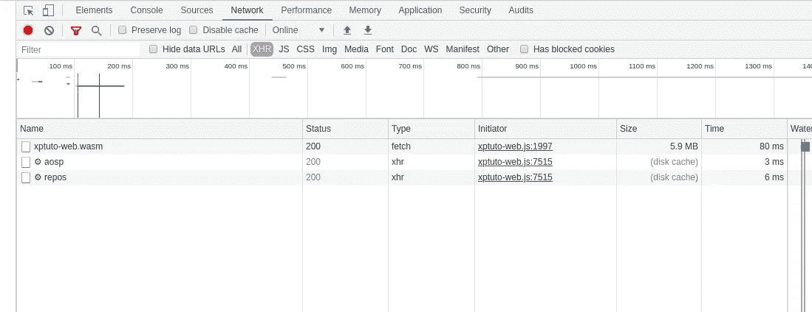

# 用 C++进行跨平台移动和 Web 开发

> 原文：<https://levelup.gitconnected.com/cross-platform-mobile-and-web-development-with-c-explained-94e112d31351>

## 第 5 部分:多线程

当我们处理图形软件时，我们需要确保我们的用户界面保持响应。这就是我们需要多线程的原因，我们需要能够在后台执行长时间的操作，并将结果返回到前台。


C++11 发挥了成熟的多线程库的作用，它是可移植的，易于使用。比 [**POSIX**](https://en.wikipedia.org/wiki/POSIX) 线程简单多了。然而，我们需要小心一些陷阱。

源代码在这里:【https://github.com/skonstant/xptuto/tree/part5_threads】T4

# 主线程

每个图形工具包都有我们称之为*的主线程*。这不仅仅是一个线程，它实际上是一个循环，一个无限的循环，程序员或操作系统可以停止它。循环处理事件上的动作(一个按钮点击，*例如*)，绘制 UI 和其他东西，按照一定的顺序。为了能够向主线程发送数据，我们实际上*向队列发送*消息，然后在循环中处理该消息。如果处理消息的时间太长，循环就没有时间绘制，我们就会感到紧张不安。

C++本身或任何编程环境都不知道主循环，UI 工具包知道，在我们的例子中，iOS 上的 **UIKit** ，Android 上的 **Activity** 框架，以及 Web assembly 中的**浏览器事件循环**。

对于我们的工作，我们需要一个通用的方法在主循环上运行一些东西，在后台线程中运行就像创建一个新的 **std::thread** 一样简单。(Java 除外，下面我们会看到)。

```
std::thread t([](**const** std::shared_ptr<ThreadFunc> &f) {
    f->run();
}, func);
t.detach();
```

因为我们需要用 Java 实现它，我们在 Djinni 中定义了我们的 *PlatformThreads* 接口，灵感来自于 [DropBox](https://github.com/dropbox/djinni/tree/master/extension-libs/platform-threads) 的一个实现。

```
platform_threads = interface +j +c {
    create_thread(name: string, func: thread_func);

    run_on_main_thread(func: thread_func);

    is_main_thread(): bool;
}

thread_func = interface +c {
    run();
}
```

我们需要一个线程函数接口，类似于*Runnable.java*。和 3 个简单的方法:create_thread()，run_on_main_thread()我们需要能够查询环境，看看我们是否在主线程中，这样我们就可以避免 post，我们可以直接运行。

## 苹果实现

这是最简单的一个，还是在**中。mm** ，我们使用滑稽命名的[*Grand Central Dispatch*](https://developer.apple.com/documentation/dispatch?language=objc)库(我们不添加任何库，它是**基础**的一部分)，我们需要的只是主线程的工作，创建一个线程是在 C++中完成的，就像上面一样。

发布一个要在主线程中执行的 *ThreadFunc* 是这样完成的:

```
__block **auto** f = func;

dispatch_async(dispatch_get_main_queue(), ^(**void**) {
    f->run();
});
```

注意，我们需要将 shared_ptr to func 复制到 __block 变量中，这样它的引用计数就会增加。如果我们不这样做，func 可能会在 func->run()被调用之前被释放，我们会进入“未定义的行为”，也称为“崩溃”。

这里最酷的是: **func** 是一个 C++ **shared_ptr** 和 **__block** 是一个 Objective-C 编译器关键字，从设计上来说，它们可以完美地协同工作。

我们如何知道我们在主线程上？ **NSThread.isMainThread** 。

MacOS 和 iOS 的工作已经完成，我们可以在 GTEST 中测试所有这些，并且工作正常。

## Web 程序集实现

同样，创建线程是用 **std::thread** 完成的。发布到前台并没有多复杂，除了没有方法，据我所知，找到 emscriten[html 5 API](https://emscripten.org/docs/api_reference/html5.h.html)中的主线程。

我们需要保存我们被初始化的线程 id，并且我们需要在主浏览器线程中被初始化。这将是我们使用的惯例。

```
**const** std::thread::id main_thread_id;**static inline** std::mutex functionsMutex;
**static inline** std::queue<std::shared_ptr<xptuto::ThreadFunc>> functionsToRun;WebThreads::WebThreads(): main_thread_id(std::this_thread::get_id()){
    emscripten_request_animation_frame_loop(main_loop, **nullptr**);
}**void** WebThreads::run_on_main_thread(**const** std::shared_ptr<ThreadFunc> &func) {
    **const** std::lock_guard<std::mutex> lock(functionsMutex);
    functionsToRun.push(func);
}**EM_BOOL** main_loop(**double** time, **void*** userData) {
    **if** (WebThreads::functionsToRun.empty()) {
        **return EM_TRUE**;
    }

    **auto** func = WebThreads::functionsToRun.front();
    func->run();

    **const** std::lock_guard<std::mutex>
                  lock(WebThreads::functionsMutex);
    WebThreads::functionsToRun.pop();**return EM_TRUE**;
}
```

我们的 **main_thread_id** 是 **const** 。它不能被改变，但是我们不能验证这实际上是主浏览器线程，我们相信我们自己不会在一个工人中初始化它。

第二步是初始化一个循环，只要我们告诉它，浏览器就会调用它，这也需要一个 C 函数，所以我们的 **std::queue** 是 **static** ，我们的 **std::mutex** 也是如此。在循环中，我们检查队列，运行前端 *ThreadFunc* 并交还控制权。环境会一直调用这个函数:我们有我们的主循环。

我们需要一个互斥体，因为 STL 写不是线程安全的，但是读是，因此锁保护调用的位置很低。

现在，我们在浏览器中实现了完全线程化。已经比 Javascript 环境好得多了，Javascript 环境对后台操作没有任何支持，而且 Workers API 也不是线程的对手。

然而，这在 GTEST 中测试不太好，因为浏览器似乎需要一个主循环迭代来启动后台线程，所以我们的 promise/future 锁阻止了 *ThreaFunc* 的执行，这有点烦人，但无论如何，GTEST 维护者建议不要尝试测试异步的东西。

## Android 实现

在这种情况下，create_thread()和 run_on_main_thread()都必须用 Java 来完成。我们不能创建 std::thread(由于这个原因，不应该直接在我们的代码中创建)，因为如果我们重新进入 Java 代码，JVM 必须知道一个新的线程。

> *JNI* 接口指针(JNIEnv)只在当前线程中有效。如果另一个线程需要访问 Java 虚拟机，它必须首先调用 *AttachCurrentThread* ()

我们不想这样做，我们不想知道 C++可移植代码中的 JVM，所以我们抽象了线程，这里是 Android 实现(不是 Java *本身*，Java 像 C++一样没有主线程的概念)。这是 Java 8，所以方法引用使它非常简洁。

```
@Override
**public void** createThread(String name, **final** ThreadFunc func) {
    **new** Thread(func::run, name).start();
}@Override
**public void** runOnMainThread(**final** ThreadFunc func) {
    **new** Handler(Looper.*getMainLooper*()).post(func::run);
}

@Override
**public boolean** isMainThread() {
    **return** Looper.*getMainLooper*() == Looper.*myLooper*();
}
```

我们可以在另一个*仪器测试*中轻松测试这一点。

```
@Test
**public void** backgroundThread() **throws** InterruptedException {
    **new** AndroidThreads()
            .createThread(**"background"**, **new** ThreadFunc() {
        @Override
        **public void** run() {
            *assertNotEquals*(Looper.*myLooper*(), Looper.*getMainLooper*());
            **synchronized** (ThreadsInstrumentedTest.**this**) {
                ThreadsInstrumentedTest.**this**.notify();
            }
        }
    });

    **synchronized** (**this**) {
        **this**.wait();
    }
}

@Test
**public void** mainThread() {
    **new** AndroidThreads().runOnMainThread(**new** ThreadFunc() {
        @Override
        **public void** run() {
            *assertEquals*(Looper.*getMainLooper*(), 
                            Looper.*getMainLooper*());
        }
    });
}
```

# 同步联网

我们从能够在后台运行我们想要的任何操作中获得的第一个优势是，现在我们可以进行*同步联网*。再往前，我们将能够在后台运行复杂的逻辑，任何事情都可以。

现在，我们可以一个接一个地运行我们的调用，以构建一个视图模型，然后我们将该模型转发到视图层，这使得代码更加清晰，调试更加容易。

在我们的示例中，我们现在可以按名称加载用户及其所有存储库:

```
**void** XptutoImpl::get_repos_for_user_name(
        **const** std::string &username,
        **const** std::shared_ptr<xptuto::GetReposCb> &cb) {
    **auto** me = shared_from_this();

    threads->create_thread(**"get_repos_for_user_name"**, 
      std::make_shared<ThreadFuncImpl>([me, cb, username](){
        **try** {
            **auto** user = me->get_user_sync(username);
            **if** (!user) {
                ...
            } **else** {
                **try** {
                    **auto** repos = me->get_repos_sync(user.value());
                    me->threads->run_on_main_thread(
           std::make_shared<ThreadFuncImpl>([cb, repos, user](){
                        cb->on_success(repos, user.value());
                    }));
                } **catch** (...) {
                    ...
                }
            }
        } **catch** (...) {
            ...
        }
    }));
}
```

1.  加载用户，请按 2。加载 repos，3。在主线程上发送响应。

这在我们的 GTEST 中简单测试过，不再需要承诺/未来，因为我们的方法是同步的。

```
**TEST_F**(Xptuto, GetUserSyncTest) {
    **auto** instance = std::make_shared<XptutoImpl>(stubHttp, 
                                              stubThreads);
    stubHttp->path = **"/responses/users_aosp.json"**;

    **auto** user = instance->get_user_sync(**"aosp"**);
    **EXPECT_EQ**(**"aosp"**, user->login);
}

**TEST_F**(Xptuto, GetRepoSyncTest) {
    **auto** instance = std::make_shared<XptutoImpl>(stubHttp,
                                               stubThreads);
    stubHttp->path = **"/responses/users_aosp.json"**;

    **auto** user = instance->get_user_sync(**"aosp"**);
    **EXPECT_EQ**(**"aosp"**, user->login);

    stubHttp->path = **"/responses/repos_aosp.json"**;
    **auto** repos = instance->get_repos_sync(user.value());
    **EXPECT_FALSE**(repos.empty());
}
```

为此，我们用新的 get_sync()方法扩展了我们的 HTTP 客户端，与 get()方法非常相似，但更简单，下面是 WebAssembly 版本:

```
HttpResponse WebHttpClient::get_sync(**const** std::string &url) {
    emscripten_fetch_attr_t attr;
    emscripten_fetch_attr_init(&attr);
    strcpy(attr.requestMethod, **"GET"**);
    attr.attributes = EMSCRIPTEN_FETCH_LOAD_TO_MEMORY | 
        EMSCRIPTEN_FETCH_SYNCHRONOUS;
    emscripten_fetch_t *fetch = emscripten_fetch(&attr,url.c_str());
    *// Blocks here until the operation is complete.* std::optional<std::string> body;
    **if** (fetch->data && fetch->numBytes > 0) {
        body = {fetch->data,
        **static_cast**<std::string_view::size_type>(fetch->numBytes)};
    }

    std::optional<int32_t> code;
    **if** (fetch->status) {
        code = fetch->status;
    }
    **auto** response = HttpResponse(code, body);
    emscripten_fetch_close(fetch);
    **return** response;
}
```

不需要回调，更容易阅读和调试。

下面是练习这一点的 Web 视图代码。

```
x.get_repos_for_user_name(**"aosp"**, **new *Module***.JSGetReposCb({
    on_error: **function** (error) {
        ***console***.error(error)
    },
    on_success: **function** (repos, user) {
        ***console***.log(**'Got user with name: '** + user.login);
        **for** (**var** i = 0; i < repos.size(); i++) {
            ***console***.log(**'Got repo with name: '** + repos.get(i).**name**);
        }
    }
}));
```



我们可以看到，我们的同步网络请求是在后台线程中运行的(URL 旁边的齿轮)。完全用 C++实现，用 Javascript 不可能实现。

既然我们可以在不干扰 UI 的情况下做复杂耗时的事情，我们就可以满怀信心地在 C++层实现我们的逻辑了。

# 另请参阅:

# [简介:](https://medium.com/@stephane_21545/cross-platform-mobile-and-web-development-with-c-explained-aac9952b4f8c)

我们提出我们的技术选择。

# 1.[项目设置](https://medium.com/@stephane_21545/cross-platform-mobile-and-web-development-with-c-explained-8d2ab1224c0a)

我们将配置一个在 iOS/Xcode、Android Studio 和 Emscripten/CMake 上编译和运行的项目，并展示如何运行和调试其中的 3 个项目。

# [2。在](https://medium.com/@stephane_21545/cross-platform-mobile-and-web-development-with-c-explained-587a235cbb0b)周围传递物体

在这个例子中，我们将展示如何将对象从业务逻辑层传递到不同的视图层。

# [3。单元测试](https://medium.com/swlh/cross-platform-mobile-and-web-development-with-c-explained-8fb5fb916d35)

这里我们使用常用的**谷歌测试**框架在 C++代码中设置单元测试。

# [4。休息客户端](https://medium.com/swlh/cross-platform-mobile-and-web-development-with-c-explained-e8cd420665af)

我们使用平台 HTTP 实现实现了一个最小的 ReST 客户端。

# [6。使用 SQLite 的离线数据](https://medium.com/@stephane_21545/cross-platform-mobile-and-web-development-with-c-explained-7076b84c425b)

添加 SQLite 数据库一如既往地简单。