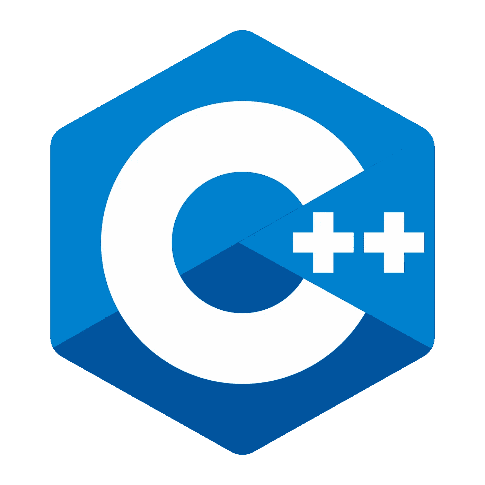

# 用 C++进行跨平台移动和 Web 开发

> 原文：<https://levelup.gitconnected.com/cross-platform-mobile-and-web-development-with-c-explained-aac9952b4f8c>

本系列描述了一种特定的技术选择，我认为这是编写需要在客户端拥有大量逻辑的业务应用程序的最佳选择。我的目标是这里的高级程序员。理解本教程需要一些经验。

# 它有效

这种架构是可行的，快速的，并且是 RAD。它生成小的二进制文件，是未来的证明。

# 基本原理

随着智能手机的出现，我被要求为 Android 和 iOS 编写软件的次数比其他任何事情都多。在过去的十年中，我面临的主要问题是缺乏一种可以让我写一次代码就可以在两个平台上运行的通用技术。

我倾向于横向工作:相同的项目，所有的平台。因为我在脑子里映射数据和逻辑，而不是平台的特质。有些人喜欢在一个平台上做很多项目，各做各的。

在此之前，我们有 Windows，macOS，也许还有 Linux，我们可以使用 QT 和 C++或 Java 和 Swing 来制作图形化的商业软件。这两种组合在 Android 或 iOS 上都无法工作(QT 声称可以，但感觉非常笨拙，肯定没有原生的外观和感觉)。

我尝试了各种基于 web 的方法，但它们都很慢，比任何本地应用程序都要慢得多，它不可用，工具也比本地工具弱得多。有些人继续走反应原生路线，或 Xamarin 或 now Flutter，对他们有好处。一旦最新的跨平台玩具变得不受支持和过时，我宁愿不必重写我的整个代码库。

所以我一直在找，客户一直在问:代码少 bugs 少=维护少=钱少。很明显。

然后经过一番研究，发现 **C++** 在这两个平台上都是一流的技术。谷歌和苹果在内部使用它，Android 和 iOS 的大部分都是用它编写的(想想 Chrome 或 WebKit，*例如*，所以他们保持工具最新并完全支持它。

我碰巧在苹果和谷歌的工具上发现了错误，它们得到了充分的关注，并在下一个版本中得到修复。

两家公司都在编译器和标准库实现上投入了大量资金，这保证了它的存在。微软现在也非常热衷，你可以在 Visual Studio 中用 C++为 Android 编写代码。

然后我投入到一个大型项目中，这个项目在 iOS 和 Android 上都使用了一个用 C++编写的大型共享库。

于是我就摆弄了一下，发现在 XCode 里，你可以把 Objective-C 和 C++混搭，很自然(叫做 **Objective-C++** )。在 Android studio 中，你使用的是 **JNI** ，这是一项经过几十年验证的老技术，在整个 Android 系统中广泛使用。

经过几个星期的尝试(我们说的是 50，000 行 C++)，我开始感觉很舒服，并且可以用一半的时间实现新功能——因为我只实现它们一次，并且由于 C++的严格特性，我会比使用另一种语言产生更少的错误。

然后是更好的部分:**网络组装**。现在，您可以在 web 应用程序中使用 C++代码。这几千行代码经过编译，无需任何调整就可以加载到浏览器中。它们起初并不工作，但是很小的改变就可以使它工作得很好。Web Assembly 现在在所有当前的浏览器中都得到支持，而且似乎正在蓬勃发展。工具还不是很好，但是每天都在改进。

# 技术选择

本系列做出了具体的技术选择，我认为这是编写需要在客户端拥有大量逻辑的业务应用程序的最佳选择。然而，我们必须记住几件事:

**C++是硬的**，语言本身是全功能的，它几乎拥有一切和厨房水槽。不过，您可以自由使用您需要的功能子集。标准库非常庞大，你永远也不会知道它的一切，但是它有很好的文档记录，非常清晰，可以满足你的所有需求。

**C++是现代的**，最新版本可以追溯到 2017 年，并在我们的目标平台上得到完全支持，C++ 2020 也将很快推出一些改进，毫无疑问，一旦准备好，它将包含在我们的工具链中。我说的现代，是指它有自动内存管理(不再有**新增**和**删除**)，它有 lambda，auto，现有的最好的时间管理库，一个很棒的线程库等等(都在标准库中)。

**C++是可移植的**，它允许你在所有平台上使用最新的东西，包括旧平台，我的大项目在 iOS 9 32bit 上工作。这是因为库包含在您的构建中，并且您不依赖于目标平台上的内容。使用 Android Java，我们仍然无法完全使用 2014 年问世的 Java 8。

**C++快**，这个不言而喻。你的二进制文件很小，并且以…本地速度运行。

# 建议的架构解决方案:没有共享 UI。

因为这是关于商业应用，我们将不会使用 3D 图形上下文或 OpenGL 太多(即使我在我的一个项目中使用)，所以我们需要一个 UI，一个我们运行的平台固有的 UI，不幸的是，这在 C++中无法实现。iOS 有 **UIKit** ，可通过界面构建器和 Objective-C 类访问，Android 有**活动** / **片段** / **视图**框架，可通过 xml 和 Java 类访问。这些在 C++中是不公开的，即使公开也是不可移植的。

我发现制作 ui 并不是真正的编程，而是更像乐高积木，想想 Adobe Illustrator，所以它并不是很难，任何事情都可以，因为你需要靠近你的平台，让我们在平台上自然地做它。因为没有逻辑，所以没有多少 bug 可以进入。根据经验，我知道构建用户界面是耗时的，你需要得到正确的外观，但它在算法上并不复杂。

所以我选择任何时候在 Interface builder / Objective-C、Android XML / Java 中编写 UI，对于 web 来说，这取决于当时的框架，我目前没有偏好，React 的 Material-UI 今天可以完成这项工作，但在一天结束时，你将处于 HTML/CSS 的世界中。

我们需要将这些与我们实际的程序代码连接起来，对于 iOS 来说这很容易，什么都不用做，在同一个文件中，你可以有 C++对象和 Objective-C 对象，它们驻留在相同的上下文中，一个可以保存另一个的实例。我们用 C++编写 iOS 部分，我们编写的唯一 Objective-C 是 Objective-C 框架类的扩展(UIViewController **et al.** )

对于 Android，我们需要使用 **JNI** ，它有一个恐怖的 C 语法。为了摆脱这些，我们将使用由 Dropbox 开发的名为 **DJinni** 的 JNI 绑定生成器。这样我们可以来回传递对象，而不用担心 JNI 编组(在代码中，我们应该担心内存性能)。

对于 Web，我们将使用来自 Emscripten 的 **Embind** ，这是一个用于 WebAssembly 的 C++工具链，它允许将 C++对象暴露给 Javascript 层，以及从 Javascript 层返回。

我们的最小公分母将是 Embind，因为它是功能较少的一个。因此，我们必须注意保持我们的接口和记录足够简单，以便可以通过 emscripten 将它们“绑定”到 Javascript，或者通过 Djinni 将它们“绑定”到 Java。我不认为这个限制是限制性的。

本系列教程分为几个部分:

## 1.[项目设置](https://medium.com/@stephane_21545/cross-platform-mobile-and-web-development-with-c-explained-8d2ab1224c0a)

我们将配置一个在 iOS/Xcode、Android Studio 和 Emscripten/CMake 上编译和运行的项目，并展示如何运行和调试其中的 3 个项目。

## [2。在](https://medium.com/@stephane_21545/cross-platform-mobile-and-web-development-with-c-explained-587a235cbb0b)周围传递物体

在这个例子中，我们将展示如何将对象从业务逻辑层传递到不同的视图层。

## [3。单元测试](https://medium.com/swlh/cross-platform-mobile-and-web-development-with-c-explained-8fb5fb916d35)

这里我们使用常用的**谷歌测试**框架在 C++代码中设置单元测试。

## [4。休息客户端](https://medium.com/swlh/cross-platform-mobile-and-web-development-with-c-explained-e8cd420665af)

我们使用平台 HTTP 实现实现了一个最小的 ReST 客户端。

## [5。多线程](/cross-platform-mobile-and-web-development-with-c-explained-94e112d31351)

是的，你可以以可移植的方式在所有三种环境中使用线程！

## [6。使用 SQLite 的离线数据](https://medium.com/@stephane_21545/cross-platform-mobile-and-web-development-with-c-explained-7076b84c425b)

添加 SQLite 数据库一如既往地简单。

还会有更多的。

# 密码

该代码可从 github 获得:[https://github.com/skonstant/xptuto](https://github.com/skonstant/xptuto)

它分为几个部分，第一部分，第二部分…

[**下一步:设置项目⇨**](https://medium.com/@stephane_21545/cross-platform-mobile-and-web-development-with-c-explained-8d2ab1224c0a)

# 参考

你可能会觉得奇怪，没有 Objective-C++引用链接，这是因为没有任何链接:Objective-C++是一种编译器模式，而不是一种语言，它允许它在同一个编译单元中理解 Objective-C 和 C++。

 [## cppreference.com

### 基本概念关键字预处理表达式声明初始化函数语句类重载…

en.cppreference.com](https://en.cppreference.com/w/) 

[Android NDK:https://developer.android.com/ndk](https://developer.android.com/ndk)，在 Android 上编译和从 C++访问一些 Android API 的工具(不可移植)

 [## 在 Visual Studio 中使用 C++进行 Android 和 iOS 开发| C++团队博客

### 在构建移动应用程序时，许多开发人员用 C++编写大部分或部分应用程序。为什么？那些…

devblogs.microsoft.com](https://devblogs.microsoft.com/cppblog/android-and-ios-development-with-c-in-visual-studio/)  [## dropbox/djinni

### Djinni 是一个用于生成跨语言类型声明和接口绑定的工具。它被设计用来连接 C++…

github.com](https://github.com/dropbox/djinni)  [## 主文档 1.39.14

### 编辑描述

emscripten.org](https://emscripten.org/)  [## web 程序集

### WebAssembly(缩写为 Wasm)是基于堆栈的虚拟机的二进制指令格式。Wasm 被设计为…

webassembly.org](https://webassembly.org/)  [## Java 本地接口规范:1 -简介

### 目录|上一页|下一页本章介绍 Java 本地接口(JNI)。JNI 是一个本地编程…

docs.oracle.com](https://docs.oracle.com/en/java/javase/11/docs/specs/jni/intro.html) 

[谷歌测试 C++单元测试框架:https://github.com/google/googletest](https://github.com/google/googletest)

【https://visagetechnologies.com/visage-sdk】一个用 C++构建的商业 SDK，目标是 iOS、Android、Web 汇编等等

https://apps.apple.com/be/app/yelo-play/id407200903T4【Yelo Play，一个使用这种架构的大型移动项目。