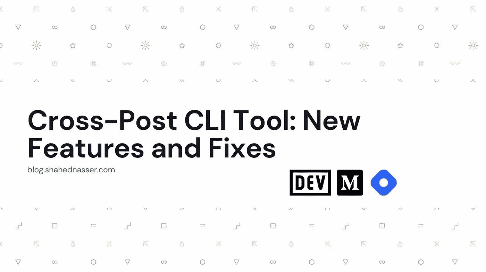

# 交叉发布 CLI 工具:新功能和修复

> 原文：<https://levelup.gitconnected.com/cross-post-cli-tool-new-features-and-fixes-fae553a3d793>



大约一年前，我写了一篇关于[我如何创建一个 CLI 工具](https://blog.shahednasser.com/i-created-a-cli-to-cross-post-your-articles-on-dev-hashnode-and-medium)来将[文章交叉发布到 Dev.to、Hashnode 和 Medium。我创建这个工具是因为它让我的过程变得更容易，但我也从其他作者那里收到了很多关于它如何对他们有所帮助的反馈。](https://github.com/shahednasser/cross-post)

从那以后，由于工作繁忙，就没怎么保养过了。现在，我花了更多的时间致力于它，并在社区的帮助下改进它。

2 月 28 日，星期一，我推出了新版本的`cross-post-blog`和版本`1.3.0`。我将分享它的一些特性和修复。您也可以查看 [GitHub 库](https://github.com/shahednasser/cross-post)以获得关于该库的更多信息。

如果您正在阅读这篇关于 Dev.to、Hashnode 或 Medium 的文章，那么它是使用 Cross-Post CLI 工具从[我自己的博客](https://blog.shahednasser.com/cross-post-cli-tool-new-features-and-fixes/)转贴的！

## 从本地文件过帐

基于使用这个库的一些开发人员的需求，我现在增加了从本地文件而不是公共 URL 直接发布的能力。为此，您只需在命令中添加`-l`或`--local`选项。

例如:

```
cross-post run /path/to/test.md -l
```

这将发布一个本地文件`test.md`到所有的平台。

您也可以将它与您之前使用的所有选项一起使用。

## 已更改降价转换器

每个平台都要求你将文章内容以 Markdown 格式发布。因此，当您向该命令传递一个 URL 时，该页面上的文章内容在提交到您想要发布的平台之前会被转换为 Markdown。

我之前用的是`[node-html-markdown](https://www.npmjs.com/package/node-html-markdown)`。就功能而言，它工作得很好。然而，关于它如何[解析代码块](https://github.com/shahednasser/cross-post/issues/14)还有一些问题。

新版本现在使用的是`[turndown](https://www.npmjs.com/package/turndown)`,它在解析代码块方面做得更好。你的文章现在应该被发布到不同的平台上，就像你在自己的博客上发布的一样。

## 添加了标题选择器

以前，您可以在配置中设置默认的文章和图像选择器。您也可以在`run`命令中覆盖这些配置。

现在，您还可以在配置中设置默认标题选择器:

```
cross-post config titleConfig
```

或者，将其作为选项`-ts`或`--title-selector`传递给`run`命令:

```
cross-post run <url> -ts .post-full-title
```

## 即将推出的功能

从现在开始，我将根据使用这个工具的开发人员的要求，或者根据我自己的使用经验，改进这个工具并添加新的特性。例如，一个被请求的特性是[更新帖子](https://github.com/shahednasser/cross-post/issues/20)的能力。

我还将考虑添加新的平台，以便能够发布到。如果你有任何你认为可以添加的平台，请告诉我！

## 如何安装或更新

如果您想安装并开始使用 Cross-Post 或更新您的版本，您可以使用 NPM 安装:

```
npm i -g cross-post-blog
```

有关安装和使用该工具的更多信息，请查看[自述文件](https://github.com/shahednasser/cross-post)。

## 贡献

目前，资源库中还没有添加贡献指南(我正在努力)。但是，如果您想对任何现有的[问题](https://github.com/shahednasser/cross-post/issues)做出贡献或添加新功能，请不要犹豫！