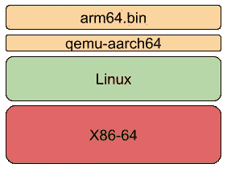

# 交叉运行的应用程序

> 原文：<https://levelup.gitconnected.com/cross-running-applications-345131f7b55f>

## 系统程序设计

## 在 x86 上运行 Arm64 二进制文件

Arm64 架构比以往更加普及。该架构不再仅仅用于电话，也用于个人计算机和服务器计算机。学习一些基本的汇编已经成为必要。

除了在本文中学习一些基本的汇编之外，我们将使用 QEMU 的一个强大的子工具，它允许从其他架构交叉运行本机应用程序。在我们的例子中，我们将在 x86_64 上运行 arm64(又名 aarch64)二进制文件。



考虑的技术堆栈

# TL；速度三角形定位法(dead reckoning)

最快的方法是使用下面的 docker:

```
**docker run -it amine2029/qemu-user-aarch64**
# wait for the bash from the docker; then**make
make run**
```

# 环境

要在 ubuntu 上安装环境，请使用以下 apt 命令:

```
**sudo apt install gcc-aarch64-linux-gnu                                                                                                                                 sudo apt install qemu-user
sudo apt install make**
```

# Hello World 示例

## 源代码

## 交叉编译并链接“hello.asm”

```
**aarch64-linux-gnu-as hello.asm -o hello.o
aarch64-linux-gnu-gcc hello.o -o hello.elf -nostdlib -static**
```

## 运行交叉编译的二进制文件

```
**qemu-aarch64 ./hello.elf**
```

链接到 GitHub:[https://github.com/techexplorer42/qemu-user-example](https://github.com/Aminem2019/qemu-user-example)

今天到此为止，欢迎评论，不要忘记鼓掌并关注更多内容；)