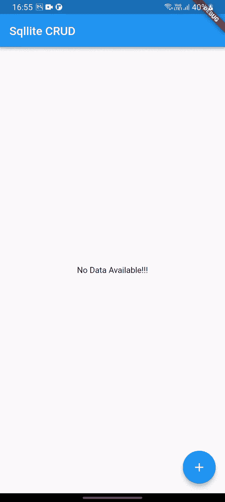

# 摇摆中的 SQLite

> 原文：<https://levelup.gitconnected.com/crud-with-sqlite-df9254d917d0>

如果您正在寻找一种方法来使用移动设备存储作为 Flutter 应用程序中的数据库，那么您可以通过集成 [sqflite](https://pub.dev/packages/sqflite) 包来获得它。

在本文中，我们将学习 SQLite 和 Flutter 的 CRUD 操作。我们的最终应用程序如下所示:



在这个项目中，我们将在我们的数据库中保存标题和描述。

## 第一步。添加依赖项

您需要在项目的 pubsec.yaml 文件中添加 sqflite 包。

*   **sqflite** :集成 SQLite 数据库功能的 SQLite 包。

```
dependencies:
  ...
    sqflite: ^2.0.2+1
```

## 第二步。创建数据库

创建一个名为**的数据库助手文件。**在里面，我们创建数据库和表格。

**第三步。打开数据库**

## 第四步。执行 CRUD 操作

1.  **添加/创建项目**

接下来，我们编写将项目插入数据库的方法。这个方法有两个参数，一个是标题，另一个是描述。

**2。阅读项目**

**3。编辑/更新项目**

**4。删除项目**


布雷特·乔丹在 [Unsplash](https://unsplash.com?utm_source=medium&utm_medium=referral) 上拍摄的照片

**database_helper.dart** 文件如下所示:

## **第五步。创建表格并显示**

创建一个名为 **homepage.dart** 的文件，我们在其中创建表单并在列表中显示数据。

# 让我们连接起来

我们可以成为朋友。在[脸书](https://www.facebook.com/nabin.dhakal.714/)、 [Linkedin](https://www.linkedin.com/in/nabindhakal/) 、 [Github](https://github.com/nbnD) 、 [Youtube](https://www.youtube.com/channel/UCW6oYt_3QSl7J2HSHNqwXWw) 、 [BuyMeACoffee](https://www.buymeacoffee.com/nabindhakal) 和 [Instagram](https://www.instagram.com/nbn_d_/) 上查找。

拜访:[颤振结](https://flutterjunction.com/)

**投稿:** [BuyMeACoffee](https://www.buymeacoffee.com/nabindhakal)

# 结论

希望这篇文章对你有所帮助，让你学到新的东西。我在这篇文章中使用了一些对你们中的一些人来说可能是新的东西。

如果你学到了新的东西或者想提出一些建议，请在评论中告诉我。

如果你喜欢这篇文章，请点击👏图标，为您提供传递所有新事物的动力。

此外，关注令人兴奋的文章和项目的更新。

通过分享学习对学习过程产生了巨大的影响，并使社区越来越大。

分享是吸引其他爱好者的磁石。

因此，让我们朝着扩大我们的学习社区迈出一小步。

与你的朋友分享这篇文章，或者如果你喜欢这篇文章，就在推特上发表评论。

# 在以下时间吃饱:

[](https://github.com/nbnD/sqlite_crud) [## GitHub-nbnD/SQLite _ crud:SQLite 在 flutter 中的 CRUD

### 一个新的颤振项目。这个项目是颤振应用的起点。一些帮助您入门的资源…

github.com](https://github.com/nbnD/sqlite_crud)