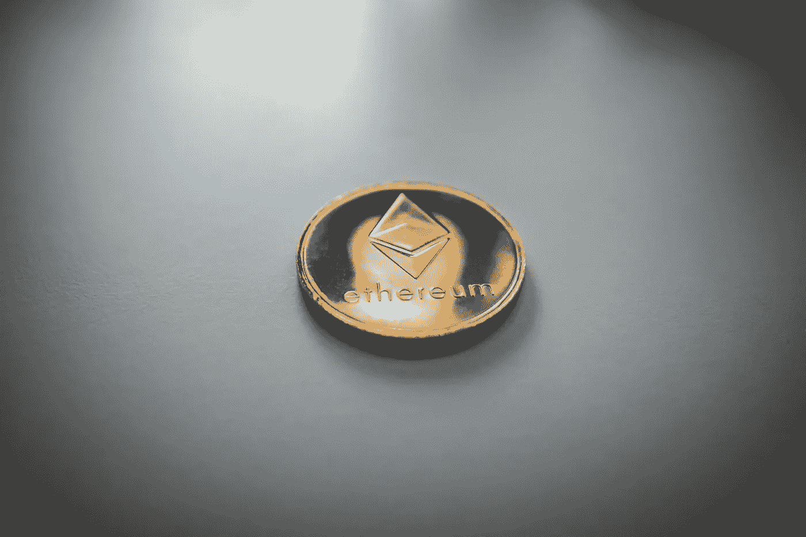
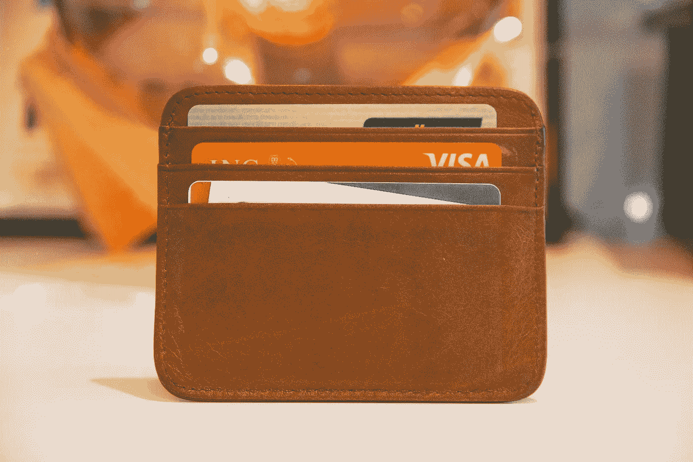

# 2021 年的密码 101

> 原文：<https://levelup.gitconnected.com/crypto-101-in-2021-4aae9bca9f2d>

每个人都伸出手来问我密码问题。让我们谈谈基本情况。

安德烈·弗朗索瓦·麦肯齐在 [Unsplash](/s/photos/blockchain?utm_source=unsplash&utm_medium=referral&utm_content=creditCopyText) 上的照片

随着比特币和其他加密货币最近达到新的成功水平和主流采用水平，我收到了许多朋友和家人的消息，他们记得我过去谈论过区块链。2011 年，当一位朋友向我展示比特币挖矿如何在他的游戏电脑上运行时，我对没有单一实体控制的完全数字货币的概念非常着迷。

当时开采比特币要容易得多，其价值也低得多；它的用途较少，也不像今天这样被视为黄金。比特币实际上被设计成更像是一个点对点交易系统，但由于几个因素，它已经成为一种储蓄和投资的方式。

尽管比特币最近达到了看似疯狂的价值，但我仍然认为我们仍处于加密货币的初级阶段，尚未看到它们的真正潜力。虽然比特币似乎非常受欢迎，但在地球上数十亿人中，可能只有数千万人拥有一定数量的比特币。这意味着大量的人可能不太了解加密货币是如何工作的，它们来自哪里，以及为什么许多人认为我们需要它们。我希望以一种容易理解的方式来涵盖这些基础知识，并试图帮助密码世界的新手理解他们为什么存在。

> **注**:我在这里所说的一切都不打算被视为财务建议。我只是分享我多年来对加密货币和区块链技术的了解。大部分内容是关于技术(区块链)和区块链今天是如何被用来创建这些流行的金融系统。
> 
> 这是一个简单的解释，旨在帮助任何人理解它是什么以及它是如何工作的。像许多技术一样，区块链有很多深度。

# 工作原理:区块链

照片由[启动按压](https://unsplash.com/@launchpresso?utm_source=unsplash&utm_medium=referral&utm_content=creditCopyText)上的 [Unsplash](https://unsplash.com/s/photos/blockchain?utm_source=unsplash&utm_medium=referral&utm_content=creditCopyText)

所有加密货币所基于的技术被称为区块链。区块链是一种数据库，其中信息存储在链接在一起的区块内。当新信息被添加时，它进入新的块，当块满时，它被链接到要被添加的最后一个块之后的链。

传统数据库将数据存储在可以相互关联的表格中，如果您不熟悉 SQL，这有点像大型 excel 电子表格。另一方面，区块链将数据存储在“块”中，这些块在“时间线”中顺序链接在一起。由于区块链固有的创建数据时间表的方式，它特别适合创建交易分类账。这就是比特币，一种为全球货币体系创造基础设施的交易区块链。

当以去中心化的方式实现时，比如比特币，这些区块是永久的；当一个新的块被添加到链中时，它将作为链的时间线的一部分永远存在。这加强了区块链作为交易分类账的伟大工具，因为块是永久的，除非在极端情况下不能被篡改。

虽然区块链在 2008 年比特币诞生之前就已经存在，但许多人认为比特币的创造者中本聪是我们今天所知的区块链技术的真正开发者。比特币是区块链的第一个主要应用，而聪的工作永远改变了区块链的使用方式。

## 共识和权力下放

也许区块链技术最重要的属性是它很容易分散。许多传统数据库由服务器仓库运行，其中一家公司控制着整个服务器。如果我试图汇款超过我银行账户中的可用金额，我的银行会标记出来，并阻止我用我没有的钱进行交易。验证我的交易的过程是由银行的一名员工完成的，而不是其他人。

然而，比特币的网络是由世界各地成千上万的计算机运行的，这些计算机被称为节点，由许多群体拥有。当新的块被添加到区块链时，网络中的大多数节点必须同意它是有效的和真实的。这种通过多数决定的过程称为共识。这意味着，只要没有一个实体控制网络的大多数(51%)，就没有人能够进行虚假交易或改变交易历史。

我之前说过，一旦一个块被添加到链中，它就是永久的，这在大多数情况下是正确的。如果一个实体获得了网络 51%的控制权，他们就可以改变块。但这是一种极不可能的可能性，需要像民族国家这样的东西来实现。不过，这是分散式网络的一个有趣特性。去中心化消除了我们习惯与之互动的中心控制点。有许多人认为比特币是某种公司，但实际上，网络本质上是在世界各地的计算机的帮助下进行自我管理。

## 密码学和采矿

我们使用**加密**货币这个名称的原因是因为加密货币使用密码术(复杂的数学)来保护每一笔交易。以下是我给你寄 5 美元(0.000087 比特币)时的情况:

1.  我打开钱包，初始化一笔 0.000087 比特币的转账到你的钱包地址。
2.  我的交易细节被发送到比特币网络，在那里，矿工用一个加密数学问题对其进行加密。将信息加密成块称为哈希，矿工将继续哈希事务，直到块满为止。
3.  当有一个加密块准备添加到区块链时，矿工们竞相猜测该块的散列码。设法找到正确块散列的挖掘器将它添加到区块链。
4.  现在整个网络检查交易是否有效。如果他们达成共识(51%的同意)，幸运的矿工将该区块添加到区块链，并获得一定数量的比特币。
5.  现在已经添加了块，您的钱放在您的钱包里了！

值得注意的是，并不是所有的加密货币都使用解决加密问题来保护交易。让矿工解决这些复杂问题的概念被称为**工作证明**共识协议。破解密码是执行向网络证明交易有效所需的“工作”。我会在另一篇文章中讨论其他替代方法，比如股权证明。

# 我们为什么想要一种数字货币？

我得到的关于加密货币的主要问题是，我们为什么需要它们？有太多的理由可以解释为什么区块链和分散金融可以造福人类，但有几个关键因素可以解释为什么分散系统是一件大事。

你会看到我使用术语“法定货币”，这是一个政府发行的货币，没有商品支持其价值。法定货币包括大多数政府货币，如美元或加拿大元。

## **抵制贬值**

法定货币的一个问题是它们容易贬值。贬值是指一种货币贬值，通常相对于一个更稳定的基准，如黄金。在尼克松总统之前，35 美元等于一盎司黄金；将美元的价值与黄金的价值联系起来，为货币提供了支持，这实质上赋予了美元的价值。但是当美国决定黄金不再支持美元时，黄金开始贬值。今天，一盎司黄金大约值 1700 美元！

稳定国家的通胀是一个更复杂的话题，而不仅仅是如今黄金相对于美元升值，但这突显出，在一个中央集权的金融体系中，少数掌权者的决定会对所有人产生重大影响。当政府对货币管理不当时，它可能会完全贬值。委内瑞拉在过去的几十年里经历了极度的通货膨胀，以至于他们的货币在合理数量的储蓄或消费中基本上毫无价值。很快，委内瑞拉人在网上工作并以美元支付变得更加有利可图，因为美元保值。比特币在像这样的国家也取得了很大的成功，这些国家需要稳定的货币来实际保存价值。

## **对法规的抵制**

比特币特别抵制政府监管；比特币没有中央总部或首席执行官，一切都是分散的，这也使得追踪比特币网络中的交易变得困难。这对国税局这样的机构来说可能是一个很大的难题，他们在打击不纳税的投资者方面遇到了麻烦。

不仅很难出于税收目的跟踪加密的使用，而且几乎不可能阻止某人拥有和交换加密货币。在闪存驱动器(硬件钱包)上存储数百万美元的比特币是可能的，而且没有人会知道你有它。被称为交易所的新市场现在也很丰富，如果某样东西很容易在互联网上出售，人们会找到一种方法来获得它。各国政府已经尝试全面禁止加密货币，人们普遍认为加密货币对加密货币在这些地区的使用影响不大。比特币基地刚刚[发表了一篇文章](https://www.coindesk.com/crypto-is-banned-in-morocco-but-bitcoin-purchases-are-soaring)，展示了尽管所有加密货币在摩洛哥被禁止，摩洛哥人如何在二月份创造了最高的比特币交易量。

我并不是说比特币应该被恶意使用或应该避免监管，但对于生活在经历严重通胀的国家的人来说，无论监管如何，比特币的受欢迎程度和使用量都在飙升。在考虑其增强受压迫地区人民权能的能力时，这是一个重要因素。

## 革命性的特性

很多人经常问我，是什么赋予了比特币价值。我的回答是，是什么赋予了美元价值？他们通常会做出一些回应，比如支持一个值得信赖的政府。我确实相信政府，也接受美元有价值，但我不认为政府的支持是确定某种东西有价值的必要条件。

自公元前 550 年(T1 年)以来，我们就把黄金作为货币使用，远早于黄金在电子产品中的价值。目前状态下的比特币最类似于可以传送的黄金。它已经成为一种极其方便的价值储存手段，对大量资金来说，运输成本非常低。一个人或一个实体可以用数字方式安全地储存黄金，而不是拥有一个装满黄金的金库。当需要移动“黄金”时，他们只需点击一个按钮就可以在当天移动。

比特币也非常安全。有无数的电影是关于银行抢劫、珠宝抢劫和导致人们价值储存被盗的黑客行为。但如果管理得当，访问另一个人的比特币钱包几乎是不可能的。尽管银行拥有非常强大的安全性，但最近的事件表明，我们当前的网络安全基础设施可能比我们想象的更脆弱。

# 以太坊呢？

[尼克·钟](https://unsplash.com/@nick604?utm_source=unsplash&utm_medium=referral&utm_content=creditCopyText)在 [Unsplash](https://unsplash.com/s/photos/ethereum?utm_source=unsplash&utm_medium=referral&utm_content=creditCopyText) 上的照片

如果你对比特币感兴趣，你可能在某个时候听说过以太坊。它的市值约为 2000 亿美元，是目前第二大最受欢迎的加密货币。除比特币之外的所有加密货币都被称为替代硬币(alt coin)，但以太坊正在成为一种主食，并且比其 alt coin 竞争对手大得多。

以太坊比比特币要新得多，于 2015 年出现。不过，以太坊并不打算像比特币那样只作为一种货币使用。相反，它被设计成一个分散的计算平台。开发者可以创建在以太坊区块链网络上运行的分散式应用程序(dApps)。

以太坊网络仍然像比特币网络一样在其核心运行。这是一个区块链网络，用作与矿工交易的分类账，以处理和维护网络。以太坊与比特币的不同之处在于“智能合约”的概念。智能合约允许开发者利用区块链创建他们自己的账本(区块链网络)，甚至创建在这个网络上运行的整个加密货币。

因此，虽然比特币的目标是钱，而不是别的，但以太坊希望成为这样一个平台，开发者可以在这个平台上创建自己的应用程序，甚至整个区块链网络。已经有一些你可以购买的加密货币是使用以太坊构建的，比如 Tether。

## 与比特币的显著区别

1.  没有终极稀缺性——只会有 2100 万枚比特币被铸造出来。但是以太坊对以太的开采量没有上限。
2.  智能合约
    -以太坊允许开发者使用以太坊区块链构建应用或整个区块链网络。

# 我如何存储 Crytpo？

斯蒂芬·菲利普斯-Hostreviews.co.uk 在 [Unsplash](/s/photos/wallet?utm_source=unsplash&utm_medium=referral&utm_content=creditCopyText) 上的照片

我们听说过一些人拥有比特币，但却无法获得比特币的恐怖故事。当然，如果比特币每枚价值 6 万美元，就一定有安全的方法来储存它，对吗？没错。

在存储加密货币方面，你有三种选择:

## 1.交换钱包

许多人从比特币基地、双子座和北海巨妖等交易所购买比特币。当你在这些交易所开户时，你会自动为你购买的货币创建钱包。这是一种存储密码的方便方法，因为你把它放在你买/卖它的地方。我认为，许多最新的比特币用户会将他们的硬币存储在他们选择的交易所。然而，这是一个最不安全的方式来存储您的密码。你的账户有可能被黑，你可能会失去所有的硬币。在这种情况下，这将是你的错，没有妥善保护您的帐户。交易所也不能幸免，可能会受到黑客攻击。在这种情况下，你会希望他们能够偿还他们的客户，但没有保证。一般来说，最好是自己控制你的加密资产，尤其是如果你投资了相当大的数额。毕竟，加密货币的核心目的之一是为个人提供来自中央机构的财务自由。

## 2.软件钱包

这就把我们带到了软件钱包。有许多可供选择的方案，它们并不都是平等的。许多软件钱包遭受类似的问题，以存储您的硬币在您的交换帐户；除非钱包让你完全控制你的私人钥匙，否则你就依赖于该公司的安全性。不过，有一些很好的软件钱包，可以让你完全控制自己的安全。我最喜欢的电影之一是《出埃及记》。它可以存储多种货币，并让您管理自己的私人密钥。但是，如果您丢失了这些密钥，您可能会失去对所有加密货币的访问权限。

基本上，私钥是在创建钱包时使用加密技术以数学方式生成的，用于匹配/关联您的钱包地址。为了进入钱包，你需要你的私人钥匙。Exodus 和几个受欢迎的钱包也将生成一个 12 世界随机单词的种子短语，您可以使用它来恢复您的帐户。最好的做法是打印两份，放在塑料袋中，存放在不同的安全位置。这听起来有些偏执，但你不想失去你的钱！

> **注意** : Exodus 不提供双因素认证，我认为这是一个很大的缺点。它也不是完全开源的。这是一个不错的选择，但并不完美。

## 3.硬件钱包

最后一类是硬件钱包。毫无疑问，这些是存储加密货币最安全的方式。你可以买一个看起来像闪存盘的东西，离线存储你的密码，而不是依赖你的手机或电脑上的软件，这些软件连接到互联网，并不完全在你的控制之下。

最受欢迎的硬件钱包是 Ledger Nano X，售价 120 美元。你可以将它无线连接到你的手机，并通过他们的应用程序管理你的资产，或者通过电缆连接到你的电脑。

硬件钱包让加密货币的真正意图成为可能。他们允许一个人对他们的密码拥有完全的自主权，没有人知道你拿了你的钱包。它们也是迄今为止最好的长时间存储密码的方法，因为你不必担心软件漏洞或任何互联网连接。

许多拥有大量加密货币的人会拥有不止一个硬件钱包，并将多余的作为主钱包的备份。分类账也有一个种子短语，如出埃及记，如果你丢了钱包，可以追回你的资产。

我可能听起来像一个偏执的老人谈论他所有的钱塞在床垫下。但是我保证，对于数字货币，或者你的数字生活，你永远都不能太小心。我认为许多个人可能会使用软件钱包或交易所，但如果有人有很多钱，长期以来的共识是硬件钱包是最安全的存储选择。

> 注意:我认为在决定哪种钱包适合你时，你自己做调查是很重要的。只有你能决定存储密码的最佳方式。

# 包扎

这里有很多信息需要消化，但这应该为大多数人理解加密货币世界提供了一个不错的起点。重要的是要记住，尽管许多人对加密货币的未来非常乐观，但它们的价格仍然非常波动。该技术相对于我们当前的金融系统具有独特的优势，从长远来看，加密货币可能会成为主导的金融系统。但是在这个过程的大计划中，加密才刚刚开始，在此之前还有许多障碍要克服。