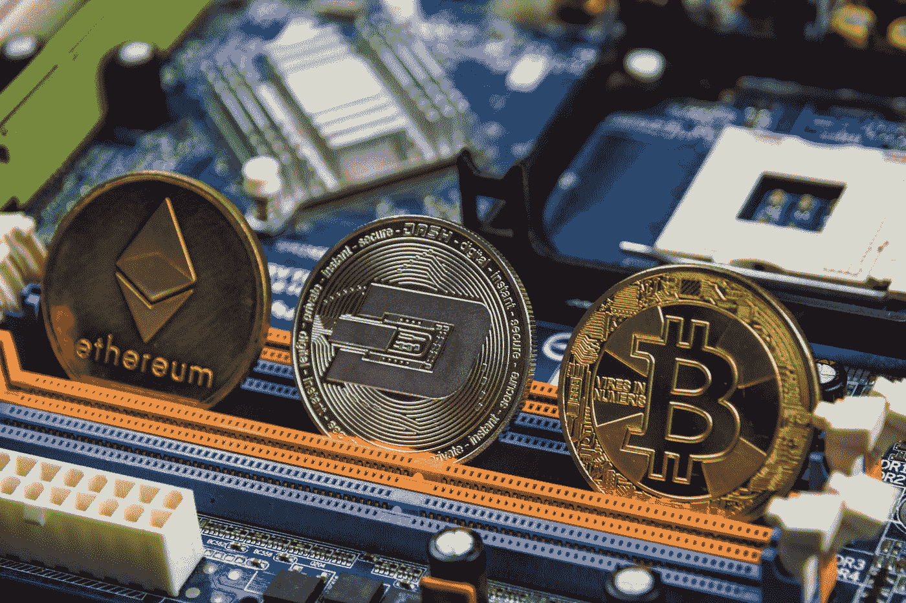

# 秘密会聚

> 原文：<https://levelup.gitconnected.com/crypto-and-convergence-5b646abd47d4>

[Bermix 工作室](https://unsplash.com/@bermixstudio?utm_source=medium&utm_medium=referral)在 [Unsplash](https://unsplash.com?utm_source=medium&utm_medium=referral) 拍摄的照片

我几乎每小时查看一次加密价格，并在这期间加密 Twitter 帖子。每当我慢跑或洗碗时，我都会听加密播客。每当我坐在电脑前，我就会点击我的推荐列表中的加密 Youtube 视频，或者打开加密交易门户。

我不认为我是唯一一个。

让我吃惊的一次遭遇是我上周参加的一次客户会议。当我们展示我们的投资管理解决方案时，客户打断了我们，问我们是否有关于加密的解决方案。他渴望听到一位资产经理对投资组合中加密配置的看法。房间里的其他人都目瞪口呆。我强颜欢笑。

我的职业和个人生活、现在、过去和未来都在融合。

我的加密之旅始于我收到一位大学老朋友的消息，他问我是否有兴趣加入菲律宾的一家比特币交易所初创公司，该公司有望利用数字货币干扰汇款。说实话，当时引发我兴趣的不是密码部分，而是有机会加入一个有硅谷血统的远见者团队。

那是 2014 年末。在 Mount Gox 事件之后，比特币价格暴跌了 80%。对于少数了解比特币的人来说，他们将其与诈骗或非法交易联系在一起。当时的说法是‘区块链，不是比特币’。作为一家比特币初创公司的营销主管，我的第一项任务是从我们所有的客户沟通中抹去所有提到“比特币”的内容，转而专注于支付用例。

从这个角度来看，我对持有任何加密货币都持怀疑态度。像大多数人一样，我认为这只是更好的支付轨道。我阅读了大量关于这个主题的文章，并总结了我在[这篇文章](https://curiousglitch.medium.com/the-easiest-way-to-understand-bitcoin-its-just-like-email-46d92aa89afb)中学到的东西——把电子邮件比喻成比特币。即使当我向朋友和家人描述我的工作时，我也会小心翼翼地使用“数字钱包”或“金融科技”等词，而不是“加密”或“比特币”时间流逝。我开始寻找新的机会。

然后，2017 年发生了。

以太坊的兴起。ICO 热潮。几个月的时间里，比特币从 900 美元疯狂涨到了 20，000 美元。大笔资金有办法吸引全世界的注意力。突然间，crypto 成了焦点。空间里充满了兴奋。我后悔没有早点集中注意力。我站在这场革命的最前沿。它就在那里等着被拿走！但愿如此。

2018 年的崩盘接踵而至。当人们称 crypto 已死时，我知道有些事情已经发生了根本性的变化。科技行业中一些最聪明的人把他们的一生都押在了这件事情上。我知道我应该继续关注。

快进到 2020 年。

围绕比特币的叙事已经完全改变。没有人再把比特币当作支付工具了——它已经成为价值储存手段、通胀对冲工具和数字黄金。在过度印钞的情况下，各机构已经开始大量注入资金。看到比特币从犯罪分子的货币到养老金级别的投资资产来了个 180 度大转弯，真是令人叹为观止。

在过去的几个月里，甚至比特币也成了一个小插曲，让位给了新的媒体宠儿——NFTs。这些不可替代的代币代表了区块链艺术、媒体和收藏品的独特所有权。从技术层面来说，这很令人兴奋，因为原本被认为可以无限复制的数字文件现在变得稀缺了。在文化层面上，这很令人兴奋，因为艺术家和创作者有了一种新的方式来直接将粉丝的爱货币化。随着媒体和文化成为这种良性循环的燃料，非功能性传播已经席卷了全世界。所有这些都是由以太坊驱动的，以太坊是一台分散的世界计算机，它正引领着下一波互联网浪潮。

通过这条弧线，你可以追溯加密叙事的演变，从先进的支付轨道，到数字黄金，现在是互联网的 [Web 3.0 时代的基础。比特币市值已突破 1 万亿美元。总的加密市值现在接近 2 万亿美元。像币安这样的加密交易所的交易量经常达到每天 300 亿美元。Jpeg 文件售价高达数百万美元。以太坊杀手如雨后春笋般出现。新的加密网络每天都在涌现，使金融“去中心化”。特斯拉、Square、Paypal 和 Visa 都在为日常消费者合法化加密。](https://curiousglitch.medium.com/the-next-era-of-the-internet-5a3c69e81d4b)

我们早就过了可以将 crypto 斥之为郁金香狂热或投机时尚的时代。加密正在成为我们这个时代最重要的革命之一。我知道我必须继续关注这个领域——我对加密了解得越多，我就能更好地适应这个新世界。还没有多少人理解它，但是妖怪已经从瓶子里出来了。没有回头路了。