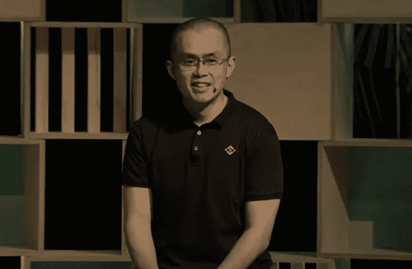
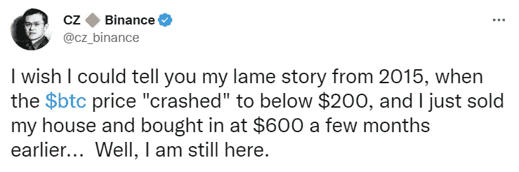

# 亿万富翁卖公寓买比特币(赵昌鹏)

> 原文：<https://levelup.gitconnected.com/crypto-billionaire-sold-his-apartment-to-buy-bitcoin-changpeng-zhao-e17edbe7fc7f>

如果你相信比特币的未来，你就会明白为什么冒巨大风险有时没有意义。

来源— [币安 YouTube 截图](https://www.youtube.com/watch?v=jQTNgfZu90o)

赵昌鹏，又名 CZ，在 8 个月内从零到加密货币亿万富翁。

截至 2022 年 10 月，他的净资产估计为 330 亿美元，在全球富豪榜上排名第 30 位。

对于华裔加拿大移民来说，事情有时更复杂。作为一名青少年，CZ 不得不分担家庭开支，在麦当劳工作，卖汉堡，在加油站上夜班。

和我们大多数加密货币起源的故事一样，CZ 是在玩扑克的时候通过一个朋友了解到比特币的。

我的是通过加里·维的视频。

那场扑克游戏将引发一系列连锁反应，导致 CZ 在 2014 年的牛市中卖掉自己的公寓，全押在比特币上。

不清楚他买了多少比特币，但 CZ 说他的买入价是 600 美元，几个月后比特币暴跌到 200 美元。

如果你从事加密货币的时间足够长，你就会知道购买 top 的感觉。

来源— [CZ 推特](https://twitter.com/cz_binance/status/1064901607425376257?s=20&t=SGgLyy2mU-oVQHM_sJ2K2w)

CZ 出售其公寓的地区发生了一些变化，导致该房产的价值在出售后很快翻了一番。

然而，比特币的价格比 CZ 的收购价暴跌了 30%。

以今天的标准来看，这是一个微小的修正，但它迫使 CZ 重返工作岗位，并获得一份办公室工作。CZ 表示，这并没有改变他的比特币叙事，财务困难也没有让他卖掉自己的比特币。

> CZ:
> 
> “当时我压力很大。是所有人都错了，还是我错了？
> 
> 可能是我错了。但我看不出为什么我错了，因为我认为它(比特币)是未来。
> 
> 2001 年，当网络泡沫破裂时，亚马逊、易贝甚至谷歌都损失了 98%的市值。每个人都经历过这个阶段。"

CZ 现在是一名亿万富翁，他说他甚至不会考虑卖掉他的比特币或其他加密货币来买房子。但相反的观点在当时被认为是完全疯狂的。

CZ 证实了他今天仍然拥有的大部分比特币的原始购买。

> CZ:
> 
> “我 99%的资产都是加密货币，都在 BNB，还有一小部分是比特币，”
> 
> “我不投资房子，现在也不会买房子。流动性很弱。”

CZ 承认了一分钟，当比特币价格暴跌，而他一切都岌岌可危时，有些怀疑。他说，比特币和加密货币确实需要几个周期来确定你的耐心。

> CZ:
> 
> “我一直相信加密技术的未来，但在你的脑海里，你有时会想，如果我错了，比特币变为零怎么办？
> 
> 在经历了一次循环之后，你学会了采取更长远的观点。"

# 币安出生了。

CZ 是一个不张扬的角色，没有人对他的个人生活了解多少。除此之外，他还和他的币安联合创始人有过一段恋情，后者现在生活在美国，有一个孩子。

按交易量计算，币安是迄今最大的加密货币交易所。他们从首次发行硬币开始，筹集了 1500 万美元。

融资后 11 天，该交易所开始交易，在不到 8 个月的时间里，CZ 将币安发展成为全球最大的加密货币交易所。

CZ 现在以加密货币形式持有 100%的流动资产净值，主要是币安的本土货币 BNB。

2022 年，他又投资 5 亿美元，帮助埃隆·马斯克收购 Twitter。

这导致了广泛的猜测，Twitter 是否会变得分散，并使用 BNB 作为平台上的交换媒介，或者只是他们的交换服务。

# CZ 公开告诉人们他正在出售 FTT (FTX 的本土代币)，从而引发了最近的市场崩盘。

这显示了他管理风险的能力，尽管他读过的一篇文章引发了抛售。

首先，如果你还没听说，FTX 是币安的竞争对手。他们的创始人萨姆·班克-弗里德，又名 SBF，利用客户存款与他们进行交易，并以他们为抵押获得贷款。

CZ 是 FTX 的第一个投资者，作为他在该公司的股份的一部分，他得到了一份 FTX 的本土股票 FTT。

如果我在这个博客中使用了过多的缩写，请告诉我。

在 FTX 投降之前，[币安](https://en.wikipedia.org/wiki/Binance)首席执行官 [CZ](https://en.wikipedia.org/wiki/Changpeng_Zhao) 在推特上表示，他的公司打算出售其持有的 FTX 代币——FTT。

在来自 CoinDesk 的一份报告显示及其姊妹公司 Alameda Research 的大部分股份在之后，赵发布了一条推特。

这条推文导致 FTX 交易所出现一连串提款，FTT 币开始自由落体。

在加密货币版本的银行挤兑期间，FTX 面临的一个重大问题是，它只有 10 亿美元的资产和 90 亿美元的负债，因此它需要更多的资本来支付客户的提款。

在绝望地试图阻止客户提取资金时，SBF 在一条现已删除的推文中撒谎说，FTX 一切都好，只是币安在做竞争对手做的事情。

这一切都发生在 Twitter 上，我可以告诉你，Twitter 是加密货币新闻和信息的中心。

在一个惊人的转变中，CZ 在尽职调查后寻求收购 FTX。

尽职调查进行了两个小时后，CZ 退出了销售。他们在推特上留下了一个简短的声明。

> “由于公司的尽职调查，以及关于不当处理客户资金和所谓的美国机构调查的最新新闻报道，我们决定不再继续收购 FTX.com”

# 最后的想法。

我绝对不会建议卖掉你的房子去投资比特币。

但你必须承认，CZ 在 2014 年的早期举措获得了丰厚的回报。归根结底就是你对风险的厌恶。

可能是 CZ 当时对比特币太有把握了，没觉得有风险。

CZ 运营币安公司的方式让我对他的风险管理充满信心，并告诉你他实际上是规避风险的。

他知道未来对比特币的潜在需求，可能会认为保留自己的公寓是一种更大的风险。

我不想听起来像罗伯·清崎，但我们都来自一个“付清房款、存钱、投资股市”的世界。

我经常质疑为什么，这种方法是否还是最好的路线。

> *如果你想在 Web3 上阅读更多我的观点，考虑成为会员吧。你的会员费直接支持你读的作家。如果你用我的链接* [*注册，我会赚一小笔佣金。点击这里*](https://medium.com/@jayden_levitt/membership) *。*

*本文仅供参考；不应将其视为财务、税务或法律建议。在做出任何重大财务决定之前，请咨询财务专家。*