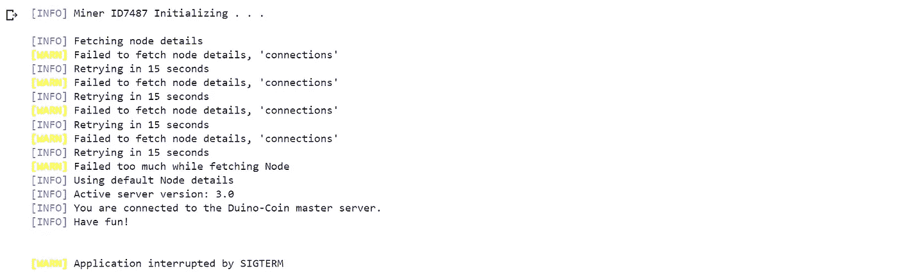
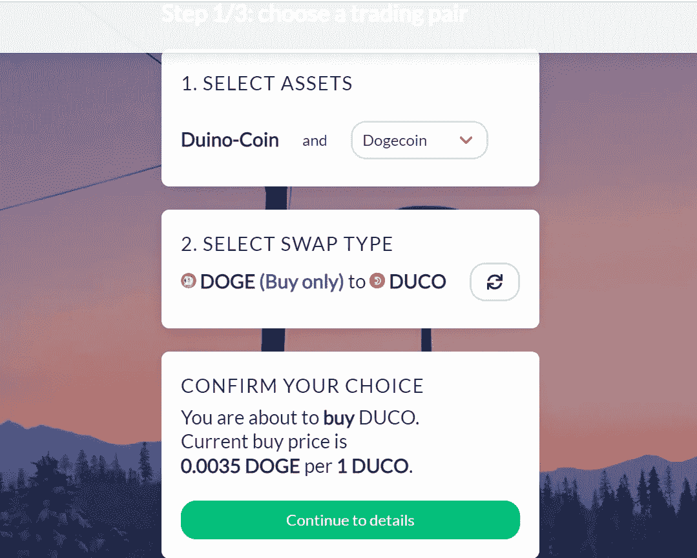

# 使用 Python 库的加密挖掘

> 原文：<https://levelup.gitconnected.com/crypto-mining-using-a-python-library-5ca5e5b77c91>

让我们利用 Python 的魔力来挖掘一种叫做 Duino-coin 的加密货币。

大多数人认为密码挖掘只是创造新硬币的一种方式。然而，加密采矿还涉及验证区块链网络上的加密货币交易，并将它们添加到分布式账本中。最重要的是，加密挖掘防止了数字货币在分布式网络上的重复花费。


[Art Rachen](https://unsplash.com/@artrachen?utm_source=unsplash&utm_medium=referral&utm_content=creditCopyText) 在 [Unsplash](https://unsplash.com/s/photos/crypto?utm_source=unsplash&utm_medium=referral&utm_content=creditCopyText) 上拍摄的照片

虽然挖掘比特币和 Ravencoin 等流行的硬币需要 ASIC 矿工，高电力和冷却成本的 GPU，**但有一种这样的硬币可以在几乎任何硬件上挖掘，甚至可以在 arduino 板上挖掘，称为 DuinoCoin。**

# 什么是杜伊诺硬币？

Duino 成立于 2019 年，是一个有趣的、完全原创的加密硬币项目，由一个专注于节能采矿的年轻开发人员团队开发。它主要是，但不仅仅是，致力于刚刚开始在密码世界的人，因为它不需要任何昂贵的设备。

听起来很有趣，对吧。

我们将使用**内置的 hashlib 模块、socket 模块和请求库**连接到**server.duinocoin.com**以连接到一个挖掘池并获取数据，而**按难度解决 hash** 。

下面是导入所需库的代码，设置难点，并定义 URL。

```
from datetime import datetime
from hashlib import sha1
from socket import socket
from time import time, sleep
from random import randint
import requestsVER = '1.2'
WORKER = f'ID{randint(1001, 9998)}'
USERNAME = ''
DIFFICULTY = 'MEDIUM'
PORT_URL = 'https://server.duinocoin.com/getPool'
DEFAULT_NODE = ('server.duinocoin.com', 2813)
```

您可以使用 pip 命令安装**请求库。python 中已经提供了所有其他模块。**

**DuinoCoin 算法**基于 **SHA-1 哈希链** /
这里是获取块哈希并发送块哈希结果的代码。

```
def fetch_block_hash(base:str, target:str, diff:int): 
    start_time = time()
    base = sha1(base.encode('ascii'))
    attemp = None
    for res in range(100 * diff + 1):
        attemp = base.copy()
        attemp.update(str(res).encode('ascii'))
        validator = attemp.hexdigest()
        if target == validator:
            process_time = time()-start_time
            hashrate = (res/process_time)/1000
            return res, round(hashrate, 2)def send_block_hash(conn_soc, result, hashrate):
    result_message = f'{result},{hashrate},Dino Miner V{VER},{WORKER}'
    while 1:
        conn_soc.sendall(bytes(result_message, encoding='utf8'))
        start_time = datetime.now()
        feedback = conn_soc.recv(64).decode().rstrip('\n')
        ping = int((datetime.now()-start_time).microseconds / 1000)
        retval = 1 if feedback == "GOOD" else 2 if feedback == "BLOCK" else 3
        return retval, ping
```

要运行的全部代码作为 GitHub 要点在最后给出。您可以在任何 python 解释器上运行它。

下面是挖掘时代码的输出。



挖掘代码的输出(图片由作者提供)

请记住**您需要创建一个钱包，并在定义了参数 USERNAME = ' '的代码中添加您的用户名**。

以下是完整的代码供您参考。

这是一个 python 程序，可以在任何硬件上挖掘加密货币。你可以在 exchange.duinocoin.com 兑换你的金币。在撰写本文时，1 Duino-Coin = 0.0035 Doge



兑币交易所

如果你喜欢我的文章， **s *支持我，用这个[链接](https://medium.com/@arjungullbadhar/membership)成为*的中级会员。您还可以使用文章末尾的奖励作者功能 ***留下提示*** 。**

[](/remove-objects-from-images-using-ai-a00876460dd1) [## 使用人工智能从图像中移除对象

### 只需几个简单的步骤，就可以使用人工智能从你的令人敬畏的图像中删除照片炸弹。

levelup.gitconnected.com](/remove-objects-from-images-using-ai-a00876460dd1) [](/colorize-black-and-white-photos-using-python-and-ai-5b3e5f85df44) [## 使用 Python 和 AI 给黑白照片上色。

### 想知道你以前的黑白照片在现实中是什么样子吗？让我们找出答案。

levelup.gitconnected.com](/colorize-black-and-white-photos-using-python-and-ai-5b3e5f85df44)