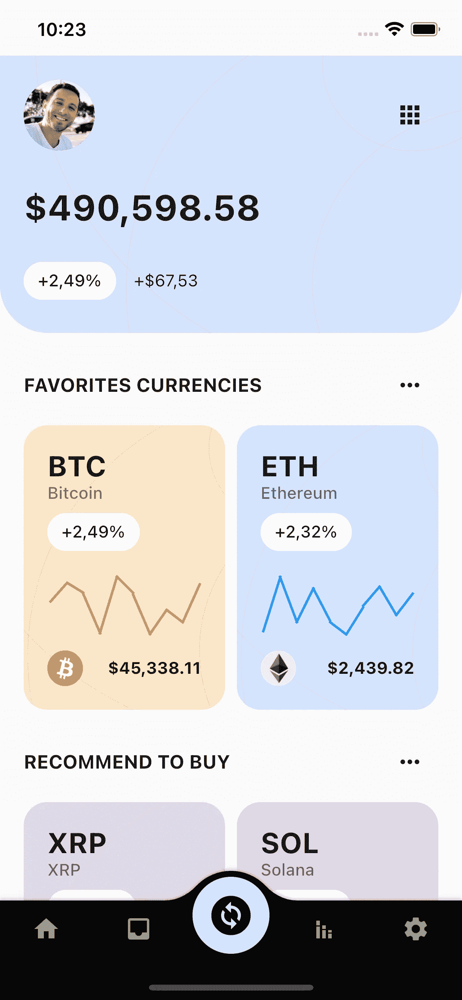
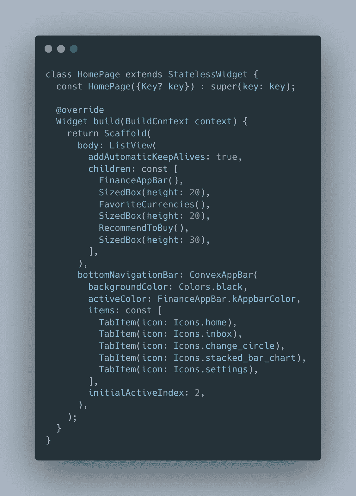
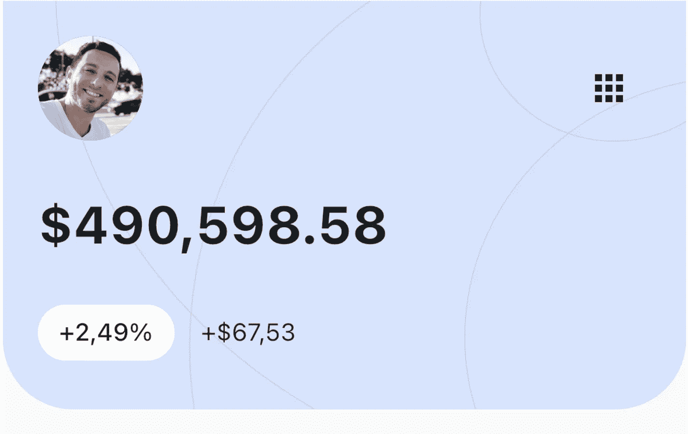
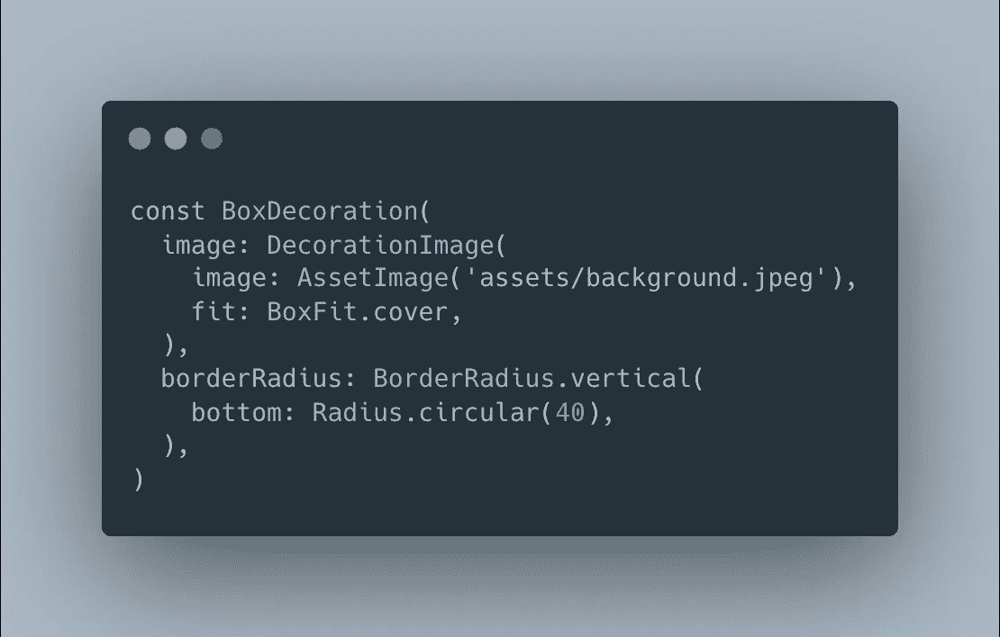
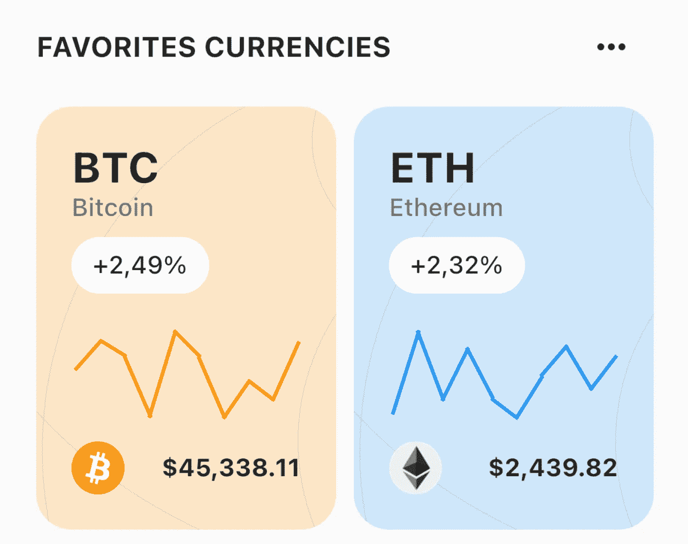
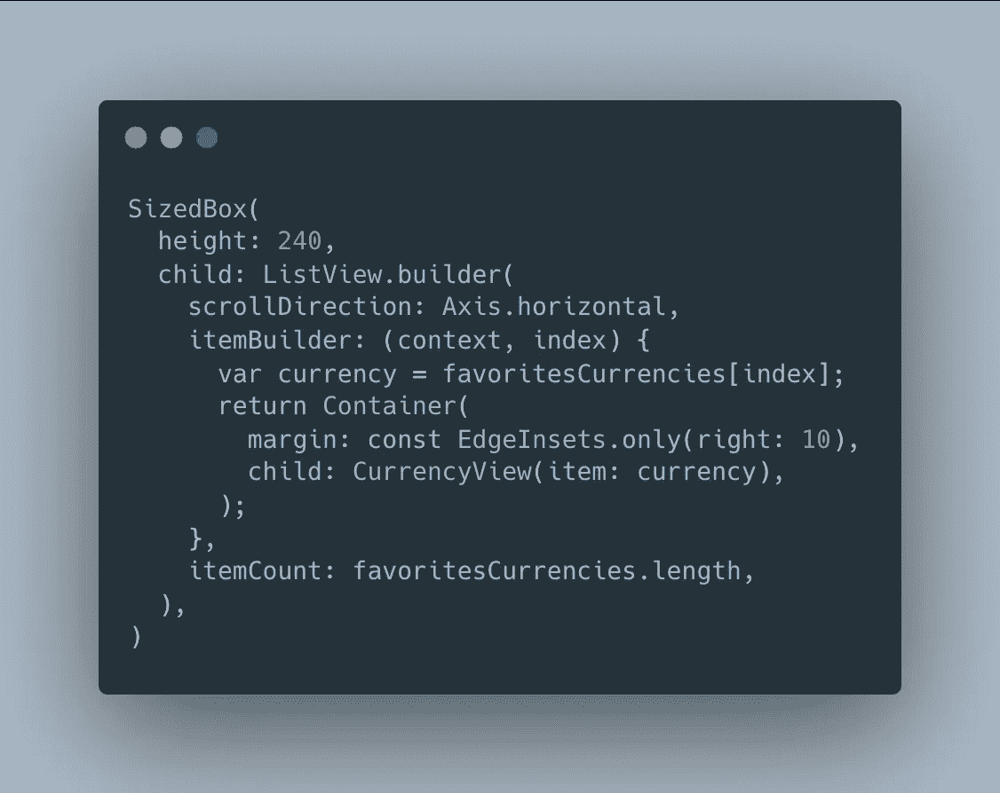
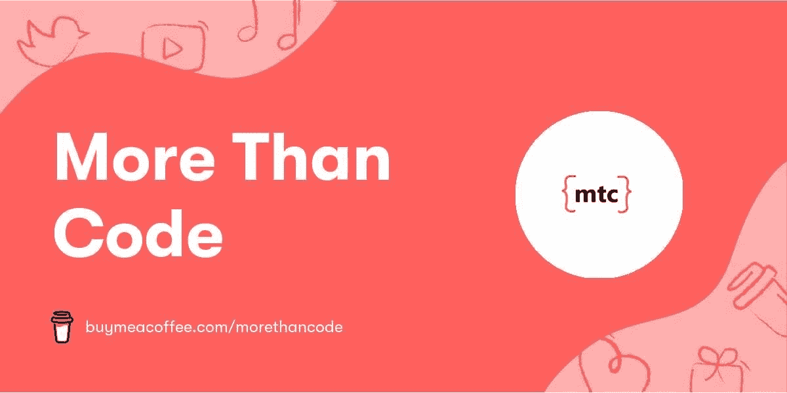

# 使用 Flutter 3.0 的加密钱包用户界面

> 原文：<https://levelup.gitconnected.com/crypto-wallet-ui-using-flutter-a760ef04895b>

嘿大家，好久不见！。

在这种情况下，我将展示一个使用 Flutter 3.0 的加密钱包的克隆。



为了便于阅读，你可以将代码分开，这一点非常重要。在另一篇文章中，我将谈论**测试**和**可维护性**。简言之，良好的实践和干净的代码。



所以，我们来编码吧。

从大的方面来分析，这个克隆有两个部分:标题和货币列表。让我们进入第一部分，标题:



在伪窗口小部件语言中应该是这样的:

```
COLUMN [
   ROW (image, button menu), 
   TEXT,
   ROW (chip, text),
]
```

要在底部获得圆形边框:



圆形边框

现在，让我们进入第二部分，货币列表。



加密货币的横向列表

现在，我们已经知道如何圆化边界(如果没有，见上；)).本节中最重要的事情将是处理 **ListView.builder** 及其错误:**Get a error ` failed assertion:line 1687 pos 12:' hasSize ' `【T9]或类似的错误。**

**记住，ListView 需要一个高度。不然它不知道怎么办！**



列中的 ListView 需要高度

CurrencyView 小部件管理货币拥有的所有信息。里面的图表是假的，我用了 [LineChart](https://pub.dev/packages/line_chart) 包，里面有虚拟数据。在另一篇文章中，我将讨论如何发出请求、读取响应和显示 UI。

最后这个帖子，我用了[凸](https://pub.dev/packages/convex_bottom_bar)包因为好看，看看吧！

## 你对哪些颤振话题感兴趣？

有许多方法来执行这个设计，尝试一下吧！

完整代码可在 [GitHub](https://github.com/nanox77/flutter-examples/tree/master/finance_app) 上获得。如果你愿意，可以看看[我之前的扑篇](https://nanocastellano.medium.com/)！。

**更多内容请看【https://mtc-flutter.com】[](https://mtc-flutter.com/)**

**如果您喜欢这些内容，您可以支持我们:**

****

**[https://www.buymeacoffee.com/morethancode](https://www.buymeacoffee.com/morethancode)**

**那都是乡亲们！**

**尽情享受吧！**