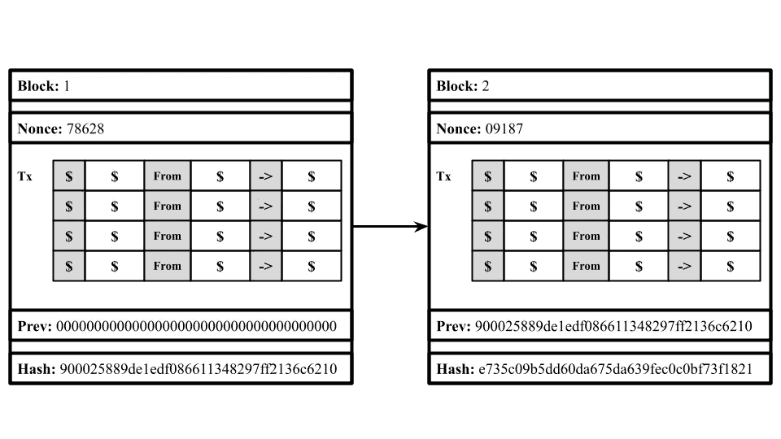
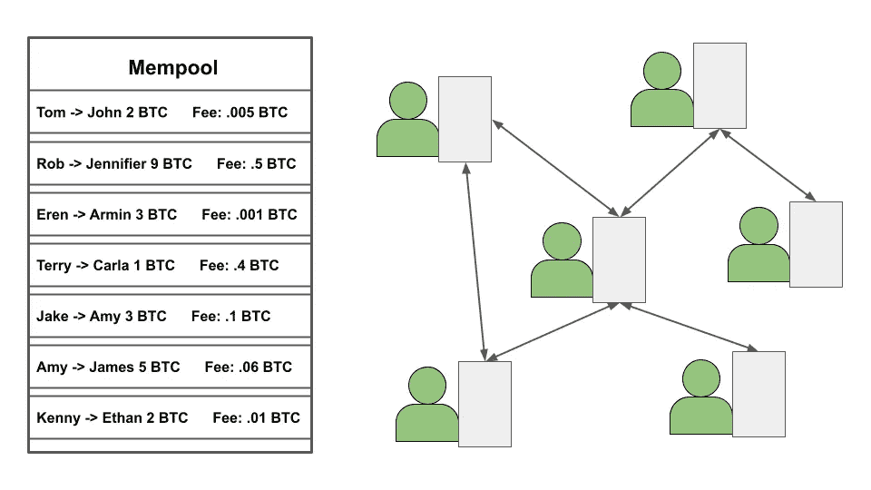
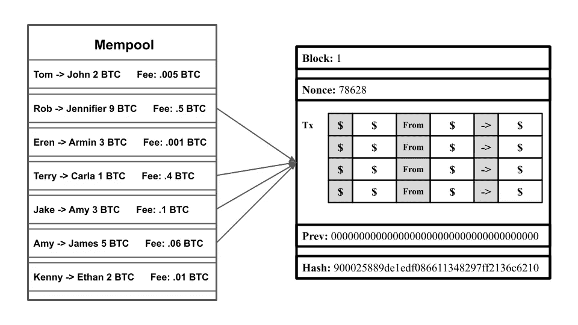
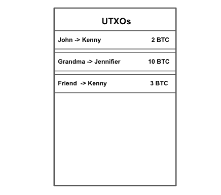
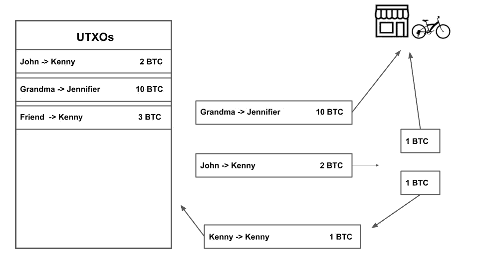
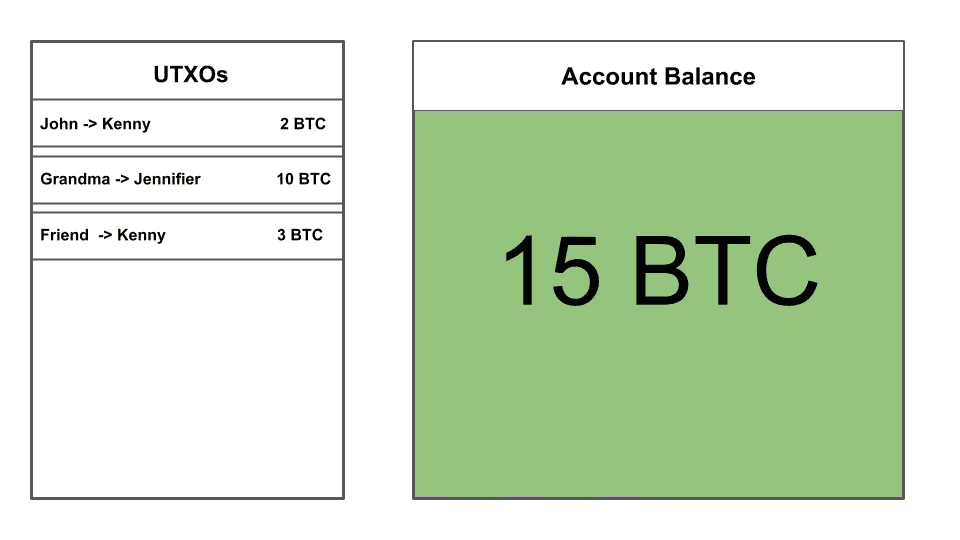

# 加密货币——未来的硬币

> 原文：<https://levelup.gitconnected.com/cryptocurrencies-the-coin-of-the-future-f2e2bf48e6c4>

[图像来源](https://stock.adobe.com/181032725?as_campaign=TinEye&as_content=tineye_match&epi1=181032725&tduid=746f41acd746cd8e77d99acfbdd9cb83&as_channel=affiliate&as_campclass=redirect&as_source=arvato)

除非你过去 2 年一直生活在岩石下，否则你可能听说过比特币或以太坊。如果你没有🤯，你去哪里了？！让我们快速概述一下它们是什么！

比特币和以太坊是加密货币最成功的两种形式。你可以把加密货币想象成一种数字硬币，人们用它和其他人一起买卖各种物品。加密货币非常安全，因为它们是建立在一种名为区块链的技术基础上的，这使它们成为一个分散的系统，不附属于任何政府。

现在我们对加密货币有了一点了解，你可能想知道，它们实际上是如何工作的？？

**区块链概述**

是时候从基础开始了！为了理解加密货币是如何运作的，我们需要首先理解它们背后的关键技术区块链是如何工作的。

区块链是一种分散的记录信息的系统，这种方式使得改变、黑客攻击或欺骗系统变得困难或不可能。它类似于谷歌文档，我们可以创建一个文档并与人分享。当文档被共享时，它被分发而不是复制，这创建了一个分散的链，使每个人都能实时访问文档。所有的改变对每个人都是可用的，所以没有人能在每个人都不知道的情况下改变任何事情。

区块链是由存储信息的区块组成的。在加密货币的情况下，这些块存储交易数据。每个块也有一个随机数和一个散列。散列是一个块的签名，它与该块粘在一起，因此可以在以后被引用。这类似于人的指纹，因为它是交易数据的签名。随机数是区块链矿工在解决任何障碍之前需要发现的第一个数字。为了创建一个块，会发生一个称为挖掘的过程，在这个过程中，人们会找到与哈希匹配的随机数。这个过程非常困难，需要大量的计算能力来完成。矿工是完成采矿过程的人。

*如果你想了解更多关于区块链的知识，请查看* [*这篇文章*](https://nivangujral.medium.com/blockchain-say-bye-to-traditional-ledgers-and-currencies-860a397742d0) *是我写的关于更详细解释区块链技术的文章。*

**内存池**

在加密货币中，区块链的区块包含发生的交易。为了理解这一点，让我们想象我们有两个名叫肯尼和伊森的人在交易比特币(BTC)。在这个场景中，肯尼送了两个 BTC 给伊森作为生日礼物。当事务完成时，该块将存储该事务，以便将来不能对其进行更改。但是，如果您有交易加密货币的经验，您可能会知道交易不会马上完成。会发生什么？

当一个人点击发送或购买后，他们未完成的交易将被临时存储在 Mempool 中。Mempool 是一个数据库，存储任何仍需完成的事务。在我们之前的场景中，Kenny 发出的事务请求将存储在 Mempool 中。当交易存储在 Mempool 中时，正在发送或接收的加密货币不会发生任何变化。肯尼仍然有他的 2 BTC，伊森没有 2 BTC。

**交易费用**

区块链上的每个节点(用户、矿工或任何存储区块链副本的设备)都可以看到内存池。它还显示了交易的哈希和通过开采区块获得的交易费。因为挖掘器正在完成事务，所以它们通过内存池来挑选它们想要完成的事务。矿商通常会选择收费最高的区块。自然，较高费用的交易比较低费用的交易完成得快。利用这一点，像以太坊这样的加密货币让用户能够添加“汽油价格”或他们希望支付的额外费用，以尽快完成交易。

为了理解矿工如何选择将被完成的交易，让我们跟随我们的例子。让我们假设在 Mempool 中有四种不同的事务可供矿工选择。让我们想象这些是不同的交易，

如果你是矿工，你会选择开采哪个区块？你可能会选择挖掘第二笔交易，因为这会给你带来最大的个人回报。因为一个块可以存储多个事务，所以挖掘器将遵循类似的策略，选择可以放入该块的最上面的事务。

**交易和 UTXO 的**

在正常的银行系统中，我们有一定数量的钱存在账户中。每当我们需要花钱的时候，我们就从账户上扣除，当我们有多余的钱时，我们可以把它加到账户上。然而，在加密货币中，移除和添加货币的过程有点复杂。

在加密货币中，有一定数量的硬币可供人们购买和出售。每当你的账户中有一定数量的硬币，它就会显示当前在你的账户中。在此之前，这枚硬币在你和他们之前的其他人手中。这听起来可能很复杂，但让我们举个例子。目前，肯尼的账户里有 2 个 BTC。他在生日那天从约翰那里得到了这两个 BTC。约翰从卡拉那里得到了他送给肯尼的 2 BTC，卡拉用 2 BTC 从约翰那里买了这辆自行车。肯尼拥有的这种加密货币原本属于卡拉，卡拉把它给了约翰，然后又传给了肯尼。这个例子表明，硬币总是在某个地方移动，当它在你的账户上时，它只是暂时在你的手中。

每当一个人收到任何数量的加密货币，它都会显示为他们账户上正在进行的交易。个人账户上正在进行的交易被称为 UTXOs 或未用交易产出。UTXOs 是任何不在个人账户上消费并由个人持有的加密货币。在我们上面的例子中，肯尼的 2 BTC 将被视为 UTXO，而卡拉和约翰以前拥有的 BTC 将不被视为 UTXO。一个人的帐户上可以有多个 UTXOs。为了让我们更好的理解这个概念，我们来举个例子。让我们假设我们正在跟踪肯尼的帐户。最初，约翰送给他 2 BTC 作为生日礼物。他还在圣诞节从奶奶那里收到了 10 个 BTC，从朋友那里收到了 3 个 BTC。因此，在肯尼的帐户中，他拥有三个不同的 UTXO，即“约翰送肯尼 2 BTC”，“奶奶送肯尼 10 BTC”，以及“朋友送 3 BTC”。

如果加密货币显示为 UTXOs，那么支出如何在后台工作？让我们假设肯尼打算用他的比特币买一辆总共价值 11 BTC 的自行车(这是一辆非常昂贵的自行车)。为了花掉比特币，我们需要将比特币的所有权转移到自行车店。让我们先拿肯尼拥有的最大的 UTXO 来说，那就是“奶奶送给肯尼 10 个 BTC”。现在我们想把它的所有权换成自行车的主人，而不是肯尼。因此，交易“肯尼将自行车店 10 BTC”将被放在 mempool 中完成。然而，这辆自行车值 11 BTC，我们只给了自行车店 10 BTC。在这种情况下，系统将采用我们拥有的下一个 UTXO，即“约翰发送给肯尼 2 BTC”。现在让我们把这枚硬币的所有权换成自行车店。等等，我们该怎么做？我们不想给自行车店带来额外的 BTC 价值。系统将首先把 UTXO 分成两个不同的交易来给出，而不是把 2 BTC 发送给自行车商店。在第一笔交易中，“肯尼把自行车送到了 BTC 1 号店”。耶！现在我们已经发送了自行车商店要求的 11 辆 BTC！但是我们没有使用的另一个 BTC 去哪里了呢？原来的 UTXO 中未使用的 BTC 将在肯尼的帐户中被重新制作为自己的新 UXTO。这笔交易将被标记为“肯尼送肯尼 1 BTC”。

使用这些技术，加密货币系统可以从一个人的账户中增加和减少货币。

**钱包**

人们在买卖加密货币时，一般不会直接使用加密货币软件。相反，大多数人使用钱包，如 MetaMask，比特币基地等。这些钱包让那些只想买卖硬币的正常人很方便。钱包通过您的签名和密钥访问您的加密货币账户。当您发送和接收加密货币时，签名和密钥是保持您的加密货币安全和保护您的身份的附加措施。钱包显示您帐户中的加密货币总量。等等，但是如果我们从上一节学到，加密货币被分解成不同的 UTXOs。钱包使用你的 UTXOs，把它们加在一起，非常简单地向用户显示你有多少钱。

**金钱的未来**

加密货币每天都在增长，每个月都有数百万新用户加入这些平台。由于它为每个用户提供了巨大的安全性，它正慢慢成为一个真正好的交换媒介选择。

目前，在加密货币能够真正取代现代货币作为交换媒介之前，需要解决一些重大缺陷。加密货币具有很高的波动性，因此对普通人来说不太可靠。加密货币也受到了很多争论，因为由于其不受监管的行为，它可能会被消极地使用。这使得人们很难信任它。随着越来越多的人使用加密货币，加密货币也可能面临规模扩大的问题，他们需要这种技术来确保速度和安全性。

让我们回顾一下刚刚学到的内容:

> 加密货币使用区块链技术作为一种交换媒介，人们可以用它来买卖物品。它们使用包括 UTXOs 和 Mempools 在内的特殊属性来高效运行。它们最终简单地通过不同的钱包展示出来，让日常人们了解正在发生的事情。

加密货币正在成为与世界各地的人们进行交易的重要工具，并且这种增长每天都在扩大。

Nivan 是一名 14 岁的人工智能开发者，他希望利用技术来帮助解决世界上的问题。他目前正在建立一家名为 Lemonaid 的公司，这是一个将青少年与需要志愿者/实习生招聘帮助的组织联系起来的平台。如果你想进一步讨论这篇文章或只是谈谈，请发邮件到 nivangujral@gmail.com**给我。**