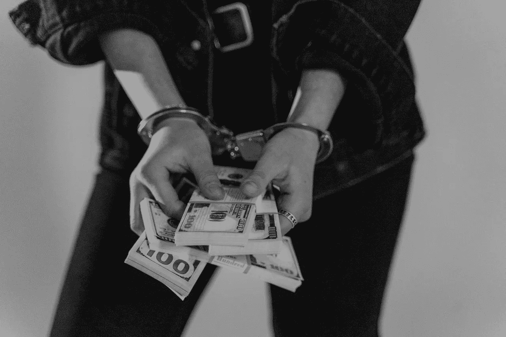
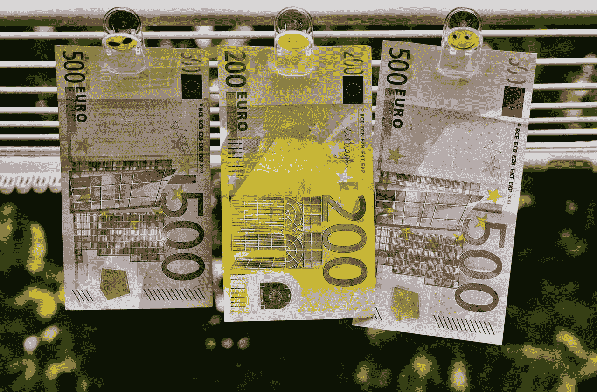

# 加密货币不仅仅是犯罪工具

> 原文：<https://levelup.gitconnected.com/cryptocurrency-is-not-just-a-tool-for-criminality-6996c949c42>

## FUD 解释并揭穿了“比特币是给罪犯的”

照片由来自[佩克斯](https://www.pexels.com/photo/man-people-woman-water-6266301/?utm_content=attributionCopyText&utm_medium=referral&utm_source=pexels)的[马体·米罗什尼琴科](https://www.pexels.com/@tima-miroshnichenko?utm_content=attributionCopyText&utm_medium=referral&utm_source=pexels)拍摄

作为加密货币的相对新手，我还有很多要学的。

我正在采取措施积累知识，并致力于理解[基础知识](/the-basics-of-bitcoin-what-ive-learned-so-far-as-a-crypto-newbie-6847056a7b5c)以及当今的热门话题。在我研究它的短暂时间里，我了解到那些没有参与其中的人会很快质疑动机，并渴望分享他们的愤世嫉俗。

新年伊始，我做了一笔小额且有点浮躁的第一笔比特币投资。从那以后，我一直在做我应该提前做的事情——应该支持任何投资的研究。

比特币的许多方面都被挑了出来——它的分散所有权、其供应的有限性，以及它是否真的是一种货币或价值储存手段，或者仅仅是一个骗局或骗局。也许最吸引批评者和反对者的是它在交易中实现的匿名性——这一特征可能会吸引那些试图掩盖自己在非法交易中的角色的人。

在即将上任的美国财政部长珍妮特·耶伦(Janet Yellen)最近的开场白中，她借此机会阐述了自己对加密货币及其监管的立场:

> “我认为许多(加密货币)被用于——至少在交易意义上——主要用于非法融资……我认为我们真的需要研究如何减少它们的使用，并确保洗钱不会通过这些渠道发生。”

作为一个乳臭未干的 crypto 新手，我致力于获得对其内部工作的基本理解，这让我觉得很有趣。然而，一位在美国政府中有影响力的人，其工作是监管所有金融事务，可能会陷入对加密货币的最大误解之一，而且在她上任初期就公开表示了这一点。

众所周知，政府热衷于监管加密技术，但我认为他们现在已经找到了一个更好的理由，而不是简单地依靠老掉牙的说辞？年复一年都在说同样的论点。

# 带着 FUD 回到地球

正如你所料，加密货币的世界充斥着技术术语、令人困惑的概念和大量的缩写——到目前为止，我最喜欢的是 FUD。

FUD 代表恐惧、不确定性和怀疑，是那些希望对 crypto 产生怀疑的人所使用的任何典型异议的总称，他们认为 crypto 不仅仅是一个精心策划的骗局或庞氏骗局。

*“比特币是给罪犯用的”* FUD 植根于这样一种理念，即加密货币带来的匿名性是政府害怕而罪犯喜欢的。

没有一个中央机构来跟踪、监督或管理货币所有权或使用货币进行的交易。政府不能对交易征税，更不用说监督谁拥有它或出于什么目的使用它。

这些都是比特币等加密货币的刻意特征，也是其设计的基本部分。对于那些可能想将它用于非法目的的人来说，这显然是一种名义上的吸引力，但这并不是创建它背后的真正目的，也不是因为它真正代表了现在它的使用方式。

现在拥有比特币的大多数人是个人投资者(像我这样的小人物和保罗·都铎-琼斯这样的对冲基金名人)，向客户出售与加密相关的交易所交易基金的投资公司，以及像 MicroStrategy 这样将公司储备投资于比特币的公司。

他们用美元等传统货币购买比特币和其他密码，并推测他们持有的价值将随着时间的推移而增加。

在很大程度上，他们没有使用比特币作为支付商品和服务的手段，原因很简单。

# 价值 4.2 亿美元的披萨

已知的第一笔比特币交易发生在 2010 年 5 月，当时拉斯洛·汉耶茨(Laszlo Hanyecz)支付了 10，000 比特币，让两个披萨外卖。

这可能是当时他的比特币的一个很好的用途。但是按照创纪录的价格(2021 年 1 月达到)，这两个披萨将花费 4.2 亿美元。

比特币价格的波动是众所周知的，也是目前被广泛接受的一个特征。2017 年，比特币价格达到近 2 万美元，随后暴跌至每比特币略高于 3000 美元。这种波动使得传统投资者对其作为价值储存手段或投资资产类别持怀疑态度。同样的波动也吸引着那些有兴趣短期买卖黄金以寻求改变人生的利润的人。

随着时间的推移，比特币价格的剧烈波动是目前比特币作为一种货币没有在*得到更广泛使用的主要原因。*

作为一笔比特币的持有者，你会愿意用一部分比特币换一本书、一杯咖啡或一份披萨，因为你知道几年后这笔钱足以买一辆车了。

我也不会。

正如许多人热衷于指出的那样，价值也可能暴跌至零(或接近零)，因为它已经多次发生过——但随着这项技术被更广泛地接受，并被 PayPal 和 Square 等支付处理公司接受，这种下跌可能不太可能发生。

政府专注于比特币和密码的使用以及使用比特币进行的交易，就是忽视了比特币作为货币的交换并不是其目前的主要用途。

即便是希望通过比特币清洗传统货币的犯罪分子，大概也很难考虑到用比特币进行一次性交易可能会损失未来价值？

# 黑暗的历史

抛开比特币对金融交易的适用性不谈，我理解珍妮特·耶伦(Janet Yellen)的观点来自哪里。

除了名义上的犯罪机会*可能是由比特币促成的*之外，人们普遍认为，许多使用比特币的交易都发生在黑暗的网络上——作为枪支、毒品或精通技术的买家想要匿名购买的任何其他物品的支付方式。

比特币单位从一个所有者转移到另一个所有者的过程被永远写入了区块链电码。

在保证匿名的情况下，我可以使用加密地址将我加密钱包中的一部分比特币发送到你的钱包，而不需要知道你是谁。

通过这种方式，比特币在网络中传输，它们的移动以一种无法破译的形式记录在多个不可争议的账簿中。即使有一个管理机构想要弄清楚谁在为谁的什么付钱，他们也做不到。

现在你明白为什么会有犯罪了吧，FUD？

如果有监管和控制的理由，那就是政府应该更好地掌握黑暗网络，并寻求控制它。像[丝绸之路](https://en.wikipedia.org/wiki/Silk_Road_(marketplace))(2014 年被联邦调查局关闭的早期市场之一)这样的暗网操作的关闭表明，政府可以重新获得控制权。

话虽如此，但在目睹了各国政府努力监管那些在众目睽睽之下运营的科技巨头——脸书、亚马逊、谷歌等——的程度后，对秘密运营商的这种监管似乎不太可能马上发生。

有人可能会说，对加密货币的监管同样难以实施。

来源: [Pexels](https://www.pexels.com/photo/200-euro-between-500-euro-164529/)

# 用比特币支付赎金

您可能在某个时候收到过试图向我们勒索金钱的垃圾邮件，这是社会工程和操纵的一部分，是一种超现代的信任伎俩。

发件人会声称在我们家的电脑上安装了恶意软件。他们可能声称已经捕获了我们的密码或从我们的网络摄像头记录了有损隐私的图像。它们可能会威胁到通过电子邮件向我们地址簿中的所有人发送敏感信息或图像的能力。唯一的预防措施是，向他们在电子邮件中提供的加密钱包地址发送比特币赎金。

可悲的是，这种诈骗和勒索的企图司空见惯——我自己也收到过一些。

他们当然是机会主义者和道德缺失者，但许多接受者措手不及，并真的害怕他们是真的。我敢肯定，有些人甚至付了钱，然后才意识到他们被愚弄了。也许比羞辱更痛苦的是意识到没有办法要回他们的钱。

这种骗局的存在和普遍存在，以及许多人将比特币融入他们的方法的事实，进一步解释了为什么许多人在犯罪和比特币之间建立了心理联系。

# 感知与现实

这是可能的 se 为什么有一个犯罪和加密之间的联系，但犬儒主义是正当的吗？

今年早些时候，区块链分析公司 chain analysis 发布了他们的 [2021 年秘密犯罪评论](https://blog.chainalysis.com/reports/2021-crypto-crime-report-intro-ransomware-scams-darknet-markets)的要点。虽然耶伦声称加密货币主要是用于非法交易的*，但 Chainalysis review 揭示了相反的情况，指出:*

> *“2019 年，犯罪活动占所有加密货币交易量的 2.1%，或价值约 214 亿美元的转移”*

*该报告继续指出:*

> *“2020 年，所有加密货币活动中的犯罪份额降至 0.34%，或 100 亿美元的交易额。”*

*需要说明的是，不仅犯罪性质的交易比例极小，而且交易总量也在减少。*

# *并非所有的犯罪都是平等的*

*Chainalysis 报告考虑了各种犯罪交易，包括与国内极端主义、恐怖融资和虐待儿童材料相关的交易。值得注意的是，这些类别占了难以察觉的金额。*

*很明显，即使与这些类别中的任何一个相关联的一美元价值，考虑到它对真实的人类所代表的意义，也是太多了。尽管如此，这些值非常小(小到在结果图上看不见)。*

*相反，绝大多数交易都与诈骗、暗网材料和最大的勒索软件有关。最有趣的是，2018 年至 2019 年期间，勒索软件交易量增长了约四倍，但在 2020 年下降了三分之二。*

*如果可以从这些数据中得出结论，这表明人们对勒索软件变得越来越明智，或许通过更好的教育，更有可能识破骗局，不太可能上当？*

*具体到勒索软件，也值得注意的是，虽然美国法律在技术上不阻止支付赎金，但向制裁名单上的国家和个人支付赎金在 T2 是非法的。那些实施网络犯罪(包括分发勒索软件)的人可能会被添加到制裁名单中。*

*根据定义，在美国，支付赎金作为对勒索软件的回应实际上可能是非法的。*

*扩大对该法律的认识和实施可能会及时阻止网络犯罪分子实施勒索软件攻击，从而减少使用加密货币支付的赎金数量。说服受害者拿出钱来维护他们的尊严是一回事，但说服他们自己去犯罪又是另一回事。*

# *犯罪和金钱密不可分*

*只要金钱存在，犯罪分子就会设法利用它来达到自己的目的和获利。人们被绑架索要赎金，被勒索，被暴力威胁勒索钱财。货物被盗后出售。现金本身被盗并被清洗，因此单个单位的现金可能会在系统中丢失并被无风险地使用。*

*这些都不是新的。*

*考虑到[联合国毒品和犯罪办公室估计](https://www.unodc.org/unodc/en/money-laundering/overview.html)仅全球洗钱就占全球 GDP 的 2%到 5%,或 8000 亿美元——相当于现在的 2 万亿美元——这仅仅是金钱犯罪的一个案例。用于犯罪用途的约 100 亿美元比特币交易开始变得微不足道，而且每年都在减少。*

*人们普遍认为，政府有责任制定控制措施，以减少犯罪，并使犯罪阶层更难开展业务。*

*尽管认为放大加密货币在促成此类交易中的作用是触及问题的核心是狭隘的。*

*作为一项新技术，随着越来越多的非法活动转移到 crypto 上作为利用它的手段，人们可能会预计数量会增加，但正如我们所见，数量正在逐年下降。*

*“比特币是给罪犯的”FUD 将继续愤怒，被那些试图破坏公众对加密信任的人引用。同样的担忧经常出现在媒体上，我认为这种情况不会改变。政府对某些事情的调控可能是可取的，但如果用在错误的地方，就不会产生预期的效果，还会降低政府的公信力。*

*对正确事物的监管——例如暗网，很可能是更好的关注焦点——同时更好地教育公众关于加密货币的现实，以及他们如何在不陷入犯罪骗局的情况下开展在线生活。*

*如果你喜欢阅读这样的故事，并且愿意支持 Medium 上的作家，考虑注册成为 Medium 会员。一个月 5 美元，给你无限的故事。如果你注册使用我的链接，我会赚一小笔佣金。*

* [## 阅读托比·黑兹伍德(以及媒体上成千上万的其他作家)的每一个故事

### 作为一个媒体会员，你的会员费的一部分会给你阅读的作家，你可以完全接触到每一个故事…

tobyhazlewood.medium.com](https://tobyhazlewood.medium.com/membership)* 

*注:*本文仅供参考。不应将其视为财务或法律建议。在做任何重大财务决定之前，先咨询财务专家。**

*[***如果你喜欢这篇文章，我希望你能加入我的邮件列表。***](http://bit.ly/TobyHazlewoodList)*