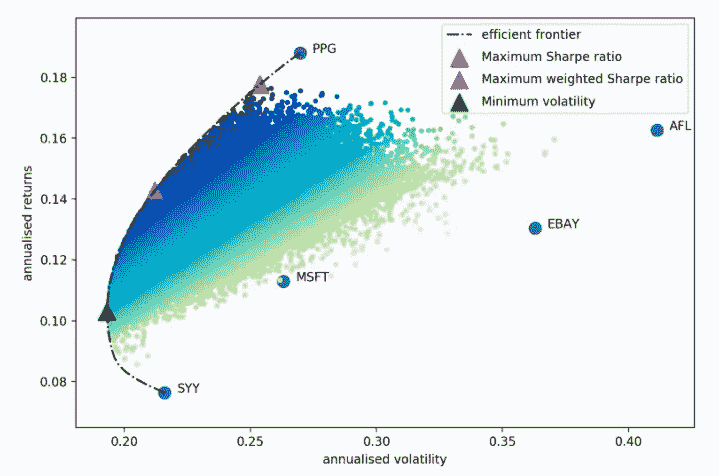
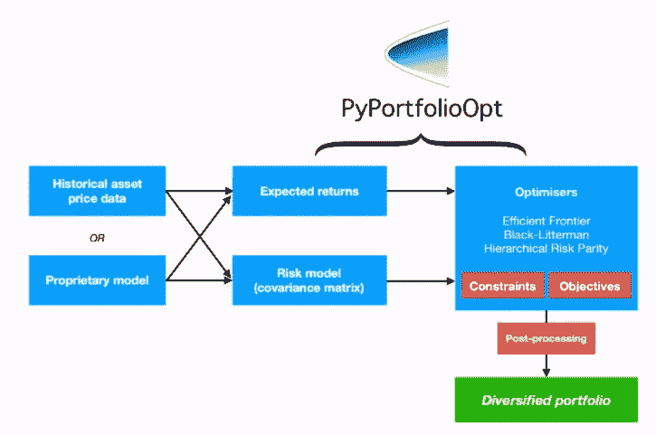
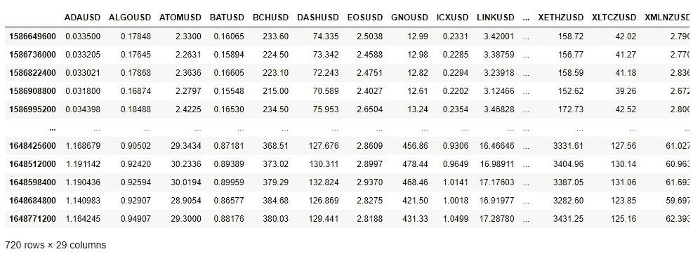
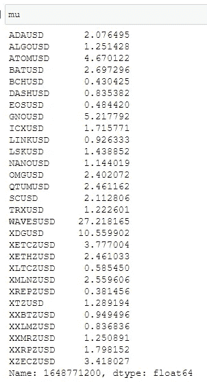
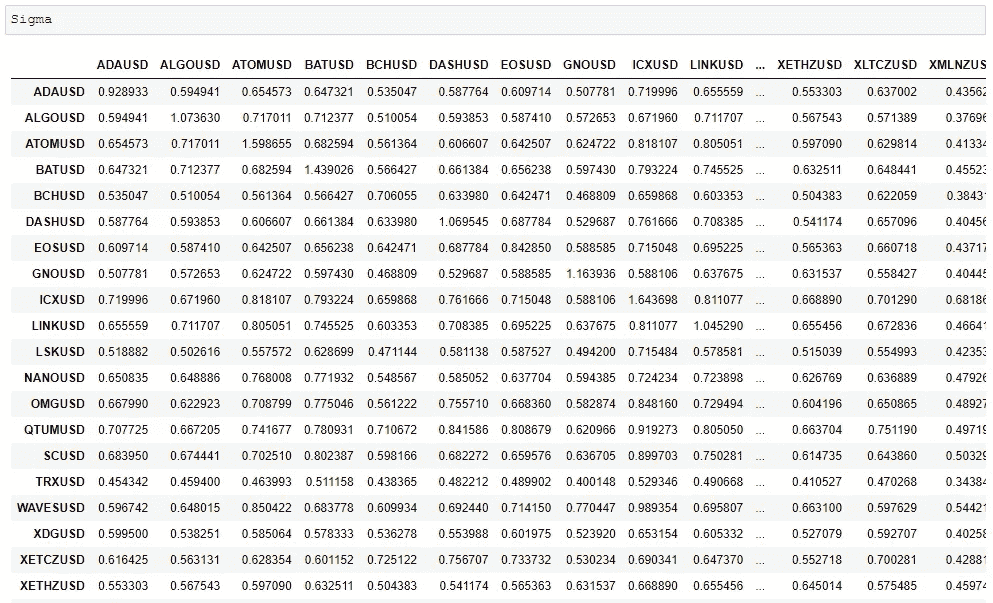
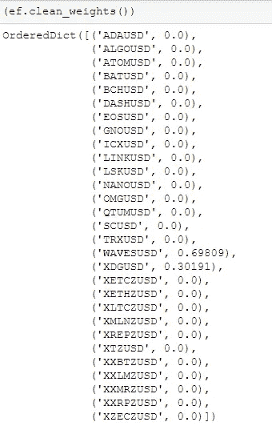
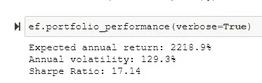
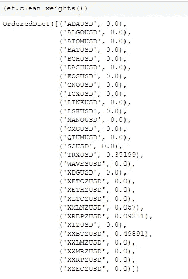
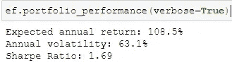

# Python 中的加密货币投资组合优化

> 原文：<https://levelup.gitconnected.com/cryptocurrency-portfolio-optimization-in-python-46b5bd6d6f81>

## 如何建立最大夏普比率和最小方差的投资组合的例子


肖恩·波洛克在 [Unsplash](https://unsplash.com?utm_source=medium&utm_medium=referral) 上的照片

[](https://jorgepit-14189.medium.com/membership) [## 用我的推荐链接加入媒体-乔治皮皮斯

### 阅读乔治·皮皮斯(以及媒体上成千上万的其他作家)的每一个故事。您的会员费直接支持…

jorgepit-14189.medium.com](https://jorgepit-14189.medium.com/membership) 

在本教程中，我们将向您展示如何使用 [PyPortfolioOpt](https://pyportfolioopt.readthedocs.io/en/latest/) 库在 Python 中构建优化的投资组合。在另一个教程中，我们已经向您展示了[如何使用 Python 从头开始构建多样化的投资组合](https://predictivehacks.com/portfolio-optimization-in-python/)。对于这项任务，我们将基于[有效边界](https://www.investopedia.com/terms/e/efficientfrontier.asp#:~:text=The%20efficient%20frontier%20is%20the,for%20the%20level%20of%20risk.)构建优化的投资组合。我们将建立一个使夏普比率最大化的投资组合和一个使波动性最小化的投资组合。下图显示了我们上面提到的投资组合在有效边界上的位置。



[图像来源](https://pyportfolioopt.readthedocs.io/en/latest/UserGuide.html)

下面的流程图展示了 PyPorfolioOpt 库的不同功能。



# 加载所需的库

对于本教程，我们将需要使用一些库。如果您想按照可重现的示例进行操作，您应该已经安装了这些库。让我们装载它们。

```
import pandas as pd
import requests
import timefrom pypfopt import risk_models
from pypfopt.risk_models import CovarianceShrinkage
from pypfopt import expected_returns
from pypfopt.efficient_frontier import EfficientFrontier
```

# 获取数据

我们将考虑自“**2020–01–01**”以来加密货币的每日价格，即 2 年零 4 个月的数据(今天是:2022–04–01)。我们将使用[北海巨妖 API](https://predictivehacks.com/how-to-get-cryptocurrency-data-from-kraken-api-in-python/) 和所有可用的加密货币。请注意，我们将删除在此期间丢失数据的任何加密货币。我们将保持每日收盘价。请注意，日期是 Unix 时间戳。

```
# get the starting date in unix timestamp
date_time = '2020-01-01 00:00:00'
pattern = '%Y-%m-%d %H:%M:%S'
epoch = int(time.mktime(time.strptime(date_time, pattern)))# get all the cryptocurrencies in USDresp = requests.get('[https://api.kraken.com/0/public/AssetPairs'](https://api.kraken.com/0/public/AssetPairs'))resp = resp.json()# Keep all the cryptos over USD
dollar_pairs = []
for pair in resp['result']:
    if pair.endswith('USD'):
        dollar_pairs.append(pair)# get all the unixtimestamps
tmp_url = f'[https://api.kraken.com/0/public/OHLC?pair=XXBTZUSD&since={epoch}&interval=1440'.format(epoch)](https://api.kraken.com/0/public/OHLC?pair=XXBTZUSD&since={epoch}&interval=1440'.format(epoch))
resp = requests.get(tmp_url)
dummy_df = pd.DataFrame(resp.json()['result']['XXBTZUSD'])[[0]]# create a pandas data frame and add the closing prices of each asset
df = pd.DataFrame(index=dummy_df[0])for pair in dollar_pairs:
    tmp_url = f'[https://api.kraken.com/0/public/OHLC?pair={pair}&since={epoch}&interval=1440'.format(pair,epoch)](https://api.kraken.com/0/public/OHLC?pair={pair}&since={epoch}&interval=1440'.format(pair,epoch))
    resp = requests.get(tmp_url)
    tmp_df = pd.DataFrame(resp.json()['result'][pair])[[0,4]]
    tmp_df.columns = ['unixtimestap', pair]
    tmp_df[pair] = tmp_df[pair].astype(float)
    df = pd.concat([df,tmp_df.set_index('unixtimestap')], axis=1)# remove the last row since it is not a full day
df = df[:-1].copy()# drop the columns with a least one NA
df.dropna(axis='columns', inplace=True)# remove the other fiat currencies liker EURO and the stable coins like Tether and DAI
df.drop(columns=['USDCUSD', 'USDTZUSD', 'DAIUSD', 'ZGBPZUSD','ZEURZUSD', 'PAXGUSD'], axis=1, inplace=True)
```



我们最终得到了 29 种加密货币，每日收盘价为 720。

# 获得有效边界

对于有效边界，我们需要传递预期收益`mu`和方差-协方差矩阵`Sigma`。穆和适马分别有许多变体。例如，对于管理部门，我们有以下选项:

*   均值 _ 历史 _ 回报
*   ema _ 历史 _ 退货
*   returns_from_prices

对于适马，我们有以下选择:

*   `sample_cov`
*   `semicovariance`
*   `exp_cov`
*   `ledoit_wolf`
*   `ledoit_wolf_constant_variance`
*   `ledoit_wolf_single_factor`
*   `ledoit_wolf_constant_correlation`
*   `oracle_approximating`

在这种情况下，我们将使用指数平均值和方差，以便给予最近的观察更多的权重。也可以随意使用其他选项。

```
# calculate the mean and variance
mu = expected_returns.ema_historical_return(df, frequency=365)
Sigma = risk_models.exp_cov(df, frequency=365)
```



从 EMA 回报中，我们可以看到 [Wave](https://coinmarketcap.com/currencies/waves/) 、 [DogeCoin](https://coinmarketcap.com/currencies/dogecoin/) 、 [Cosmos](https://coinmarketcap.com/currencies/cosmos/) 和 [ETC](https://coinmarketcap.com/currencies/ethereum-classic/) 相对于其他加密货币表现极佳。

```
# get the efficient frontier
ef = EfficientFrontier(mu, Sigma)
```

# 最大夏普比率投资组合

我们可以根据夏普比率得到最优投资组合的权重，如下所示。请注意，我们将无风险利率设置为 0。如果您想设置另一个值，您可以将其传递给`max_sharpe()`函数。

```
sharpe_weights = ef.max_sharpe()
(ef.clean_weights())
```



最大化夏普比率的最优投资组合是投资 Wave (70%)和 DogeCoin (30%)。我们也可以得到投资组合的表现。

```
ef.portfolio_performance(verbose=True)
```



# 最小方差投资组合

我们也可以得到最小化风险的投资组合的权重，它在有效边界上。

```
ef = EfficientFrontier(mu, Sigma)
min_vol_weights = ef.min_volatility()(ef.clean_weights())
```



根据我们的数据，最低方差投资组合的权重是 **50% BTC、35% TRX、10%代表和 5% MLN** 。

这个投资组合的表现是:

```
ef.portfolio_performance(verbose=True)
```



# 外卖

我们的目标是向您展示如何使用 Python 将 Markowitz 投资组合理论应用于加密货币。我个人认为，我们没有得到可靠的结果是因为:

*   许多好的加密货币没有包括在内，因为我们没有 2.5 年的数据。一些例子是圆点，AAVE，露娜，阿瓦克斯等等。
*   有些另类投资可能有极高的回报，这影响了我们的数据

然而，我相信你可以通过考虑更短的时间周期和专注于特定的加密货币来应用这些技术。

# 想要免费密码吗？

你可以通过这个会员链接在 [Nexo](https://nexo.io/ref/dygfa7vabh?src=web-link) 投资 100 美元，获得**25**美元的比特币。

最初发布于[预测黑客](https://predictivehacks.com/cryptocurrency-portfolio-optimization-in-python/)