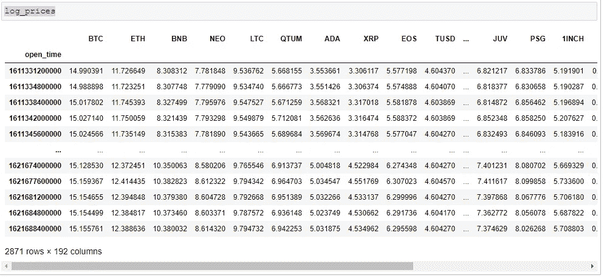
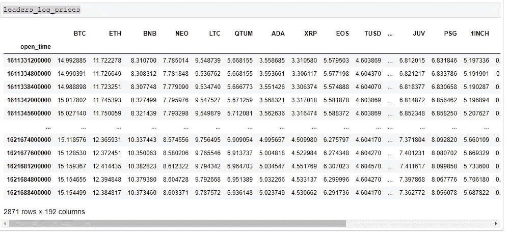
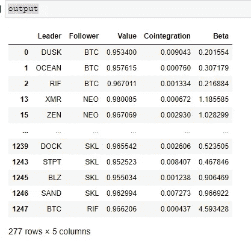
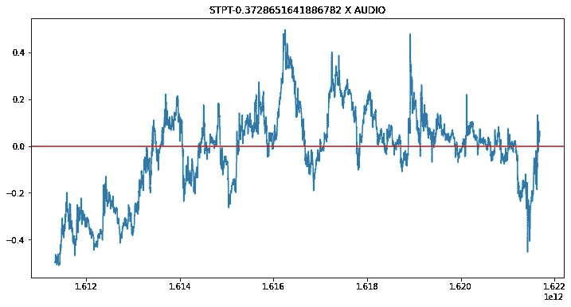
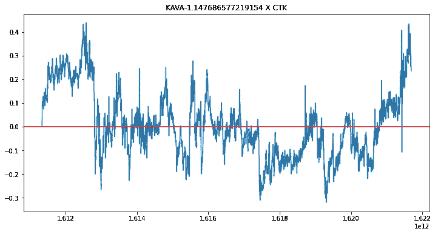
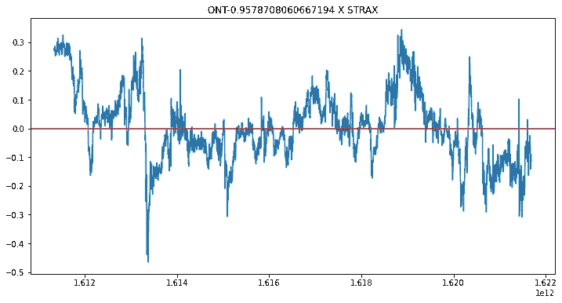
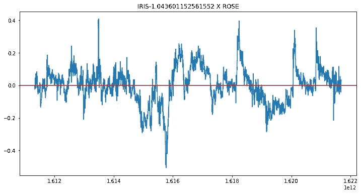

# 检测领导者和追随者的加密货币交易策略

> 原文：<https://levelup.gitconnected.com/cryptocurrency-trading-strategy-by-detecting-the-leaders-and-the-followers-93da609df90d>

## 我们如何根据其他加密货币来预测加密货币的每小时走势


Unsplash 上的图像

[](https://jorgepit-14189.medium.com/membership) [## 用我的推荐链接加入媒体-乔治皮皮斯

### 阅读乔治·皮皮斯(以及媒体上成千上万的其他作家)的每一个故事。您的会员费直接支持…

jorgepit-14189.medium.com](https://jorgepit-14189.medium.com/membership) 

# 介绍

首先，我需要澄清没有无风险的交易策略，也没有能保证盈利的交易策略。然而，应用预期回报为正的策略是有意义的，换句话说，更有可能赚钱而不是亏损。在本帖中，我们将提供一个基于[配对交易](https://predictivehacks.com/example-of-pairs-trading/)概念的交易策略的例子。

# 假设

我们认为，在市场上，存在一些加密货币以等于`k`的滞后跟随其他加密货币。对于这个分析，我们将检查等于 1 小时的 k，但是可以随意尝试不同的值`k`。因此，这个想法是，如果有一对“领导者和追随者”的密码，那么我们可以根据“领导者”的运动来预测“追随者”的运动，如果领导者在时间`t=0`上升，那么我们期望“追随者”在下一个`k`区间上升，反之亦然。

# 分析

我们将获得过去 3.5 个月所有加密货币收盘价的 1 小时数据。对于所有对(X，Y)，我们将测试(Xt，Yt-1)或(Xt-1，Yt)是否协整。在这个分析中，我们使用了对数价格。因此，如果我们确定了领导者和跟随者，我们预计当 X 增加时，Y 将跟随，策略是当 X 明显偏离其均衡时买入 Y。当然，有很多风险，比如 X 可能永远不会收敛到它的平衡状态。也许又出现了一个均衡，但是因为修正只发生在 X 上，而 Y 没有跟随，等等。你可以在这里找到 [**清理后的数据**](https://drive.google.com/file/d/1m2ifE6K3fqOJKTFgV6KRWunp1Z0DoIdR/view?usp=sharing) ，你可以跟着教程走。对于这个分析，我们将使用 Python。

# 编码

让我们把手弄脏吧。因为有许多价值小于 1 美元的密码，并且对数价格变为负数，所以我们将所有价格乘以 100，就像将价格表示为美分而不是美元一样。请注意，时间是以 UNIX 时间戳表示的。

```
# [http://web.pdx.edu/~crkl/ceR/Python/example14_3.py](http://web.pdx.edu/~crkl/ceR/Python/example14_3.py)
df = pd.read_csv("clean_data.csv")
df.set_index('open_time', inplace=True)df = df*100
# get the log prices and remove the first not NA row
# in order to have the same period of data with the leader (lag(1))
log_prices = np.log(df).dropna(how='any')
log_prices = log_prices.iloc[1:]# get the log prices of the leader, where by leaders we refer to the lag 1
leaders_log_prices = np.log(df.shift(1)).dropna(how='any')# remove the USDT suffix from the column names 
log_prices.columns = [c[:-4] for c in log_prices.columns]
leaders_log_prices.columns = [c[:-4] for c in leaders_log_prices.columns]log_prices
```



尝试通过仅考虑高度相关(> 0.95)的配对来寻找协整配对，应用协整检验并运行无截距的线性回归，即 log(leader) = beta x log(follower)。

```
my_list = []
Leader = []
Follower = []
Cointegration = []
Beta = []
for i in log_prices.columns:
    for j in log_prices.columns:
        if (i!=j and log_prices[i].corr(leaders_log_prices[j])>0.95):
            Leader.append(j)
            Follower.append(i)
            my_list.append(log_prices[i].corr(leaders_log_prices[j]))
            Cointegration.append(ts.coint(leaders_log_prices[j], log_prices[i])[1] )
            Beta.append(np.linalg.lstsq(log_prices[i].values[:,np.newaxis], leaders_log_prices[j].values, rcond=None)[0][0])output = pd.DataFrame({'Leader':Leader, 'Follower':Follower,
                       'Value':my_list, 'Cointegration':Cointegration,
                       'Beta':Beta})# keep only the cointegrated parts p-value 0.01
output = output.loc[output.Cointegration<0.01]# remove the negative Betas
output = output.loc[output.Beta>0]
```

我们提出了满足以下条件的 277 个共整合对:

*   协整检验 p 值<0.01
*   Correlation> 0.95



我们可以画出所有的价差，其形式为**价差=领导者-贝塔 x 跟随者**

```
for i in range(sample.shape[0]):
    plt.figure(figsize=(12,6))
    plt.plot(leaders_log_prices[sample.iloc[i]['Leader']] - log_prices[sample.iloc[i]['Follower']]*sample.iloc[i]['Beta'])
    plt.axhline(y=0.0, color='r', linestyle='-')
    plt.title(sample.iloc[i]['Leader'] + "-" + str(sample.iloc[i]['Beta']) + " X " + sample.iloc[i]['Follower'])
    plt.show()
```

一些共集成对例子



# 外卖

现在，你可以应用一个基于统计套利的策略。你甚至可以沿着两个方向前进，做多一种资产，做空另一种资产。一般来说，基于领导者和追随者的假设，你可以尝试许多不同的策略。在现实世界中，当你进行高频交易时，你必须支付交易费用，而大部分时间交易费用都高于预期回报。所以，这种策略可能行得通，但前提是不收费🙂
交易愉快！

【https://predictivehacks.com】最初发表于[](https://predictivehacks.com/cryptocurrency-trading-strategy-by-detecting-the-leaders-and-the-followers/)**。**