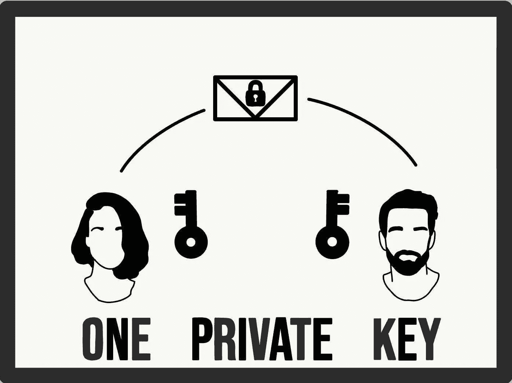
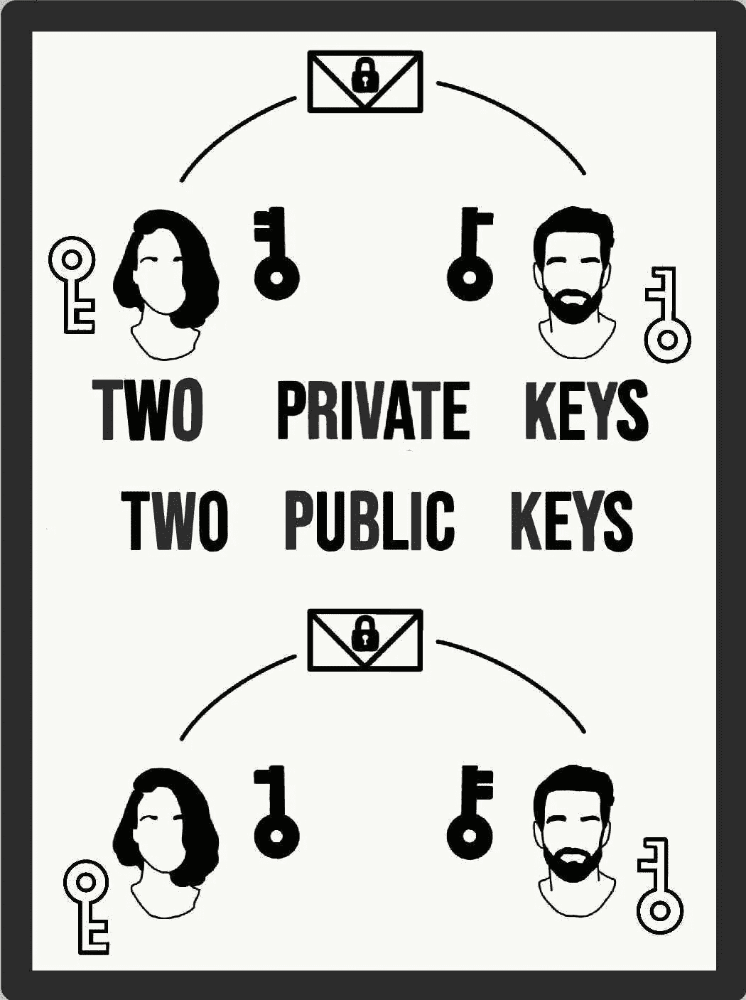

# 密码学:对称与非对称加密

> 原文：<https://levelup.gitconnected.com/cryptography-symmetric-vs-asymmetric-encryption-db36277c8329>

在现代密码学出现之前，重点已经从消息的保密性扩展到了身份认证、完整性检查等等，这个领域主要围绕着词典和语言模式。

随着数字计算机的加入以及数学理论和计算机科学实践在密码学中的广泛应用，破解复杂加密算法的能力增强了，但随之而来的是，创建日益复杂、计算安全(尽管理论上是可破解的)的加密机制的速度也提高了。

这里，我们来看看两种密码系统:对称和非对称。

# 一些基本的密码学术语

**密钥** —一个“变量值”，使用一种算法(密码)应用于一些未加密的消息，以便对其进行加密。或者应用于加密的消息，以便对其进行解密。

密钥应该是保密的，只有消息的发送方和接收方知道。这样，如果消息被任何外部参与者捕获，它将被解读为无意义的，并且不会提供任何有用的信息。

**明文—** 未加密的信息。通常，但不总是，等待输入加密算法。

**密文—** 明文加密的结果。如果没有正确的解密算法，人或计算机都无法读取。

**密码—** 一种算法。它用于对明文执行加密，对密文执行解密，或者可以同时执行这两种操作。密码可以被归类为各种各样的“程序”，一系列可以遵循的详细定义的步骤。密码操作的方式将取决于所选择的密钥，该密钥充当辅助信息。因此，在使用密码加密消息之前，必须选择一个密钥。

**密码分析**——简而言之，研究在不获取设计密钥的情况下解密信息(“破解”加密算法的代码)。

— — — — — — — — — — — — — — — — — — — — — — — — — —

# 选角电话

为了本文的其余部分，我现在将向您介绍加密游戏中三个常用的玩家:

*   **爱丽丝(‘A’)**，我们让她扮演我们的发送者。她希望将一些消息或数据转发给另一方。
*   **Bob ('B')** 发送信息的预期接收人。他扮演爱丽丝的知己。
*   Eve ('E') ，我们欺骗性的昵称，“被动”攻击者。窃听者的简称，这个对抗者可以监听 Alice 和 Bob 之间的交流，但是不能修改他们来回发送的消息。他们的目标只是成功地解密一条窃听到的消息。(这与 Mallory(“M”)不同，Mallory 是一个“主动”攻击者，他可以在第二方收到发送的消息之前拦截并直接修改或替换它。Mallory 游戏的参与者在创建一个安全可靠的系统时比 Eves 遇到了更多的挑战。)

这些只是对几个字符的简短解释。几十个传统原型中的四个，用于帮助理解密码学的讨论，以及其他科学和工程文本，甚至用于博弈论和物理思想实验(至少对“爱丽丝”和“鲍勃”来说)。

有了基本的定义和角色，让我们来演示两种类型的密码系统。

# 对称加密

直到 70 年代末，对称密钥密码是唯一一种得到公众认可的加密类型，它可以是块加密，也可以是流加密。

*   **流密码—** 一次加密一条消息的字母或数字(通常是字节)。
*   **分组密码—** 收集一定数量的比特，然后将它们作为一个单元进行加密。然后填充明文，使其成为块大小的倍数(通常使用 64 位块)。

对称加密涉及一个单独的密钥，用于加密和解密消息。这意味着发送方和接收方必须拥有相同的密钥。

## 它是如何工作的？

这真的很简单:

*   Alice 使用她的私钥对她打算发送的消息进行加密。
*   然后，她将加密信息传递给鲍勃。
*   当 Bob 收到加密的消息时，他使用 Alice 使用的相同的私钥对其进行解密。

就这么简单，一把钥匙——两个人(或者可能更多)。

嗯……等一下。解决问题“Bob 如何能拥有与 Alice 相同的私钥？”将我们引向对称模式中的主要缺陷。为了让 Alice 和 Bob 拥有相同的私钥，必须在他们之间的某个点上传递该私钥，这就为 Eve 甚至 Mallory 打开了大门，他们可以截获该密钥，并有效地使其在保护他们的信息通信时变得无用。

# 不对称加密

也被称为**公钥加密**，这是对上面古老的对称类型的更新改造。这里的过程不要求使用两个相同的密钥，而是要求每一方(发送方和接收方)都有自己的一组单独的密钥。(这使得私钥的初始共享没有必要，并消除了与对称相关的额外风险。)

第一个密钥仍然被称为“**私钥**，但是在这种情况下，对于持有者来说是唯一的，并且现在必须完全保密(即使是对另一方、发送者或接收者)。第二种称为“**公钥**，可以自由分发，因为它不负责解密(只负责加密)。这两个密钥是不同的，但在数学上仍然相关，这意味着不可能根据一个密钥的知识来计算另一个密钥。

## 它是如何工作的？

稍微复杂一点的过程:

*   Alice 和 Bob 都为自己生成了一个公钥和私钥(他们使用 RSA 算法)
*   爱丽丝将她的公钥发送给鲍勃，鲍勃又将他的公钥发送给爱丽丝。(双方都不会向任何人透露自己的私钥。)
*   Alice 再次写了一条消息，但是这次用 Bob 的公钥加密。然后，她将消息发送给鲍勃。
*   当 Bob 收到加密的消息时，他使用自己的私钥解密它，并读取 Alice 写的消息。

# 两者之间

*   对称加密中的数据操作比非对称加密快得多，因为它只使用一个密钥，而且使用的密钥长度通常较短。
*   与对称加密不同，非对称加密很少用于直接加密大量数据；它增加了密码的大小，并可能使数据占用更多的存储空间或更多的移动时间。特别是对于解密，非对称方案的性能安全比通常不如对称方案令人印象深刻。随着安全性的提高，解密的效率降低。
*   大多数公钥算法都涉及计算开销更大的运算(例如，取幂运算)。

鉴于我们对两者的了解，每个方案明显的优点和缺点，除了它明显的“共享密钥”缺陷之外，对称似乎在大多数类别中“更好”。

………………………………………………………

## 进入，舞台左侧，混合密码系统**。**

提供效率的任何数据封装方案(对称密钥密码系统)和提供便利的任何密钥封装方案(非对称密钥密码系统)的组合。

混合实施的一个简单示例:

*   对消息应用高质量的对称密钥加密算法。
*   然后使用公钥算法对对称密钥本身进行加密。
*   加密的对称密钥与消息一起发送。

**要点:**实际上，今天所有实用的非对称方案都采用了某种形式的混合系统优化。

## 感谢您的阅读！