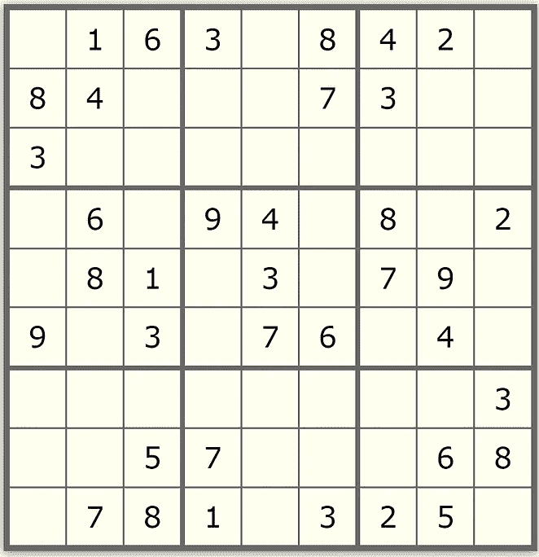
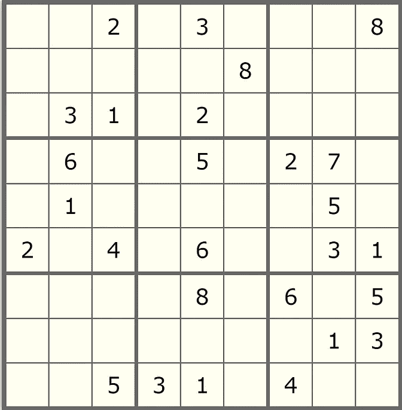
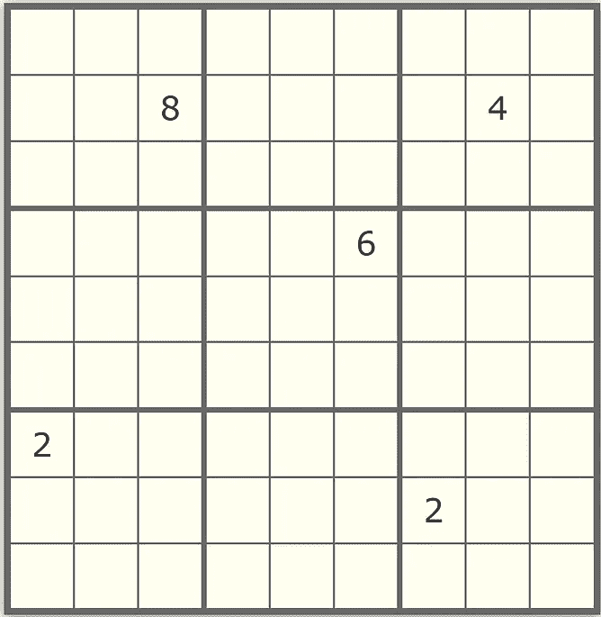
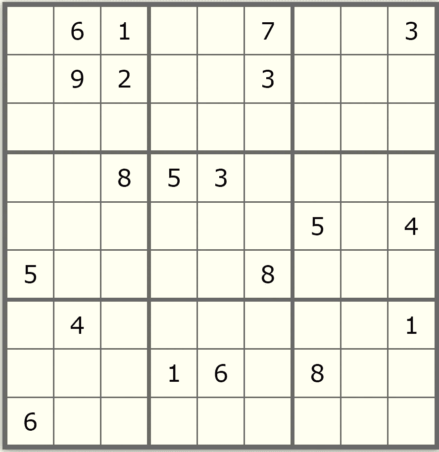

# CSP 算法与回溯:数独

> 原文：<https://levelup.gitconnected.com/csp-algorithm-vs-backtracking-sudoku-304a242f96d0>

## 约束满足问题与回溯方法的比较


每当我们谈论回溯，数独问题就会浮现在脑海中，成为回溯解决的最著名的问题之一。在几乎所有的计算机科学学校，这个问题会在课堂上讨论，或者出现在学生的作业中，以便教授回溯算法。

回溯是一种非常简单的技术，可以解决很多问题。然而，回溯求解者倾向于通过搜索所有问题空间来解决问题，他们可能会检查所有案例来找到解决方案。他们也消耗了大量的时间。问题越复杂，求解器就变得越慢。这就是 CSP 算法缩小空间和加快系统速度的地方！

我们通常在 AI 领域听到 CSP 这个术语，我们期望在其中发现一些智能特性。然而，在我看来，CSP 算法只是回溯方法的优化版本。事实上，它更像是一种用来轻松加速你的算法的技术。我们举个例子来讨论一下这个。著名的数独问题！我们的目标是尽可能减少数独搜索树中的节点扩展数。我已经创建了一个数独求解器类，它将用于创建我们的代理。这个类包含用于求解其纸板的求解器方法。

# 回溯算法:

回溯算法非常简单。这与在 n 皇后问题中使用的方法相同。我们的初始条件是在表中找到一个空单元格(用‘0’表示)，用一个数字填充它。如果它找不到空位，这意味着表已满，问题就解决了。每当它发现一个空的单元格时，它将检查在 1 到 9 的范围内哪个数字在该单元格中使用是安全的。找到合适的数字后，它将填充单元格，并再次调用回溯函数在树中更深入地搜索，以填充下一个单元格。这个函数调用在每一步都递归地发生，直到表格被数字填满。在任何时候，如果它不能用一个数字填充单元格，它将返回到前一个单元格，并将该数字更改为另一个有效的选择。代码如下:

```
**def solveSimpleBackTracking(self):
    location = self.getNextLocation()
    if location[0] == -1:
        return True
    else:
    self.expandedNodes += 1
    for choice in range(1,self.dim+1):
        if self.isSafe(location[0],location[1],choice):
            self.board[location[0]][location[1]] = str(choice)
            if self.solveSimpleBackTracking():
                  return True
            self.board[location[0]][location[1]] = ‘0’
    return False**
```

为了测试这个算法，我定义了五个在互联网上找到的表格。第五张桌子被认为是数独游戏中最难的案例之一。(这里可以找到表格[)。](http://apollon.issp.u-tokyo.ac.jp/~watanabe/sample/sudoku/index.html)



从左至右-顶行:表[1~3]，底行:表[4，5]

该算法为每个表实现了以下结果。

1.  表 1 →展开的节点数:372，耗时:0.0109 秒
2.  表 2 →展开的节点数:12161，耗时:0.4089 秒
3.  表 3 →展开的节点数:193，耗时:0.0049 秒
4.  表 4 →展开的节点数:392，耗时:0.0119 秒
5.  表 5 →展开的节点数:1904541，耗时:65.9218 秒

正如我们所看到的，第二个和第五个表跟踪了搜索树中的大量节点。现在让我们优化问题，减少节点的数量。

# CSP 算法:

CSP 代表 ***约束满足问题*** 。因此，我们设计这种算法的主要目标是满足问题引入的所有明确定义的约束。为了创建 CSP 算法，我们需要指出问题的三个属性。 ***变量*** ， ***域，*** 和 ***约束*** 。每个变量都是问题的一部分，为了解决问题，需要给每个变量分配一个合适的值。域表示哪些值可以分配给特定的变量。最后，约束条件表明当前可以使用域中存在的哪些值。让我们在数独问题上试试这个技巧。

问题的三个性质定义如下:

1.  变量:棋盘上的每个空白单元格
2.  域:对于每个单元格，域被定义为 1 到 9 之间的一组数字，当前行、列或 3×3 正方形中已经使用的数字除外。
3.  约束:行、列和 3×3 的正方形中没有多余的数字。

现在，我们的 CSP 算法的轮廓已经确定，是时候开始优化回溯算法了。

首先，我们需要所有变量的所有定义域的数组。换句话说，需要一个空格来保存每个变量的剩余值。因此，一个名为`rv`的属性将被添加到我们的类中，在代码中它将被称为基于 python OOP 的`self.rv`。我决定用`[‘x’]`替换板上的固定值域，以防标记单元格包含固定数字。在其他情况下，我将检查数独标准，以便为单元格找到合适的值，并将其添加到`self.rv`列表中:

```
**def __init__(self,dim,fileDir):
    self.dim = dim
    self.expandedNodes = 0
    with open(fileDir) as f:
        content = f.readlines()
        self.board = [list(x.strip()) for x in content]
    self.rv = self.getRemainingValues()****def getDomain(self,row,col):
    RVCell = [str(i) for i in range(1 ,self.dim + 1)]
    for i in range(self.dim):
        if self.board[row][i] != ‘0’:
            if self.board[row][i] in RVCell:
                RVCell.remove(self.board[row][i])** **for i in range(self.dim):
        if self.board[i][col] != ‘0’:
            if self.board[i][col] in RVCell:
                RVCell.remove(self.board[i][col])** **boxRow = row — row%3
    boxCol = col — col%3
    for i in range(3):
        for j in range(3):
            if self.board[boxRow+i][boxCol+j]!=0:
                if self.board[boxRow+i][boxCol+j] in RVCell:
                    RVCell.remove(self.board[boxRow+i][boxCol+j])
    return RVCell****def getRemainingValues(self):
    RV=[]
    for row in range(self.dim):
        for col in range(self.dim):
            if self.board[row][col] != ‘0’:
                 RV.append([‘x’])
            else:
                 RV.append(self.getDomain(row,col))
    return RV**
```

现在信息已经可以使用了，我们需要选择一个空的单元格或者换句话说一个变量作为第二步。但是这重要吗？的确如此。对于这个问题，最简单的方法是首先用较小的域填充单元格。例如，如果一个单元的域是[3]，而另一个单元的域是[1，2，9]，显然用域大小 1 填充单元更好，因为这是唯一的选择，而且肯定是正确的。

如果我们扩展这个想法，如果你从小的定义域集合中选择一个值，你有很高的概率选择正确的值。让我们称我们的函数为`getNextMRVRowCol()`，MRV 代表最小剩余价值。正如我提到的，我们将固定值标记为“x ”,因此我们首先检查一个单元是否是固定的，如果域为空，我们返回 10 作为问题空间之外的一个大数字，以防止代理选择一个空的域作为最小剩余值单元。

```
**def getDomainLength(self,lst):
        if 'x' in lst or lst == []:
            return 10
        else:
            return len(lst)*****def* getNextMRVRowCol(*self*):
    rvMap = *list*(map(self.getDomainLength,self.rv))
    minimum = min(rvMap)
    if minimum == 10:
        return (-1,-1)
    index = rvMap.index(minimum)
    return(index // 9, index % 9)**
```

好了，现在我们有一个函数，它为我们选择最好的填充点。因为我们线性地存储了域，所以我们必须在每个 self.rv 索引上用除法和模运算来计算行和列。在此之前，我们刚刚将回溯问题转换为 CSP 问题，我们所做的唯一优化是更改我们的位置查找器(也称为启发式函数)。这稍微改善了我们的结果。让我们使用一种叫做“向前检查”的漂亮技术来达到我们需要的结果。

前向检查只是为程序提供了一个远景，以增加从树的更高层次的选择中获利的可能性。例如，假设一行中有两个单元格 ***v1*** 和 ***v2*** ，域为***D1 =【1，2】***和***D2 =【1】***。我们的定位功能选择了 ***v1*** 。在正常情况下，程序首先选择 1， ***d2*** 的新值将是 ***d2=[]*** 结果，在更深的层中，它发现对于具有域 ***d2*** 的单元没有可能的值，并且它回溯。

如果您还记得，我们的目标是减少包括回溯移动在内的节点扩展数量。作为解决方案，我们可以先通过选择 1 来检查，它是否排除了另一个的可能选择？我们将看到它消除了***【D2】***的所有剩余值。在这一点上，我们被告知选择 1 肯定会导致回溯移动，因此我们选择 2 作为可能的答案。

可以对多个步骤实现前向检查。但是，这可能会导致严重的时间开销。在这种情况下，我倾向于实现一种方法，通过为一个单元格选择某个值来检查它是否消除了棋盘上存在的其他单元格的可能机会。综上所述，下面是最终的代码:

```
**def isEmptyDomainProduced(self,row,col,choice):
    element = self.rv.pop(row*9 + col)
    if [] in self.rv:
        self.rv.insert(row*9+col,element)
        return True
    else:
        self.rv.insert(row*9+col,element)
        return False****def solveCSPFH(self):
    location = self.getNextMRVRowCol()
    if location[0] == -1:
        return True
    else:
        self.expandedNodes+=1

        row = location[0]
        col = location[1]
        for choice in self.rv[row*9+col]:
            choice_str = str(choice)
            self.board[row][col] = choice_str
            cpy = copy.deepcopy(self.rv) 
            self.rv = self.getRemainingValues()

            if not self.isEmptyDomainProduced(row,col,choice_str):
                 if self.solveCSPFH():
                       return True
            self.board[row][col] = ‘0’
            self.rv = cpy** **return False**
```

现在我们已经完成了，算法可以测试了。通过对之前的表格进行测试，获得了以下结果:

1.  表 1 →展开的节点数:44，耗时:0.0598 秒
2.  表 2 →展开的节点数:137，耗时:0.1136 秒
3.  表 3 →展开的节点数:76，耗时:0.0798 秒
4.  表 4 →展开的节点数:81，耗时:0.0708 秒
5.  表 5 →展开的节点数:93889，耗时:82.6698 秒

这真是太棒了！我们刚刚将节点扩展量减少了近 85%。如果你注意到在某些情况下，运行时间比回溯算法要长。这就是我之前提到的开销。尽管我们缩小了搜索空间，但由于我们对问题的分析，搜索时间增加了。我们使用的前向检查方法就是一个有时间开销的方法的例子。虽然，在小问题中，它没有任何区别，在某些情况下，如表 2，它甚至工作得更快，但在复杂的问题中，如第五种情况，它相差 17 秒。更好的方法是只检查所选单元格同一行同一列中值的定义域，而不是整个表格！

此外，您可以实现启发式函数，以便猜测在某个变量域中选择哪个值更好。例如，您的启发式函数可以选择表中重复次数最少的值。如果你的方法是一致的，它一定会提高你的结果。

# 结论

虽然回溯算法在理论上可以解决任何问题，但是它需要很大的内存空间，并且耗费大量的时间。CSP 算法的引入是为了压缩大空间，提高算法性能。有了良好的前向检查算法和一致的启发式函数，高速解决低内存需求的问题将成为可能。

希望这篇文章对你有用。你可以在我的 [gitlab](https://gitlab.com/hiradbaba/cspsudoku/-/blob/master/sudoku.py) 上找到我的代码。

特别感谢我亲爱的老师[齐亚拉蒂](http://ziarati.net/)博士布置了这个项目。