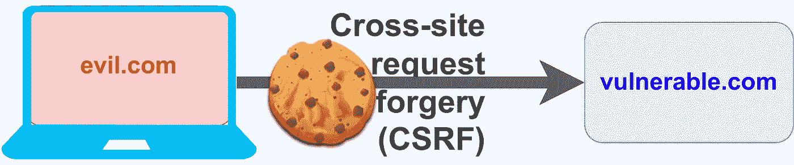

# CSRF —跨站点请求伪造😈

> 原文：<https://levelup.gitconnected.com/csrf-cross-site-request-forgery-88d26304e5f4>

## 它是什么，为什么重要，它是如何做到的，以及如何防止 CSRF 袭击



马丁·托马斯创造形象

一个跨站请求伪造攻击是网络经典之一。最近这已经不再是新闻了，因为防御很容易实施，也很有效。尽管如此，今年和 2019 年，即使是大型合作和政府组织也有问题。

读完这篇文章后，你会知道如何应用那些攻击，以及如何防御它们。我们开始吧！

# 为什么 CSRF 如此重要

不可否认，CSRF 袭击事件带来的巨大影响不是一时半会儿发生的。他们也不再是 OWASP 前 10 名，但仍然存在:

*   2022 年:亚特兰蒂斯吉拉有一个 CSRF 漏洞([来源](https://jira.atlassian.com/browse/JRASERVER-73138)
*   2019 年:德国官方安全网站 Cert-Bund 易受 CSRF 攻击，该攻击可能允许攻击者看到未披露的漏洞([来源](https://www.golem.de/news/websicherheit-cert-bund-war-anfaellig-fuer-csrf-angriff-1910-144699.html))
*   **2012:巴西数百万 DSL 调制解调器被黑，传播银行恶意软件** ( [来源](https://thehackernews.com/2012/10/millions-of-dsl-modems-hacked-in-brazil.html)，[来源](https://nakedsecurity.sophos.com/2012/10/01/hacked-routers-brazil-vb2012/))
*   2008 年:家用 DSL 路由器易受攻击([来源](https://www.techrepublic.com/article/csrf-attacks-home-dsl-routers-are-vulnerable/))

# CSRF 袭击是如何实施的？

假设你正在编写一个博客的评论部分。您正在使用的 REST 端点是`POST /comments`。当然是经过认证的。您选择使用带有会话 ID 的 cookie。

现在的问题是，攻击者可以创建一个完全不同的网站——让我们称它为 evil.com，你的网站为 vulnerable.com。在 evil.com 可能是一种形式

```
<form method="post" action="https://vulnerable.com/api/comments"><input type="text" name="comment" />
<input type="submit" /></form>
```

vulnerable.com 的 cookies 是由浏览器**自动**发送的，不管请求来自哪里**！这是关键部分。**

因此，攻击的工作原理如下:

*   确保受害者登录到易受攻击的站点。攻击者可以依赖于没有人注销的事实。
*   攻击者让受害者访问由攻击者控制的网页。该页面使浏览器发送请求—浏览器不需要任何漏洞。浏览器一直向其他网站发出请求。
*   浏览器会自动附加 cookie 的会话信息。

只要受害者登录到易受攻击的页面，攻击者就可以发送任何信息。然而，攻击者无法读取信息。

# 我如何防止 CSRF 袭击？

有几种方法可以消除 CSRF 漏洞:反 CSRF 令牌、SameSite Cookies 和非基于 cookie 的身份验证。

## 反 CSRF 代币——一种奇特的临时货币

收到评论的页面可能包含一个“秘密”。只有原网站和用户知道的值。在前端发出注释请求之前，它会为该用户请求一次性令牌。后端知道只有包含这个令牌的请求才能被接受。

通常，这被称为“反 CSRF 令牌”。你也可以称之为“Nonce”——一个“ **n** 使用**一次**的数字”。作为一个副作用，它还可以防止重复的页面提交两次发表评论。实现方式不同；反 CSRF 令牌也可以绑定到会话。

## SameSite Cookies

属性为`SameSite=Strict`的 Cookies 将只与来自同一站点的请求一起发送。

`Strict`提供了完美的防御，但以可用性为代价。`Lax`提供了一些防御。如果您想了解更多信息，请阅读以下文章:

[](https://portswigger.net/web-security/csrf/samesite-cookies) [## 使用相同站点 cookies 防御|网络安全学院

### 一些网站使用相同站点的 cookies 来防御 CSRF 攻击。SameSite 属性可用于控制…

portswigger.net](https://portswigger.net/web-security/csrf/samesite-cookies) 

## 内容类型标题

如果您的 API 期望并强制执行`Content-Type: application/json`，并且您没有篡改 CORS 报头，那么它可能还会为您提供一些针对 CSRF 攻击的保护。不过，我对此并不是 100%确定。

## 不基于 cookie 的身份验证

浏览器在每次请求时只自动发送 cookies。如果您将凭据存储在 LocalStorage 中，CSRF 攻击就不再可能。在那种情况下，你在回避问题。我喜欢这个解决方案，因为你不能忘记为一些端点做这件事——与反 CSRF 令牌相反。

然而，XSS 可能更令人担忧:

[](/cross-site-scripting-xss-fd374ce71b2f) [## 跨站点脚本(XSS)😈

### 它是什么，为什么重要，它们是如何执行的，如何防止 XSS 攻击，以及如何创建一个 cookie 窃取者！

levelup.gitconnected.com](/cross-site-scripting-xss-fd374ce71b2f) 

# 同源政策(SOP)怎么样？

同源策略是浏览器为防止跨域数据读取而实现的一种安全机制

由于跨域访问控制，攻击者不能简单地包含银行的 iframe 并看到 iframe 的内容。只有当协议(HTTP / HTTPS)、域(evil.com/vulnerable . com)和端口(几乎总是 80)相同时，他们才能访问它。

> 作为旁注:这是连接到 CORS(跨原产地资源共享)。CORS 是安全放松同源政策(SOP)的一种方式。

然而，CSRF 攻击并不是为了读取数据。CSRF 攻击试图盲目地做一个动作。这是同源政策所不关心的。因此 SOP /任何 CORS 设置都不能抵御 CSRF 攻击。

# 其他资源

YouTube 上有一个很棒的视频很好地解释了 CSRF:

当然，还有一个关于 CSRF 的电脑爱好者视频。

# 下一步是什么？

在这个关于应用安全(AppSec)的系列文章中，我们已经解释了攻击者的一些技术😈以及防守队员的技术😇：

*   第 1 部分: [SQL 注入](https://medium.com/faun/sql-injections-e8bc9a14c95)😈🐝
*   第二部:[不要泄密](/leaking-secrets-240a3484cb80)😇
*   第 3 部分:[跨站点脚本(XSS)](/cross-site-scripting-xss-fd374ce71b2f) 😈🐝
*   第 4 部分:[密码哈希](/password-hashing-eb3b97684636)😇
*   第五部分: [ZIP 炸弹](https://medium.com/bugbountywriteup/zip-bombs-30337a1b0112)😈
*   第六部分:[验证码](https://medium.com/plain-and-simple/captcha-500991bd90a3)😇
*   第 7 部分:[电子邮件欺骗](https://medium.com/bugbountywriteup/email-spoofing-9da8d33406bf)😈
*   第 8 部分:[软件组成分析](https://medium.com/python-in-plain-english/software-composition-analysis-sca-7e573214a98e) (SCA)😇
*   第九部分: [XXE 袭击事件](https://medium.com/faun/xxe-attacks-750e91448e8f)😈🐝
*   第十部分:[有效的访问控制](/effective-access-control-331f883cb0ff)😇
*   第十一部分: [DOS via 十亿次笑](https://medium.com/bugbountywriteup/dos-via-a-billion-laughs-9a79be96e139)😈
*   第十二部分:[全磁盘加密](https://medium.com/faun/full-disk-encryption-2090489f9760)😇
*   第 13 部分:[不安全的反序列化](https://medium.com/bugbountywriteup/insecure-deserialization-5c64e9943f0e)😈
*   第 14 部分:[码头工人安全](/docker-security-5f4df118948c)😇
*   第 15 部分:[证件填充](/credential-stuffing-ff58ee8c3320)😈🐝
*   第 16 部分:[多因素认证](https://medium.com/plain-and-simple/multi-factor-authentication-cefff819be95) (MFA/2FA)😇
*   第 17 部分:[重做](https://infosecwriteups.com/redos-denial-of-service-by-regex-59c7ffab4880?source=user_profile---------0-------------------------------&gi=bec35fb230e3)😈
*   第 18 部分:[安全和私人即时通讯](https://infosecwriteups.com/secure-messaging-5d2fc7748c24)😇
*   第十九部:[密码劫持](https://medium.com/coinmonks/cryptojacking-55a73622fb6d)😈
*   第 20 部分:[备份](https://medium.com/geekculture/backups-what-matters-and-how-to-do-it-right-62accf7e9800)😇
*   第 21 部分:CSRF😈
*   第 22 部分:单点登录😇
*   第 23 部分:剪贴板劫持😈
*   第 24 部分:证书😇
*   第 25 部分:区块链的种族条件攻击😈
*   第 26 部分:移动设备管理(MDM)😇
*   第 27 部分:服务器端请求伪造(SSRF)😈
*   第 28 部分:网络隔离😇
*   第 29 部分:社会工程(包括钓鱼)😈
*   第 30 部分:虚拟专用网络😇

如果您对更多关于 AppSec / InfoSec 的文章感兴趣，请告诉我！

我喜欢写关于软件开发和技术的文章🤩不要错过更新: [**获取我的免费电子邮件简讯**](https://martinthoma.medium.com/subscribe) 📧或者[如果你还没有报名参加 medium](https://martinthoma.medium.com/membership)✍️——两者都鼓励我多写🤗