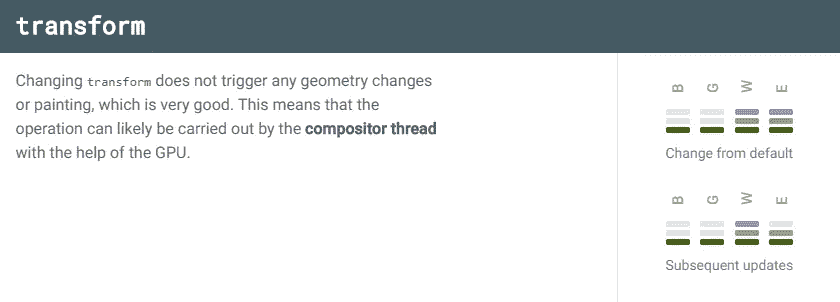

# 带有示例的 CSS 和 JavaScript 动画技巧

> 原文：<https://levelup.gitconnected.com/css-and-javascript-animation-tips-with-an-example-in-angular-678246901752>

## 本文包含了一些通过构建一个简单的模态视图来引导网页动画性能的技巧


照片由[诺德伍德主题](https://unsplash.com/@nordwood?utm_source=unsplash&utm_medium=referral&utm_content=creditCopyText)在 [Unsplash](https://unsplash.com/search/photos/coffee?utm_source=unsplash&utm_medium=referral&utm_content=creditCopyText) 上拍摄

在这篇文章中，我将讨论浏览器动画，并演示如何。本文将分为以下几个部分:

1.  “宽松”的基础
2.  CSS 和 JavaScript/TypeScript 动画
3.  动画提示
4.  示例:制作模态视图的动画
5.  CSS 动画性能

*更多类似内容，请查看*[https://betterfullstack.com](https://betterfullstack.com/stories/)

# “宽松”的基础

动画是制作引人注目的网络应用和网站的重要组成部分。用户已经开始期待高响应性和交互性的用户界面。

根据[保罗·刘易斯](https://developers.google.com/web/resources/contributors/paullewis)

> 在经典动画中，缓慢开始并加速的运动称为“缓慢进入”，快速开始并减速的运动称为“缓慢退出”。网络上最常用的术语分别是“渐入”和“渐出”。有时这两者结合在一起，这被称为“渐入渐出”因此，放松实际上是使动画不那么严重或不那么明显的过程。

**好处:** Easing 通过简单的动画让你的应用更加自然。

Easings 与简单动画的`transtion` CSS 属性一起使用。例如，如果你想让一个按钮改变`hover`上的背景颜色，你可以使用一个带有 easings 的`transition`，这样它会逐渐改变，而不是突然发生。背景色的基本过渡如下所示:

```
.button {
  background-color: #2185d0;
  transition: background-color .2s ease;
}.button:hover {
  background-color: #1678c2;
}
```

以下是一些可以在 CSS 中使用的关键字:

*   `linear`
*   `ease-in`
*   `ease-out`
*   `ease-in-out`

注意:

1.  没有任何缓动的动画称为**线性**。
2.  渐强动画开始慢，结束快。
3.  渐出动画开始得快，结束得慢。
4.  向内和向外放松类似于汽车加速和减速，如果使用得当，可以提供比仅仅放松更具戏剧性的效果。

# CSS 和 JavaScript 制作动画

在浏览器中创建动画有两种主要方式:使用 CSS 或 Javascript。决定使用哪一个取决于项目中的特性情况。以下是帮助您决定使用哪种方法的提示:

1.  当 UI 元素具有较小的自包含状态时，请使用 CSS。
2.  当您需要对动画进行有效控制时，请使用 JavaScript。
3.  当你想手工编排整个场景时，直接使用`requestAnimationFrame`。这告诉浏览器您想要执行一个动画，并且您向它传递一个回调，您希望在下一个浏览器重画之前执行该回调。在 MDN 上了解更多关于 [requestAnimationFrame 的信息。](https://developer.mozilla.org/en-US/docs/Web/API/window/requestAnimationFrame)

## **通过 CSS 制作动画**

用 CSS 制作动画是让一些东西在屏幕上移动的最简单的方法。这种方法被描述为*声明式*，因为您指定了您希望发生的事情。

使用 CSS 动画，您可以独立于目标元素定义动画本身，并使用`animation`属性(或其[子属性](https://developer.mozilla.org/en-US/docs/Web/CSS/CSS_Animations/Using_CSS_animations#Configuring_the_animation)的组合)构建所需的动画，并将其与`@keyframes`结合使用。

如果你想让你的 CSS 动画在旧的浏览器中工作，你需要添加厂商前缀。我建议用 [**postcss**](https://postcss.org/) 。


用 CSS 做动画

示例代码:

[](https://stackblitz.com/edit/animation-basic-1?embed=1&file=src/app/app.component.ts) [## 动画-基本-1 -堆栈式

### 导出到 Angular CLI 的 Angular 应用程序的启动项目

stackblitz.com](https://stackblitz.com/edit/animation-basic-1?embed=1&file=src/app/app.component.ts) 

## **通过 JavaScript/TypeScript 制作动画:**

使用 JavaScript 创建动画比使用 CSS 过渡或动画更复杂，但它给了开发人员更多的控制权。你可以在这里阅读网页动画 API。

JavaScript **/** 打字稿动画*势在必行。*


使用脚本处理动画

**注:**

现代浏览器支持 Web 动画 API。对于不支持的现代浏览器，[多填充可用](https://github.com/web-animations/web-animations-js)。

**样本代码:**

[](https://stackblitz.com/edit/animation-basic-1?embed=1&file=src/app/app.component.ts) [## 动画-基本-1 -堆栈式

### 导出到 Angular CLI 的 Angular 应用程序的启动项目

stackblitz.com](https://stackblitz.com/edit/animation-basic-1?embed=1&file=src/app/app.component.ts) 

# 动画提示

1.  尽可能使用 CSS 动画而不是 JavaScript 动画，因为浏览器引擎能够通过使用计算机的 GPU 提前优化这些动画。
2.  放松通常是正确的选择，当然也是一个好的默认。它开始很快，给你的动画一种反应灵敏的感觉，这是可取的，但在结尾有一个很好的减速。
3.  你可以去[easings.net](http://easings.net/)到**看更多的缓和方程式**。
4.  缓出的动画持续时间应该在**200 毫秒-500 毫秒**左右。这就给了眼睛看动画的机会，但又不会觉得碍手碍脚。
5.  缓入的动画持续时间也应该在**200 毫秒-500 毫秒**左右。请记住，它将在结束时发生震荡，无论多少时间的变化都不会减弱这种影响。
6.  经验法则是**总是快速响应用户交互。**
7.  如果你是新手，你应该**使用一些库来处理动画**任务比如 [GSAP](https://greensock.com/gsap/) 、 [anime.js](https://animejs.com/) 、 [animate.css](https://daneden.github.io/animate.css/) ，更多从[这里](https://hackernoon.com/10-javascript-animation-libraries-to-follow-ee193196776)。
8.  使用`will-change` CSS 属性来确保浏览器知道你打算制作什么动画。

# 示例:制作模态视图的动画

模态视图用于重要的消息，因此你有很好的理由阻止用户界面。但是，要小心使用它们，因为如果过度使用，它们会造成破坏，很容易破坏用户的体验。

在下面的演示中，我将在 Angular 项目中构建一个样本模型。

演示:


使用动画演示模型

下面是动画模式的 CSS:

你可以在这里查看源代码。

[](https://stackblitz.com/edit/animation-modal-view?embed=1&file=src/app/app.component.css) [## 动画-模态-视图-堆栈

### 导出到 Angular CLI 的 Angular 应用程序的启动项目

stackblitz.com](https://stackblitz.com/edit/animation-modal-view?embed=1&file=src/app/app.component.css) 

# CSS 动画性能

制作属性动画不是免费的，有些属性制作动画比其他的便宜。你必须避免触发任何几何图形的改变或绘制，因为当你的页面有很多元素时，这可能会很昂贵。

这是什么意思？

这意味着将动画限制在仅**的** `opacity`或`transform`，浏览器可以通过 CSS 引擎进行高度优化。

`opacity`属性:


不透明属性

`transform`属性:



转换属性

你可以在这里阅读更多关于其他 CSS 属性[。](https://csstriggers.com/)

如果动画可能在接下来的 200 毫秒内被触发，使用`will-change`,可能是由于用户的交互，也可能是由于应用程序的状态。`will-change`将确保浏览器知道你打算改变一个元素的属性。

# 摘要

动画对于最终用户来说是获得良好网络体验的关键。作为一名前端工程师，我们必须避免动画属性，这将触发昂贵的布局或绘画，并可能导致用户界面上的意外错误或性能下降。

声明式动画(CSS)比命令式动画(JavaScript)更好，因为浏览器有机会提前优化。但是在某些情况下，命令式动画给了你更多应用程序所需要的控制。因此，这取决于每个用例。

我希望这篇文章对你有用！你可以在[媒体](https://medium.com/@transonhoang)上关注我。我也在[推特](https://twitter.com/transonhoang)上。欢迎在下面的评论中留下任何问题。我很乐意帮忙！

# 资源/参考资料

[1]:动画[https://developers . Google . com/web/fundamentals/design-and-UX/animations/](https://developers.google.com/web/fundamentals/design-and-ux/animations/)

[2]:高性能动画[https://www . html 5 rocks . com/en/tutorials/speed/High-Performance-Animations/](https://www.html5rocks.com/en/tutorials/speed/high-performance-animations/)

[](https://gitconnected.com/learn/javascript) [## 学习 JavaScript -最佳 JavaScript 教程(2019) | gitconnected

### JavaScript 是世界上最流行的编程语言之一——它随处可见。JavaScript 是一种…

gitconnected.com](https://gitconnected.com/learn/javascript) [](https://betterfullstack.com/stories/) [## 故事-更好的全栈

### 关于 JavaScript、Python 和 Wordpress 的有用文章，有助于开发人员减少开发时间并提高…

betterfullstack.com](https://betterfullstack.com/stories/)