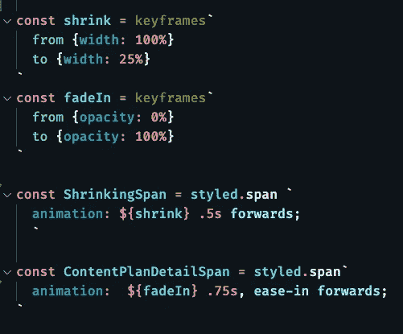

# React 中的 CSS 动画

> 原文：<https://levelup.gitconnected.com/css-animations-in-react-38efd3174300>

## [JavaScript 和打字稿提示](https://gentille.us/typescript-tips-b74925485b78?sk=4c9067cf57be6406abc26e44cb7fb872)

## 一旦你有了合适的原料，你就可以做一些令人印象深刻的事情。


正确的成分创造奇迹！

我看了一个 Pluralsight 课程，其中有一个很好的部分是关于用 CSS 制作动画的。看完之后，我觉得我明白了如何用 imported 在普通网站上制作动画。css 文件，但是在我的 React 应用程序中，我在无知的洪流中漂流。

动画方面，我不需要做任何太花哨的东西。当一个页面加载时，我想收缩左边，淡化右边。*这种效果让它看起来像是右手边在滑动和淡入。*我知道我需要指定一些`keyframes`，并在 css `animation`属性中使用它们。我可以很容易地在一个样式化的 span 上指定`animation`属性，但是正确的`keyframes`声明却让我摸不着头脑。

在这个项目中，我们已经使用了`styled-components`库，事实证明这个库“隐藏”了一个`keyframes` 辅助对象。我所要做的就是导入它:

```
import styled, { keyframes } from 'styled-components'
```

有了这些，整个动画可以归结为这样的风格:



两个关键帧规范和以及动画属性

*完全披露—我是 Pluralsight 的软件工程师，观看内容需要订阅—或免费十天试用，或我们的免费四月、免费周或免费周末促销活动之一！我想既然我喜欢这门课，我应该大声喊出来。*

*我在所有文章中表达的所有观点都是我自己的观点，不一定反映 Pluralsight 的观点。*

你可以阅读更多我的 [JavaScript 和 TypeScript 文章](https://gentille.us/typescript-tips-b74925485b78?sk=4c9067cf57be6406abc26e44cb7fb872)。

平静地编码。