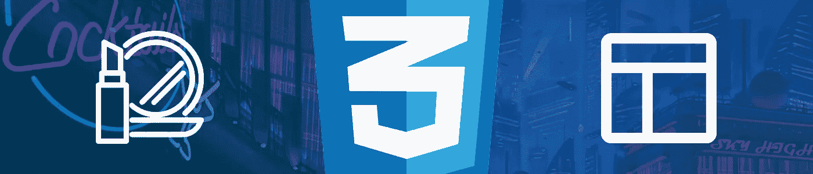

# 缩放比例的 CSS:外观与布局属性

> 原文：<https://levelup.gitconnected.com/css-at-scale-cosmetic-vs-layout-properties-a1c8acc875d7>



# 问题是

CSS 属性基本上有两种类型:控制布局/结构/功能的属性和控制外观的属性。知道如何、何时以及为什么识别差异可以提高产品的可维护性和团队的生产力。通常，业务需求可以通过仅仅修改被认为是*装饰性的*(想想品牌化)的属性来满足；考虑到这个问题的性质，将其分开是有意义的。

CSS 属性经常在没有适当考虑的情况下被投入生产，这就是为什么很难实现可维护和可伸缩的 CSS 代码库。注释/记录 UI 模块中的每一个 CSS 属性来解释它的用途是不切实际的(但是每一个属性都应该有一个已知的用途和副作用，对吗？)，但是通过合理的属性分离，它们可以更容易地被管理和维护，允许一个更加“自文档化”的 CSS 代码库。

考虑一个只有两个 CSS 属性的 UI 元素:

```
.element {
  display: flex;
  color: red;
}
```

这两个属性之间的区别似乎微不足道(它们都是 CSS，对吗？)，但更改其中一个可能会导致您的应用程序不可用，而更改另一个则不会。这种顿悟如何帮助我们构建更好的产品？一旦你意识到大部分考虑布局和结构的 CSS 属性具有*离散的*值，并且大部分考虑外观和感觉的 CSS 属性具有*连续的*值，就很清楚外观属性更倾向于变化(这实际上*有意义*)。

当某样东西可以分成两个不同的类别，一个包含*安全*和*易变*属性，另一个包含*危险*和*抗变*属性时，将它们分开*才有意义。这种对布局和外观属性的担忧只会阻碍大规模生产——就像把你的苏打水和漂白剂放在同一个橱柜里，只是因为它们都是“瓶子里的液体”。*

# 解决方案

让我们假设您的项目有某种 UI 模块文件夹，每个模块都有一个`styles.scss`文件:

```
modules/
|    |-- accordion/
|    |    |-- styles.scss
```

像这样的建议太不切实际(也太容易)了:

```
modules/
|    |-- accordion/
|    |    |-- layout.scss
|    |    |-- cosmetic.scss
```

…(虽然这实际上不是一个坏主意…)，但是解决这个问题的更好的方法引入了一种新的思维方式，那就是将 UI 模块的表面 CSS 属性视为*配置*，而不是逻辑/实际代码(CSS)。毕竟，对于传达含义的外观属性，您实际上不需要对 CSS 有固有的理解(不像布局属性)；"颜色:红色；"对任何说英语的人都有意义；"显示器:flex"不会。同样，这可能看起来是一个无关紧要的细微差别，但在实践中，它最终会导致需要一个新版本和不需要一个新版本之间的差异，因为外观属性可以直接与业务需求相关联(您可以想象企业要求某些东西是红色的，但从来没有要求某些东西是“display:flex；”)并且可以放心地应用，而不需要任何回归测试。

因此，现在我们将外观 CSS 属性视为配置而非代码，我们的项目结构可能类似于:

```
modules/
|    |-- accordion/
|    |    |-- config.json
|    |    |-- layout.scss
```

JSON 是数据/配置的标准格式。从理论的角度来看，这很好，但是从实践的角度来看，这没有多大用处，因为 Sass 不能开箱即用地解释 JSON，JSON 也不能写入样式表。实现本文提出的目标的技术“如何做”有些超出了本文的范围(尽管它将被简单地触及)；从技术上来说，有一百万种不同的方法来实现它，所以重点将继续放在理论上。但是，只是把它扔在那里，所有这些理论在实践中使用 One-Nexus 的[协同框架](https://github.com/One-Nexus/Synergy-Front-End-Guides/wiki/CSS-at-Scale:-Cosmetic-vs-Layout-Properties#TODO)(特别是 [synergy-sass-importer](https://www.npmjs.com/package/@onenexus/synergy-sass-importer) 和 [Cell](https://github.com/One-Nexus/Cell) )是可能的。

# 分离

到目前为止，我们只看了两个 CSS 属性(`display`和`color`)，但是将任何 CSS 属性放入“布局”或“装饰”类别应该很容易，没有太多争议(...*多了*...)，根据经验法则，具有连续值的属性=外观，具有离散值的属性=布局。

实际上有大约 500 个有效的 CSS 属性[和属性是否应该被认为是“装饰”或“布局”相关的确切性质取决于它被使用的上下文。](https://github.com/known-css/known-css-properties/blob/master/source/w3c.json)

主要目标实际上是通过将潜在的可配置属性移动到配置中，并将它们与不太可能频繁更改或从不更改的属性完全分离，从而提高生产率——因此真正的问题是“这个属性可能会被更改不止一次吗？”或者甚至是“这个属性可以在任何时候改变以直接满足某些业务需求吗？”。考虑是否可以让一个“非技术”人员负责更改相关属性的值，以及更改值是否会破坏产品(之前我可能暗示过,`display`属性不应该是可配置的，因为它会破坏应用程序；然而，仍然有一些例子说明配置这个属性是有意义的，比如控制促销标语的可见性。

作为一个粗略的想法，下面是一些共同的属性可能经常被分开:

## 化妆品特性

*   颜色
*   背景颜色
*   背景图像
*   边框半径
*   充满
*   字体系列
*   字体大小
*   字体样式
*   字体粗细

## 布局属性

*   盒子尺寸
*   清楚的
*   显示
*   弯曲
*   浮动
*   泛滥
*   位置
*   垂直对齐

## 有争议的财产

**高/宽** 使用`height`或`width`可以被认为是`layout`属性或`cosmetic`属性的可能性是 50/50；这完全取决于上下文。毕竟，企业肯定会说“让徽标更大”，而不是修改代码，而是修改一些配置来增加徽标的大小。但是你必须考虑这样的问题:“增加标志的尺寸会不会破坏布局?”？在哪种情况下，我们首先应该允许大小是可配置的？”-这些问题的答案取决于每个项目特有的因素。

**填充/边距** `padding`和`margin`是很难分类的属性；虽然它们的值是连续的，但它们的用途通常与布局相关，在其他情况下，它们的值可能在您的设计系统中是标准化的，因此不太可能在模块级别进行配置。也就是说，你可以在两个不同的主题中使用同一个模块，除了一个主题需要稍微大一点的填充；在这种情况下，将`padding`属性作为模块的可配置值是有意义的。

**上/下/左/右** `top`、`bottom`、`left`和`right`属性通常用于布局目的，例如将您可以做的事情垂直居中:

```
.vertical-center {
  position: relative;
  top: 50%;
  transform: translateY(-50%);
}
```

…在这里，改变`top`的值是没有意义的，尽管这个值是连续的。通常情况下，考虑到这些属性的使用性质，它们应该被认为是`layout`属性，而不是`cosmetic`属性。

# 前/后示例

让我们以一个`accordion`模块为例，看看采用这种哲学前后的一些源代码。

> 本例使用[单元库](https://github.com/One-Nexus/Cell/wiki)

对于上下文，我们将要设计的 accordion 模块的标记是:

这个例子使用了 BEM 命名约定

## 以前

```
modules/
|    |-- accordion/
|    |    |-- styles.scss
```

本例中使用的 mixins 来自[单元库](https://github.com/One-Nexus/Cell)

## 在...之后

```
modules/
|    |-- accordion/
|    |    |-- config.json
|    |    |-- layout.scss
```

现在已经将可配置属性移动到它们自己的文件中，现在看起来可能类似于:

JSON 可以通过 [synergy-sass-importer](https://www.npmjs.com/package/@onenexus/synergy-sass-importer) 导入到 Sass 中

现在，如果没有某种神奇的工具从这个 JSON 文件写入 CSS，您仍然需要手动将上述值映射到 Sass 文件中的 CSS 属性。使用 [synergy-sass-importer](https://www.npmjs.com/package/@onenexus/synergy-sass-importer) ，导入`config.json`文件会将`$config`变量下的值作为 sass 映射暴露给 Sass，因此可以使用`[map-get-deep](https://esr360.github.io/Sass-Boost/#undefined-function-map-get-deep)`函数访问它们:

现在，我相信你会同意在这一点上，我们可以说是后退了一步，而不是前进；我们仍然将修饰属性与源代码紧密耦合，我们只是允许从一个单独的 JSON 文件中配置它们的值。在这个过程中，我们让源代码看起来更不和谐。

幸运的是，由于有了[细胞库](https://github.com/One-Nexus/Cell)，我们可以实现之前所要求的*魔法*。Cell 可以智能地确定模块配置中的哪些属性应该被视为 CSS，以及它们应该应用于哪些元素。这意味着我们可以从源代码中删除它们，留给我们的是:

JSON 由 [synergy-sass-importer](https://www.npmjs.com/package/@onenexus/synergy-sass-importer) 导入

没有了污染文件的修饰属性，现在需要担心的属性减少了大约 85%,剩下的属性更容易破译。这很重要，因为剩下的 15%有可能会破坏应用程序。

要明确一点:这不是“CSS-in-JSON”。即使你能从技术上证明这是事实，得出这个结论的思维方式也没有抓住我们的目标。我们拥有的是其属性恰好对应于有效 CSS 属性的配置；我们使用的工具利用了这一事实来为相应的属性自动生成 CSS。将它想象成“CSS-in-JSON”意味着您可以随意添加任何属性，这是公约所不允许的。重要的是，你只需要给 JSON 添加属性，这些属性可以转化为不会破坏应用程序的修饰性属性。

如果这个概念仍然没有意义(或者看起来仍然是 CSS-in-JSON ),那么可以考虑同样的概念，只是稍微修改了一下配置键，并且没有创建 CSS 的 JSON 属性的神奇之处。这可能会给你留下这样的东西:

```
{
  "accordion": {
    "panel-color": "red",
    ...
  }
}
```

现在在`accordion.scss`中，你可能会看到这样的内容:

这满足了使价值可配置的目标(对业务有益！)，但仍然会使源代码受到外观属性的污染(不利于可读性！).对于所有意图和目的(从配置的角度来看)，这:

```
{
 "accordion": {
    "panel-color": "red",
    ...
 }
}
```

…实际上与此没有什么不同:

```
{
  "accordion": {
    "panel": {
        "color": "red",
        ...
    },
    ...
  }
}
```

…除了后者，某些东西可以更安全地推断出来，然后可以在 API 中加以利用。因此，这种理念在理论上允许的是一种产品，其源代码可以保持更小、更干净和更简洁，其配置可以用于生成装饰性的 CSS。

# 结论

通过将 CSS 属性视为两个不同的类别(外观和功能/布局)，您可以利用某些好处，最终导致生产力的提高，如本文所述。只有当你有合适的工具来处理杠杆化的利益时，这样做才有意义(否则这个过程会适得其反)。

总之，这一理论的主要实际好处包括:

*   减少源代码的大小
*   提高源代码的清晰度
*   允许更有效地处理修饰更新
*   在更改 CSS 属性时，对可能受影响的内容更有信心(关注点分离的好处)
*   通过将更多的注意力吸引到单个的属性上来改善 CSS 在产品中的整体使用方式

…这些都有助于软件开发的共同目标，如可伸缩性和可维护性。


[推特](https://twitter.com/esr360) | [Github](https://github.com/esr360)