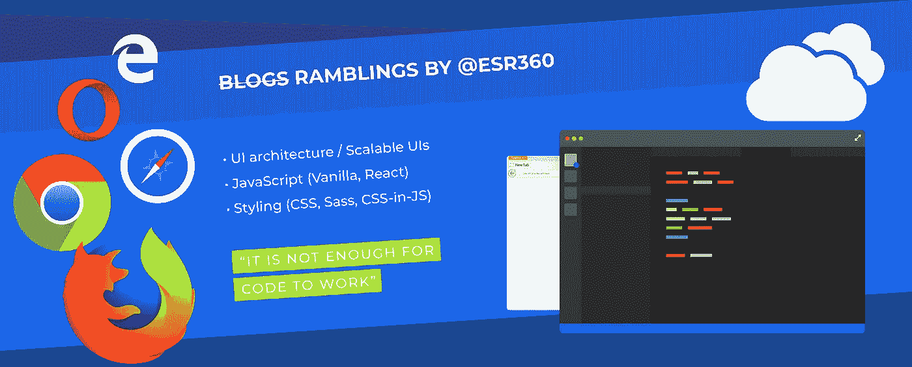
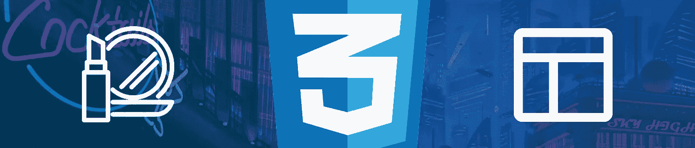
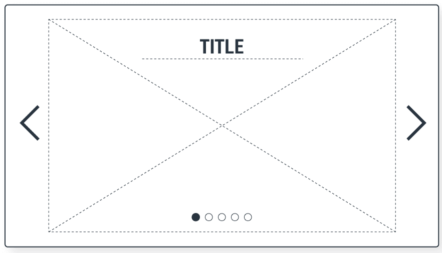
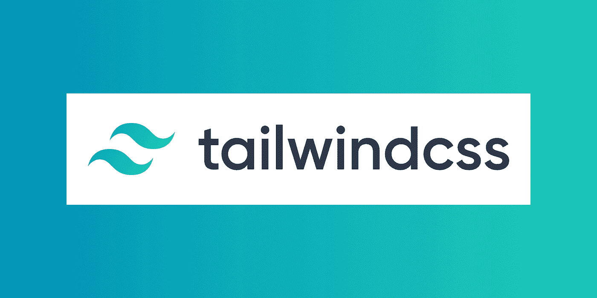
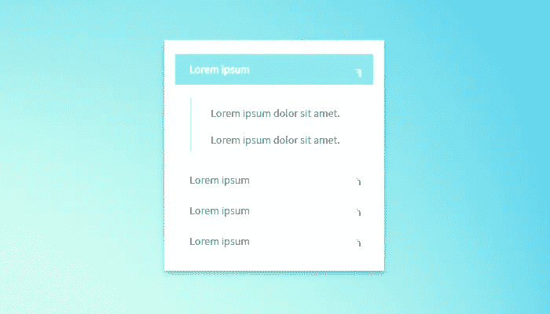
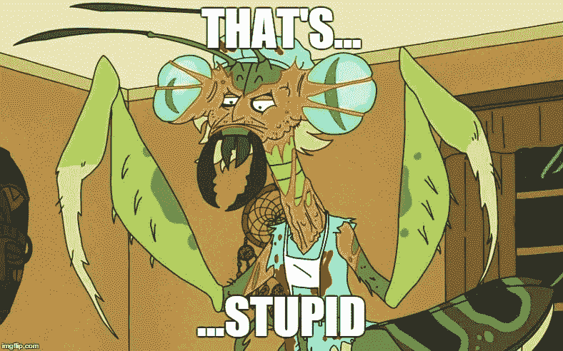

# 大规模 CSS 公共和私有风格

> 原文：<https://levelup.gitconnected.com/css-at-scale-public-private-styles-b5e693080d8d>

## 提高共享 UI 组件的通用性，让非开发人员成为样式作者

[我之前写过一个类似的概念](/css-at-scale-cosmetic-vs-layout-properties-a1c8acc875d7)——根据风格是与化妆品相关还是与布局相关来区分风格。这篇文章也许可以被认为是对最初想法的发展。与其按照*化妆品*和*布局*来思考风格，不如把它们想成*公共*和*私人*。在这一点上，必须澄清术语“公共”和“私有”是在组件级(或*模块化*级)应用的。这意味着(UI)组件可以有公共和/或私有样式。

自第一篇文章以来，基本原理没有改变——如果一个 CSS 属性倾向于根据组件在不同上下文中的实现而改变*,那么它可以被认为是组件的公共样式。如果一个 CSS 属性不容易改变，无论组件如何使用，它都可以被认为是组件的私有样式。在实践中，几乎可以肯定的是**公共**样式与组件的*外观和感觉*相关联，尽管一些私有样式也可能对外观和感觉有所贡献，但几乎可以肯定的是，影响*布局*的所有样式都将是**私有**(例如，为什么一个组件在一个上下文中需要位置`relative`，而在另一个上下文中需要`absolute`？我摸不透)。*

我的问题是——为什么要将这两套设备放在同一个位置？传统上，思考过程可能是“我需要改变组件的样式，所以我将转到组件的样式文件”。有道理，对吧？但是实际上，有两个主要原因可以解释为什么你想要改变一些现有组件的风格。第一种，是因为你发现了一些 bug 或者正在开发一个新特性——组件*坏了*或者*不完整*。第二，是因为你试图让组件看起来*不同*，也许是基于一些新的需求或者不同的上下文(以前背景是蓝色的，现在你想把它变成绿色，或者也许你想添加一个边框)——但是它以前不被认为是“坏的”或者“不完整的”。

对我来说，我认为这是两个完全独立的任务，可能由两个不同的领域来解决。虽然它们都是传统意义上的“改变组件的风格”，但其中一个可以被认为是开发/编码，另一个也许可以被认为是“配置的改变”(稍后将详细介绍)。在许多系统中，您可以自由地安全地调整一些配置，而不需要新的版本。想象一下，如果您可以安全地更改产品的外观和感觉，而不需要发布新版本，会是什么样子？也许通过采用一种私人和公共风格的哲学，你可以做到。这会不会导致一个世界，非开发人员可以为产品创作 100%的公共样式，将“外观和感觉”交给实际“决定”它的人？嗯，这可能有点操之过急了，但想象起来很有趣。

# 不是一个新概念…

顺便说一下，这并不是一个新概念。“裸 UI 组件”可能是我刚刚现场编造的一个名词，但我还是在野外见过。纯 React Carousel 是 React 的一个非常好的 Carousel 组件。摘自自述文件:

> 我的目标是创建一个 100% ReactJS 的 carousel，它不试图强加需要被击败的结构或风格，以符合你的站点的设计标准。

作者在这里说的是，你必须自己设计转盘，使它符合你的系统的设计标准。它不提供任何开箱即用的“主题化”。那么，这是否意味着它没有任何现成的 CSS？如果你回答“是”，你当然是错误的:

> Pure React Carousel 中的组件提供了 Carousel 正常运行所需的最基本的样式和 javascript。

这是什么？“造型”…正确“运作”所需？这是什么意思？功能性怎么可能需要样式呢？造型指的是“观感”，不是吗？因此，我写这篇文章的关键是。我们都知道“是的，样式的确会影响功能”，但是我很少看到有人真正区分影响功能的样式和不影响功能的样式。我们已经从`pure-react-carousel`的例子中看到，通过拥有私有风格，你可以更容易地创建、共享和主题化 UI 组件。它们的多功能性显著增加。

这种哲学在野外也有一个更明显的例子(这种哲学是公共/私有风格)。你上过他妈的网站吗？如果没有，你就错过了。不过，关键是，尽管网站不包含任何 CSS，但页面上的元素之间仍有明显的视觉区别。这是因为 web 浏览器将合理的默认 CSS 属性应用于 HTML 元素。每当你在一个新项目中设计一个裸露的 H1 元素时，它实际上并不是“裸露”的。它已经应用了浏览器的*私有*样式(最有用的属性可能是`display`，值为`block`)。你在上面添加的任何样式都可以被认为是“公共的”(至少就客户端/浏览器而言)。

# 到目前为止的总结

当我们考虑将语义 HTML 标签演变成抽象的可重用 React JSX 组件时，我们不再需要合并`<section>`、`
`、`<button>`等 HTML 标签。我们可以用`<Slide>`、`<Dot>`、`<ButtonBack>`等提供更多的语义。(摘自`pure-react-carousel`)。

正如一位智者曾经说过的:语义越多，风格就越私人。也许开箱即用的`<Slide>`组件只是一个带有`relative`的`position`的`
`，也许`<Dot>`组件只是一个带有`50%`的`border-radius`的`<button>`(使其成为一个圆)。这些类型的样式对于它们的组件来说是私有的——它们可能是组件的功能所需要的(比如`<Slide>`上的`position`属性),或者它们可能是组件具有语义所需要的(比如`<Dot>`上的`border-radius`属性)。不幸的是，目前这仍然是非常主观的(例如，如果我不希望旋转木马`<Dot>`是一个圆呢？为什么还要叫`<Dot>`？会不会不是正方形？).

# 将哲学付诸实践

这个概念完全不同于组件库，比如 Bootstrap，或者任何其他提供现成主题的 UI 组件库。拥有一个默认主题在理论上是好的，但是根据我的经验，现有的提供“主题化”组件的组件库并不是那么可扩展或者通用的——在你必须实际编写一些基本代码之前，你实际上在如何“主题化”所提供的组件方面受到了很大的限制。

事实证明，当涉及到用户界面组件的主题化时，人们实际上是多功能性的爱好者。 [Tailwind CSS](https://tailwindcss.com/) 是一个流行的 CSS 框架，用于快速构建定制设计。摘自他们的主页:

> Tailwind CSS 是一个高度可定制的低级 CSS 框架，它为您提供了构建定制设计所需的所有构件，而没有您必须努力克服的任何恼人的固执己见的风格。

因此，你可以看到，Tailwind CSS 和这篇文章中的哲学至少有一个共同的敌人:“令人讨厌的固执己见的风格，你必须努力克服”。Tailwind CSS 以一种有趣的方式解决了这个问题。它将责任归咎于试图做“太多”的库本身，它们提供了“各种预先设计的组件，如*按钮*、*卡片*和*提醒*，这些组件可能会在一开始帮助你快速移动，但当涉及到用定制设计让你的网站脱颖而出时，会造成比它们所能治愈的更多的痛苦”。

我没有看到 Tailwind CSS 在组件驱动开发中的位置。一次完成整个页面的原型看起来真的很酷，但是对于实际创建可重用的 UI 组件，我想它可能不是为此而构建的。

快速回到我个人描述的问题:

> 提供“主题化”组件的组件库不是那么可扩展或通用——在您必须实际编写一些基本代码之前，您实际上在如何“主题化”所提供的组件方面受到很大限制

对我来说，感觉我和 Tailwind CSS 在说同样的事情——但我不认为我们必须抛弃提供现成 UI 组件的概念来解决 UI 框架的问题，我认为`pure-react-carousel`是一个很好的例子来说明如何做到这一点(或者更确切地说，是一个可能在未来的组件库中找到的 UI 组件的例子)。显然，人们喜欢拥有开箱即用组件的概念，从而产生了 Bootstrap 和所有曾经存在过的 Bootstrap 仿冒品；显然，人们喜欢多功能性、灵活性和可扩展性，从而产生了像 Tailwind CSS 这样的东西。

我梦想有一个我们两者都拥有的世界，正如一位智者曾经说过的:“梦想是我的现实”，我不认为公共/私有风格和裸露的 UI 组件一定只是一个无聊的 UI 开发人员被困在锁定中的无意义的漫谈，它们也可能是下一波 UI 组件库的关键。

## 编码 vs 配置？

在文章的开始，我提到了改变一个组件的公共样式可以被看作是配置而不是编码。这更像是迄今为止所提出的概念的延伸。毕竟，如果你是用 CSS 创作样式，不管你是创作私有还是公共样式，你仍然是在写“代码”，你仍然需要一个新的版本来做任何改变。

这是理论的终点，我们必须开始审视我们可用技术的能力。我如何告诉我的系统“我希望 Accordion Title 元素有一个红色背景，除非相应的 Panel 元素是*打开的，*那么它应该有一个绿色背景，除非元素本身是悬浮的，在这种情况下，它应该有一个蓝色背景”而不用编写任何代码，并且 Accordion Title 元素没有预先存在的任何“背景”属性来映射这些决定？

我们可以从同意写配置和写代码(这里是 CSS)的区别开始。我可以简单地提议“它必须能够以 JSON 的形式存在”然后就到此为止，但是一些聪明的人会提出这样的东西:

我的反应会和你一样:

…因为虽然我们几乎可以接受 CSS-in-JS 是一个东西，但 CSS-in-JSON 只是一个荒谬的概念…但低调地说，它实际上是伪装的解决方案，更像是:

这不是“代码”，它不包含任何 CSS，它只是我用尽可能简单的术语告诉我的系统我想要什么。恰好写出来的东西很容易翻译成 CSS。我们可以将它提供给一些假设的 Accordion 组件，甚至不需要组件的源代码包含单词“background”。

当然，在将风格决策映射到配置文件中的字符串时，我们需要遵循一些实际定义的标准；我们需要一些关于允许使用什么语言的规则(例如“面板是活动的”)，因为毕竟我们仍在与机器通信(当您设置任何配置时就是这种情况)。幸运的是，我已经起草了一个标准，至少对我和我的需求来说是有意义的，它被称为[单元格查询](https://github.com/One-Nexus/Synergy-Front-End-Guides/wiki/Cell-Query)，它提供了语言规则( *CQ 表达式*，以迎合我曾经面临的任何文体要求。

你为什么想要这个？那么，为什么*不想*将 CSS 逻辑抽象成可读性更强的东西呢？你为什么想要`.panel.open > &`而不是`panel-is-open`？当你不必担心 CSS 的复杂性以及类和层叠等问题时，正如我在文章开始时提到的，这不仅减轻了开发人员的负担，还可以让非开发人员控制产品的外观。从各方面考虑，第二个例子的门槛要低得多。需要明确的是，我们在这里只讨论*公共*样式——私有样式仍然会使用 CSS/Sass/what-have-you 之类的代码进行创作。

## 单一联系

[One-Nexus](https://github.com/esr360/One-Nexus/wiki) 是我正在构建的一个框架/库，旨在提供开箱即用的 UI 组件，如*按钮*、*卡片*和*提醒*，同时也只提供组件正确运行所需的最少样式和 javascript。

我甚至不需要自己想出这个描述，我只是从 Tailwind 和 Pure React Carousel 描述中复制并粘贴了一些部分，并将它们粘贴在一起。关注我在开发 One-Nexus 方面的进展，并查看支持 One-Nexus 组件的底层框架。

[推特](https://twitter.com/esr360) | [Github](https://github.com/esr360)