# CSS —背景剪辑与背景原点属性

> 原文：<https://levelup.gitconnected.com/css-background-clip-vs-background-origin-properties-e2a15d5d7fa0>

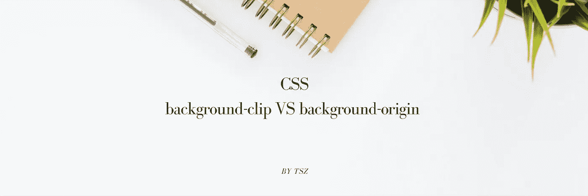

# 背景

当我学习这两个 CSS 属性时，我感到很困惑，因为它们有相同的属性值，并且它们的演示效果看起来很相似。经过研究和调查，下面是我现在对这两个属性的理解。

在所有下面的例子中，我将使用一个 20px 虚线边框和 15px 填充的 div，背景重复。(下面的橙色、绿色和蓝色分别代表边框、填充和内容区域)

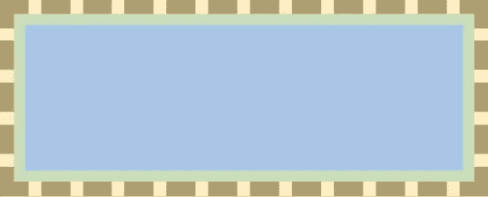

以下示例中使用的 div

以下示例中使用的背景图像

# “背景-来源”

它定义了背景的起始**位置**。(从左上角开始)

1.  **值=边框**

当我们将值设置为“border-box”时，背景从边界区域的左上角开始

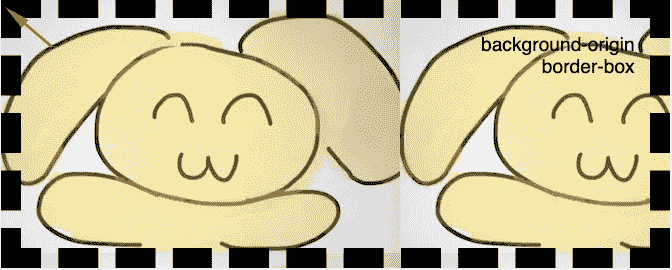

背景-原点=边框-盒子的演示

**2。值=填充框**

背景从填充区域的左上角开始

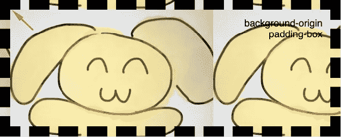

背景-原点=填充框的演示

**3。值=内容框**

背景从内容区域的左上角开始

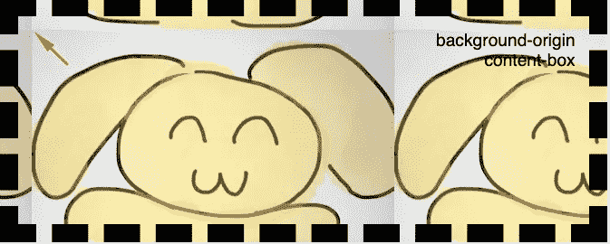

背景-来源=内容-盒子演示

# "背景剪辑"

理解了“背景-原点”的作用之后，就更容易理解什么是“背景-剪辑”了。

## 两种属性之间的差异

“背景-剪辑”——让您定义应该在哪个**区域**显示背景，区域外的背景将被“剪辑”

“background-origin”——只定义了背景的起始位置**，我们没有权力单独使用这个属性来定义其他任何东西(例如:它在哪里结束)**

## **1。值** = **内容框**

这次我们将从“内容盒”开始，因为它显示了最明显的效果。我们可以看到，背景只填充了内容区域，而填充和边框区域都没有。

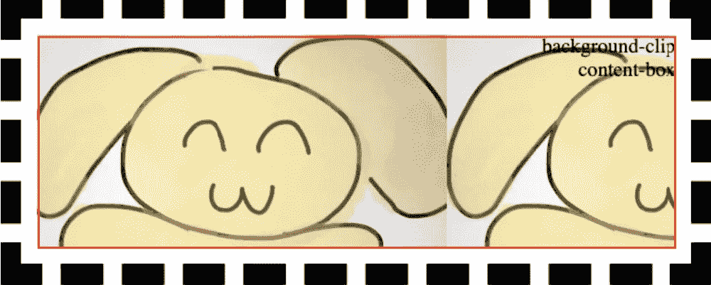

背景剪辑=内容框的演示

## 2.值=填充框

这次背景扩展到了填充区域。

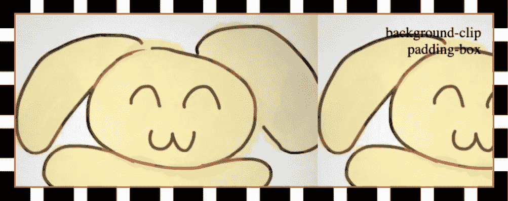

背景剪辑=填充框的演示

## 3.值=边框-框

背景扩展到整个 div，包括它的边界区域。

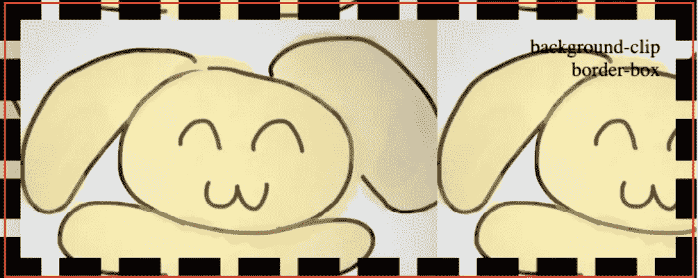

背景剪辑=边框-框的演示

css 背景-剪辑和背景-原点演示的代码笔

# 更多使用案例

在了解了每个属性的作用之后，我们就可以针对不同的用例单独或一起使用它们了！

## 应用多个值

除了上面的单值示例，两个属性都支持给出多个值(用逗号分隔)，以定义多背景行为。

在接下来的例子中，我在“背景图像”属性中设置了两个背景图像 URL。

然后在“背景-剪辑”演示中，我可以定义图像 A 扩展到内容框区域；而图像 B 可以延伸到边界框区域。

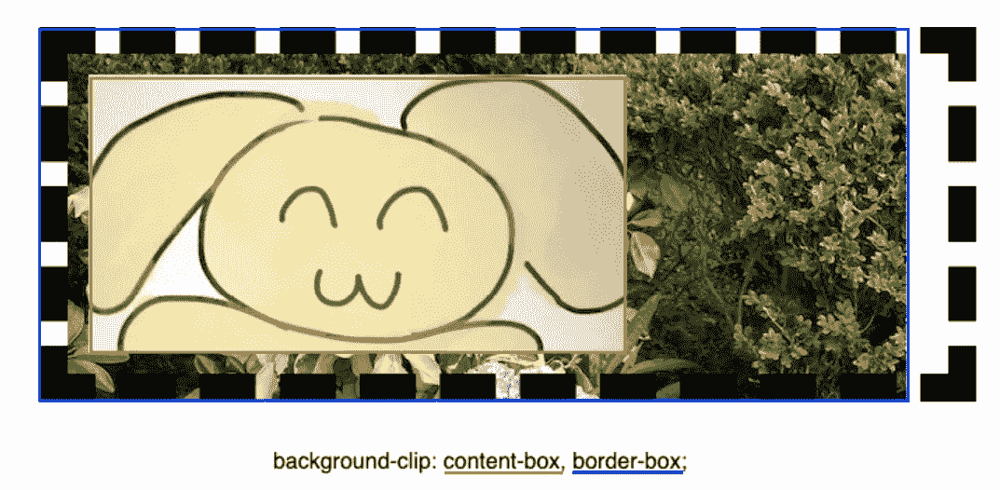

在“背景-原点”演示中，背景 A &背景 B 的起点可以不同。(A 从内容框开始，B 从边框开始)

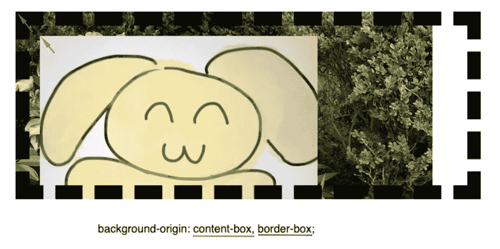

用于将多个值分配给背景剪辑和背景原点的代码笔

## 一起应用这两个属性

这两个属性可以一起使用。在下面的例子中，我使用“背景-原点”来设置背景图片的位置；并使用“背景剪辑”来决定应该显示背景图像的哪个区域。

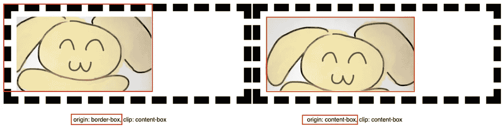

两张背景图片的起点不同！

用于演示背景-原点和背景-剪辑组合的代码笔

# 资源

 [## 背景-剪辑- CSS:级联样式表| MDN

### 背景剪辑 CSS 属性设置一个元素的背景是否延伸到它的边框，填充框…

developer.mozilla.org](https://developer.mozilla.org/en-US/docs/Web/CSS/background-clip)  [## 背景-来源- CSS:级联样式表| MDN

### 背景-原点 CSS 属性设置背景的原点:从边框开始，在边框内，或在…

developer.mozilla.org](https://developer.mozilla.org/en-US/docs/Web/CSS/background-origin)