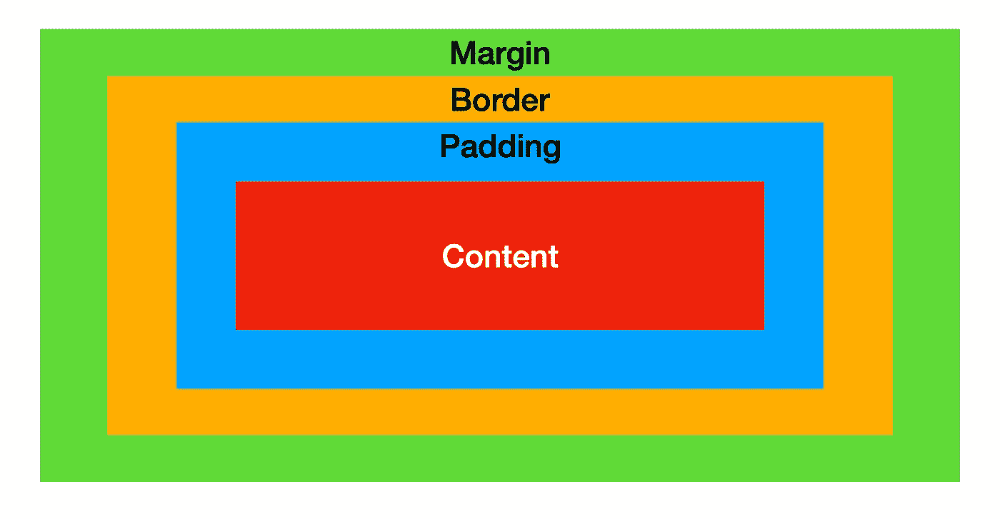

# CSS:解释盒子模型

> 原文：<https://levelup.gitconnected.com/css-box-model-explained-60fc76fe9c4d>

任何前端开发人员、UI/UX 设计人员或任何设计网站的人都知道，你对 CSS 的核心概念理解得越好，你就会越有效、越快。盒子模型是这些核心概念之一，我们将探索每一个不同的元素，以更好地理解它是如何工作的，并帮助您在设计 CSS 样式时尽可能地高效。

布局文档时，所有浏览器的渲染引擎都将每个元素表示为一个矩形框。在 CSS 中，当谈论设计和布局时，术语“盒子模型”被使用。网络标准[万维网联盟(W3C)](https://en.wikipedia.org/wiki/World_Wide_Web_Consortium) 描述了盒子模型的指导方针。

# 盒子模型的历史

1996 年，在给更多元素添加了边距、边框和填充之后，引入了盒子模型。在 HTML 4 和 CSS 之前，很少有 HTML 元素同时支持`border`和`padding`，所以元素的宽度和高度的定义并没有很大的争议。然而，它因元素而异。

1996 年后，CSS 采用了与内容、边框、边距和填充相关的**宽度**定义，类似于表格单元格。这就是后来被称为*的 W3C 盒子模型*。自从 CSS3 发布以来，它现在被称为`content-box`。根据 W3C 于 1996 年发布并于 1999 年修订的 CSS1 规范，当明确指定任何块级元素的宽度或高度时，它应该只确定**可见元素**的宽度或高度，然后应用填充、边框和边距。因此，要计算元素的整个宽度或高度，每个单独的值应该加在一起(我将在最后详细讨论)。

# **CSS 盒子模型**

CSS 盒子模型本质上是一个包装每个 HTML 元素的盒子。它由:
-内容(图片、文字等)。)
-填充
-边框
-边距

`height`和`width`可以在 CSS 中专门设置，也可以是你的`content`的大小。您的**内容**是 HTML 元素的主要焦点，可以是文本、图像、链接等。

**填充**是内容周围的空间。如果你想在文本周围添加空间，让它有“呼吸空间”，但是你不想在不同的 CSS 元素之间添加空间，那么`padding`通常是你要使用的。

**Border** 是盒子模型洋葱的下一层，设置这个值会在你的`content`和`padding`周围放置一个边框。您可以设置`border`的各个方面，也可以使用简写来设置大小、颜色和样式属性。

**边距**是最外面的元素，如果您添加更多，如果没有足够的空间，边距可能会覆盖您的`content`高度和宽度。下面例子中的外部元素是一个带有文本“外部元素”的 div，你可以看到`content`收缩以允许额外的边距。

如果外部元素有更多的高度和宽度，那么增加边距不会影响我们的`content`的大小。您可以在下面的示例中看到这一点，其中外部元素的高度和宽度为`300px`，而不是`200px`。

你也可以在 CSS 中定义一个`outline`,但是我会留给你自己去做。

# 计算总宽度或高度

在计算元素的总宽度或高度时，只需将边距、边框、填充和内容大小相加。

> 上边距+下边距+上边距+下边距+上边距+上边距+下边距+内容高度=总高度
> 
> 左边距+右边距+左边距+右边距+左边距+左边距+右边距+内容宽度=总宽度

当在浏览器中使用开发者工具时，这将为您进行计算，您可以看到不同的值是如何分解的。

# 结论

我希望看到这些可视化展示的例子能够帮助你理解 CSS 盒子模型，这样你就可以在正确的场景中使用每一个元素。记住，要利用开发人员的工具来了解在哪里设置值，并计算元素的全宽或全高。如果你想看代码示例，可以在 [GitHub](https://github.com/exosyphon/css/tree/main/box_model) 上查看。

如果你喜欢这篇文章，考虑[订阅 Medium](https://medium.com/@ascourter/membership) ！

如果你或你的公司有兴趣找人进行技术面试，那么请在 Twitter ( [@Exosyphon](http://twitter.com/Exosyphon) )上给我发 DM，或者访问我的[网站](https://andrewcourter.com/)。如果你喜欢这样的话题，那么你可能也会喜欢我的 [Youtube 频道](https://www.youtube.com/channel/UCx3Vist13GWLzRPvhUxQ3Jg)。如果你想支持更多像这样的内容 [buymeacoffee](https://www.buymeacoffee.com/andrewcourter) 。祝您愉快！