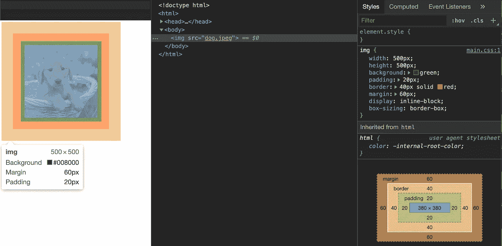

# CSS 框大小属性

> 原文：<https://levelup.gitconnected.com/css-box-sizing-property-and-how-it-works-f7ac1c3a76b0>

## 它的含义及其不同的价值观是如何运作的

在 HTML 中，默认情况下，每个元素都是一个矩形对象。所有的元素，不管它们以什么形状出现在网页上，都被浏览器绘制成一个矩形。让我们借助几个例子来更好地理解这个概念


在上面的例子中，我们有一个宽度和高度都是 500 像素的图像。当我们试图检查该元素时，我们看到浏览器测量它的形状是一个边长为 500 像素的正方形。


猫的另一个图像的宽度和高度为 500 像素，但它是一个圆形图像(通过将边框半径设置为 50%)。但是我们可以看到，尽管浏览器对用户来说是一个圆，但它仍然以正方形来衡量自己的形状。

在我们进入盒子大小的话题之前，我们首先需要讨论 HTML 如何测量元素的尺寸。我们来看宽度维度。HTML 允许我们使用 CSS 属性`width`来设置元素的宽度。但是，网页上某个元素占用的空间与分配给它的宽度不同。计算元素占据的总水平空间的公式为

```
total horizontal space = width + padding-left + padding-right + border-right + border-left + margin-left + margin-right
```

如您所见，填充、边框和边距等属性也考虑了 HTML 中元素所占用的空间。从下图中你可以更好地理解这一点


如您所见，尽管我们将图像的宽度设置为 500px，但图像占据的总水平空间包括其两侧 20px 的填充、20px 的边框和两侧 40px 的边距。所以，总空间，根据我们之前讨论的公式是 500 + 20 + 20 + 40 + 40 + 60 + 60 = 740px。

尽管这是计算 HTML 中元素所占空间的默认方法，但这在设计元素时并不十分有利。假设你有一个元素，需要有一个固定的 300 像素的总宽度。首先在 CSS 中将它的 width 属性指定为 300px。但是，如果您希望向该元素添加边框或填充，因为它们会增加元素的总宽度，您还需要相应地减少元素的`width`属性，以便保持 300px 的固定总宽度。为了克服这种不便，我们在 CSS 中有一个名为`box-sizing`的属性。

## 盒子尺寸

属性决定了一个元素在网页上最终占据的空间是如何计算的。该属性的默认值是`content-box`。当将其设置为值时，元素所占用的最终空间将按照上一节中讨论的方式进行计算。

```
div {
    box-sizing: content-box;
}
```

然而，这个属性还有另一个值叫做`border-box`。当应用 border-box 时，应用于元素的任何填充或边框都包含在元素的原始大小内。添加到元素的边距通常会增加它们的最终大小。

```
div {
    box-sizing: border-box;
}
```

因此，其框大小设置为 border-box 的元素所占用的总水平空间将被计算为

```
total horizontal space = width + margin-left + margin-right
```

让我们使用与之前相同的布局来进一步理解这一点，但是将框大小设置为 border-box



可以看到，CSS 中宽度设置为 500px。但与之前不同的是，两边 20px 的填充和 40px 的边框都包含在元素内部，而不是元素外部。因此，元素的基本宽度计算为 500–20–20–40–40 = 380 px。但是，最终的宽度(不包括边距)仍然只有 500 像素。无论您将边框或填充设置为什么，它都将保持不变。这种盒子大小有助于我们以更容易和简单的方式设计我们的网页。