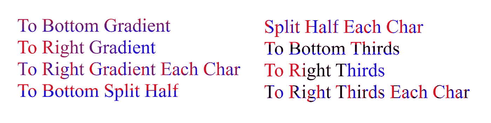
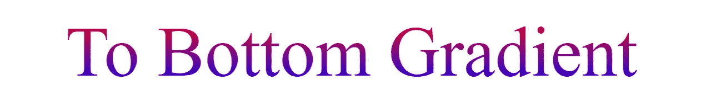
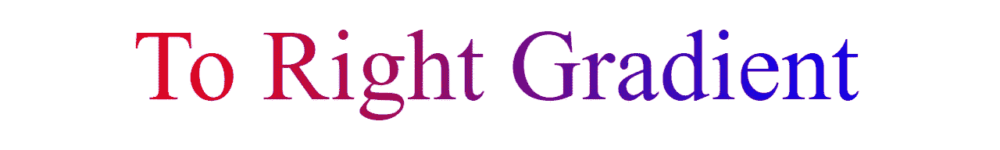
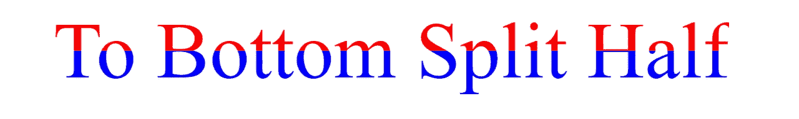

# 使用背景剪辑的 CSS 字符样式

> 原文：<https://levelup.gitconnected.com/css-character-styling-using-background-clip-a1c512ad6d20>



在 Grace Omele 的文章“[如何将 CSS 应用于半样式字符或文本](https://medium.com/front-end-weekly/how-to-apply-css-to-halfstyle-a-character-or-a-text-588efc289f4c)中，她介绍了[一个“插件”来帮助样式文本](https://github.com/arbelh/HalfStyle)。虽然这个概念是好的，但是执行起来还有很多需要改进的地方，因为它使用的脚本完全是垃圾，使用的技术是暴力的，CSS 实际上可以用线性渐变和背景剪辑来完成所有的事情！

# **出现的问题**

1.  它用绝对定位和溢出创建每个角色的副本:隐藏以剪切掉部分。ttthhhiiisss rrreeesssuuullllttttsss iiinnnnnnoonnn—-vvviiiissuuaaauaallul uuussseeerrr aaaggggeeenntttsss rrreeaadddiiiinnggg yyyooouuurrr ttteeeexxxttt llllikkeettthhhiiisss…不完全是一种可取的行为。
2.  对于这种从上到下的着色，我们实际上不需要 JavaScript 的帮助！从上到下设置一个线性渐变，然后设置`background-clip:text;`(和它的-webkit 等价物)
3.  因此，不仅脚本比需要的要大很多倍，而且这是一个典型的写得很差的笨蛋，你可以从火车残骸的洗衣单中看到如何不写 JavaScript，即 jQuery。15 年前推出时，它是一种无能的垃圾，到 2021 年，它就是一种令人麻木的愚蠢垃圾。我不知道那个臭屁是如何流行起来的。

真的对我来说，如果你需要一个 2k 的脚本和 7k 的 CSS 的“插件”来做这件事，嗯…有些不对劲。这并不是说这完全取决于所述“插件”的原始创建者——Arbel Hakopian——考虑到当它被编写时——*显然是 2014*——我们可以利用的许多花哨的 CSS 功能——*如背景剪辑*——甚至不可在现实世界中部署。

即便如此，这也是我从那些被 dumbassery 的灾难所迷惑的人们那里所期待的混乱类型，这些框架包括 jQuery、Angular、React、Vue 等等。

# 做得更好

正如我所说，我们真正需要做的就是应用`background-style`和`background-clip`来解决这个问题。

*注意，以下所有代码都假设正在使用复位。*

例如，从上到下的线性渐变:

```
<p class=”test”>To Bottom Gradient</p>
```

使用此 CSS:

```
.test {
  background-image:linear-gradient(
    to bottom,
    #FF0000 0%,
    #0000FF 100%
  );
  background-clip:text;
  --webkit-background-clip:text;
  color:transparent;
}
```

这基本上给了我们这个:



如果我们将容器切换为收缩到文本(内联块、浮动等)，并将“`to bottom`”替换为“【T4”)，我们会得到这样的结果:



嘭，我们完成了大部分工作。你可以对线性渐变做的任何事情，我们都可以对文本做。例如，如果我们将顶部到底部的渐变改为:

```
background-image:linear-gradient(
  to bottom,
  #FF0000 0%,
  #FF0000 50%,
  #0000FF 50%,
  #0000FF 100%
);
```

我们得到这个:



## 这是怎么回事？

通过设置文本为透明，我们让背景显示出来。`background-clip:text;`设置告诉浏览器只绘制文本后面的背景…这就是它显示的方式。

简单的柠檬榨汁机。

# 每个角色呢？

您实际上可以在不编写脚本的情况下完成这项工作，尽管这有点痛苦。每个字符加一个跨度就行了。

```
<p class="test"><span>T</span><span>o</span><span> </span><span>R</span><span>i</span><span>g</span><span>h</span><span>t</span><span> </span><span>T</span><span>h</span><span>i</span><span>r</span><span>d</span><span>s</span><span> </span><span>E</span><span>a</span><span>c</span><span>h</span><span> </span><span>C</span><span>h</span><span>a</span><span>r</span></p>
```

这真的很糟糕。它消耗带宽，消耗你的时间和精力，真糟糕。

这就是我要使用 Javascript 来帮助…将标记转换成如下形式的地方:

```
<p class="test jsWrapEachChar">To Right Third Each Char</p>
```

用这个简单的小脚本:

```
(function(d) {

  for (var wrapper of d.getElementsByClassName("jsWrapEachChar")) {
    var text = wrapper.textContent;
    wrapper.textContent = "";
    for (var char of text) {
      var span = wrapper.appendChild(d.createElement('span'));
      span.textContent = char;
    }

  }

})(document);
```

一种隔离范围的生活，这样我们就不用到处说“T1”了。jsWrapEachChar，获取它们的文本，清空元素，然后直接在 DOM 上为每个字符生成 span。

*又记，。appendChild 返回追加的节点，因此我们不必等待应用值。同样，在脚本发布之前，不会呈现对 DOM 的脚本更改，所以不要让那些“批量更改”* ***骗子*** *的人给你满嘴胡言。*

# 让我们来看看它的实际应用

这里有一只简单的笔，用多个例子展示了这一点。我使用包装器通过组合子来应用所有东西，而不是用表示类来破坏所有东西。请记住，使用类来说明您希望事情看起来像什么，这与 JavaScript 中应该做的事情是相反的，无论“HTML/CSS”框架用他们的废话和无能试图告诉您什么。

# 遗留问题

1.  如果文本分成多行，垂直渐变将延伸到容器，而不是每行。您可以通过应用与每个角色版本相同的方式来解决这个问题。
2.  整个文本的水平渐变指向父容器。这就是为什么 codepen 演示浮动并清除每个段落，使它们收缩到它们的内容。
3.  每个字符周围的一些空白被视为渐变的一部分，因此您可能希望通过将每个渐变的第一个和最后一个百分之五到百分之十作为统一的颜色来进行补偿。

# 结论

不要只扑向 JavaScript 来暴力破解每一个答案。CSS 现在有了更多的功能，如果迟早他们真的给了我们一种单独定位每个角色的方法，我一点也不奇怪。但是现在，严格地使用脚本来做普通 CSS 做不到的事情，并确保你彻底地调查，以确保你不是在复制已经存在的东西。

我已经看到了太多最近的暴力代码重新创建函数和功能，CSS 或甚至普通的 HTML 应该做繁重的工作。