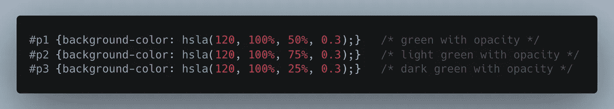

# CSS:颜色和如何使用它们

> 原文：<https://levelup.gitconnected.com/css-colors-and-how-to-use-them-5f40d8da6315>

如果你曾在任何网站、个人项目、公司的应用程序或另一家公司的自由职业者中工作过，你会使用 CSS 颜色来增加颜色。在这里，我将重述一些基础知识，并介绍一些你在使用 CSS 颜色时可能不知道的其他选项。

马库斯·斯皮斯克在 [Unsplash](https://unsplash.com?utm_source=medium&utm_medium=referral) 上拍摄的照片

首先，我们将介绍如何指定自定义颜色，然后进入可以应用这些颜色的 CSS 元素。我甚至没有意识到有*那么*在如何指定以及在 HTML 元素中有多少区域你可以灵活定制上有许多不同的变化。

# 指定颜色的不同方式

**十六进制**

*   这是许多设计师和软件工程师指定颜色的 goto 方法。
*   格式为#RRGGBB，其中 RR(红色)、GG(绿色)和 BB(蓝色)[十六进制](https://en.wikipedia.org/wiki/Hexadecimal)整数指定颜色的组成部分。所有值必须在 00 和 FF 之间。

*   您还可以通过在末尾添加两个额外的数字来使用十六进制指定透明度

**RGB 颜色**

*   您可以使用`rgb(red, green, blue)`功能指定 RGB 颜色。红、绿、蓝值中的每一个都定义了颜色的强度，并且是 0 到 255 之间的整数或者是从 0%到 100%的百分比值。
*   例如，`rgb(0,0,255)`值被渲染为蓝色，因为蓝色参数被设置为其最高值(255)，而其他参数被设置为 0。
*   同样，以下值定义了等色:`rgb(0,0,255)`和`rgb(0%,0%,100%)`。

*   您也可以在`rgba()`函数中指定一个 alpha 值作为第四个参数来指定颜色的不透明度。这是一个介于 0.0(完全透明)和 1.0(完全不透明)之间的数字。

**HSL 颜色**

*   HSL 代表色调、饱和度和亮度，代表颜色的圆柱坐标表示。

*   您可以使用`hsl(hue, saturation, lightness)`功能指定 HSL 颜色。`Hue`是色轮上的度数(从 0 到 360)；0(或 360)是红色，120 是绿色，240 是蓝色。`Saturation`是百分比值；0%表示灰色阴影，100%表示全色。`Lightness`也是百分比；0%是黑，100%是白。

*   与 RGB 相似，您也可以在`hsla()`功能中指定 HSL 颜色的 alpha 设置。这也是一个介于 0.0(完全透明)和 1.0(完全不透明)之间的数字。

**预定义/跨浏览器颜色名称**

*   各种浏览器至少支持 140 种不同的颜色名称。你可以在这里查看完整的颜色列表。

*   您还可以使用`currentcolor`关键字来使用已经为该 CSS 元素指定的相同颜色

# 我们可以在哪里使用这些令人敬畏的颜色？

既然我们知道了所有不同的指定颜色的方法，那么我们实际上可以使用什么元素或 CSS 标签来指定颜色呢？下面列出了所有带有颜色属性的元素的定义(在写这篇文章之前，我甚至不知道这些元素的存在)。另请注意，在指定颜色时，您也可以使用不透明度。在我看来，除了一个(强调色)，大多数都可以直接使用。

**强调色
-** 指定用户界面控件的强调色，如:<输入类型= "复选框">，<输入类型= "单选">，<输入类型= "范围">和<进度>。

**背景色(或背景简写)
-** 设置元素的背景色

**颜色
-** 指定文本的颜色

**边框颜色(边框简写、边框左颜色、边框右颜色、边框下颜色、边框上颜色)
-** 设置元素的四个边框或单个上、左、右、下边框的颜色

**框-阴影**
-设置阴影的颜色

**插入符号-颜色**
-指定输入、文本区域或任何可编辑元素中光标(插入符号)的颜色

**列-规则-颜色**
-指定列间规则的颜色

**轮廓-颜色**-指定轮廓的颜色

**文本-装饰-颜色**
-指定文本-装饰的颜色(下划线、上划线、线条)

**文本-阴影**
-给文本添加阴影

**文本-强调-颜色**
-用于对文本应用强调标记

# 结论

我希望这有助于了解*所有*你可以利用颜色的不同地方，以及更多指定你想要的颜色和透明度的方式，以获得正确的外观和感觉。我打算继续 CSS 主题，这样我可以学到更多，也可以以统一的格式分享给其他人使用和学习。如果你有 CSS 或其他感兴趣的话题，请在评论中告诉我。

如果你喜欢这篇文章，考虑[订阅媒体](https://medium.com/@ascourter/membership)！

如果你或你的公司有兴趣找人进行技术面试，那么请在 Twitter ( [@Exosyphon](http://twitter.com/Exosyphon) )上给我发消息，或者访问我的[网站](https://andrewcourter.com/)。如果你喜欢这样的话题，那么你可能也会喜欢我的 Youtube 频道。如果你想支持更多像这样的内容 [buymeacoffee](https://www.buymeacoffee.com/andrewcourter) 。祝您愉快！

# 分级编码

感谢您成为我们社区的一员！在你离开之前:

*   👏为故事鼓掌，跟着作者走👉
*   📰查看[升级编码出版物](https://levelup.gitconnected.com/?utm_source=pub&utm_medium=post)中的更多内容
*   🔔关注我们:[Twitter](https://twitter.com/gitconnected)|[LinkedIn](https://www.linkedin.com/company/gitconnected)|[时事通讯](https://newsletter.levelup.dev)

🚀👉 [**加入人才集体，找到一份令人惊喜的工作**](https://jobs.levelup.dev/talent/welcome?referral=true)