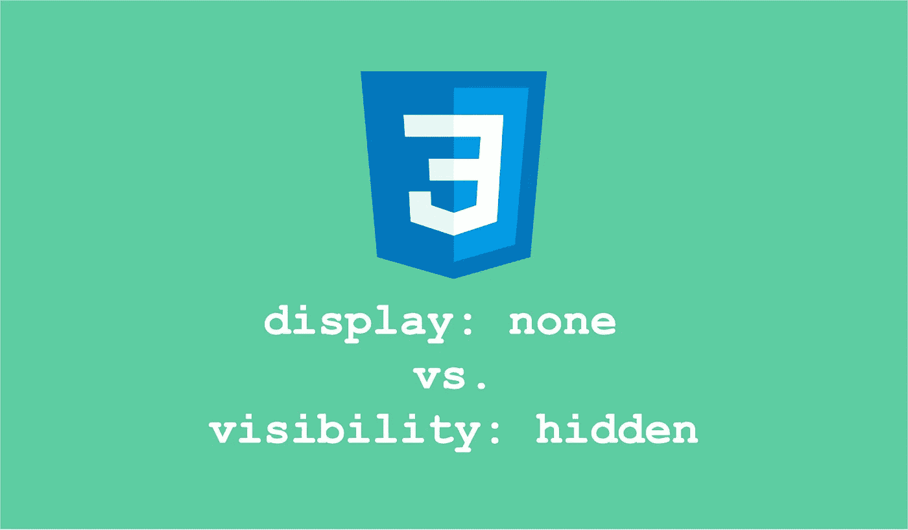
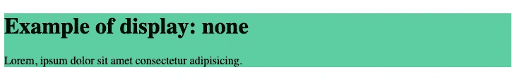
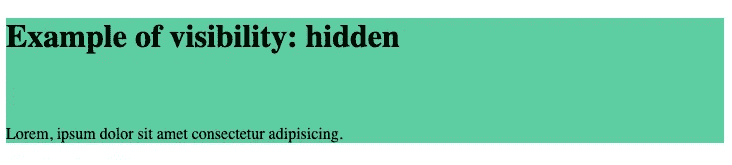

# Display: None 和 Visibility: Hidden in CSS 之间的关键区别是你应该知道的

> 原文：<https://levelup.gitconnected.com/css-display-none-vs-visibility-hidden-53c9809c857>

## 显示:无与可见性:隐藏在 CSS 中

图片由作者创作| Logo 鸣谢:[icons8.com](https://icons8.com/icons/set/css-logo)

在 CSS 中，显示和可见性属性都非常重要。对于`**display: none**`和`**visibility: hidden**`的具体值，它们的行为类似，但它们之间略有不同。有时他们的行为也可能给一些开发人员造成一点困惑。

在本文中，我们将通过一个例子来讨论这些属性是如何工作的，以及最终的网页是什么样子的。

让我们开始吧。

# 显示:无

当您将任何给定元素的`display`属性设置为`none`时，该元素将不会被渲染，因此不会出现在网页上。因此，页面上其他元素之间不会为该元素分配空间。尽管如此，您仍然可以通过 DOM 与元素进行交互。

> 显示:无从网页布局中完全移除元素，不留任何空间

您可以在下面看到`display: none`属性的代码和页面呈现。

显示输出:h2 元素无设置(作者截图)

# 可见性:隐藏

当您将任何给定元素的`visibility`属性设置为`hidden`时，该元素将被呈现，但不会出现在网页上。由于可见性设置为隐藏，尽管元素可能不可见，但网页上分配给元素的空间保持不变。所以它会在最后一页显示为空白。

> 可见性:hidden 将元素保留在网页布局中，但将其隐藏，从而为元素留出一个空白空间

您可以在下面看到`visibility: hidden`属性的代码和页面呈现。

具有可见性的输出:h2 元素的隐藏集

这些就是`display: none`和`visibility: hidden`属性的工作方式，以及它们在网页渲染中的用法。我希望你觉得这很有用。

感谢阅读！

如果你喜欢阅读这样的故事，并想支持我成为一名作家，可以考虑[注册成为一名媒体会员](https://nehalk.medium.com/membership)。一个月 5 美元，你可以无限制地阅读 Medium 上的所有故事。如果你用我的链接注册，我会赚一点佣金。

 [## 通过我的推荐链接加入 Medium-Nehal Khan

### 阅读 Nehal Khan(以及媒体上成千上万的其他作家)的每一个故事。您的会员费直接支持…

nehalk.medium.com](https://nehalk.medium.com/membership) 

# 分级编码

感谢您成为我们社区的一员！更多内容见[级编码出版物](https://levelup.gitconnected.com/)。
跟随: [Twitter](https://twitter.com/gitconnected) ， [LinkedIn](https://www.linkedin.com/company/gitconnected) ，[迅](https://newsletter.levelup.dev/)
升一级就是转型科技招聘👉 [**加入我们的人才集体**](https://jobs.levelup.dev/talent/welcome?referral=true)