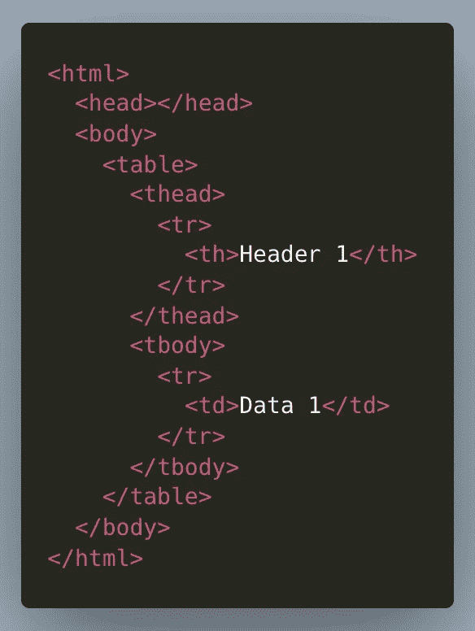
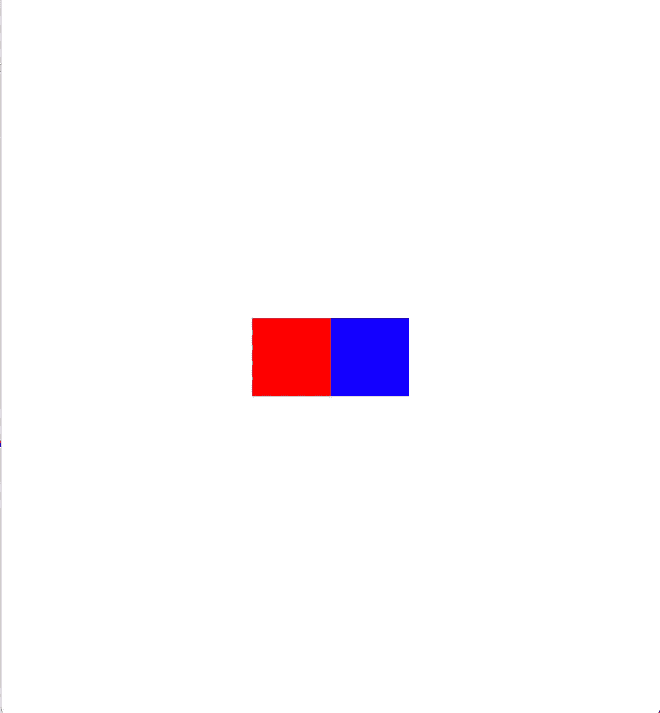
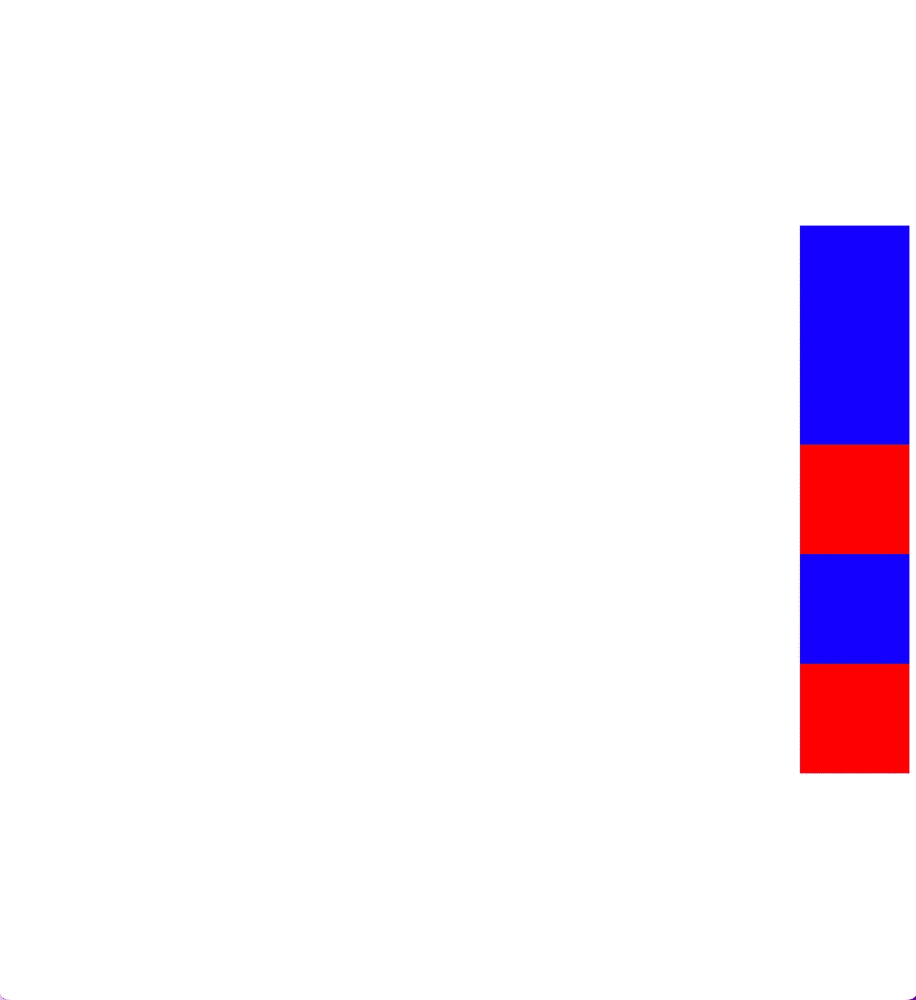

# CSS: Flexbox 解释

> 原文：<https://levelup.gitconnected.com/css-flexbox-explained-557f01f2d7de>

如果你在过去的几年里花了一些时间来构建网页，那么你很可能已经使用了 Flexbox。使用 Flexbox 时有大量的配置选项，所以我将介绍其中的许多选项，这样您就可以成为 Flexbox pro 了！


由 [Ferenc Almasi](https://unsplash.com/@flowforfrank?utm_source=medium&utm_medium=referral) 在 [Unsplash](https://unsplash.com?utm_source=medium&utm_medium=referral) 上拍摄的照片

# 概观

20 世纪 90 年代和 21 世纪初的网页在表格视图中使用行和列布局，如下例所示。



这种结构非常适合于显示数据表和页面布局，对于典型的屏幕尺寸来说，这种结构具有良好的定义。然而，随着移动电话的引入和在任何屏幕尺寸上良好显示数据的需求，需要一些新的东西。Flexbox 就是在这里创建的，目的是在未知的屏幕尺寸上灵活地显示内容，并允许响应性的布局行为。

Flexbox 是方向不可知的，你可以垂直、水平或反向排列项目。建议对页面或小型应用程序使用 Flexbox，对需要更多结构的大型应用程序使用网格布局。

# 性能

Flexbox 有两类属性可供您使用，一类是包装页面上项目的容器元素上的属性，另一类是项目本身的属性。大多数属性都是在容器元素上定义的，但是如果您需要覆盖特定元素的行为或进行定制，您可以使用这个杠杆。

**容器属性**

下面是可以在包装其他项目的容器元素上使用的容器属性的完整列表。我将强调最常用的元素和一些如何使用它们的例子。

```
.container {
  display: flex; /* or inline-flex */
  flex-direction: row | 
                  row-reverse | 
                  column |
                  column-reverse;
  flex-wrap: nowrap | wrap | wrap-reverse;
  flex-flow: column wrap;
  justify-content: flex-start | 
                   flex-end | 
                   center | 
                   space-between | 
                   space-around | 
                   space-evenly | 
                   start | 
                   end | 
                   left | 
                   right; /* safe or unsafe */
  align-items: stretch | 
               flex-start | 
               flex-end | 
               center | 
               baseline | 
               first baseline | 
               last baseline | 
               start | 
               end | 
               self-start | 
               self-end; /* safe or unsafe */
  align-content: flex-start | 
                 flex-end | 
                 center | 
                 space-between | 
                 space-around | 
                 space-evenly | 
                 stretch | 
                 start | 
                 end | 
                 baseline | 
                 first baseline | 
                 last baseline; /* safe or unsafe */
  gap: 10px 20px; /* row-gap column gap */
  row-gap: 10px;
  column-gap: 20px;
}
```

`justify-content`、`flex-direction`和`align-items`是你会用到最多的元素。

`flex-direction`让您设置项目在页面上的布局方式，水平(`row`，默认设置)或垂直`column`。请注意，Flexbox 将试图把所有的元素塞进一行，除非您指定了`flex-wrap: wrap;`

`justify-content`决定内容如何放置在当前行的主轴上。如果您有想要换行的内容，那么您可能想要使用`align-content`。还要注意，如果您使用`flex-direction: column`选项之一，那么`justify-content`将应用于垂直轴，而不是默认的水平轴。

`align-items`确定弹性项目在每行的横轴上的默认放置方式。例如，如果`justify-content: row`想要垂直对齐所有项目，则可以设置`align-items: center`。

**物品属性**

下面是可以在容器元素内部的元素上使用的项目属性的完整列表。我将强调最常用的元素和一些如何使用它们的例子。

```
.item {
  order: 5; /* default is 0 */
  flex-grow: 4; /* default 0 */
  flex-shrink: 3; /* default 1 */
  flex-basis:  | auto; /* default auto */
  flex: none | 
        [ <'flex-grow'> <'flex-shrink'>?
           || <'flex-basis'> ]
  align-self: auto | 
              flex-start | 
              flex-end | 
              center | 
              baseline | 
              stretch;
}
```

`order`可用于改变渲染项目的顺序。假设您希望首先呈现所有带有类`yellow`的项目。要实现这一点，您可以使用类似下面的例子。

```
.yellow {
  order: 1;
}
```

`align-self`可用于覆盖容器元素行为和`center`div 中的文本或其他行为。

`flex-grow`将允许项目增长以适应容器元素内的额外空间

`flex-shrink`将允许项目收缩以继续适合更小的空间

**例题**

臭名昭著的将 div 放在页面中间的例子就像下面的例子一样简单。

*styles.css*

```
.container {
  height: 100%;
  display: flex;
  justify-content: center;
  align-items: center;
}
.red {
  height: 100px;
  width: 100px;
  background-color: #ff0000;
}
.blue {
  height: 100px;
  width: 100px;
  background-color: #0000ff;
}
```

【index.html】

```
<html>
  <head>
    <link rel="stylesheet" href="styles.css" />
  </head>
  <body>
    <div class="container">
      <div class="red"></div>
      <div class="blue"></div>
    </div>
  </body>
</html>
```

*输出*



很简单！

下面是一个更复杂的反转列的例子，它从页面的底部开始以相反的顺序排列列，并反转换行，将元素放在页面的右侧，然后将元素居中；注意`justify-content`现在适用于垂直轴，因为我们使用了`column-reverse`。

*styles.css*

```
.container {
  height: 100%;
  display: flex;
  flex-direction: column-reverse;
  flex-wrap: wrap-reverse;
  justify-content: center;
}
.red {
  height: 100px;
  width: 100px;
  background-color: #ff0000;
}
.blue {
  order: 1;
  height: 100px;
  width: 100px;
  background-color: #0000ff;
}
```

*index.html*

```
<html>
  <head>
    <link rel="stylesheet" href="styles.css" />
  </head>
  <body>
    <div class="container">
      <div class="red"></div>
      <div class="blue"></div>
      <div class="red"></div>
      <div class="blue"></div>
      <div class="blue"></div>
    </div>
  </body>
</html>
```

*输出*



相当酷。

# 结论

我希望列出这些并给出一些例子有助于你的理解，并给你一个很好的基础来构建创造性的 CSS 解决方案。关于 CSS Flexbox 的另一个很棒的指南，请看这个 [Flexbox 备忘单](https://css-tricks.com/snippets/css/a-guide-to-flexbox/)。想在互动游乐场测试你的技能吗？试试 [Flexbox Froggy！](https://flexboxfroggy.com/)

如果你喜欢这篇文章，考虑[订阅媒体](https://medium.com/@ascourter/membership)！

如果你或你的公司有兴趣找人进行技术面试，那么请在 Twitter ( [@Exosyphon](http://twitter.com/Exosyphon) )上给我发 DM，或者访问我的[网站](https://andrewcourter.com/)。如果你喜欢这样的话题，那么你可能也会喜欢我的 Youtube 频道。如果你喜欢 3D 打印的东西，可以去我的 [Etsy 商店](https://www.etsy.com/listing/1273702925/6-sided-fidget-cube)看看。祝您愉快！

# 分级编码

感谢您成为我们社区的一员！在你离开之前:

*   👏为故事鼓掌，跟着作者走👉
*   📰查看[升级编码出版物](https://levelup.gitconnected.com/?utm_source=pub&utm_medium=post)中的更多内容
*   🔔关注我们:[Twitter](https://twitter.com/gitconnected)|[LinkedIn](https://www.linkedin.com/company/gitconnected)|[时事通讯](https://newsletter.levelup.dev)

🚀👉 [**加入升级人才集体，找到一份惊艳的工作**](https://jobs.levelup.dev/talent/welcome?referral=true)