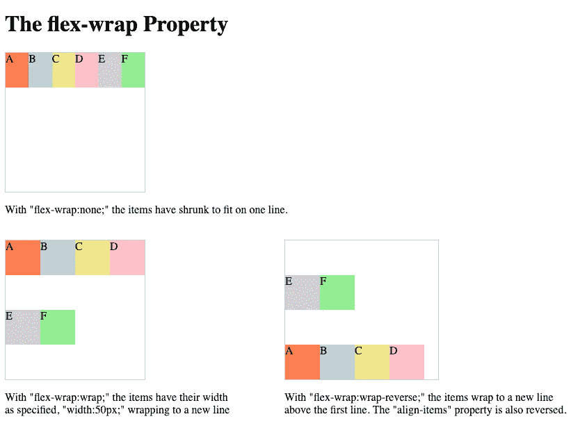

# CSS Flexbox 第 2 部分:我从 Flexbox 僵尸那里学到了什么

> 原文：<https://levelup.gitconnected.com/css-flexbox-part-2-what-else-i-learned-from-flexbox-zombies-c90a323b0ad>

> 这是一个博客系列的第二部分，描述了我通过玩一个叫做 [Flexbox 僵尸](https://flexboxzombies.com/p/flexbox-zombies)的教育游戏而对 CSS flexbox 的了解。你可以在这里阅读第一部分。

Flexbox 僵尸

正如我之前提到的， [MDN 文档](https://developer.mozilla.org/en-US/docs/Learn/CSS/CSS_layout/Flexbox)将 [flexbox](https://developer.mozilla.org/en-US/docs/Web/CSS/CSS_Flexible_Box_Layout) 解释为:

> 按行或列排列项目的一维布局方法。项目伸缩以填充额外的空间，收缩以适应更小的空间。

flexbox 僵尸游戏通过一个故事来教授 flexbox，每个课程都建立在以前的基础上，从而以一种有趣而有效的方式强化 Flexbox 的基础。

以下是我自上一篇博客以来学到的步骤:

# 弹性基础

*这对应于丧尸的理想尺寸，在 justify laser 的方向，如果有足够的空间。*

`flex-basis`适用于物品本身。当有足够的可用空间时，它指定项目的理想或假设大小。当`flex-direction`为水平时，表示该项目的`width`，当`flex-direction`为垂直时，表示该项的`height`。

如果在一个项目上同时指定了`width`和`flex-basis`属性，则`width`将被忽略。

`min-width`属性作为`flex-basis`的下限。因此，如果两者都被应用，例如`flex-basis:50px`和`min-width:100px`，最后的`flex-basis`实际上是`100px`。

这同样适用于作为`flex-basis`上限的`max-width`。

`flex-basis`的值可以是像素数量或百分比。当使用百分比时，它定义项目将占用多少容器空间。

当容器中的所有项目加在一起将超过容器的总大小时(如果它们各自的`flex-basis`属性被认可)，将应用`flex-shrink`属性来缩小宽度并确保项目适合空间。反之亦然。如果容器中有多余的空间，项目可以根据它们的`flex-grow`属性进行扩展。

如果未指定，默认为`flex-basis:auto`，这意味着它使用其`width`(或`flex-direction:column`时使用`height`)值。

# 命令

*这对应于行或列中僵尸出现的顺序。*

`order`应用于物品本身。

`order`取决于弯曲方向。(对于`row`，顺序是从左到右，对于`row-reverse`，顺序是从右到左。对于`column`来说，顺序是从上到下，对于`column-reverse`来说，顺序是从下到上。)

项目的`order`越高，它将在行或列中向后移动得越远。

如果未指定，默认为`order:0`。

因此，任何带有`order:1`或更高的项目将移动到没有指定`order`的项目后面。`order`属性也可以有一个负值，比如`order:-1`，它会将一个项目移动到行的前面或列的顶部。

物品将按升序排列`order`。如果多个项目具有相同的`order`，它们在 HTML 中出现的顺序将被保留。

# 柔性包装

这对应于弩上关于僵尸是否多行缠绕的设置。

`flex-wrap`是父元素上的一个属性。

正如 [MDN 文档](https://developer.mozilla.org/en-US/docs/Web/CSS/flex-wrap)所解释的:

> CSS 属性设置 flex 项是强制换行还是换行。如果允许换行，它设置线条堆叠的方向。

这意味着，如果父元素被设置为`flex-wrap:wrap`，由于溢出而创建的任何新行将在原始行之后创建(在`flex-direction:row`的下方，在`flex-direction:column`的右侧)。如果设置为`flex-wrap:wrap-reverse`，新线条将在原始线条之前创建(在`flex-direction:row`中位于顶部，在`flex-direction:column`中位于左侧)。

除了颠倒行的顺序，`flex-wrap:wrap-reverse`也会颠倒`align-items`设置的顺序，如果它被设置为`flex-start`或`flex-end`。

如果未指定，默认为`flex-wrap:nowrap`。其他选项有`wrap`和`wrap-reverse`。

另一点要注意的是，一旦项目`wrap`到一个新的行，这个新的行被视为一个全新的自由空间，位于那里的项目然后可以`grow`来填充那个空间。

项目不会`shrink`直到他们不得不。如果他们有一个`flex-wrap`设置(除了`nowrap`)，他们会先`wrap`到一个新的行，只有当他们完全换行后，如果没有足够的空间，他们才会`shrink`。

另一件要注意的事情是，一旦项目`wrap`，如果有非增长项目现在位于具有可用空闲空间的行上，则`justify-content`属性可能需要再次指定。

查看本系列的[第 3 部分](/css-flexbox-part-3-the-end-of-my-adventure-with-flexbox-zombies-327b5e5d7fb2)，我们将在其中讨论更多 flexbox 属性。