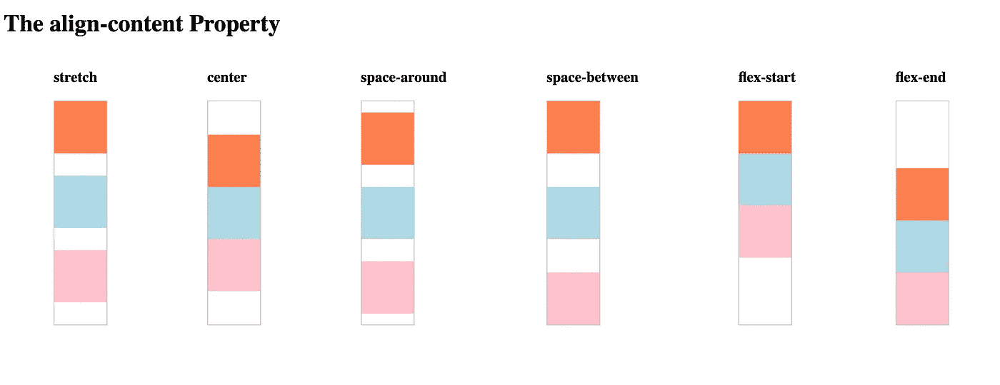

# CSS Flexbox 第 3 部分:我的 Flexbox 僵尸之旅的结束

> 原文：<https://levelup.gitconnected.com/css-flexbox-part-3-the-end-of-my-adventure-with-flexbox-zombies-327b5e5d7fb2>

*这是一个博客系列的第三部分，描述了我通过玩一个名为* [*Flexbox 僵尸*](https://flexboxzombies.com/p/flexbox-zombies) *的教育游戏而了解到的 CSS flexbox。如果你还没看完其他的，不妨先看一下* [*第一部*](/css-flexbox-what-i-learned-from-flexbox-zombies-850b1f2f6d23) *和* [*第二部*](/css-flexbox-part-2-what-else-i-learned-from-flexbox-zombies-c90a323b0ad) *。*

Flexbox 僵尸

正如我在本系列的前两部分中提到的， [MDN 文档](https://developer.mozilla.org/en-US/docs/Learn/CSS/CSS_layout/Flexbox)将 [flexbox](https://developer.mozilla.org/en-US/docs/Web/CSS/CSS_Flexible_Box_Layout) 解释为:

> 按行或列排列项目的一维布局方法。项目伸缩以填充额外的空间，收缩以适应更小的空间。

flexbox 僵尸游戏通过一个故事来教授 flexbox，每个课程都建立在以前的基础上，从而以一种有趣而有效的方式强化 Flexbox 的基础。

以下是我自上一篇博客以来学到的步骤:

# 对齐内容

*这对应的是针对僵尸的台词。*

正如 [MDN 文档](https://developer.mozilla.org/en-US/docs/Web/CSS/align-content)所解释的:

> CSS `**align-content**`属性沿着 flexbox 的横轴设置内容项之间和周围的空间分布。
> 
> 该属性对单行 flex 容器(即带有`flex-wrap: nowrap`的容器)没有影响。

如果未指定，默认为`align-content:stretch`。其他选项有`flex-start`、`flex-end`、`center`、`space-between`和`space-around`。

`align-content`很像`align-items`，除了它控制包装的行，而不是那些行中的单个项目。

[摩西·奥格沃的这篇文章](https://medium.com/better-programming/flexbox-align-items-and-align-content-a60b6f8451e3)解释了`align-items`财产(我们已经在本系列的第一部分[中讨论过)和`align-content`之间的区别如下:](/css-flexbox-what-i-learned-from-flexbox-zombies-850b1f2f6d23)

> `align-content`属性确定伸缩线如何沿横轴对齐，而`align-items`属性确定伸缩项目如何在伸缩线内和沿横轴对齐。

换句话说，`align-content`是指项目的**行**在横轴上的间距，`align-items`是指**单个项目**在横轴上的间距。

对齐内容属性

# 弯曲

*这对应于同时设置* `*flex-grow*` *、* `*flex-shrink*` *和* `*flex-basis*` *属性的快捷方式。*

`flex`是对物品本身的指定。它按顺序指定项目的`flex-grow`、`flex-shrink`和`flex-basis`属性。例如`flex:1 1 200px;`

注意:如果省略第三个参数，该项目的`flex-basis`将默认设置为`0`。这有点棘手，需要记住，因为一般来说，`flex-basis`本身会默认为`auto`，但是使用`flex`时，它会默认为`0`。为了将项目的`flex-basis`设置为等于其`width`，第三个参数必须显式设置为`auto`。

如果省略第二个参数，它将默认为`flex-shrink:1`(类似于`flex-shrink`的常规默认值)。所以比如`flex: 0 300px`会将`grow`属性设置为`0`，而`300px`会被识别为`flex-basis`设置。

如果`flex`属性只与一个参数一起使用，这将只指定`flex-grow`属性，其他两个参数将使用它们的`flex`默认值。`So flex:1`与`flex: 1 1 0`相同。

还有一些附加的`flex`快捷键:

*   `flex:auto`与设置`flex-grow:1`、`flex-shrink:1`和`flex-basis:auto`相同。
*   `flex:none`与设置`flex-grow:0`、`flex-shrink:0`和`flex-basis:auto`相同。

# `flex-flow`

*这相当于同时设置* `*flex-direction*` *和* `*flex-wrap*` *属性的快捷方式。*

与`flex-direction`和`flex-wrap`属性一样，`flex-flow`是在父元素上指定的。

例如`flex-flow: column wrap`相当于指定`flex-direction: column`和`flex-wrap:wrap`。

我的 flexbox 系列到此结束。我希望你和我一样发现了这一点，如果你还没有，一定要亲自看看 [flexbox 僵尸](https://flexboxzombies.com/p/flexbox-zombies)！