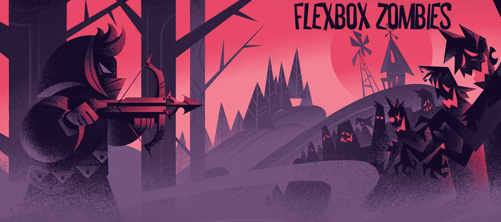
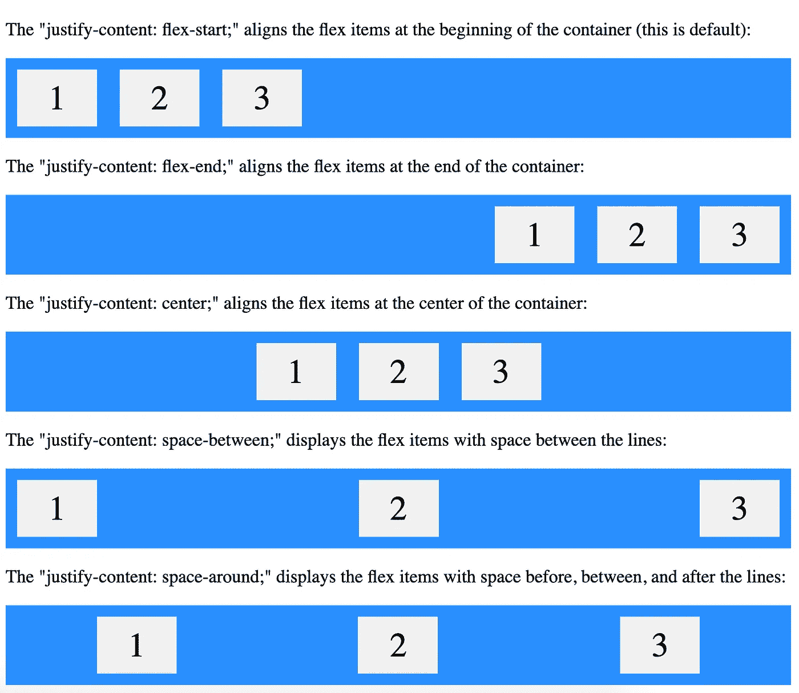
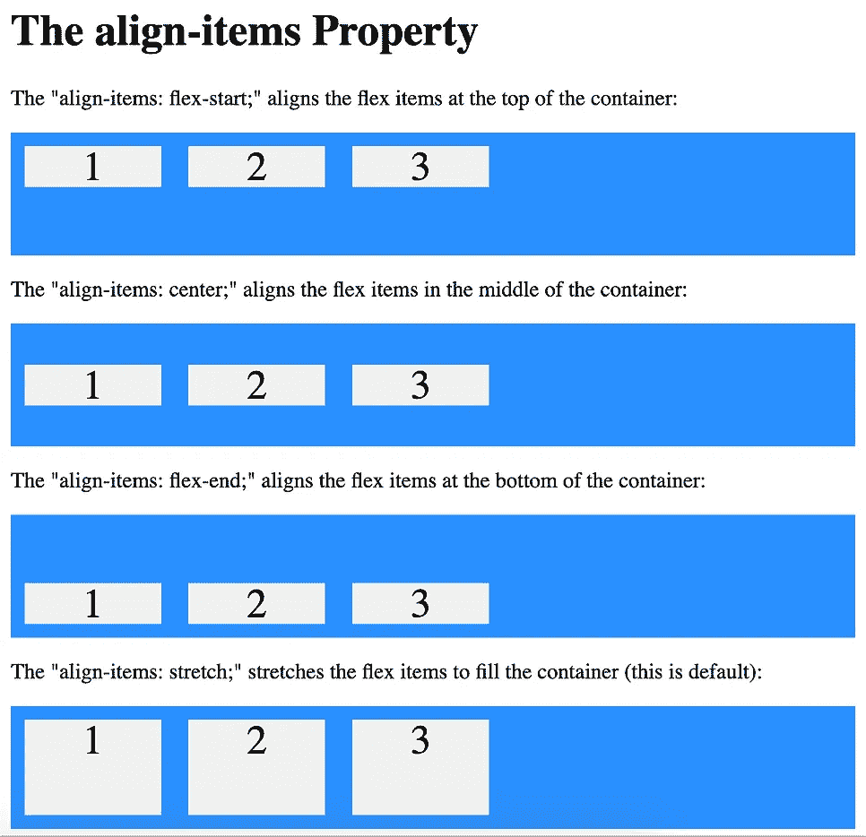
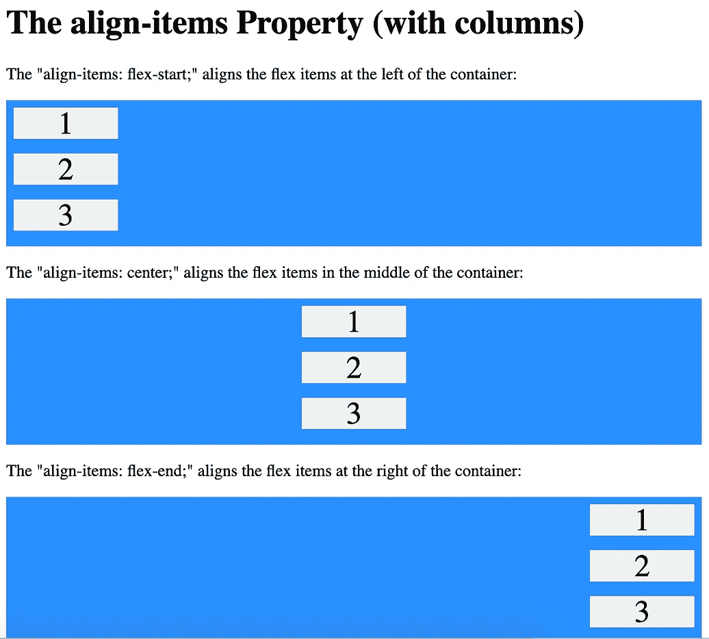

# CSS Flexbox:我从 Flexbox 僵尸身上学到了什么

> 原文：<https://levelup.gitconnected.com/css-flexbox-what-i-learned-from-flexbox-zombies-850b1f2f6d23>

Flexbox 僵尸

我开始玩一个叫 [Flexbox 僵尸](https://flexboxzombies.com/p/flexbox-zombies)的教育游戏，它一直在用有趣的方式教我 Flexbox 的基础知识。在游戏中，你通过使用 flexbox 的功能将你的十字弓瞄准僵尸来对抗僵尸。

[MDN 文档](https://developer.mozilla.org/en-US/docs/Learn/CSS/CSS_layout/Flexbox)将 [flexbox](https://developer.mozilla.org/en-US/docs/Web/CSS/CSS_Flexible_Box_Layout) 解释为:

> 按行或列排列项目的一维布局方法。项目伸缩以填充额外的空间，收缩以适应更小的空间。

flexbox 僵尸游戏通过一个故事来教授 flexbox，每个课程都建立在以前的基础上，从而以一种有趣而有效的方式强化 Flexbox 的基础。

以下是我到目前为止学到的步骤:

# 显示器:flex

这相当于打开了十字弓。

这导致父容器成为 **flex 容器**，其子容器成为 **flex 项目。**

这是通过在父元素中使用`display:flex;`实现的。

# 弯曲方向

这相当于将弩瞄准适当的方向。

`flex-direction`定义了项目所在的主轴。

如果未指定，默认为`flex-direction:row`。其他选项有`row-reverse`、`column`和`column-reverse`。

# 调整内容

*这对应于沿着红色的 justify 激光排列僵尸。*

`justify-content`控制项目在主轴内的间距(或`flex-direction`)。

如果未指定，默认为`justify-content:flex-start`。其他选项有`center`、`flex-end`、`space-between`、`space-around`。

证明 W3Schools 的内容解释

# 对齐-项目

*这对应于沿着蓝色校准激光排列僵尸。*

`align-items`控制项目在横轴或垂直于主轴的轴上的间距。

如果未指定，默认为`align-items:stretch`。这将填满对齐轴中的整个空间。其他选项有`center`、`flex-start`、`flex-end`。

W3Schools 的对齐项目说明

# 自我对齐

*这对应于处理任何不同于其他的单个比对。*

与前面提到的其他属性不同，`align-self`是在项目本身上指定的(与父元素相反)。与`align-items`选项相同:`stretch`、`center`、`flex-start`、`flex-end`。

[MDN 文档](https://developer.mozilla.org/en-US/docs/Web/CSS/align-self)说明:

> `**align-self**` CSS 属性覆盖 flex 项目的`align-items`值。

# 灵活增长

*这对应着丧尸越来越多占据了更多的空间。*

`flex-grow`确定伸缩增长因子，即当容器沿主轴增长时，项目将如何增长以填充所有可用空间的比率。`flex-grow`是在物品本身上指定的。

如果未指定，默认为`flex-grow:0`，这意味着即使父元素大小增加，该项也不会增加。给定父元素的空间，具有增长因子的项目将根据其`flex-grow`属性指定的比率增长以填充空间。

当一个项目的`flex-grow`属性的值大于 0 时，它将增长以填充所有空间(在主轴上),使得`justify-content`属性变得不必要。(除非有`flex-wrap`，不过这个我们以后再说。)

# 弯曲收缩

*这对应的是空间不够的时候丧尸会收缩。*

`flex-shrink`与`flex-grow`相似，只是它决定了父容器收缩时项目的收缩比率。`flex-shrink`是对物品本身的指定。

如果未指定，默认为`flex-shrink:1`。带有`flex-shrink:0`的物品无论如何都会保持尺寸不变，不会缩水。

由于它使用比率，将所有项目设置为`flex-shrink:1`与将它们都设置为`flex-shrink:2`或`flex-shrink:20`是一样的。

我还没完成游戏，课程里教的属性更多。如果你想继续和我一起学习，请查看[第 2 部分](/css-flexbox-part-2-what-else-i-learned-from-flexbox-zombies-c90a323b0ad)，在那里我讨论了我学到的更多 flexbox 属性。