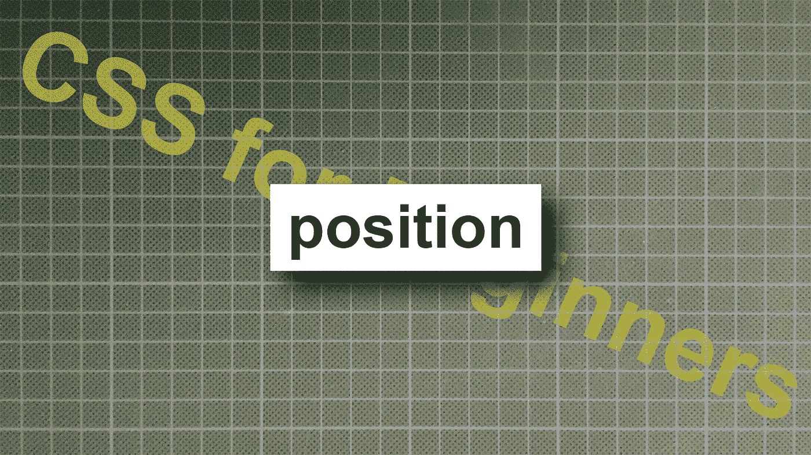
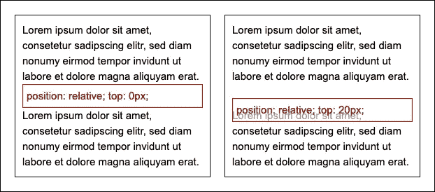
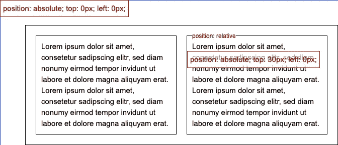
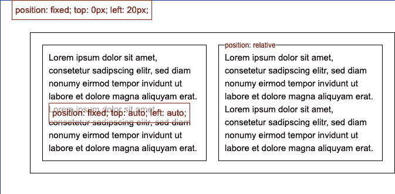
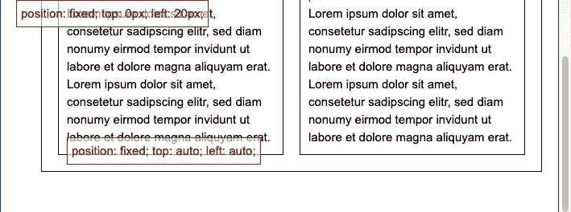
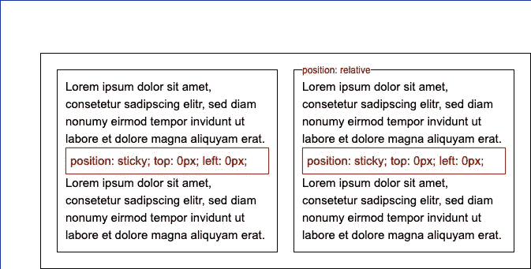
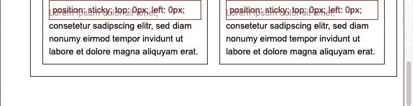
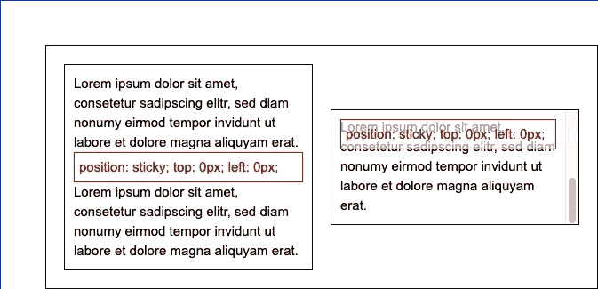

# 初学者 CSS:位置

> 原文：<https://levelup.gitconnected.com/css-for-beginners-position-4913ff17d1e5>

CSS 属性位置的解释



今天我将开始一系列 CSS 初学者的故事。在每一个故事中，我将向你展示一个 CSS 属性的解释和例子。

我先从`position`说起。如果一个元素有除静态之外的任何位置属性，它可以用属性 top、left、bottom、right 和 z-index 来定位。

`position`的值为:

*   位置:静态(默认)
*   位置:相对
*   位置:绝对
*   位置:固定
*   位置:粘性

# 静态

这是元素的默认值。顶部、左侧、底部、右侧和 z 索引属性对其没有影响。它位于文档的正常流程中。

# 亲戚



作者截图和代码

具有相对位置的元素停留在文档的正常流程中(参见左侧的红色块)。例如，如果 top: 20px，它将被移动到比正常位置低 20px 的位置，文档流中的空间将被保留，并且该元素位于下一个元素(右侧的红色块)之上。

# 绝对的



作者截图和代码

首先，让我们看看 HTML 代码:

```
<body>
  <div class="wrapper">
    <div class="text-block text-block-left">
      Lorem ipsum ...
      <div class="div-positioned">
        position: absolute; ...
      </div>
      Lorem ipsum ...
    </div>
    <div class="text-block text-block-right">
      Lorem ipsum ...
      <div class="div-positioned">
        position: absolute; ...
      </div>
      Lorem ipsum ...
    </div>
  </div>
</body>
```

该元素将从文档流中完全删除，并且不会在文档流中留下任何空间。

”。div-定位在“内部”。文字-区块-左侧”与正文相关(蓝色边框)；发生这种情况是因为它的父级没有特定的位置集。否则”。text-block-right”的位置设置为相对位置；所以”。div-定位在“内部”。文本-块-右“相关”。文本-块-右”。

# 固定的；不变的



作者截图和代码

固定元素与它们在文档流中的位置相关，不留空格，只要它们没有设置类似“顶部”、“左侧”、“底部”或“右侧”(左侧的红色块)的属性。如果设置了这些属性之一，则它们与视口相关。



作者截图和代码

当页面被滚动时，元素的位置被固定在视频上。

# 粘的



作者截图和代码

嗯，看起来像静态的，但现在让我们滚动页面:



作者截图和代码

元素现在停留在视口的顶部。



作者截图和代码

如果父元素是可滚动的，则该元素位于父元素之上。

我希望这能帮助你理解 CSS 定位的原则。如果你有任何问题，随时联系我。

编码快乐！