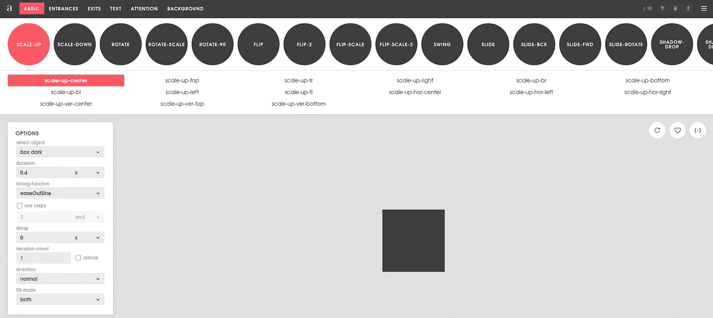
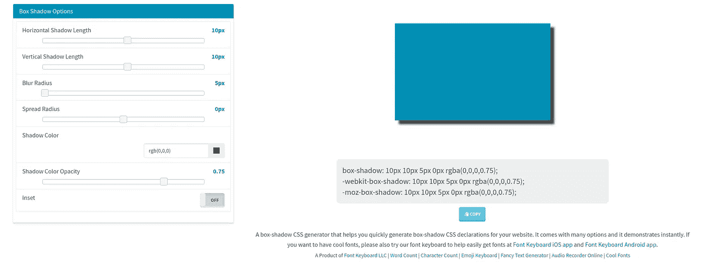

# CSS 生成器，让你的生活更轻松

> 原文：<https://levelup.gitconnected.com/css-generators-that-will-make-your-life-easier-cdd8e3dc564c>

潘卡杰·帕特尔在 [Unsplash](https://unsplash.com?utm_source=medium&utm_medium=referral) 上的照片

*你也可以在我的个人博客* [*这里*](https://shahednasserblog.tk/css-generators-that-will-make-life-easier/) *查看这篇帖子。*

无论你是一直从事 Web 开发，还是仅仅是一个初学者，使用 CSS 实现如此多的风格都是一件痛苦的事情。

为了让你的生活更容易，我已经编译了一个生成器列表，它会让 CSS 对你来说更好一些。

# [Animista](https://animista.net/)

[Animista](https://animista.net/) 帮助你在 CSS 中生成动画。它的可视化和各种选项让您放心，因为您可以依靠它来为您完成所有工作。即使你想要的动画很简单，少浪费点时间也是不错的。

# [盒子阴影 CSS 生成器](https://cssgenerator.org/box-shadow-css-generator.html)

这个生成器可以帮助你创建元素的阴影。它使用起来非常简单，而且有很大的帮助，尤其是对初学者。

# [CSS 三角形生成器](http://apps.eky.hk/css-triangle-generator/)

在使用 CSS 时，你必须学会的最烦人的事情之一可能是在元素的一边创建一个箭头，并且你不能逃避它。几乎每个网站都用。这个生成器使它更容易做到这一点，并节省你的麻烦。

# [CSS3 文本阴影生成器](https://css3gen.com/text-shadow/)

如果你需要创建一个文字阴影，但你不知道如何做，或者你只是懒得自己做，这个生成器可以帮助你！您可以在修改文本时看到它，因此选择您想要的样式并实现它会更容易。

# [起泡器](https://www.ilikepixels.co.uk/bubbler/)

Bubbler 帮助您轻松创建语音气泡。你可以从许多配置中选择，如颜色、大小、箭头位置等…

# [CSS 渐变](https://cssgradient.io/)

CSS 渐变对很多人来说都很难，不仅仅是创建它，还要让它看起来很舒服，并能跨浏览器工作。这个生成器可以让您随意使用颜色，直到找到适合您的渐变，并为您提供跨浏览器代码，让您放心。

# [酷派](https://coolors.co/d5b0ac-cea0ae-684551-402e2a-9cd08f)

这不是 CSS 特有的，但也很有帮助。对于很多人(包括我自己)来说，选择网站的颜色主题可能是一项艰巨的任务，很多时候会让我们想要完全放弃网站。Coolors 生成的调色板既现代又好看。您可以通过点击空格键轻松地在模式之间导航！

# [背景图像生成器](http://bg.siteorigin.com/)

SiteOrigin 为我们带来了一个创意工具，一定会让你的网站与众不同！通过他们的背景图像生成器工具，你可以用不同的图案和颜色为你的网站创建一个背景图像。尽管它们的最终结果是一个可以下载的图像，但这仍然比用 CSS 自己创建要好。

# [ZenBG](https://galactic.ink/bg/)

使用 ZenBG，你也可以生成不同颜色、图案和特征的背景图像，然而，它有一些额外的功能，使它也很好。首先，你可以加载你的网站并实时编辑它，看看它会是什么样子。这比不得不把 CSS 复制到你的网站上，然后一直来回复制，直到你做对为止要好。它的另一个好处是你可以选择渐变。此外，您可以选择获取 CSS 代码或下载图像形式的壁纸。

# [CSS 媒体查询生成器](https://simplecss.eu/)

对于每个还在努力正确处理媒体查询并为不同设备提供支持的人来说，这个生成器可以帮助你！您可以选择手机、笔记本电脑或台式机等设备类型，但也可以选择 iPhone 6s 等特定设备。他们的设备数据集有点过时，但在很多情况下仍然有用。

# 结论

你觉得这些发电机有用吗？你使用这里没有提到的其他发电机吗？在下面的评论中提到他们吧！