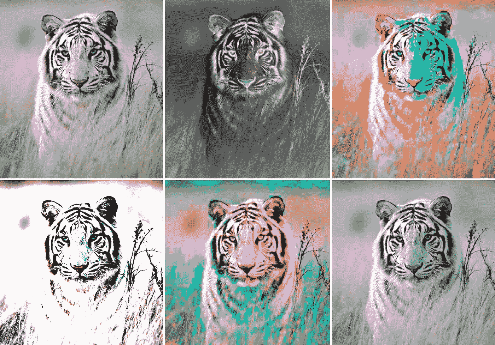

# CSS 图像过滤器

> 原文：<https://levelup.gitconnected.com/css-image-filters-e549271864f7>

为 t̶h̶e̶ ̶'̶g̶r̶a̶m̶做你的网络应用。



当你第一次听到“滤镜”这个词时，我打赌首先想到的是 Instagram 滤镜，它让人看起来像是刚刚从*《Vogue》*或*《GQ》*的封面上走下来。或者 Snapchat 过滤器把你变成一只去科切拉的狗。这个博客不是关于如何成为一个社交媒体的影响者。我说的其实是 CSS 图像滤镜。是的，我们可以使用 CSS 将迷人和时尚的效果融入到我们的应用程序的图像中，我将带您浏览每个过滤器。

所有主流浏览器(Chrome、Safari、Firefox)都支持这些图像过滤器，除了 Internet Explorer(这怎么还是一件事呢？).

我们可以使用 9 种过滤器:

1.  灰度()
2.  棕褐色()
3.  模糊()
4.  反转()
5.  不透明度()
6.  饱和()
7.  对比度()
8.  亮度()
9.  色调-旋转()
10.  投影()

在所有这些方法中，我们将对 Chrome 和 Safari 使用`-webkit-filter`，对 Firefox 使用`-moz-filter`。

## **灰度**

```
.grayscale {
  filter: grayscale(1);
    -webkit-filter: grayscale(1);
    -moz-filter: grayscale(1);}
```

灰度从图像中移除颜色。传入的值是您想要的灰色效果的数量。它以百分比或小数的形式输入，其中 0%或 0 没有变化，1 或 100%完全是灰度。

灰度过滤器

## 乌贼的墨

```
.sepia {
  filter: sepia(1);
    -webkit-filter: sepia(1); 
    -moz-filter: sepia(1)
}
```

另一个众所周知的过滤器。棕褐色给你的图像一种“老化”的效果。该值的格式为百分比或小数，其中 0%或 0 表示无变化，1 或 100%表示完全棕褐色。

棕褐色过滤器

## 虚化

```
.blur {
  filter: blur(2px);
   -webkit-filter: blur(2px);
   -moz-filter: blur(2px)
}
```

模糊对图像产生高斯模糊效果。有趣的事实:高斯分布是正态分布(回到高中数学！).该值是高斯函数的标准偏差。换句话说，它指的是有多少屏幕像素混合在一起，因此较大的值将创建更多的模糊，0 表示没有变化。

模糊滤镜

## 转化的

```
.invert {
  filter: invert(.9);
    -webkit-filter: invert(.9); 
    -moz-filter: invert(.9)
}
```

反转将图像的所有颜色值设置为色轮上的相反值。白色变成黑色，绿色变成紫色，橙色变成蓝色。值被格式化为百分比或小数，其中 0%或 0 没有变化，1 或 100%将完全反转图像。

反转过滤器。恶魔小猫😈

## 不透明

```
.opacity {
  filter: opacity(.5);
    -webkit-filter: opacity(.5); 
    -moz-filter: opacity(.5)
}
```

设置您想要的图像透明度。值被格式化为百分比或小数，其中 0%或 0 是完全透明的，1 或 100%没有变化。

不透明度滤镜

## 饱和的

```
.saturate {
   filter: saturate(10);
    -webkit-filter: saturate(10); 
    -moz-filter: saturate(10)
}
```

饱和增加图像中颜色的强度。值的格式为百分比或小数。0%或 0 表示“不饱和”，导致灰色效果。1%或 100%没有变化。任何超过 1%或 100%的值都会产生“过饱和”效果。

饱和过滤器

## 对比

```
.contrast {
   filter: contrast(4);
    -webkit-filter: contrast(4); 
    -moz-filter: contrast(4)
}
```

对比度是图像中不同色调的视觉比率。这种差异决定了图像的纹理、高光、阴影、颜色和清晰度。值 0 或 0%将创建一个灰色的图像。1%或 100%的值没有变化。数量值超过 1%或 100%会增加对比度。

强反差滤光镜

## 聪明

```
.brightness {
   filter: brightness(2);
    -webkit-filter: brightness(2); 
    -moz-filter: brightness(2)
}
```

亮度滤镜将使您的图像变亮或变暗。该值的格式为百分比或小数，其中 0%或 0 为黑色，1 或 100%没有变化。大于 1%或 100%的值会使图像变亮。

亮度过滤器

## 色调-旋转

```
.hue-rotate {
   filter: hue-rotate(270deg);
    -webkit-filter: hue-rotate(270deg); 
    -moz-filter: hue-rotate(270deg)
}
```

色调旋转考虑色轮。该值是一个角度或度数测量值，表示如何根据色轮调整图像的颜色。0 表示无变化，接受最大值 360 度。

色调旋转滤镜。粉眼睛超赞。

## 投影

```
//syntax
drop-shadow(*offset-x* *offset-y* *blur-radius* *spread-radius* *color*).shadow {
  filter: drop-shadow(16px 16px 10px red);
   -webkit-filter: drop-shadow(16px 16px 10px red);
   -moz-filter: drop-shadow(16px 16px 10px red);
}
```

投影滤镜创建一个模糊的偏移阴影，它符合图像的形状。效果显示在图像后面，颜色可以应用于它。

这个过滤器的语法比其他的稍微复杂一些。

*   `offset-x` `offset-y`(必需)→确定阴影偏移的两个`[<length>](https://developer.mozilla.org/en-US/docs/Web/CSS/length)`值。`offset-x`是水平距离，负值将阴影放置在元素的左侧。`offset-y`是垂直距离，负值表示元素上方的阴影。如果两个值都是`0`，阴影正好在图像后面。
*   `blur-radius`(可选)→阴影的模糊半径，指定为`[<length>](https://developer.mozilla.org/en-US/docs/Web/CSS/length)`。值越大，阴影越大，越模糊。如果未指明，则默认为`0`，产生清晰、不模糊的边缘。
*   `spread-radius`(可选)→阴影的扩散半径，指定为`[<length>](https://developer.mozilla.org/en-US/docs/Web/CSS/length)`。正值会让阴影扩大，负值会让阴影缩小。如果未指定，则默认为`0`，阴影将与图像大小相同。
*   颜色(可选)→阴影的颜色

投影滤镜

## 多重过滤器

您可以使用多个滤镜并将它们链接在一起用于一个图像。请记住，过滤器*的顺序与*无关。

我称这个过滤器为“小美人鱼”

现在你已经拥有了 CSS 滤镜的魔力，你可以尝试开发你自己的自定义滤镜了！再见，克拉伦登和朱诺，做一个原创！

感谢阅读！回头见，✌️❤️