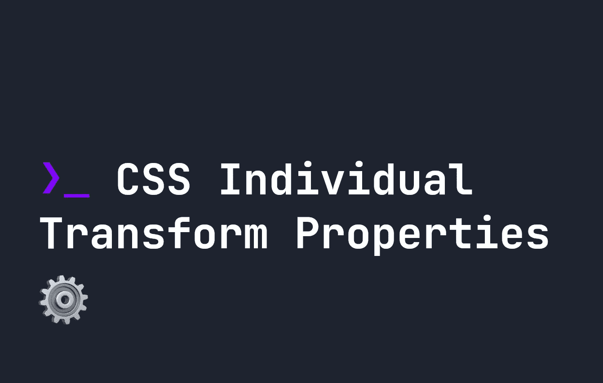

# CSS 单个变换属性

> 原文：<https://levelup.gitconnected.com/css-individual-transform-properties-e9325b01beeb>



CSS 变换是一种在 CSS 中转换、旋转和创建 3d 对象的有用方法。我在前面的[中介绍了 CSS 转换是如何工作的](https://fjolt.com/article/css-transformations)，我还创建了一个 [3d《我的世界》鸡](https://fjolt.com/article/css-minecraft-chicken)来展示你如何使用它们来制作 3d 动画对象。

在这个简短的指南中，我想介绍一下最近 CSS 对 CSS 转换做了一些改变。以前，语法有点混乱。如果我们想沿着 X 轴平移某个东西并旋转它，我们必须这样做:

```
div {
    transform: rotateX(45deg) translateX(40px);
}
```

这很好，但它让动画中的各种问题。例如，考虑下面的 CSS:

```
div {
    transform: rotateX(45deg) translateX(40px);
}
div:hover {
    transform: rotateX(75deg);
}
```

事实上，这不仅仅是在 X 轴上旋转`75deg`。它还将`translateX`重置为`0px`。这个**可能**没问题，但是问题是你必须重新声明`translateX`仍然是`40px`:

```
div {
    transform: rotateX(45deg) translateX(40px);
}
div:hover {
    transform: rotateX(75deg) translateX(40px);
}
```

为了解决这个问题和其他问题，CSS 引入了专用的转换属性，假设您不需要支持 Internet Explorer 或某些移动浏览器，这些属性现在享有广泛的浏览器支持。

主要浏览器对 mdn-css__properties__rotate 特性的支持数据

# 单个 CSS 转换属性

现在可以在 CSS 中使用的属性有:

*   `scale`
*   `translate`
*   `rotate`

每一个都接受不同的值。

**对于标尺**，当`scale`有一个值时，它同时代表`scaleX`和`scaleY`。2 个值是指为`scaleX`和`scaleY`设置不同的值，第三个值代表`scaleZ`。例如:

```
div {
    scale: 2; /* scales x and y by factor of 2 */
    scale: 2 1.5; /* scales x by factor of 2, and y by factor of 1.5 */
    scale: 2 1.5 3; /* scales x by factor of 2, y by factor of 1.5, and z by a factor of 3 */
}
```

**对于旋转**，单个值表示绕`z`轴旋转。如果我们想在另一个方向旋转，我们只需添加我们想要旋转的字母。如果我们想在多个方向上旋转，我们传入一个像`1 1 1`这样的方向向量和我们想要使用的角度，功能与`rotate3d`相同。

```
div {
    rotate: 45deg; /* Rotate 45deg along z axis */
    rotate: 1 1 2 45deg; /* Rotate 45deg across a directional vector of [1, 1, 2] */
    rotate: x 45deg; /* rotate individually along x axis by 45deg. */
}
```

**对于翻译**，单个值将代表`x`翻译，两个值将代表`x`和`y`翻译，第三个值代表`z`翻译。

```
div {
    translate: 5px; /* Translate x by 5px */
    translate: 5px 10px; /* Translate x by 5px, and y by 10px */
    translate: 5px 10px 15px; /* Translate x by 5px, y by 10px, and z by 15px */
}
```

# 单个 CSS 转换属性的好处

这些新的属性减少了一些最常用的转换属性以前处理转换的混乱方式。像这样复杂的转变:

```
div {
    transform: scale(2) translateX(45px) translateY(20px) rotate(45deg);
}
```

可以简化为:

```
div {
    scale: 2;
    rotate: 45deg;
    translate: 45px 20px;
}
```

# 结论

这些单独的 CSS 属性简化了曾经令人困惑的长行 CSS 转换。它们不会取代`transform`属性，因为它支持像`skew`这样没有单独属性的函数。然而，它们确实大大提高了 CSS 的可读性。