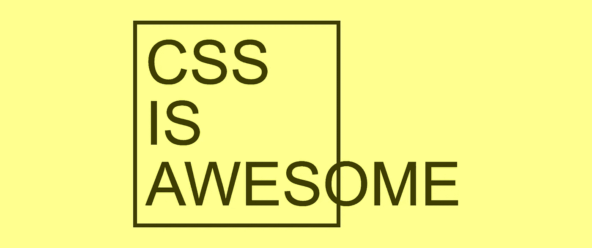

# CSS 面试练习

> 原文：<https://levelup.gitconnected.com/css-interview-exercise-b1dd449fa7de>



## 一套 HTML+CSS 面试的问题…还有为什么我不再问了。

我之前工作的任务之一是面试网站开发职位的候选人。我特别关注 HTML、CSS 和 Web 可访问性，因为我知道另一位面试官专门研究 JavaScript 和算法。

我们的项目专注于样式(和可访问性)，CSS 是一个重要的工具。因此，这种语言的高级知识将使候选人成为该角色的理想人选。

在转向更健康(在我看来，更复杂)的 web 开发面试问题集之前，我曾经有过一系列基于以下代码的问题(一个半开玩笑的 CSS 笑话片段，其文本“CSS 真棒”溢出了一个框):

```
<div>
  CSS
  IS
  AWESOME
</div><style>
div {
  border: 1vmin solid;
  box-sizing: border-box;
  font-family: Arial, sans-serif;
  font-size: 15vmin;
  min-height: 51vmin;
  line-height: 15vmin;
  padding: 2vmin;
  width: 51vmin;
}
</style>
```

你可以在这个 CodePen 演示上运行:

分享完代码后，我会从这个问题开始，“ ***你会如何避免水平溢出？*** “注意，这是一个有多种可能性的开放式问题。候选人可以选择许多不同的回答方式:

*   扩展框的宽度；
*   扩展盒子的高度；
*   破“牛逼”二字；
*   缩小文本尺寸；
*   隐藏溢出；
*   使用省略号等隐藏溢出。

答案没有对错之分，根据情况，我们可以问一些关于其他人的后续问题:

*   如果候选人水平延伸方框，我会接着说，“*太好了！* ***我们要保持宽度不变，只允许垂直溢出*。**”
*   如果他们垂直展开盒子:“*太好了！但是，* ***如果我们不能垂直溢出，但是我们可以水平溢出或者根本不溢出，那会怎么样呢？***
*   如果他们隐藏溢出或者使用省略号:"*太好了，* ***你能想出一个方法让所有文本都可见吗？***

这样，我们可以一次涵盖多个主题，而且由于没有错误的答案，这可以提高候选人的士气，使他们能够更自信地回答下面的问题。

下面这个问题是一个经典问题，每个从事 CSS 工作的人都应该能够很快回答: ***你将如何在屏幕上居中显示这个框？*** 再次，另一个未决问题。考生想加多少 CSS/HTML 都可以。我让他们垂直居中，水平居中，或者两者都居中，但我还是要求两者都居中。

…然后是后续问题:

*   假设考生多加了 HTML:“*好！* ***你能想象出一种不用添加更多 HTML 就能做到的方法吗？***
*   而如果他们用绝对定位:“*好看。* ***你会怎么用 FlexBox 或者 Grid 来做？*** ”
*   如果候选人使用了 Flex(或 Grid): " *太好了！你用过 Grid(或者 FlexBox)吗？* ***使用网格(或 Flex)会是怎样的情况？***
*   或者更一般的:“*太好了。你能想象出做这件事的不同方法吗？*”

我向大多数人展示了中心内容问题，他们同意在这一点上它应该是“基本”的东西。但是有趣的是，只有一个候选人在没有指导的情况下做对了。不过，没什么可怕的。他们中的大多数人能够应用标准的 Flexbox 解决方案，这些解决方案在网上随处可见。尽管如此，他们还是被卡住了，因为这种解决方案要求容器有一个高度(这通常是那些在线帖子没有提到的)。)一个小小的推动让他们意识到了这一点，最终他们解决了这个问题。

最后，如果有时间，我问了一些一般性的 CSS 问题:

*   **什么是盒子模型？**这个问题引出了其他的盒子模型问题，比如边距、边框、填充等等。
*   **什么是盒子大小属性？**你还知道哪些价值观？
*   **什么是 vmin？还知道其他 CSS 视口单位吗？**(注意，演示使用了 vmin 单位。)

这一系列问题是我第一次想出这样的练习，我认为它是完整的，因为它回顾了 CSS 的许多关键部分，这应该是任何 Web 开发人员的基本知识:

*   配置
*   FlexBox 和网格
*   转换
*   盒子模型
*   文本属性
*   CSS 单位

但是，当我通过[博客](https://alvaromontoro.com/blog/67850/css-interview-questions-feedback)或 Twitter 与更多人分享这个练习时，**许多评论者强调这些问题太复杂了**。我并不完全同意，但如上所述，最终我从这一系列问题转向了更完整的问题*(“编写一个简单的搜索框组件”)。*

*考虑到这是一个针对有 2-5 年 web 开发经验的候选人的面试问题，你有什么看法？你认为它太简单了还是太复杂了？你会添加/删除什么来使它变得更好？*

# *分级编码*

*感谢您成为我们社区的一员！在你离开之前:*

*   *👏为故事鼓掌，跟着作者走👉*
*   *📰在[级别提升编码](https://levelup.gitconnected.com/)中查看更多内容*
*   *🔔关注我们:[Twitter](https://twitter.com/gitconnected)|[LinkedIn](https://www.linkedin.com/company/gitconnected)*
*   *🚀👉 [**软件工程师的热门职位**](https://jobs.levelup.dev/)*