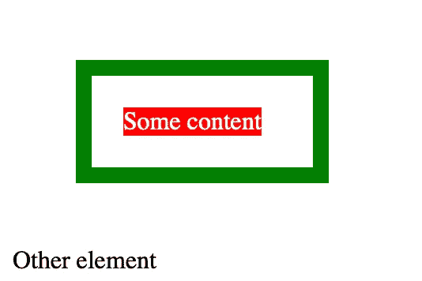
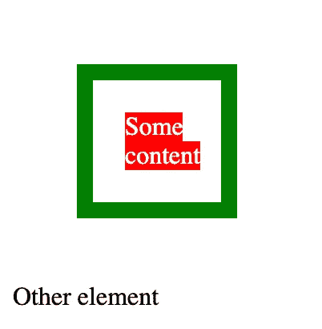

# CSS 面试问题:什么是盒子大小？

> 原文：<https://levelup.gitconnected.com/css-interview-question-what-is-box-sizing-954262431b63>

[Erda Estremera](https://unsplash.com/@erdaest?utm_source=unsplash&utm_medium=referral&utm_content=creditCopyText) 在 [Unsplash](https://unsplash.com/s/photos/box?utm_source=unsplash&utm_medium=referral&utm_content=creditCopyText) 上拍摄的照片

使用 CSS 进行样式化可能不是您最喜欢的 web 开发部分(或者可能是，我不做判断)，但这是无可避免的。虽然我们都非常熟悉简单的属性，如 *color* 或 *font-size* ，但有些样式属性更神秘。试图理解为什么两个元素应该对齐或不对齐会导致一些严重的头痛。对这些鲜为人知的属性有更好的了解可以让你省去很多谷歌搜索，这在面试中会有很大的不同。

那么什么是`box-sizing`？

> 框大小 CSS 属性设置如何计算元素的总宽度和高度。

这到底是什么意思？

# 填充、边距和边框

HTML 元素可以被认为是一个盒子。在这个框的周围，你可以用`border`属性画一个边框。然后你可以定义你的盒子周围应该保留多少空间，基本上就是边框和任何其他元素之间的距离。这是`margin`的财产。最后，您可以决定边框和元素内容之间应该有多大的间距。这是`padding`属性。

在下面的例子中，您可以看到一个非常粗的绿色边框。在这个边框和红色背景的内容之间，我们添加了一个 20 像素的填充。我们还定义了一个 40 像素的边距，这意味着没有任何元素能比 40 像素更接近我们的边界。

你可能已经注意到了 CSS 中的`width: 100px`，它可能已经引发了一个问题:100 像素宽应该是多少？内容还是带有填充和边框的框？这实际上取决于`box-sizing`属性的值。

# 盒子尺寸

属性让你定义当计算一个元素的宽度和高度时应该考虑什么。它只有两个可能的值:`content-box`和`border-box`。

默认情况下，`width`和`height`属性只应用于元素的内容，在我们的例子中是红色的`span`。这是当`box-sizing`属性的默认值为`content-box`时的情况。然后将填充和边框添加到宽度上，使完整的元素通常大于您用`height`和`width`属性定义的元素。

另一方面，如果将`box-sizing`属性设置为`border-box` ，那么整个元素及其填充和边框都将被调整大小(不考虑边距)。在我们的例子中，绿色框的宽度为 100 像素，因此要小得多:

使用`box-sizing`属性，您可以决定在调整元素大小时要考虑什么——是内容还是整个框及其填充和边框。了解它可能会帮助您解决在调整元素大小和对齐元素时遇到的棘手问题。您可以查看以下链接了解更多详细信息:

 [## 盒子尺寸

### 默认情况下，在 CSS box 模型中，分配给元素的宽度和高度只应用于元素的内容…

developer.mozilla.org](https://developer.mozilla.org/en-US/docs/Web/CSS/box-sizing)