# CSS 很神奇，是时候试试 3D 了

> 原文：<https://levelup.gitconnected.com/css-is-magic-its-time-you-try-3d-91a2dd49c781>

## Web 开发| CSS |前端

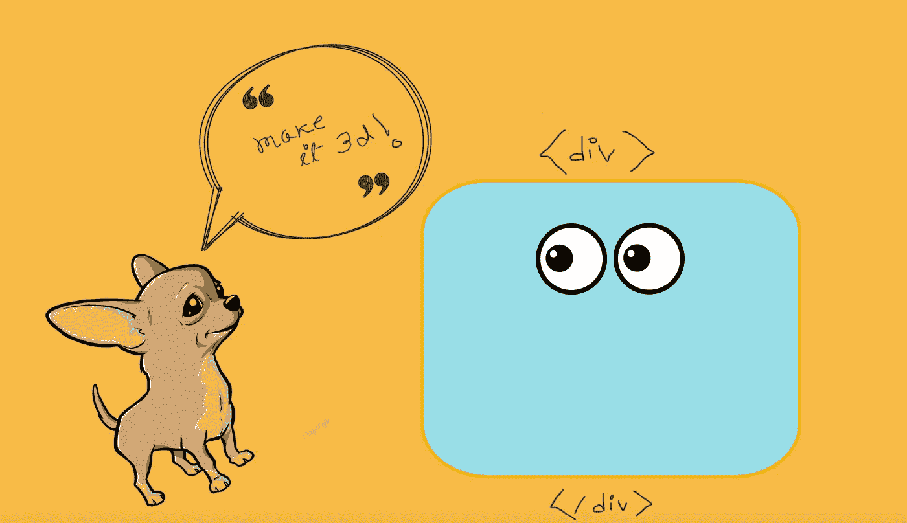

狗狗插画:[支线](https://www.subpng.com/)，眼睛: [pngegg](https://www.pngegg.com)

**CSS 变换**是 CSS 最通用、最神奇的属性之一。这不仅是在你的网站上实现平滑动画的最佳方式，而且你可以用 **CSS 3D 变换创造奇迹。**
像这样的🙀 —

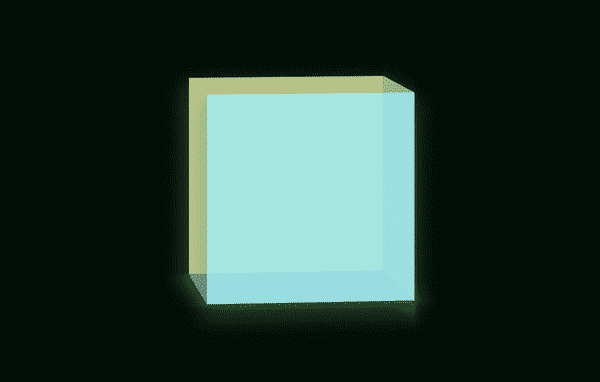

CSS 3D 立方体！

> 我提前为几个 gif 吃掉你的网络带宽道歉，但我希望这是值得的！🤜🤛

但是等等，立方体的两个面不见了！！！我故意这样做，以便更容易理解和形象化。我会在文章的最后添加一个链接，链接到获得上述结果的完整代码！

## 首先，翻译是如何工作的？

`translate`方法基本上将一个 HTML 元素从它的实际位置移开，而不会干扰布局树上的任何其他兄弟/父元素。总而言之，`translateX`方法将元素左右移动，而`translateY`方法将元素上下移动。

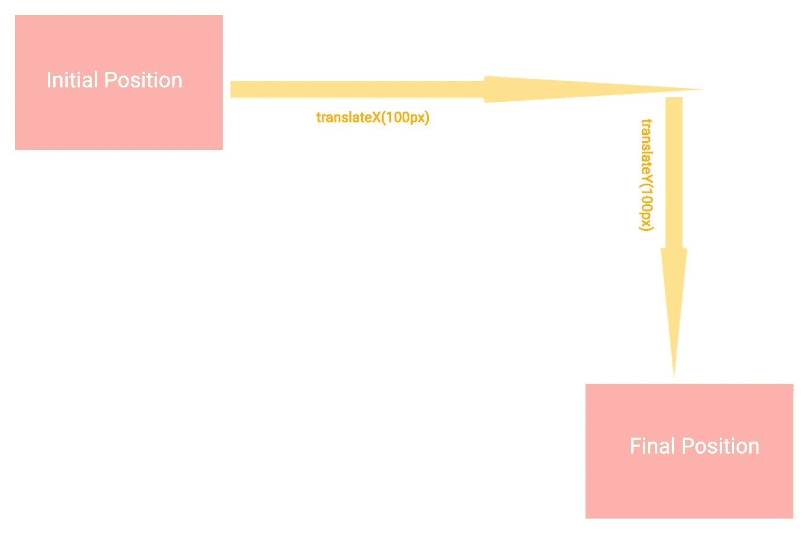

平移如何在 X 和 Y 轴上工作

## 但是 Z 轴到底是什么？

为了形象化`translate`如何沿着 Z 轴工作，想象你的 div 向你移动或者远离你，而不是在屏幕上上下左右移动——

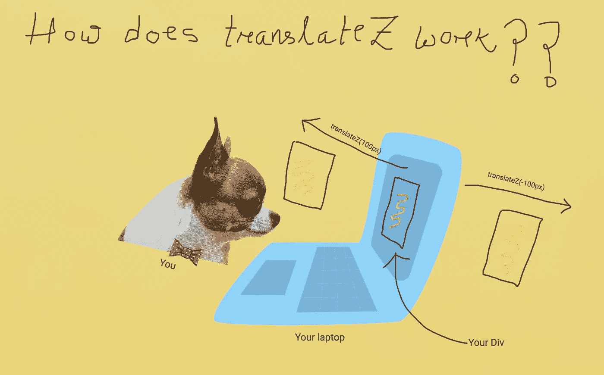

沿 Z 轴平移

这怎么可能呢？一个网站被看作是一本书的一页，对吗？怎么可能会有东西从屏幕里出来朝向你(或者，远离你)？

你的`div`显然不会真实地出现，它会给你一种它会出现的感觉。让我们并排检查一下沿不同轴改变`translate`值的效果—

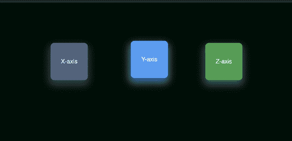

我不知道你是怎么想的，但是这个绿色的盒子看起来不像是在向我走来或者离开我。👺

我们如何解决这个问题？我们需要稍微改变一下我们*的视角。😉*

## *CSS 透视属性*

*如果不设置正确的`perspective`值，您将无法直观地检测 Z 轴的变化。*

> *`perspective`属性定义了对象离用户有多远。因此，较低的值会比较高的值产生更强烈的 3D 效果。*
> 
> *来源— [W3 学校](https://www.w3schools.com/cssref/css3_pr_perspective.asp)*

*让我们将下面的 CSS 添加到三个盒子的父元素中—*

*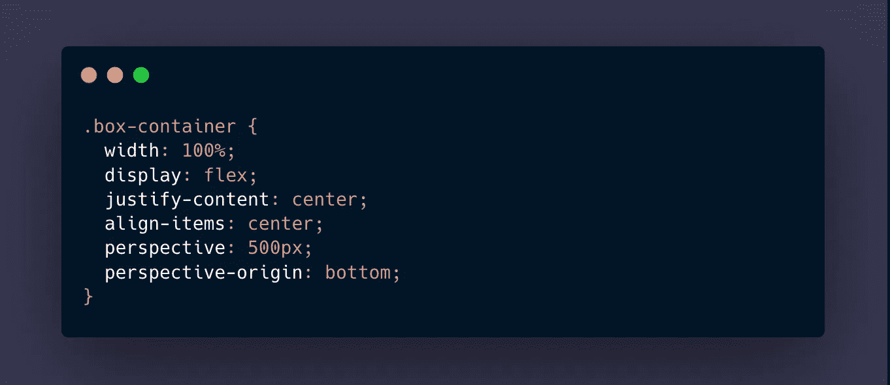*

*然后，*瞧，* —*

*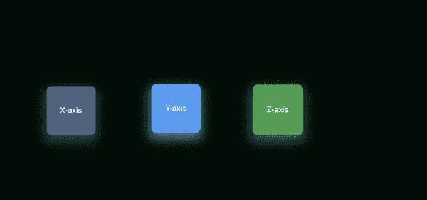*

## *该旋转方法*

*顾名思义，`rotate`通过给定度数，沿着三个轴中的一个轴旋转元素来工作。然而，我们需要一些关于旋转如何沿着不同的轴工作的可视化。*

*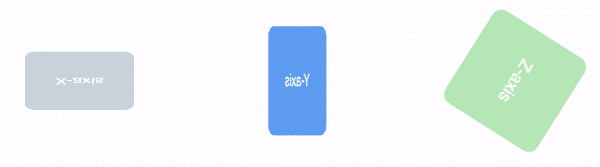*

*没有透视的不同轴的旋转*

*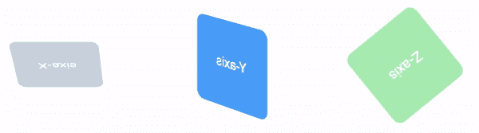*

*透视下不同轴的旋转*

## *立方体*

*让我们最后从立方体的侧面开始吧！我们将有四个面——底部、前部、后部和左侧——*

*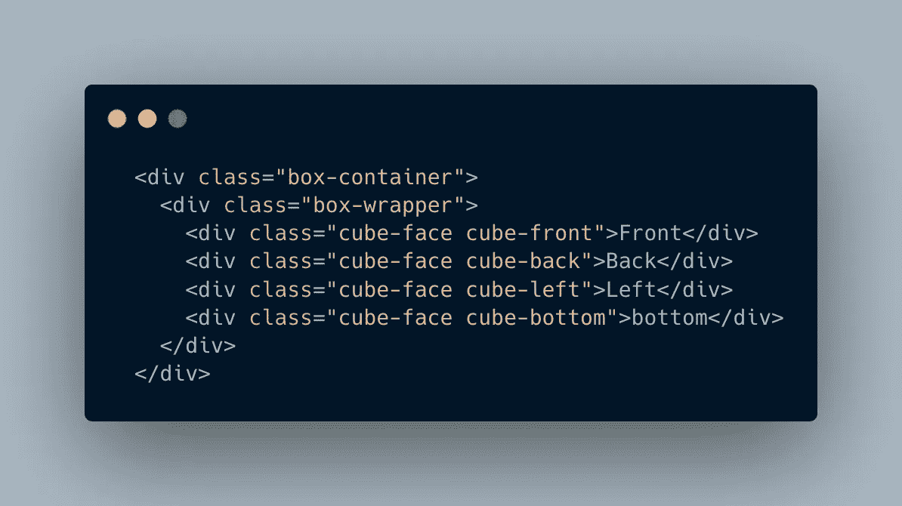*

*我还在立方体的主包装器中添加了一些 CSS。*

*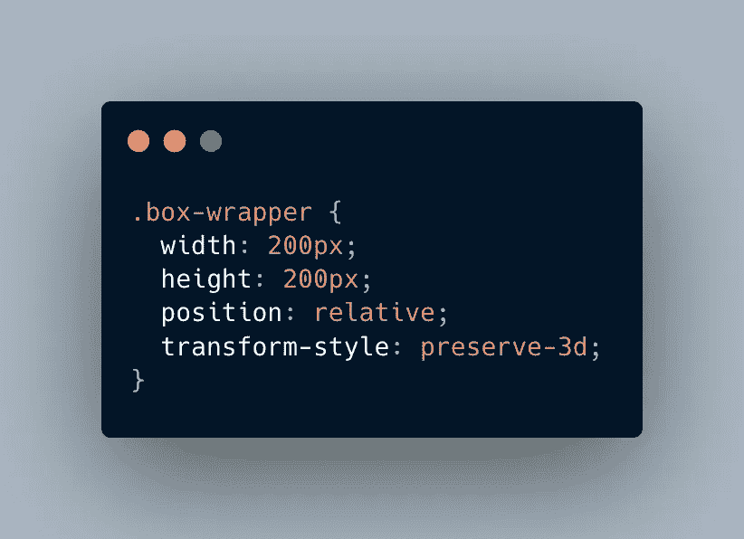*

*注意，我已经将`transform-style: preserve-3d;`添加到容器中。这是渲染 3D 孩子的关键一步。每个面的宽度和高度都是`200px`，我们需要记住这个值，因为我们将不得不添加与侧面尺寸相关的`translate`值。*

*对于我们的立方体，每个面都将是一个绝对的分割，我已经添加了文本来指示它是哪个面。我给每张脸都加了`opacity: 0.5`，这样重叠部分就很清楚了*

*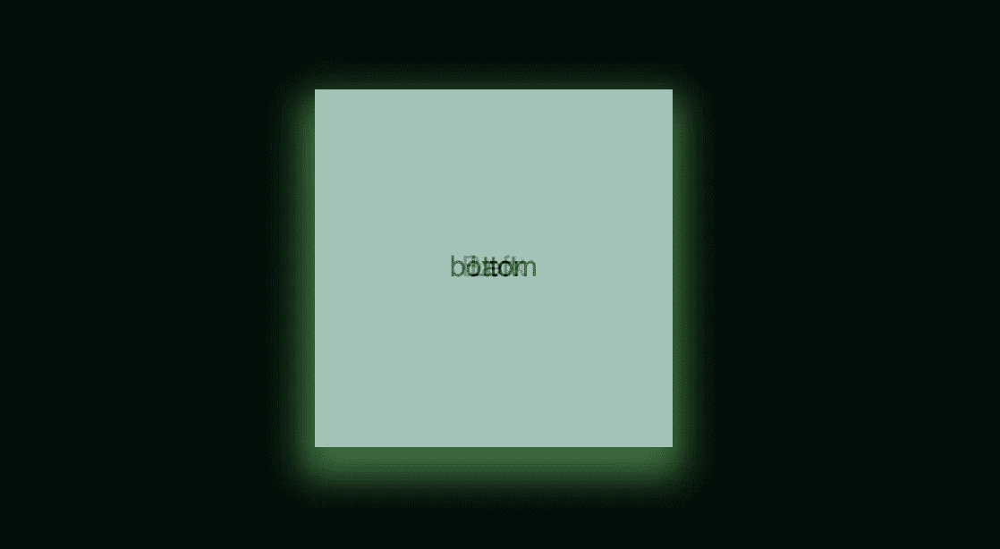*

*为了将正面带到前面，我们给它添加了`translateZ(100px)`。*

*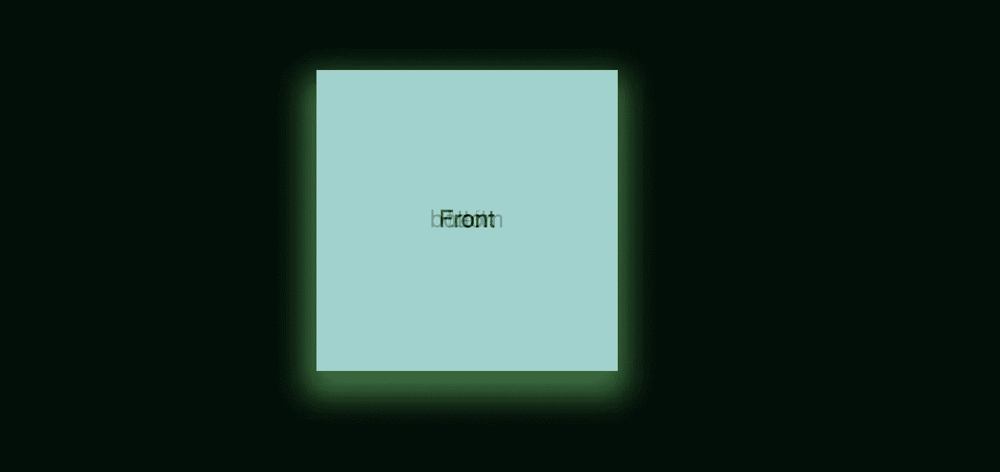*

*嗯，看起来是这样的。🙁*

*那么如何才能让这个 3D- *ish* ？我们的`perspective`知识在这里派上了用场。*

*将这个 CSS 添加到我们的外部—*

*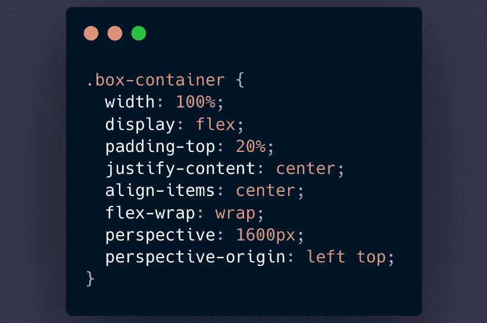*

*还有，让我们把背面倒过来。因此，我们将添加与前面相反的东西。*

*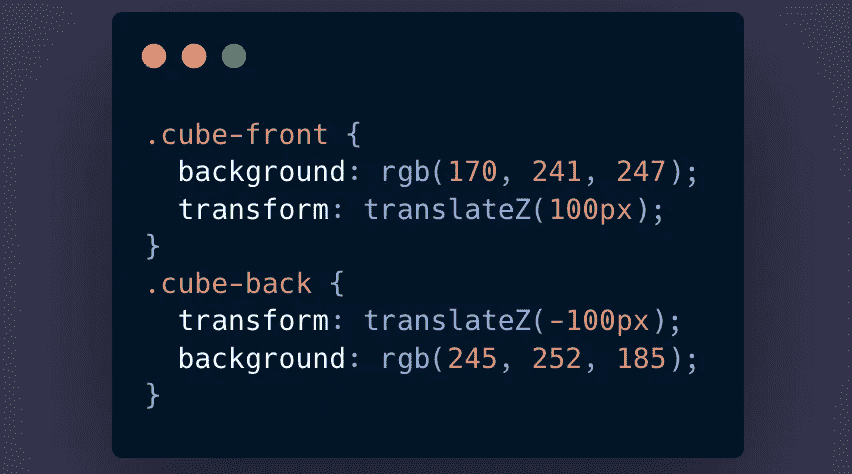*

***结果—***

*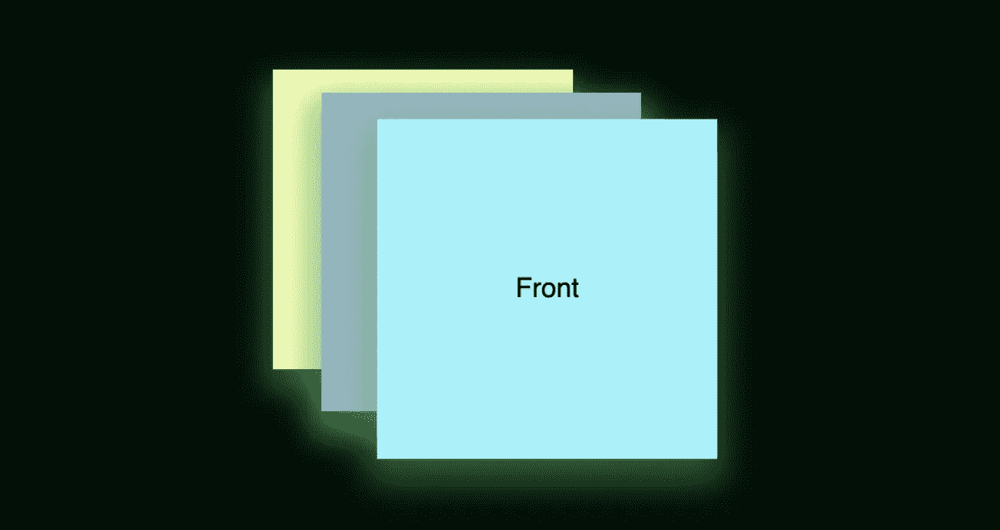*

*你能想象前面的脸向你走来，后面的脸(黄色的)离开吗？如果还是不够直观，让我们试着旋转一下立方体包装*

*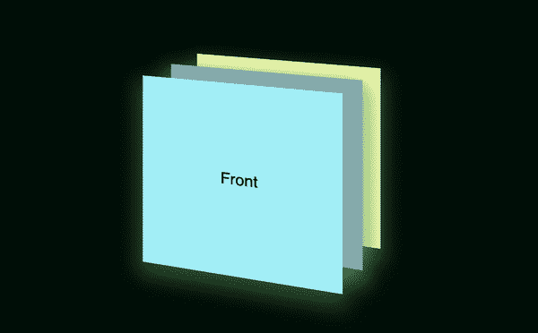*

*令人惊奇不是吗？*

*接下来，我们需要修复底面💁‍♀️.为了将底面放置到位，我们将沿着 X 轴将其旋转 *90 度**

*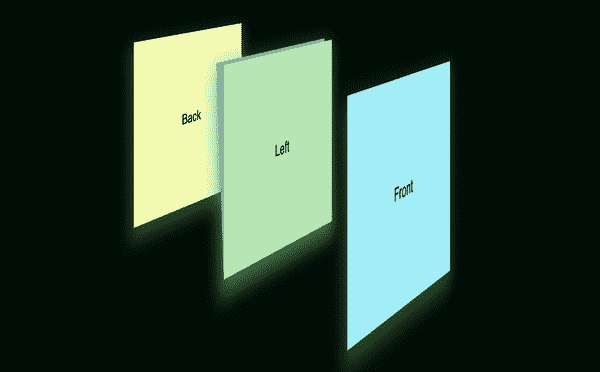*

*我们还必须移动它的位置，使它正好位于立方体的正面和背面之间。我们能做的是，移动底面与正面成一直线，然后旋转它。听起来很困惑？*

***步骤— 1:将底面与正面对齐***

**CSS—**

*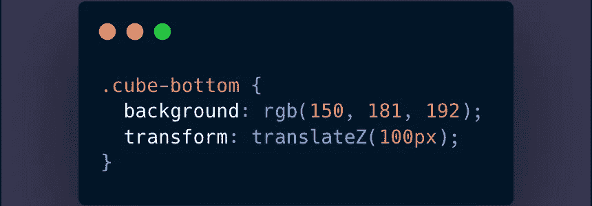*

*将底面与正面对齐*

**结果—**

*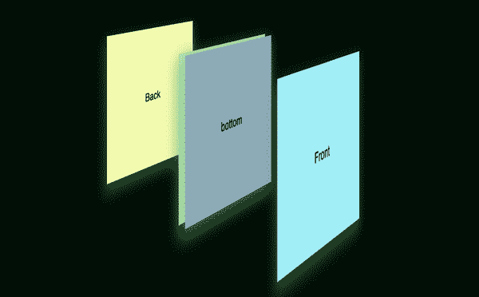*

*将底面与正面对齐*

***第二步:将底面旋转 90 度***

**CSS—**

*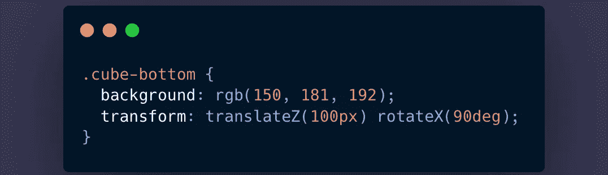*

*结合底面的旋转和平移*

**结果—**

*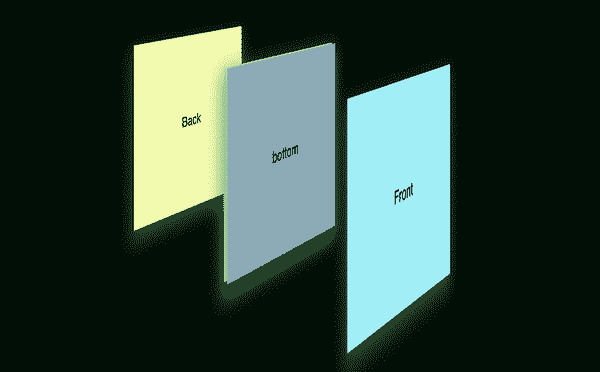*

*结合底面的旋转和平移*

*底面现在在其位置上是安全和完好的。但是左脸卡在中间了。🙍‍♀️:首先，我们需要把它移到一边，然后旋转它。让我们在 X 轴上移动 *-100px* ，然后在 Y 轴上旋转。*

*CSS —*

*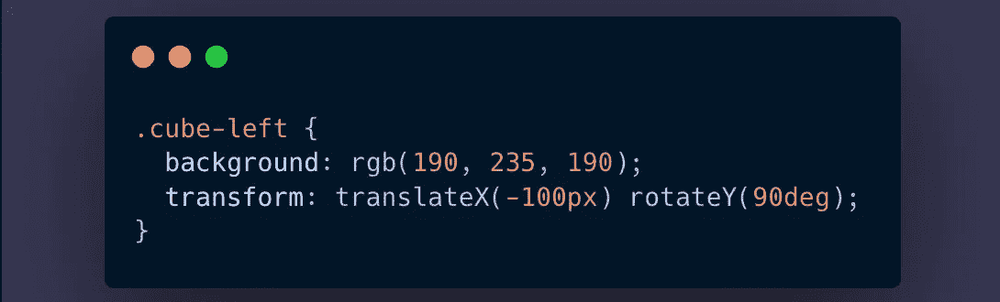*

**结果**

*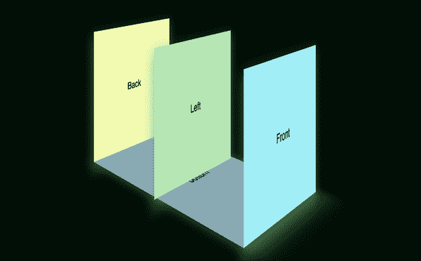*

*然后*瞧*！我们的*快完成了。我建议你在每个轴上使用不同的平移和旋转值，并尝试添加顶部和右侧的轴来制作一个完整的立方体。**

*现在，最后但并非最不重要的，让我们旋转我们的立方体😍*

**CSS* —*

*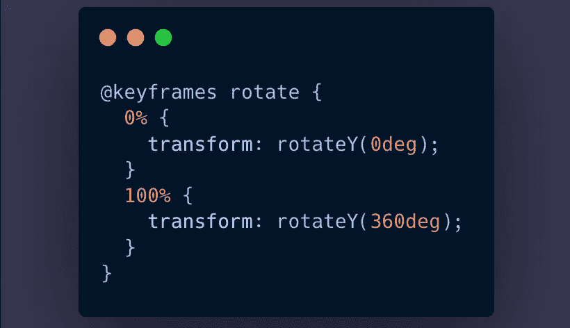*

*将以上动画添加到我们的`box-wrapper` —*

*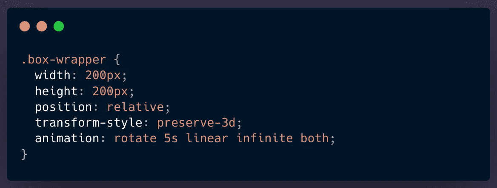*

*结果呢🤜🤛 —*

*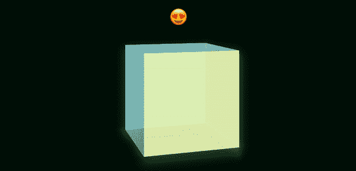*

*参考[这个库](https://github.com/ankita1010/css-cube)的工作代码，因为 **CSS 3D** 是一个魔术池。💫*

**请注意——我已经调整了透视值并添加了动画来实现侧面的最终位置，以更清晰地说明这些变化。另外，我将* `box-wrapper` *旋转了一点，这样从正确的角度看变化是最明显的。**

*非常感谢你看到了文章的结尾。在推特[上关注我](https://twitter.com/agile_bored)保持联系。🤝*

*干杯！*