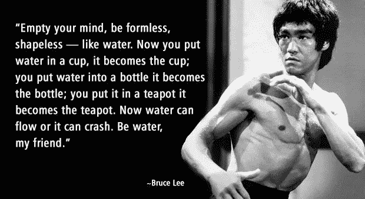
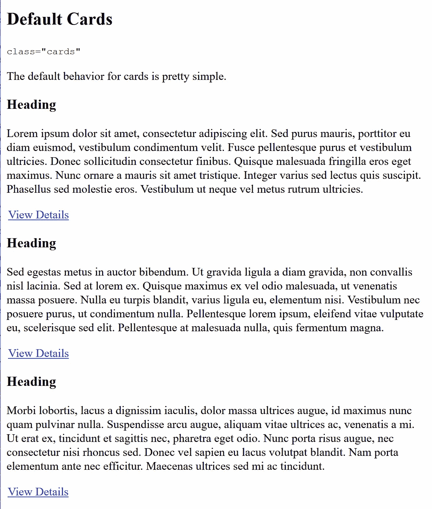

# CSS 布局——使用 Flex-Wrap 脱离网格

> 原文：<https://levelup.gitconnected.com/css-layouts-using-flex-wrap-to-get-off-the-grid-d7d6d279cfc9>

首先让我澄清一下，当我在这里谈论网格时，我不是在谈论“CSS3 网格布局模块”。我指的是将页面宽度分成固定数量的子单元的布局概念，例如屏幕宽度的十二分之一，预先确定的最大宽度，或者将东西分成 960 像素的片段。

回到 21 世纪，布局的最大问题是人们如何将它们创建为固定的宽度。网格成为其中的一部分，其中最常见的问题是“我应该设计多宽”。最常见的答案要么是 768 像素代表 800 像素友好，要么是 960 像素代表 1024 像素友好。基本上去掉 32 或 64px，为滚动条腾出空间。

这种心态是有缺陷的，因为:

1.  像素不是一个容易理解的字体标准，不管有多少蹩脚的借口或断章取义的曲解 WCAG 的说法。PX 不会根据用户偏好自动缩放，这就是为什么所有布局:字体大小；行高；填充；边距；宽度；媒体的询问应该尽可能在 EM 中进行！
2.  以固定宽度思考意味着没有人思考，因为显示器有各种尺寸和形状。你的布局应该能够通过流畅来自动调整。自动调整大小以适应可用空间。



响应式布局——通过媒体查询——的出现解决了这个问题，但人们仍然按照固定的宽度来思考。他们没有设计弹性(EM)和流体(动态宽度),而是使用网格思想将媒体查询断点视为一堆预先确定的宽度。

有时当然，某些元素应该有一个最大宽度。它有助于防止长文本难以理解*(说真的，你想在 3840 像素的 4k 显示宽度下找到 6 行段落的下一行吗？！？绝对不会。)*或将事物分割成更易理解的子部分，以便并排展示。但那是最大宽度，不是固定宽度。因此，这种想法被称为半流体设计，你有一个最大宽度，但如果需要的话，容器可以缩小到这个宽度以下。

**这种将页面视为由媒体查询控制的一堆独立的固定宽度布局的想法，实际上会导致比实际需要更复杂的代码库。为什么？**



普通的 HTML 可能并不漂亮，但是它是响应性的和可访问的！

# HTML 已经有响应了， ***你的*** CSS 正在撤销那个！

这听起来可能很奇怪…但是仔细想想。默认情况下，所有 HTML 元素要么是内联(短语)级，要么是块级。它们都没有固定的宽度。它们要么扩展以适应屏幕宽度，使其内容换行，要么收缩以适应其内容。没有中间地带。

只有你在 CSS 中所做的改变了这一点。比如声明固定宽度、百分比宽度列等。

但是，如果我们不考虑让内容适合预先确定的网格容器，而是翻转它，将每个子部分都视为自己的容器，并让自然的包装流程来完成繁重的工作，会怎么样呢？这意味着你可以让许多常见的布局响应**而不使用媒体查询！**


托比，给你一条鞭子！曾经是我的兄弟，现在你表现得好像不认识我一样。

# 人们哪里出错了

观察 HTML 和 CSS 的糟糕规划和糟糕使用的最佳地方之一当然是我最喜欢的替罪羊 Bootstrap。我称之为 bootcrap 是有原因的，因为在大多数情况下，人们真的需要找到一根棍子来刮掉它，然后才能在互联网的地毯上追踪它。

即使是最简单的结构，比如一堆响应卡片，它们也会以尽可能困难、复杂和破碎的方式进行。

他们对卡片部分的想法是这样的:

```
<div class="container">
  <!-- Example row of columns -->
  <div class="row">
    <div class="col-md-4 col-sm-6">
      <h2>Heading</h2>
      <p>Donec id elit non mi porta gravida at eget metus. Fusce dapibus, tellus ac cursus commodo, tortor mauris condimentum nibh, ut fermentum massa justo sit amet risus. Etiam porta sem malesuada magna mollis euismod. Donec sed odio dui. </p>
      <p><a href="#">View details &raquo;</a></p>
    </div>
    <div class="col-md-4 col-sm-6">
      <h2>Heading</h2>
      <p>Donec id elit non mi porta gravida at eget metus. Fusce dapibus, tellus ac cursus commodo, tortor mauris condimentum nibh, ut fermentum massa justo sit amet risus. Etiam porta sem malesuada magna mollis euismod. Donec sed odio dui. </p>
      <p><a href="#">View details &raquo;</a></p>
    </div>
    <div class="col-md-4 col-sm-6">
      <h2>Heading</h2>
      <p>Donec sed odio dui. Cras justo odio, dapibus ac facilisis in, egestas eget quam. Vestibulum id ligula porta felis euismod semper. Fusce dapibus, tellus ac cursus commodo, tortor mauris condimentum nibh, ut fermentum massa justo sit amet risus.</p>
      <p><a href="#">View details &raquo;</a></p>
    </div>
  </div>
</div><!-- /container -->
```

行容器是一个真正的抓头工具，因为他们免费得到了额外的 DIV 来包装它的“不再是一行”。这就好像他们不能让他们的大脑摆脱“布局的表格”的心态。正如我一位去世的好友常说的:

> 那些曾经做了无尽的毫无意义的桌子的人，现在做了无尽的毫无意义的 DIV。丹·舒尔茨

从标记的角度来看，两个突出的问题是空的“行”容器和在每个被破坏的项目上空的表示类的使用。“col-md-4 col-sm-6”不仅仅是一个愚蠢的、神秘的、带有 HTML 3 思想的表象类，它甚至没有必要。现在更是如此，甚至连 bootcrap 都转向了 flex。

如果我们深入研究这些类，我们会发现它们的整个 CSS 方法一直到容器都是无能的垃圾。

```
[@media](http://twitter.com/media) (min-width: 1200px)
.container, .container-lg, .container-md, .container-sm, .container-xl {
    max-width: 1140px;
}
[@media](http://twitter.com/media) (min-width: 992px)
.container, .container-lg, .container-md, .container-sm {
    max-width: 960px;
}
[@media](http://twitter.com/media) (min-width: 768px)
.container, .container-md, .container-sm {
    max-width: 720px;
}
[@media](http://twitter.com/media) (min-width: 576px)
.container, .container-sm {
    max-width: 540px;
}
.container, .container-fluid, .container-lg, .container-md, .container-sm, .container-xl {
    width: 100%;
    padding-right: 15px;
    padding-left: 15px;
    margin-right: auto;
    margin-left: auto;
}*, ::after, ::before {
    box-sizing: border-box;
}
```

像素度量查询、像素度量固定宽度、像素度量填充、100%宽度上的自动边距…这些小丑甚至理解可访问性或布局吗？*咄，当然不是！*

无意义的不必要的行 DIV 的 CSS 不是太糟糕，除了没有存在的理由…

```
.row {
    display: -ms-flexbox;
    display: flex;
    -ms-flex-wrap: wrap;
    flex-wrap: wrap;
    margin-right: -15px;
    margin-left: -15px;
}
```

他们启用了 flex wrap，这应该是一件好事，对吧？嗯，如果他们用就好了？容器上的+15 和行上的-15，为什么还要声明它呢？他们总是在容器上声明填充，而不是在内容上声明边距，这是想多了！如果所有的内容都有适当的页边距，你就不需要填充。容器或玩愚蠢的负利润把戏来克服它时，不可取的。

```
[@media](http://twitter.com/media) (min-width: 992px) {
.col-md-4 {
    -ms-flex: 0 0 33.333333%;
    flex: 0 0 33.333333%;
    max-width: 33.333333%;
}[@media](http://twitter.com/media) (min-width: 768px) {
.col-sm-6 {
    -ms-flex: 0 0 50%;
    flex: 0 0 50%;
    max-width: 50%;
}.col, .col-1, .col-10, .col-11, .col-12, .col-2, .col-3, .col-4, .col-5, .col-6, .col-7, .col-8, .col-9, .col-auto, .col-lg, .col-lg-1, .col-lg-10, .col-lg-11, .col-lg-12, .col-lg-2, .col-lg-3, .col-lg-4, .col-lg-5, .col-lg-6, .col-lg-7, .col-lg-8, .col-lg-9, .col-lg-auto, .col-md, .col-md-1, .col-md-10, .col-md-11, .col-md-12, .col-md-2, .col-md-3, .col-md-4, .col-md-5, .col-md-6, .col-md-7, .col-md-8, .col-md-9, .col-md-auto, .col-sm, .col-sm-1, .col-sm-10, .col-sm-11, .col-sm-12, .col-sm-2, .col-sm-3, .col-sm-4, .col-sm-5, .col-sm-6, .col-sm-7, .col-sm-8, .col-sm-9, .col-sm-auto, .col-xl, .col-xl-1, .col-xl-10, .col-xl-11, .col-xl-12, .col-xl-2, .col-xl-3, .col-xl-4, .col-xl-5, .col-xl-6, .col-xl-7, .col-xl-8, .col-xl-9, .col-xl-auto {
    position: relative;
    width: 100%;
    padding-right: 15px;
    padding-left: 15px;
}
```

再次是 PX 度量查询，因为他们有那些愚蠢的“无用的类”，他们不得不用减慢渲染速度的规则来膨胀他们的 CSS*(通过增加类的列表)*等等。

可悲的是，你不需要那些媒体的询问就能让这些栏目做出回应！

# 等等！没有媒体质疑的回应？！？

不完全是 T1，但要简单得多。与其一堆媒体查询， ***我们只需要一个。***

对于许多常见的布局样式来说，这其实非常容易。通常被称为“卡片”的布局是其中最简单的，因为它们都应该是相对统一的大小。

对于标记，我们非常相似，但是我们可以抛弃“空行”DIV 和外部包装中所有那些愚蠢的表示类。利用语义和 HTML 5 的“假装语义”在这里创造了奇迹。

```
<div class="cards">
  <section>
    <h3>Heading</h3>
    <p>
      Lorem ipsum dolor sit amet, consectetur adipiscing elit. Sed purus mauris, porttitor eu diam euismod, vestibulum condimentum velit. Fusce pellentesque purus et vestibulum ultricies. Donec sollicitudin consectetur finibus. Quisque malesuada fringilla eros eget maximus. Nunc ornare a mauris sit amet tristique. Integer varius sed lectus quis suscipit. Phasellus sed molestie eros. Vestibulum ut neque vel metus rutrum ultricies.
    </p><p>
      <a href="#">View Details</a>
    </p>
  </section><section>
    <h3>Heading</h3>
    <p>
      Sed egestas metus in auctor bibendum. Ut gravida ligula a diam gravida, non convallis nisl lacinia. Sed at lorem ex. Quisque maximus ex vel odio malesuada, ut venenatis massa posuere. Nulla eu turpis blandit, varius ligula eu, elementum nisi. 
    </p><p>
      <a href="#">View Details</a>
    </p>
  </section><section>
    <h3>Heading</h3>
    <p>
      Morbi lobortis, lacus a dignissim iaculis, dolor massa ultrices augue, id maximus nunc quam pulvinar nulla. Suspendisse arcu augue, aliquam vitae ultrices ac, venenatis a mi. Ut erat ex, tincidunt et sagittis nec, pharetra eget odio. Nunc porta risus augue, nec consectetur nisi rhoncus sed. Donec vel sapien eu lacus volutpat blandit. Nam porta elementum ante nec efficitur. Maecenas ultrices sed mi ac tincidunt.
    </p><p>
      <a href="#">View Details</a>
    </p>
  </section>
<!-- .cards --></div>
```

如果我们的 HTML 有一点意义的话，外部的 DIV 是我们唯一需要的钩子。

为了使这些在正常布局中完全响应，我们需要的是:

```
.cards {
 display:flex;
 flex-wrap:wrap;
 align-items:stretch;
 justify-content:center;
 max-width:89.999em;
 padding:0 1em;
 margin:0 auto;
}.cards > section {
 flex:1 0 20em;
 max-width:30em;
 margin:0 1em 2em;
}[@media](http://twitter.com/media) (max-width:30em) {
 .cards  {
  display:block;
 }
}
```

*注意，假设正在使用一个重置，包括空边距/填充，以及将所有内容设置为 box-sizing:border-box；*

Boom，我们不再需要像这样在一个部分中为每一个该死的列大小编写媒体查询，或者为每一个可能的组合将类放入标记中。只需声明 flex-grow，将 flex-shrink 设置为 none，使用 flex-basis 作为最小宽度，使用 max-width 作为最大尺寸。全面保证金，你就可以走了。即使是愚蠢的“负边距超过填充”的把戏也可以避免，只要记住 flex 边距不会崩溃，所以只需填充与边距相同的容器，然后繁荣，甚至是所有的边距。我们唯一需要媒体查询的是以最小的尺寸剥离单个动态调整大小的列的弹性。


朋友有各种各样的。这是事实！是真的！彩虹的所有颜色，从紫红色到蓝色。名字不一样，鞋子不搭配。有的喜欢扔，有的喜欢抓…

在父级的最大宽度内。卡片它会伸展以适应屏幕，直到我们减少到一列，在那里它会保持最大宽度，直到屏幕太小，在这一点上我们剥离 flex，它会自动适应剩余的空间。

**这样它适合所有的页面大小，**动态地适应**，而**不必为每个被破坏的断点修改类和值。而不用浪费时间考虑中间的具体屏幕尺寸。

*屏幕有各种尺寸。这是事实。是真的。*

# 现场演示

我把它放到了我的普通演示模板中:

 [## 无查询包装 Flex - Responsive

### 下面的布局根据可用空间调整每行的“卡片”数量。CSS 属性显示:flex 被使用…

cutcodedown.com](https://cutcodedown.com/for_others/medium_articles/flexOffTheGrid/flex.html) 

我还添加了一个更花哨的版本，其中有边框、背景、彩色标题和一个将锚点推到底部的列 flex:
[https://cutcodedown . com/for _ others/medium _ articles/flexOffTheGrid/flex fancy . html](https://cutcodedown.com/for_others/medium_articles/flexOffTheGrid/flexFancy.html)

请注意，它的标记丝毫没有改变。

同我所有的例子目录:
[https://cutcodedown . com/for _ others/medium _ articles/flexOffTheGrid/](https://cutcodedown.com/for_others/medium_articles/flexOffTheGrid/)

是敞开的，容易接触到黏糊糊的东西。你也可以在里面找到整个交易的摘要。

# 利弊

一如既往，我们先看看哪里出了问题。

## 不足之处

1.  没有遗产，也就是说，哦，太好了！
2.  我们并不打算通过加价来说明尺寸。这实际上不是一个问题，因为你不应该在第一个该死的地方这样做……但是对于 bootstrap / tailwind /其他愚蠢的框架呼吸者来说，这可能是不可行的。*谁最有可能不应该在第一时间尝试编写网站代码。*

## 优势

1.  只需要一次媒体查询
2.  不需要额外的“行”容器。
3.  通过利用语义标记，您可以避免为了更小的标记和更好的缓存利用而在任何事情上浪费表示类。
4.  通过在 EM 中工作，我们具有弹性，因此在可访问性方面要好得多。
5.  当我们为包容声明实际的最大宽度和最小宽度时，我们从网格中“解放”出来，允许大多数框架不允许的事情——比如每行五个。请记住，大多数流行的框架网格都是基于 12 的分数……所以你不可能跨越 5。

# 结论

我知道对你们中的一些人来说，这可能看起来过于简单，而其他人正目瞪口呆地盯着屏幕。

总的来说，如果你不再考虑去适应预先确定的网格，而是关注内容的需求，你会发现你的布局变得更干净、更容易、更简单。Flex-wrap 可以在没有媒体询问的情况下独自处理这么多事情，为您做了许多您可能会过度思考的工作。

*看在圣诞节的份上，* ***不要再用类来表达你想要的东西了！！！如果你认为像“w3-red”或“col-4-sm”或“box-shadow”这样的类是你应该做的事情，就承认失败，回去写 HTML 3.2，用所有那些字体/中心标签、align/bgcolor/border 属性和布局表格，你似乎都非常想念！***