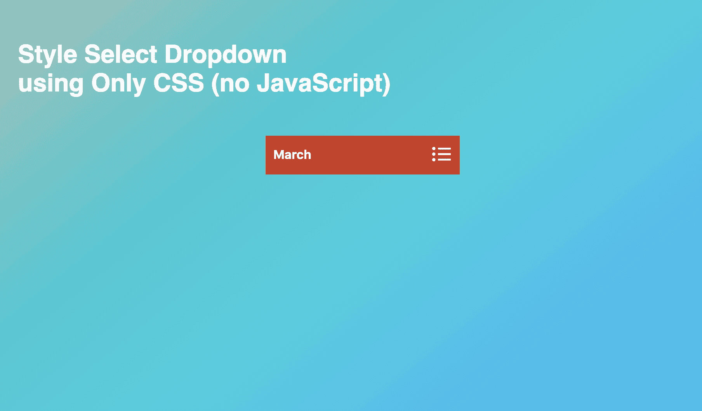
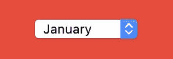
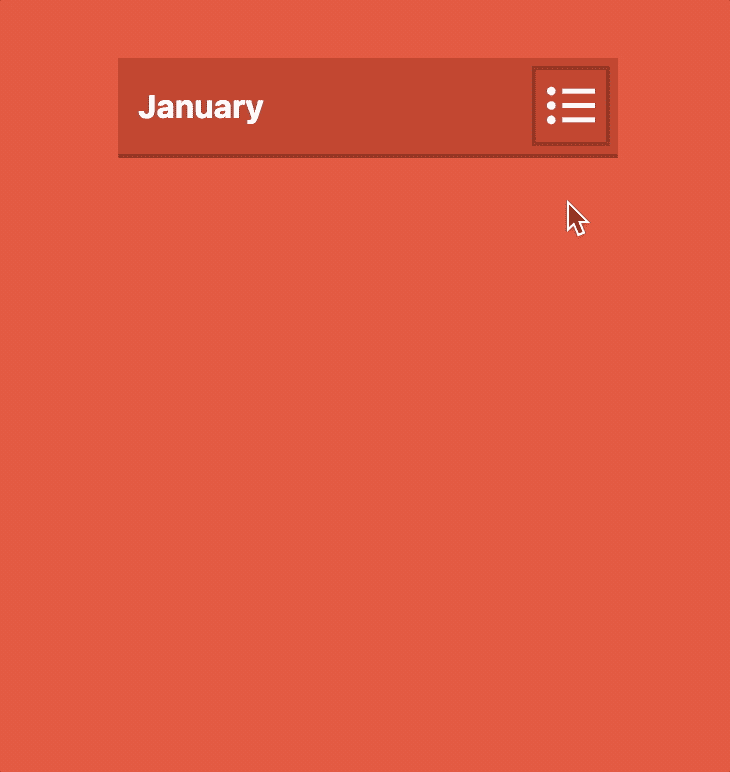
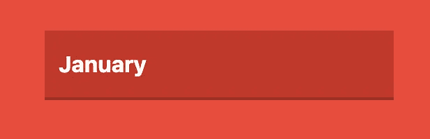
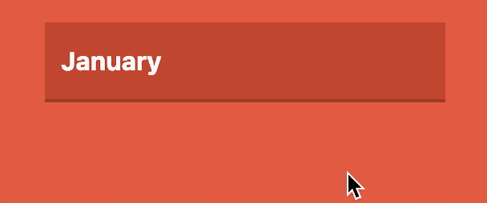

# 仅 CSS 自定义样式选择

> 原文：<https://levelup.gitconnected.com/css-only-custom-styled-select-99b1b022bfbf>

一个 HTML `select`元素，只用 CSS 直接样式化(根本不用 JavaScript)。IE10+和各大浏览器上风格一致。

[](https://skilled.dev) [## 编写面试问题

### 一个完整的平台，在这里我会教你找到下一份工作所需的一切，以及…

技术开发](https://skilled.dev) 

仅 CSS 自定义样式选择

长久以来,`select`元素很难在不同的浏览器中保持一致的样式。我们一直在使用 JavaScript 从不同的元素中构造一个类似 select 的控件。例如，我们使用无序列表`ul`或者使用`div`来构建定制的选择组件。

由于以下问题，JavaScript 变通方法很难维护:

*   💣无障碍挑战
*   💣对屏幕阅读器不利
*   💣难以在移动设备上使用，尤其是当选项列表很长时
*   💣禁用 JavaScript 时不起作用
*   也许对搜索引擎优化不好
*   需要维护更多的代码
*   出现 bug 的风险增加

## 一个简单的例子

首先，作为背景，这里有一个*非样式化的* `select`元素。根据您使用的浏览器，它看起来会有所不同。



Chrome 默认无样式选择

下面是同一个`select`元素，只使用 CSS 直接样式化。



纯 CSS 样式选择

# 第一步:基本外观

## HTML 标记

让我们只使用一个默认的 html 选择(没有任何额外的 HTML 标签):

```
<select>
  <option value="1">January</option>
  <option value="2">February</option>
  <option value="3">March</option>
  <option value="4">April</option>
  <option value="5">May</option>
  <option value="6">June</option>
  <option value="7">July</option>
  <option value="8">August</option>
  <option value="9">September</option>
  <option value="10">October</option>
  <option value="11">November</option>
  <option value="12">December</option>
</select>
```

## CSS

默认的下拉箭头和边框都是表单元素默认“外观”的一部分。所以，你需要确保`appearance: none;`在你的样式 css 中跨所有不同的浏览器设置。

```
*appearance*: none;
*-webkit-appearance*: none;
*-moz-appearance*: none;/* For IE <= 11 */
select::-ms-expand {
   *display*: none;
}
```

注意，IE ≤ 11 有一个特殊的伪类。

这是驱动选择外观的完整 CSS

```
select {
  width: 100%;
  height: 50px;
  font-size: 100%;
  font-weight: bold;
  cursor: pointer;
  border-radius: 0;
  background-color: #c0392b;
  border: none;
  border-bottom: 2px solid #962d22;
  color: white;
  padding: 10px;
  appearance: none;
  -webkit-appearance: none;
  -moz-appearance: none;
  padding: 10px;
}/* For IE <= 11 */
select::-ms-expand {
  display: none; 
}
```

现在，您应该能够看到:



CSS 样式选择的基本外观

# 步骤 2:添加悬停和聚焦效果

`:hover`选择器用于在鼠标悬停在元素上时选择元素。`:focus`选择器用于选择具有焦点的元素。让我们用`color`、`background-color`和`border-bottom-color`上的过渡效果`0.3s ease`来设计悬停和聚焦效果。

```
select {
  width: 100%;
  height: 50px;
  font-size: 100%;
  font-weight: bold;
  cursor: pointer;
  border-radius: 0;
  background-color: #c0392b;
  border: none;
  border-bottom: 2px solid #962d22;
  color: white;
  padding: 10px;
  padding-right: 38px;
  appearance: none;
  -webkit-appearance: none;
  -moz-appearance: none;
  /* Adding transition effect */
  transition: color 0.3s ease, background-color 0.3s ease, border-bottom-color 0.3s ease;
}/* For IE <= 11 */
select::-ms-expand {
  display: none; 
}select:hover,
select:focus {
  color: #c0392b;
  background-color: white;
  border-bottom-color: #DCDCDC;
}
```

现在，您应该能够看到这样的效果:



添加悬停和聚焦效果

# 步骤 3:在右侧添加自定义图标

为了改善外观，让我们在右侧添加一个自定义图像或图标，使其突出，更像一个下拉菜单。

## HTML 标记

让我们使用`svg`图标并将其放在`select`旁边。你可以很容易地从像 font-awesome 这样的开源库中找到任何免费的`svg`图标。

```
<select>
  <option value="1">January</option>
  <option value="2">February</option>
  <option value="3">March</option>
  <option value="4">April</option>
  <option value="5">May</option>
  <option value="6">June</option>
  <option value="7">July</option>
  <option value="8">August</option>
  <option value="9">September</option>
  <option value="10">October</option>
  <option value="11">November</option>
  <option value="12">December</option>
</select>
<div class="select-icon">
  <svg focusable="false" viewBox="0 0 104 128" width="25" height="35" class="icon">
    <path d="m2e1 95a9 9 0 0 1 -9 9 9 9 0 0 1 -9 -9 9 9 0 0 1 9 -9 9 9 0 0 1 9 9zm0-3e1a9 9 0 0 1 -9 9 9 9 0 0 1 -9 -9 9 9 0 0 1 9 -9 9 9 0 0 1 9 9zm0-3e1a9 9 0 0 1 -9 9 9 9 0 0 1 -9 -9 9 9 0 0 1 9 -9 9 9 0 0 1 9 9zm14 55h68v1e1h-68zm0-3e1h68v1e1h-68zm0-3e1h68v1e1h-68z"></path>
  </svg>
</div>
```

## CSS

这是图标的 CSS 样式。注意，我们使用了`background-color`和`border-color`过渡。

```
.select-icon {
  position: absolute;
  top: 4px;
  right: 4px;
  width: 30px;
  height: 36px;
  pointer-events: none;
  border: 2px solid #962d22;
  padding-left: 5px;
  transition: background-color 0.3s ease, border-color 0.3s ease;
}
.select-icon svg.icon {
  transition: fill 0.3s ease;
  fill: white;
}
```

这是图标的 CSS 悬停和聚焦效果。注意，CSS 选择器`~`用于选择`select`之前的`.select-icon`

```
select:hover ~ .select-icon,
select:focus ~ .select-icon {
  background-color: white;
  border-color: #DCDCDC;
}
select:hover ~ .select-icon svg.icon,
select:focus ~ .select-icon svg.icon {
  fill: #c0392b;
}
```

现在，您应该能够看到完成的自定义选择 like


已完成自定义选择

# 尽情享受吧！

仅此而已。感谢阅读，以下是完整代码:

[](https://skilled.dev) [## 编写面试问题

### 一个完整的平台，在这里我会教你找到下一份工作所需的一切，以及…

技术开发](https://skilled.dev)