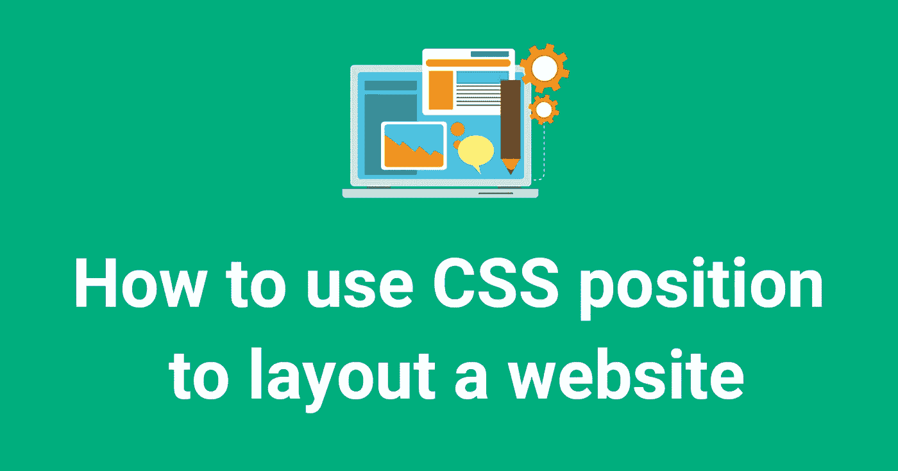
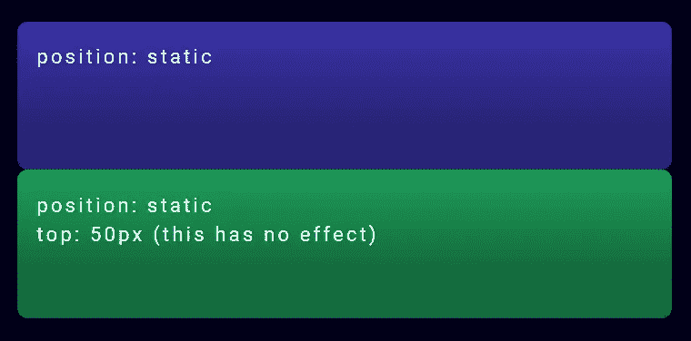
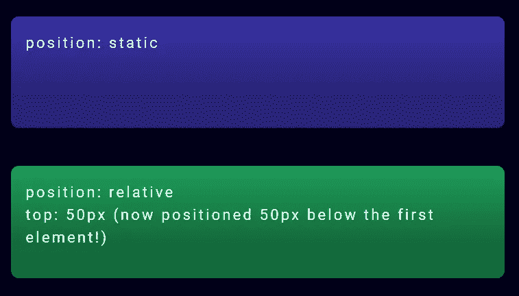
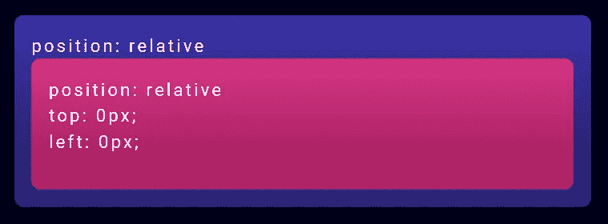

# CSS 位置属性:相对、绝对、静态、固定、粘性

> 原文：<https://levelup.gitconnected.com/css-position-property-relative-absolute-static-fixed-sticky-79a40275ed04>



使用 CSS 位置在你的网站上布局元素可能很难弄清楚。绝对、相对、固定、粘性有什么区别？很快就会变得混乱。

为了有所帮助，本教程将指导您完成所有的 CSS 位置属性。你将能够得到你的网站布局像素完美！

# CSS 职位是做什么的？

使用 CSS，你可以在你的网页上可视化地布局所有的元素。例如，您可以将一个元素放在页面的最顶端，或者比它前面的元素低 50px。

要控制元素在布局中的显示方式，需要使用 CSS `position`属性。此外，您还可以利用其他一些与位置相关的属性:`top`、`right`、`bottom`、`left`和`z-index`。(我们稍后将对此进行更深入的探讨。)

属性可以有五个不同的值:`static`、`relative`、`absolute`、`fixed`和`sticky`。

听起来很多，但是不用担心！

CSS `position`的每个值是如何工作的:

# 1.静态

`position: static`是一个元素将拥有的默认值。这意味着如果你没有为 CSS 中的一个元素声明`position`，它将自动被设置为`static`。

> *需要注意的是，拥有一个静态位置等同于根本没有设置* `*position*` *属性。(这将在稍后的绝对定位中发挥作用。)*

静态定位的元素将出现在页面上，我们称之为正常流程。例如，如果您有多个`<div>`元素，它们将一个接一个地出现在页面上，直接位于另一个的下方。

这里有一个快速演示来说明静态位置。我们使用以下 HTML 标记:

```
<div class="first purple"> position: static </div><div class="another green"> position: static<br> top: 50px (this has no effect) </div>
```

这是我们正在使用的 CSS:

```
.first {
    // No position set, so it's static 
} .another { 
  // No position set, so it's static top: 50px; 
}
```

第二个元素的`top`属性被设置为`50px`。你会认为这会把它向下移动 50px，对吗？

但是，这是它在网页上的外观:



因为两个元素都有一个静态位置，所以布局 CSS 属性都不起作用。这使得`top`属性对第二个元素的显示方式没有影响。

因此第二个元素直接位于第一个元素的下方，中间没有空间。

我们如何解决这个问题？让我们继续下一个位置:

# 2.亲戚

`position: relative`与`static`类似，相对定位的元素会遵循网页的正常流程。但是主要的区别是使用`relative`将解锁其他 CSS 布局属性。

请这样想:您正在设置元素相对于页面上其他元素的位置。

让我们看看这是什么样子，并像这样调整我们的 CSS:

```
.first { 
  position: static; 
} .another { 
  position: relative; 
  top: 50px; 
}
```

所有的 CSS 都完全一样，除了我们把第二个元素改成了使用`position: relative`。这样做使`top: 50px`工作！



您可以看到第二个元素现在比第一个元素低 50px，增加了它们之间的空间。

# 相对定位的父元素和子元素

让我们尝试另一个例子，使用一个父元素和嵌套在其中的子元素。两者都有`position: relative`设置。

这是它的 HTML:

```
<div class="parent purple">  
  <div class="child magenta"></div>
</div>
```

我们的 CSS 样式:

```
.parent { 
  position: relative; 
} .child { 
  position: relative; 
  top: 0px; 
  left: 0px; 
}
```

下面是这些代码在现实生活中的样子:



您可以看到粉红色的子元素很好地嵌套在紫色的父元素中。子对象也尽可能靠近父对象的顶部和左侧。(它将一直延伸到父文本)

位置相对比较直接，对吗？好吧，抓紧你的帽子，因为事情将会变得疯狂。

# 3.绝对的

`position: absolute`将导致一个元素被从网页正常流程中移除。

等等，那是什么意思？

所以以前，使用静态或相对定位，元素会很好地一个接一个地显示，这取决于它们在 HTML 标记中的顺序。但是在绝对定位的情况下，元素被完全从整个流中取出。

为了帮助解释，让我们做一个比较来说明相对定位和绝对定位的区别。

在前面的例子中，我们有一个父元素和一个子元素，两者都是相对定位的。子元素嵌套在父元素中。

让我们把那个孩子绝对定位在父代里！

我们的 CSS 现在看起来像这样:

```
.parent { 
  position: relative;
} .child { 
  position: absolute; 
  top: 0px; 
  left: 0px; 
}
```

粉色子元素现在看起来与我们的上一个示例非常不同:


虽然它仍在父元素的范围内，但它位于父元素的最顶部和最左侧。它甚至掩盖了父文本内容！

这是由于孩子的`top: 0px`和`left: 0px`风格，加上孩子被绝对定位。在正常的流程中，元素不会在其他元素之上(并覆盖其他元素)。

但是由于子元素是绝对的，它本质上与普通元素在不同的层上。所以它可以被放置在网页上其他内容的上面。

但是它将留在父元素的边界内——只要父元素设置了它的位置。这就引出了我们的下一点。

具有绝对位置的子元素还有一个棘手的方面…

# 绝对定位的元素需要相对于定位的祖先来定位自己。

当您使用`position: absolute`从正常流中取出一个元素时，它会寻找一个有自己位置集的祖先元素。这是为了让孩子知道应该相对于什么元素来定位自己。

那么，如果子元素是绝对定位的，但父元素没有位置集，会发生什么呢？

这是我们的 CSS 示例:

```
.parent { 
  // No position set, so it's static 
} .child { 
  position: absolute; 
  top: 0px; 
  left: 0px; 
}
```

这是最终网页的样子:


子元素现在已经脱离了父元素的范围，因为父元素没有位置集。子元素已经到达下一个(大的)父元素，在本例中是`<body>`元素，这是它所能到达的最大限度。

(一个有点悲伤的比喻是，这个“孤儿”正在祖先树上寻找将成为其“父母”的人。)

对于许多开发人员来说，这是 CSS 中意外行为的一个巨大原因。

如果你能记住总是设置子元素的父元素，将`position`设置为`relative`或`absolute`(在大多数情况下)，你将避免让你的子元素在页面上飞来飞去😊

因此，总结一下相对和绝对定位:

> *相对定位和绝对定位的主要区别在于* `*position: absolute*` *会将一个子元素完全带出文档的正常流程。并且该子元素将相对于具有自己的位置集的第一个父元素进行定位。*

最后两个`position`值`fixed`和`sticky`在某些方面与`position: absolute`相似。但是它们也和你在页面上的滚动位置有关。

让我们来看看:

# 4.固定的；不变的

`position: fixed`将元素从正常流程中取出，并将其放置在视窗中的相同位置(屏幕上可见)。这意味着滚动根本不会影响它的位置。

让我们看看这在代码中是什么样子的。这是我们的 HTML:

```
<div class="first purple"> 
  Lorem ipsum dolor sit amet, consectetur adipiscing elit.... 
</div> <div class="another green"></div>
```

在我们的 CSS 中，我们将第二个元素设置为`position: fixed`:

```
.first { 
  position: relative; 
} .another { 
  position: fixed; 
  top: 0px; 
  left: 0px; 
}
```

这里有一个代码笔来说明这一点:

绿色的固定元素将保持在视口的左上角。如果你滚动，紫色元素将正常向上滚动，但是绿色元素将停留在我们放置它的地方。

> ***提示*** *:固定元素必须有* `*top*` *或* `*bottom*` *位置集。如果没有，它将根本不存在于页面上。*

`position: fixed`通常用于制作总是贴在顶部的导航栏。这是一个超级有用的属性！

接下来，我们将看看粘性定位，它类似于固定定位，但有一点额外的内容。

# 5.粘的

`Position: sticky`元素最初的行为类似于`position: relative`元素，但是如果你继续滚动，它们会脱离正常的流程，无论你把它们放在哪里，它们的行为都类似于`position: fixed`。

如果你想把一个元素放在屏幕的顶端，这将非常有用。

在这个代码示例中，在两个包含大量文本的紫色元素之间有一个绿色的粘性元素。(滚动更好！)

```
<div class="first purple"> 
  Lorem ipsum dolor sit amet, consectetur adipiscing elit.... 
</div> <div class="another green"></div> <div class="purple"> 
  Lorem ipsum dolor sit amet, consectetur adipiscing elit.... 
</div>
```

粘性元素的 CSS:

```
.first { 
  position: relative; 
} .another { 
  position: sticky; 
  top: 0px; 
}
```

这是它在网页上的样子！

当您向下滚动页面时，当您看到绿色元素进入视口时，它看起来像一个正常的、相对定位的元素。但是当你不断滚动，而不是滚离页面，它会变得固定，并坚持在视窗的顶部。

就像固定元素一样，粘性元素必须在 CSS 中设置`top`或`bottom`。如果它没有它，元素将继续表现得好像它是相对定位的，并且永远不会变得有粘性。

> ***关于浏览器支持的说明:***
> 
> *目前，* `*position: sticky*` *还没有全面完整的支持。较新的浏览器版本支持它，但没有 IE 版本支持它。如果你正在做一个需要 IE 11 支持的客户项目，这可能很重要。你可以在*[*CanIUse.com*](https://caniuse.com/#feat=css-sticky)上查看当前支持

# 最后

我希望这篇教程和 CSS 定位的代码示例对你有所帮助！如果您有任何问题或反馈，请在下面留下您的评论😊

**其他资源:**

*   [Mozilla 开发者网络:CSS 职位](https://developer.mozilla.org/en-US/docs/Web/CSS/position)
*   [CSS 招数:位置](https://css-tricks.com/almanac/properties/p/position/)

# 想要更多吗？

📃在我的博客上阅读更多教程，【coder-coder.com 。
📮[在此注册以获取关于新文章的电子邮件](https://coder-coder.com/subscribe)。
💻我正在创建一门课程，初学者的反应式设计！[在此获取更新。](https://coder-coder.com/responsive-design-beginners/)