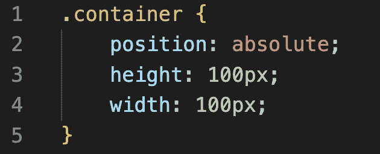
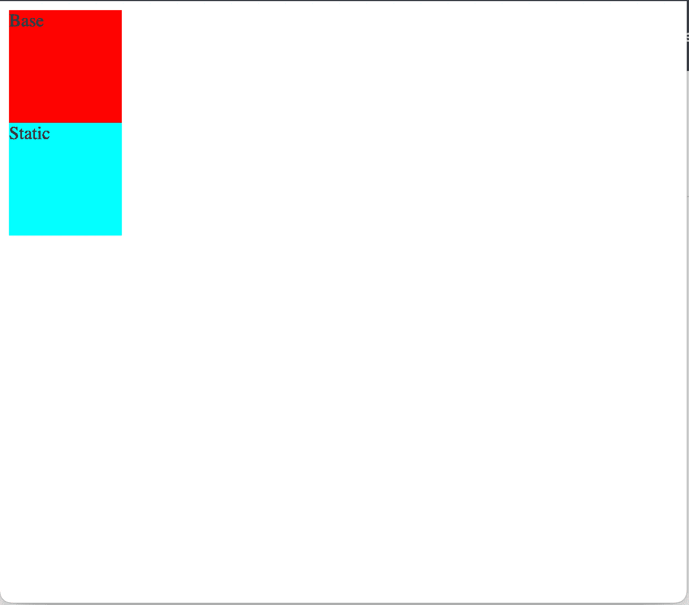
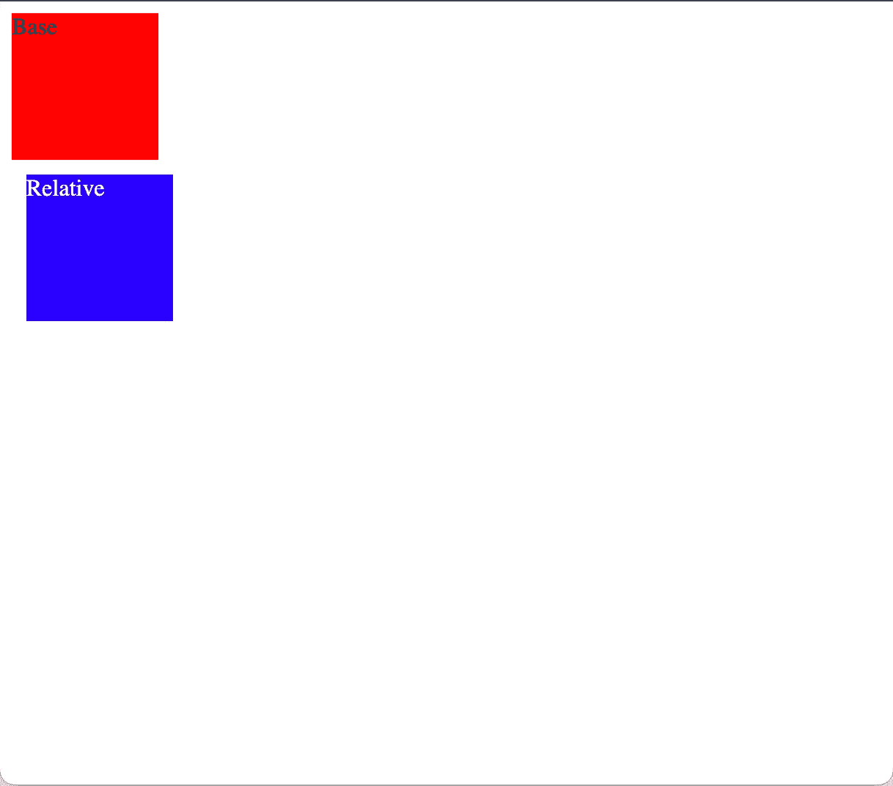
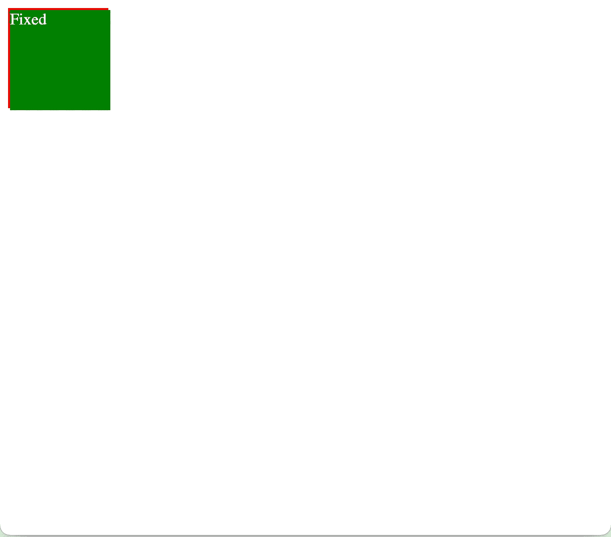
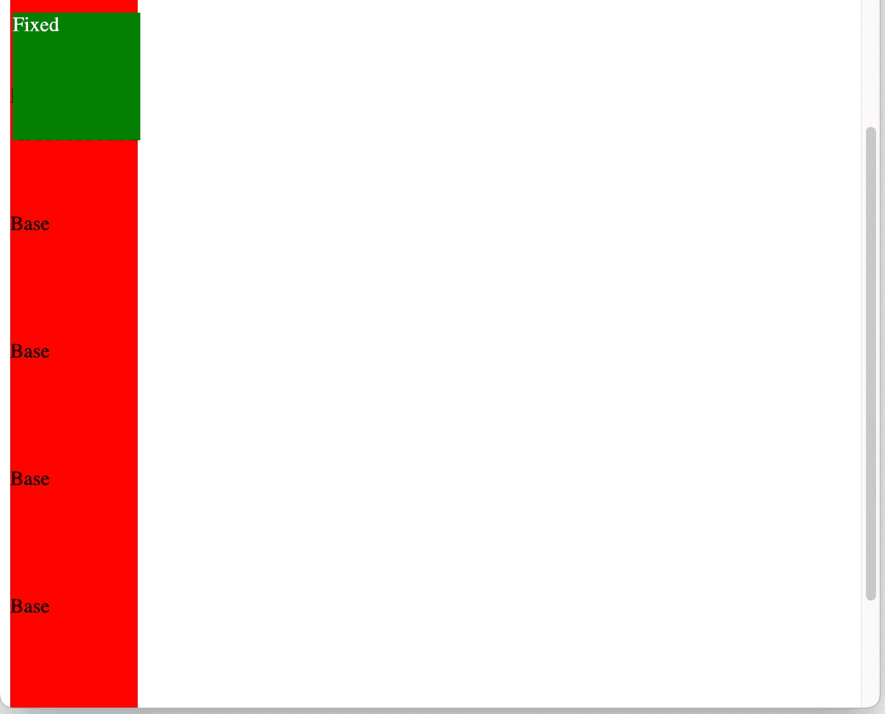
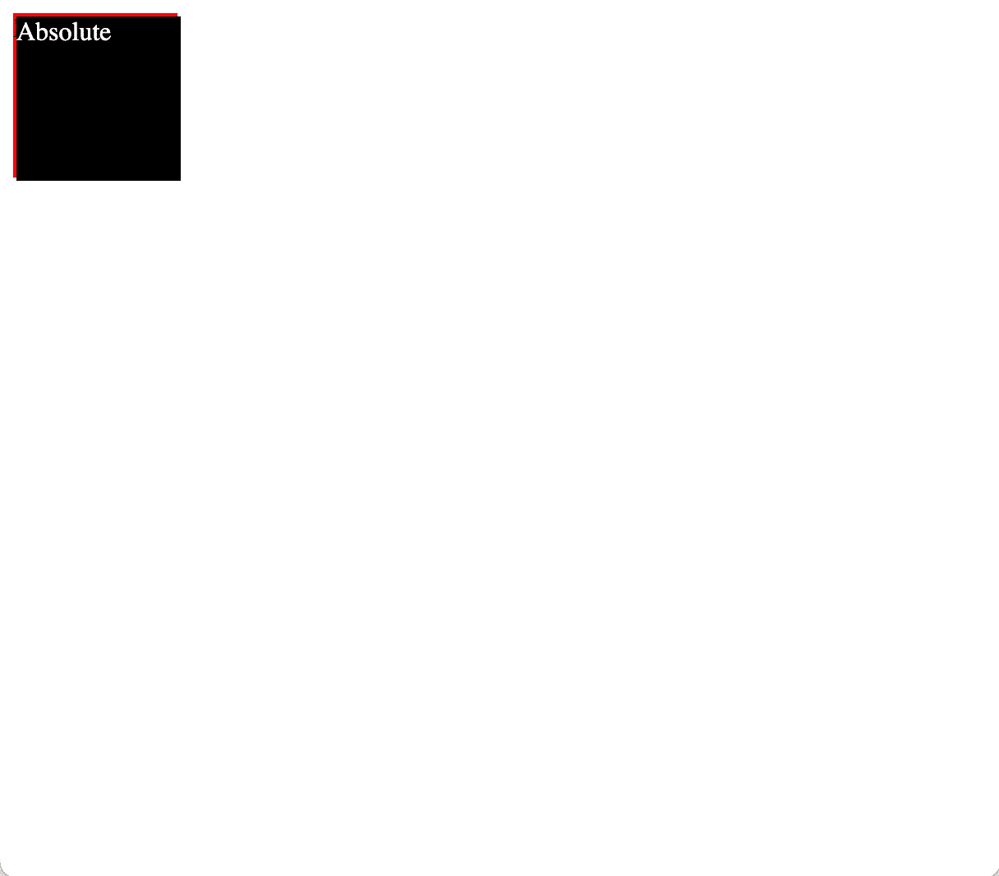
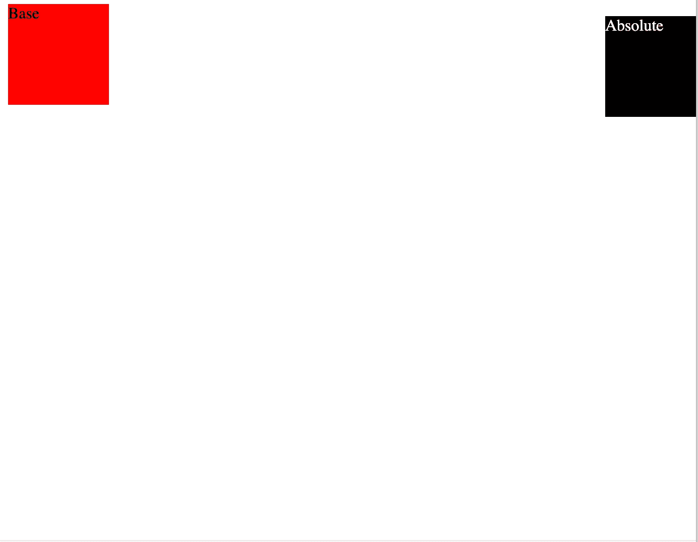
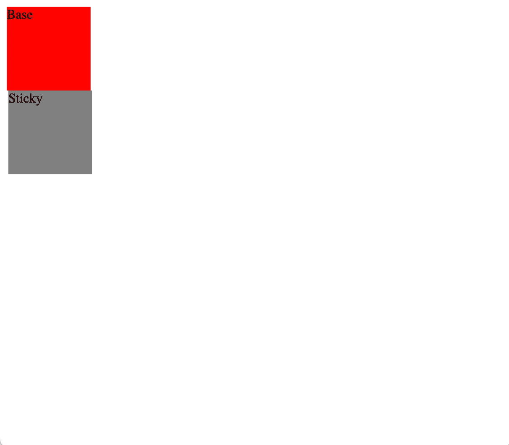
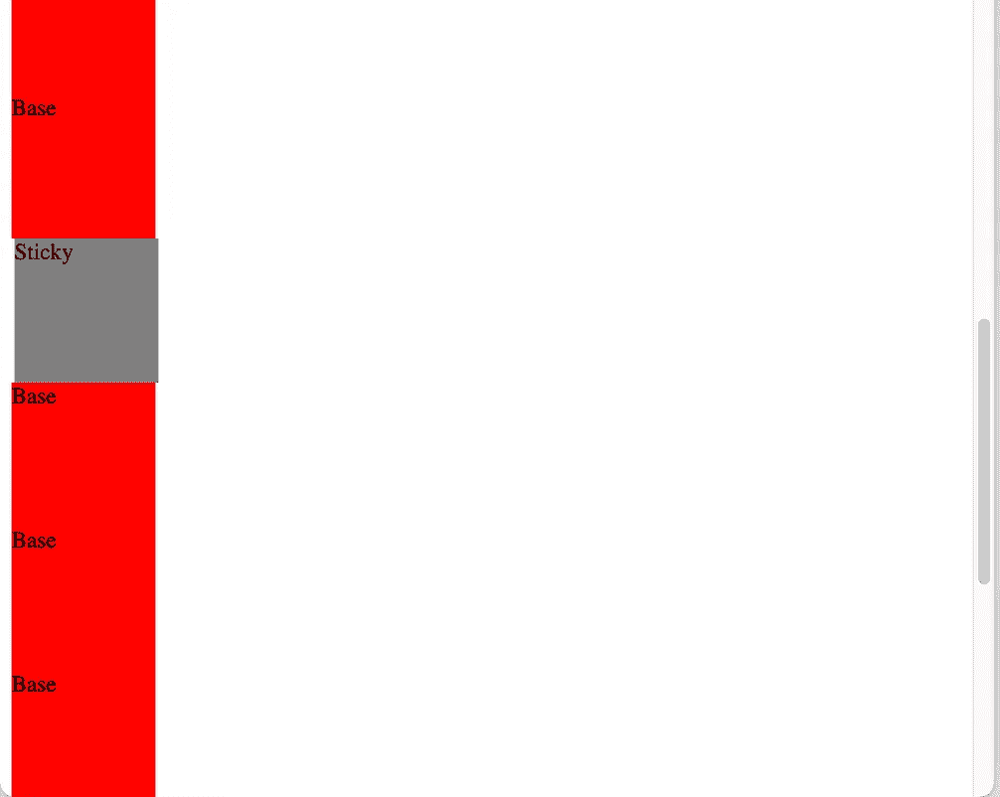
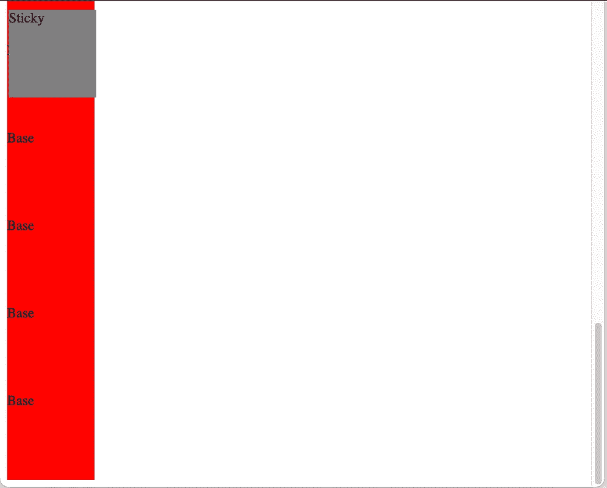

# CSS:位置和如何使用它们

> 原文：<https://levelup.gitconnected.com/css-positions-and-how-to-use-them-c00e62a7a0fa>

哦，CSS……许多开发人员对这项技术的爱恨情仇相当有趣。在本文中，我将详细介绍每个 CSS 位置，以便更好地理解这个属性如何在页面中移动元素。不要担心，我不会要求你在最后将一个 div 居中，但是希望你仍然能够这样做。

指定 HTML 元素的位置时，允许五种不同的值或类型。这些包括静态、相对、固定、绝对和粘性。下面是每种方法的特点，以及一些直观地展示每种方法在实践中的样子的例子。

(完整的代码示例可在 [GitHub](https://github.com/exosyphon/css) 上获得。)

**静态**

*   默认情况下，HTML 元素是静态定位的
*   静态定位的元素不受顶部、底部、左侧、右侧属性的影响
*   带有`position: static;`的元素不会以任何特殊方式定位，并且总是根据页面的正常流动来定位

示例 1:我们有两个 div，一个是红色的基本示例，另一个是我们的`position: static;`元素。我们的静态 div 有一个顶部和左侧的 10px 集合，但是你可以看到它并没有影响它。

**相对**

*   带有`position: relative;`的元素相对于其正常位置进行定位
*   设置相对定位元素的 top、right、bottom 和 left 属性将导致它被调整到远离正常位置的位置。其他内容将不会被调整以适合元素留下的任何间隙。

示例 1:我们有两个 div，一个是红色的基本示例，另一个是我们的`position: relative;`元素。我们的相对 div 有一个顶部和左侧的 10px 集合，你可以看到这次它*确实*将元素移动到了它通常被放置的位置。

**固定**

*   带有`position: fixed;`的元素是相对于视窗定位的，这意味着即使页面滚动，它也总是停留在同一位置。top、right、bottom 和 left 属性用于定位元素。
*   固定元素不会在页面中它通常所在的位置留下间隙。

示例 1:我们有两个 div，一个是红色的基本示例，另一个是我们的`position: fixed;`元素。我们的固定 div 有一个顶部和左侧的 10px 集合，您可以看到这次它将它保持在页面的左上角，而不是留下一个间隙，并允许它正常流动。

例 2:在这个例子中，我添加了几个基础 div 并向下滚动了大约一半。您可以看到，无论我如何滚动页面，我们的`fixed` div 都停留在同一个地方。

**绝对**

*   带有`position: absolute;`的元素相对于最近的祖先定位(而不是像`fixed`那样相对于视口定位)
*   如果绝对定位的元素没有定位的祖先，它使用文档正文并随着页面滚动移动。
*   绝对定位的元素从正常流中移除，并且可以重叠元素。如果你需要做一些自定义重叠，那么`absolute`就是你要利用的。

示例 1:我们有两个 div，一个是红色的基本示例，另一个是我们的`position: absolute;`元素。我们的`absolute` div 的行为与我们的`fixed` div 非常相似，它将自己定位在页面的左上角。

例子 2:如果我们想让一个元素部分离开页面，那么这里有一个使用`absolute`并设置`right: -10px;`的例子。

**粘粘的**

*   带有`position: sticky;`的元素基于用户的滚动位置定位。
*   粘性元素根据滚动位置在相对和固定之间切换。它相对定位，直到在视口中遇到给定的偏移位置，然后它“固定”在适当的位置(如`position: fixed`)。
*   如果你需要一个像弹出窗口或通知一样跟随用户的元素，那么`sticky`就是你想要的位置。

示例 1:我们有两个 div，一个是红色的基本示例，另一个是我们的`position: sticky;`元素。我们的`sticky` div 是我们的`fixed`和`relative`div 的混合，它位于我们的基本 div 之下，但是从顶部和左侧调整移动了一点。

示例 2:在这里，我在我们的`sticky` div 的上方和下方添加了一些基本 div，当我向下滚动时，它出现在视图中，但滚动过去后，它停留在屏幕的左上角。

# 结论

我希望这有助于您将来在设计组件样式时能够快速知道从哪个位置开始，而不必在几个位置之间摆弄。如果你对更多信息感兴趣，请查看职位上的 [W3Schools。如果你对完整的代码示例感兴趣，那么可以在](https://www.w3schools.com/css/css_positioning.asp) [GitHub](https://github.com/exosyphon/css) 上查看。我打算继续这个 CSS 系列，所以如果你有要求，不要害羞，让我知道！

如果你喜欢这篇文章，考虑[订阅媒体](https://medium.com/@ascourter/membership)！

如果你或你的公司有兴趣找人进行技术面试，那么请在 Twitter ( [@Exosyphon](http://twitter.com/Exosyphon) )上给我发 DM，或者访问我的[网站](https://andrewcourter.com/)。如果你喜欢这样的话题，那么你可能也会喜欢我的 Youtube 频道。如果你想支持更多这样的内容 [buymeacoffee](https://www.buymeacoffee.com/andrewcourter) 。祝您愉快！