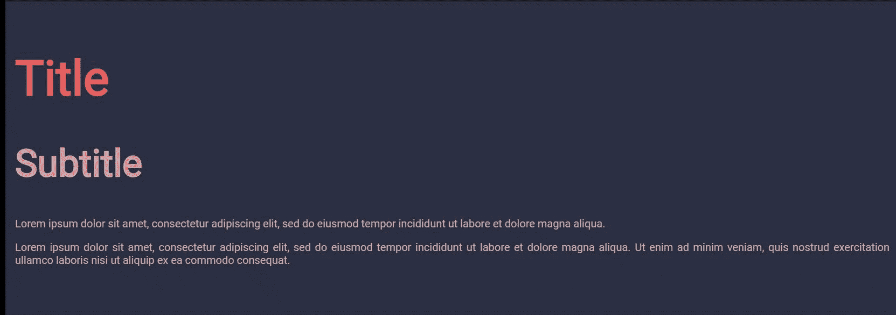
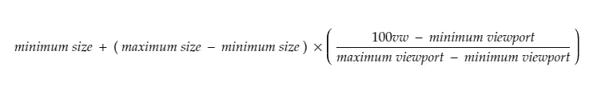

# CSS 响应流体排版

> 原文：<https://levelup.gitconnected.com/css-responsive-fluid-typography-a23a9aab19a>


照片由[格雷格·拉科齐](https://unsplash.com/@grakozy?utm_source=unsplash&utm_medium=referral&utm_content=creditCopyText)在 [Unsplash](https://unsplash.com/s/photos/css?utm_source=unsplash&utm_medium=referral&utm_content=creditCopyText) 上拍摄

这里有许多技术可以用来使字体大小与屏幕大小相适应。最常见的方法是只使用媒体查询，并为每个断点设置字体大小。但是 CSS3 提供了一些很棒的工具，可以用来使字体大小流畅，如下例所示:



CSS 流畅排版示例

# 使用视口单位

在视窗单元的帮助下，您可以创建流畅的排版，其中字体大小将根据屏幕大小进行缩放。这很容易理解。1 视口单位将是屏幕大小(宽/高)的 1%。

共有 4 个视口单位:`vw`(视口宽度)`vh`(视口高度)`vmin`(高度或宽度，以较小者为准)`vmax`(高度或宽度，以较大者为准)。

在本帖中，我们将主要关注`vw`。我们可以使用`vw`来声明字体大小，字体大小将根据屏幕大小平滑缩放。

```
p{
  font-size: 2vw;
}
```

但是仅使用视口单位，您将无法控制缩放。例如，对于较小的屏幕，字体大小可以非常小，而对于较大的屏幕，字体大小可以非常大。

# 使用 calc()限制缩放

我们可以使用 CSS 提供的`calc()`函数将缩放比例限制到最小字体大小。

```
p{
  font-size: calc(16px + 2vw);
}
```

在上面的例子中，我们将最小字体大小设置为 16px。但是，我们仍然无法精确控制规模。

# 使用公式精确控制缩放比例

使用下面的公式，我们可以精确控制字体大小的缩放，



由麦克制作的[配方](https://www.madebymike.com.au/writing/precise-control-responsive-typography/)

就 CSS 而言，我们可以这样写:

```
font-size: calc([minimum size] + ([maximum size] - [minimum size]) * ((100vw - [minimum viewport width]) / ([maximum viewport width] - [minimum viewport width])));
```

例如，如果我们希望字体大小从 768 像素到 1600 像素的屏幕宽度开始在 16 像素到 26 像素之间缩放，我们可以这样编写 CSS:

```
body{
font-size: calc(16px + (26 - 16) * ((100vw - 768px) / (1600 - 768))); 
}
```

> **注:请注意在公式**中何处添加带有单位的值以及何处仅添加值

这里我使用了像素，但是你也可以很容易地使用`em`，但是所有的值应该是相同的单位，即如果使用了`em`，那么视窗范围值也应该在`em`中。

但是，该公式没有设置字体大小的最小和最大限制，它只定义了字体在提供的视口宽度范围内的缩放率，因此字体大小可以小于/大于公式中设置的最小/最大字体大小。为了解决这个问题，我们必须使用媒体查询:

```
body{
font-size: calc(16px + (26 - 16) * ((100vw - 768px) / (1600 - 768))); 
}[@media](http://twitter.com/media) screen and (max-width: 768px) { body { font-size: 16px; } }[@media](http://twitter.com/media) screen and (min-width: 1600px) { body { font-size: 26px; } }
```

# 萨斯米辛

我已经创建了一个易于使用的 SASS mixin 的这个公式，你可以在任何项目中使用它来实现流畅的排版:

```
/* SASS mixin start *//// $min - Minimum font size (px, rem)
/// $max - Maximum font size (px, rem)
/// $min-vw - Minimum viewport value lock range (px) --(optional)
/// $max-vw - Maximum viewport value lock range (px) --(optional)
/// $fallback - fallback font size (px, rem) --(optional)[@mixin](http://twitter.com/mixin) fluid-font($min, $max, $min-vw: 768px, $max-vw: 1600px, $fallback: false) {
  $min-no-unit : strip-units($min);
  $max-no-unit : strip-units($max);

  $min-vw-no-unit : strip-units($min-vw);
  $max-vw-no-unit : strip-units($max-vw);

  [@if](http://twitter.com/if) getUnit($min) == "rem" or getUnit($min) == "em" {
    $min-no-unit : strip-units($min) * 16;
    $max-no-unit : strip-units($max) * 16;
  }

   $responsive : calc(#{$min-no-unit}px + (#{$max-no-unit} - #{$min-no-unit}) * ((100vw - #{$min-vw}) / (#{$max-vw-no-unit} - #{$min-vw-no-unit})));

  [@if](http://twitter.com/if) $fallback { font-size: $fallback; }
  [@else](http://twitter.com/else) { font-size: $max; }font-size:  $responsive;[@media](http://twitter.com/media) screen and (max-width: #{$min-vw}) { font-size: $min; }
   [@media](http://twitter.com/media) screen and (min-width: #{$max-vw}) { font-size: $max; }
}[@function](http://twitter.com/function) strip-units($number) {
  [@return](http://twitter.com/return) $number / ($number * 0 + 1);
}[@function](http://twitter.com/function) getUnit($value) {
  [@return](http://twitter.com/return) str-slice($value * 0 + "", 2, -1);
}/* SASS mixin end *//* Using SASS mixin */body{
[@include](http://twitter.com/include) fluid-font(30px, 90px); //give min max size range 
//@include fluid-font(1.875em, 5.625em); //also can use em values
}
```

您可以使用下面的 codepen 来试验 SASS mixin:

# 推荐的公式使用方式

您可以使用上面给出的 SASS mixin 为每个元素提供流畅的字体大小。但是推荐的使用公式的方法是将其应用于基本字体，即在 body 标签中，并使用 em 单位为所有元素提供字体大小。

因为`em`单位取决于基本字体大小。当基本字体大小流畅缩放时，所有的`em`单位也会缩放。

```
body{
  font-size: calc(21px + (30 - 21) * ((100vw - 768px) / (1600 - 768))); //setting base font size fluidly
}[@media](http://twitter.com/media) screen and (max-width: 768px) { body { font-size: 21px; } } 
[@media](http://twitter.com/media) screen and (min-width: 1600px) { body { font-size: 30px; } } h1{
    font-size: 3em; //em value will change fluidly as base font size changes
  }
 h2{
    font-size: 2.3em;
 }
 p{
    font-size: 0.7em;
 } 
```

您可以使用下面的代码笔试验这种方法:

因此，我们可以使用这种非常棒的技术，根据屏幕大小流畅地改变字体大小。

# 参考

*   [精确控制响应式排版](https://www.madebymike.com.au/writing/precise-control-responsive-typography/)
*   [CSS 视口单位](https://dev.opera.com/articles/css-viewport-units/)
*   [带 CSS 锁的灵活排版](https://blog.typekit.com/2016/08/17/flexible-typography-with-css-locks/)