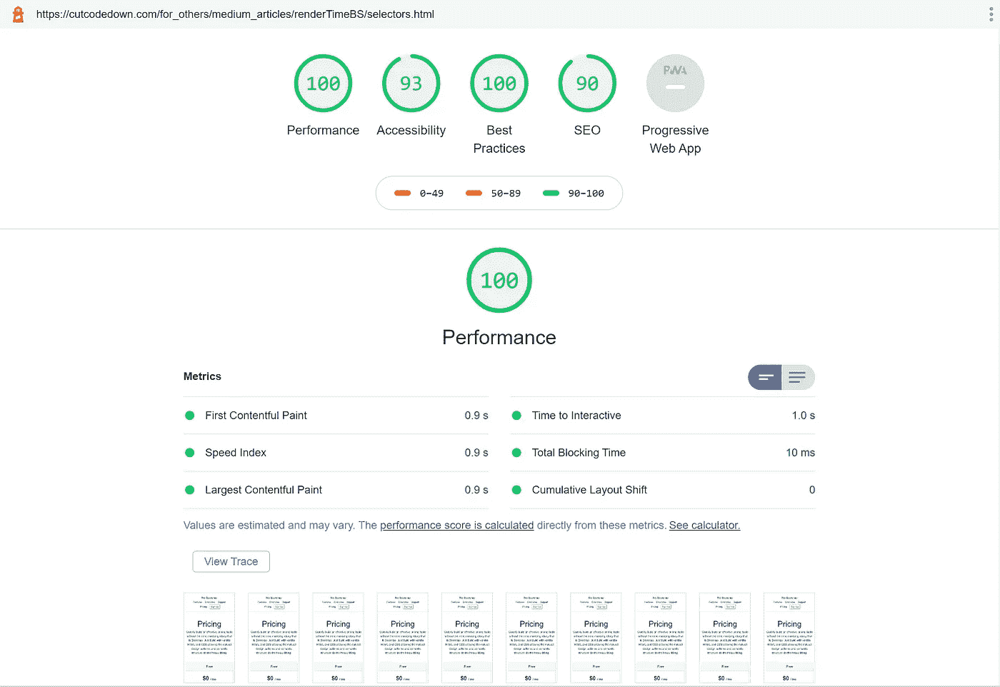

# “CSS 选择器/组合器很慢，类很快”——他们在骗你！

> 原文：<https://levelup.gitconnected.com/css-selectors-combinators-are-slow-classes-are-fast-theyre-lying-to-you-827ff7d15203>


真相会让你自由

# 谎言

如果你从事前端编码工作，你可能听说过这个:

> 使用类使得页面的渲染阶段比选择器和组合器加载得更快。选择器“慢”、“效率低”、“需要过多的 DOM 遍历”、“缺乏代码清晰度”等等。与其编写 CSS 依赖“复杂的”选择器来访问标签和组合子来利用它们的嵌套方式，不如将类放在所有东西上，或者为 CSS 属性创建单独的类来使页面“更快”。

**而且这个宣称是 100% A 级农场新鲜草原馅饼！我们正在通过一个锡喇叭谈论它。一部彻头彻尾的小说！！！**

这么多年来，我已经听到这个**谎言**被一次又一次地重复，以证明像 BEM、HTML/CSS 框架使用表示类以及许多其他不良实践这样的荒谬臃肿的实践是正确的。这是许多蹩脚的借口和童话般的废话中的一个，是人们拼命试图证明他们最喜欢的卖弄学问是正确的，不管这是多么彻底的废话。

不要给我更多的谎言作为相反的“证据”。这让你们听起来像一群低俗的邪教徒。“这个业内大腕说的吧”*(权威转自)*“这些人说的很棒”*(褒奖)*，百万人用*(跟风)*“对我管用”*(生存偏差，确认偏差，认知失调)*不是证明！那是营销和宣传，旨在让你感受而不是思考。就像*闪闪发光的“更容易”的概括性*或任何其他类似的大话。

如果你知道七种核心宣传技巧，你会很容易认出我上面选择的许多词。

# **那么这有什么问题呢？**

有许多错误的假设导致了同样有缺陷的结论，但它也违反了许多良好的实践。

## 关注点分离

特别是表示与内容的分离。如果你使用类来描述事物看起来是什么样子，就违背了 HTML 和 CSS 的目的，这又回到了 HTML 3.2 风格的最糟糕的实践中。这就是为什么 HTML/CSS 框架是无知、无能和不称职的纪念碑。

有可能以避免这种情况的方式使用类——参见被称为[“块元素修饰符”的心理侏儒，简称为](http://getbem.com)“BEM”——但是在这一点上，你只是添加了对现有标记来说多余的代码。

## 未能利用缓存

从标记中移出并放入外部样式表的代码越多，可以为子页或重访预先缓存的代码就越多。这就是为什么一个单一的样式表实际上可以用来使子页面加载速度极快，而代价是首次加载时的一点额外开销。虽然优化首次加载很重要，但是如果没有必要，不要在首次加载的祭坛上牺牲缓存的优势。

不可否认，对于那些在半打文件中浪费半兆字节 CSS 而在一个文件中做 48k 或更少的工作的人来说，这种争论毫无意义。

## 代码膨胀

如果你添加一个类——或者多个类——到所有的东西中，你就增加了代码的大小。根据经验，像 BEM 或 HTML/CSS 框架这样的系统通常会产生 2 到 10 倍的标记。

这种膨胀会影响页面交付链中的每一点。您最终会有更多的标记供任何后端代码粘贴在一起。您最终会有更多的代码需要进行 gzip 交付和本地解包。解析器需要处理更多的代码……当然也需要更多的带宽。

这么想吧，他们实际上是想告诉你，更多的标记会神奇地让你的页面加载和渲染得更快。如果那没有触发你的 BS 警报，你可能想要检查电池。

## 处理负载

如果你为每件事都有一个类，类的列表会变得更大。因为这些类是按名称索引的，所以对于解析器来说，这个更大的列表会变得越来越慢——因此对于呈现器来说也是如此——很难通过！在一个较小的综合测试中，你也许可以让类看起来比选择器更快，但是这是一个收益递减的例子，当你加载任何真正的页面时，它充其量是一个清洗，在最坏的情况下使页面更慢。

## 这不只是渲染时间的问题

浏览器呈现的部分——应用样式和绘图元素——只是页面加载图片的一小部分。正如我上面所说的，您还需要考虑服务器端、带宽、压缩开销，当然还有实际的浏览器解析器。

如果你在渲染过程中的其他地方损失了相同甚至更多的时间，那么优化渲染毫无意义！

## 代码清晰度

声称所有那些带有更多标记的类“有助于代码清晰”显然是荒谬的，我真想知道人们怎么会相信。*尽管最近我开始意识到，与其他人相比，我对清晰代码的构成有着完全不同的看法。*

说真的，你认为哪个代码库更干净、更清晰或者更容易理解？

```
<div class="d-flex flex-column flex-md-row align-items-center p-3 px-md-4 mb-3 bg-white border-bottom shadow-sm">
  <h5 class="my-0 mr-md-auto font-weight-normal">Company name</h5>
  <nav class="my-2 my-md-0 mr-md-3">
    <a class="p-2 text-dark" href="#">Features</a>
    <a class="p-2 text-dark" href="#">Enterprise</a>
    <a class="p-2 text-dark" href="#">Support</a>
    <a class="p-2 text-dark" href="#">Pricing</a>
  </nav>
  <a class="btn btn-outline-primary" href="#">Sign up</a>
</div>
```

或者

```
<header id="top">
 <h1>Company Name</h1>
 <ul>
  <li><a href="#">Features</a></li>
  <li><a href="#">Enterprise</a></li>
  <li><a href="#">Support</a></li>
  <li><a href="#">Pricing</a></li>
  <li><a href="#" class="userAction">Sign Up</a></li>
  </ul>
</header>
```

再次，将表示与内容分离；什么东西看起来像是已经在你的 HTML 中炸开了生意的 **ZERO** 。

当服务器将内容粘贴到模板时，哪一个对服务器来说工作量更少？哪一个保持了关注点的分离，所以你不会把屏幕媒体的概念扔给非屏幕用户代理？哪一种加载速度更快？

给你个提示，不是那个费力不讨好的人。不开玩笑，第一个片段直接来自 bootstrap 的定价示例。

当然，上述所有论点的意思是杰克如果你不能…

# 证明一下！

测试永远是最重要的部分。事实上，我很惊讶，要么是我的 Google-fu 让我很失望，要么是没有人为此做过合法的测试。

## 构建我们的测试用例

最初我打算使用 Bootstrap 的定价示例作为我们的“一切类”基线，但我认为这不公平，因为 HTML/CSS 框架如何“做他们的事情”的膨胀开销可能会不公平地使结果偏向“选择器”方法。

但是它是真实内容、真实布局等等的一个很好的例子…所以我想我要做的是把它克隆成一个普通的选择器和一个 BEM 版本。最初我不想挑出 BEM，但它是一个典型的无意义的有缺陷的思维，导致人们想出这些类型的谎言。这种欺骗和不诚实的根源在于转移批评和为不良行为辩护的需要。

BEM 的所有意图和目的都是围绕这样一个想法构建的:在任何事情上抛出无止境的、无意义的、愚蠢的**冗余的**类。这在某种程度上使我实现起来比“从头开始”版本的 bootcrap 更快，它不包括我们不使用的所有部分。

因此，我们有两个测试页面要扔进八边形中进行讨论。

**选择器驱动:**
[https://cutcodedown . com/for _ others/medium _ articles/render timebs/selectors . html](https://cutcodedown.com/for_others/medium_articles/renderTimeBS/selectors.html)

**BEM 版本:**
[https://cutcode down . com/for _ others/medium _ articles/render timebs/BEM . html](https://cutcodedown.com/for_others/medium_articles/renderTimeBS/bem.html)

**它们所在的目录:**
[https://cutcode down . com/for _ others/medium _ articles/render timebs/](https://cutcodedown.com/for_others/medium_articles/renderTimeBS/)

是敞开的，容易接触到黏糊糊的东西。

在这两个页面中，我将价格元素的数量增加到多达 330 个，以最大化文件大小和呈现/解析页面所需的时间。如果我们像最初的 bootstrap 示例一样只使用三个，就没有足够的“时间”来抵消任何误差，因为除了任何带宽问题之外，两个都需要不到 50 毫秒的时间。

在选择器版本中，我尽可能避免使用类和 ID，只在明显需要它们的部分容器和唯一元素中使用它们。

正如我们所看到的，基于选择器的重写是 95k 的 HTML，而 BEM 版本使用了 182k 的标记。如我所说，加倍代码。即使我们将它们缩小到只有三个元素，对于“选择器”来说也是 2.62k，对于 BEM 来说是 4.89k..所以它实际上是成比例的。还要注意 CSS 如何分别达到 3.6k 和 3.65k，所以实际上 CSS 大小不应该是一个因素。

## 测试方法

最明显的工具是 Lighthouse。内置到 Chrome-like 这些天来，它是一个容易去与可靠的结果。我进行了多次测试(每次十次),以消除任何异常值。在这种情况下，只有边界元法的版本有一个不一致的结果，这是如此的左领域和如此倾斜反对它，我完全拒绝它。(它得了 62 分)

结果呢？嗯……不言自明。

使用选择器:



选择器似乎很快，哦不，10 毫秒“阻塞”

那么对于 BEM:


看看吧，BEM 在画出有意义的画时整整慢了十分之一秒。

如果这个“渲染时间”公牛以任何方式、形状或形式基于现实，边界元版本应该绕着非边界元版本运行。

同样，如果我们看一下表演瀑布，放大到大约 280 毫秒…

**选择器:**


选择器驱动是高性能的！

**贝姆:**


阶级驱动…没那么多。

你还可以看到一些有趣的恶作剧。构建所有 DOM 类并优化其列表的要求实际上是**阻塞**“DOM 内容已加载”……你知道灯塔报告中为“选择器”版本列出的 10ms“阻塞”吗？这就是我们在这里看到的。它没有阻止，只是在 DCL 之前藏了起来！

让我们再说一遍，如果你有足够多的类，并且用它们代替选择器和组合子，**你实际上阻止了 onload 和 DomContentLoaded** 在你初始绘制之后发生！

然而更重要的是，在 BEM 版本中，在“第一次绘制”(图表中的绿色 FP)之前，更多的代码看到了更大的差距？向较大文件大小的开销和解析器在真正进行渲染之前不得不浪费额外的时间问好！

随着这一切的发生。你猜怎么着？任何测量渲染的尝试都是错误的。

我在几十种不同类型的页面上运行了几十种不同的测试，它们都返回了相同的结果。任何对更快加载或更快渲染的要求都是完全的胡言乱语，无论如何，都不符合现实！我不在乎网上有多少声称相反的文章…甚至这个网站！这是愚蠢的，糊涂的胡言乱语，背后只不过是毫无根据的疯狂主张和同样陈腐谎言的盲目鹦鹉学舌。

## 那是性能，那代码清晰度呢？

嗯，那里也是一片废墟。在标记中，它变得越来越难维护。让我们只看第一张价格卡本身。

BEM 版本的标记:

```
<section class="priceCards__section">
  <h3 class="priceCards__h3">Free</h3>
  <ul class="priceCards__ul">
    <li class="priceCards__li"><strong class="priceCards__strong">$0 <span class="priceCards__span">/ mo</span></strong></li>
    <li class="priceCards__li">10 users included</li>
    <li class="priceCards__li">2 GB of storage</li>
    <li class="priceCards__li">Email support</li>
    <li class="priceCards__li">Help center access</li>
  </ul>
  <a href="#" class="priceCards__a">Sign up for free</a>
</section>
```

愚蠢的冗余类占据了一半以上的代码，甚至很难看到语义和附带事件。

“选择器”版本的标记:

```
<section>
  <h3>Free</h3>
  <ul>
    <li><strong>$0 <span>/ mo</span></strong></li>
    <li>10 users included</li>
    <li>2 GB of storage</li>
    <li>Email support</li>
    <li>Help center access</li>
  </ul>
  <a href="#">Sign up for free</a>
</section>
```

更小、更干净、更简单、更容易理解。在 CSS 这边？让我们以 H3 为例。如果以下两者之间存在差异:

```
.priceCards__h3 {
```

和

```
.priceCards h3 {
```

对你来说有这么大的不同吗？抓住现实，伙计们。这是妄想的胡说八道。

# 结论

正如我刚才所展示的，使用“空类”删除两次标记并不会使页面“渲染得更快”或“加载得更快”,也不会像粉丝们告诉你的“让我们在任何事情上都抛出类”那样荒谬。

我们可以看到，任何实际有用的时间差——至少根据 light house——都是可以忽略不计的，如果有什么对不太喜欢上课的人有利的话。一旦我们深入到负载和油漆时间的本质，索赔的真正欺骗性是有目共睹的！

坦率地说，任何人说类“比选择器快”或者你“不应该使用标签选择器和结合子，因为它们更慢”或者任何其他类似的大话实际上都是在吹牛。


这也是为什么越来越多的网站所有者开始将前端开发者视为骗子、假货、伪君子、骗子、江湖骗子，以及一大堆你能想到的骗子的代名词。

在你的《放克与瓦格纳》中查找。

# 其他需要注意的谎言

这个行业充斥着无时无刻不在欺骗我们的“大牌”。此类谎言包括:

*   将“折叠之上”的 CSS 移动到标记中会使页面加载更快。
*   与底层语言相比，框架“更容易”、“更适合协作”、“加速开发”或任何其他优点。
*   没人关心底层代码
*   这个网站的可访问性并不重要，那不是我们的观众。
*   表格渲染速度较慢，所以不要使用它们。

最后一个是喜剧黄金，因为它只是 2000 年早期的版本，与类对选择器/组合子一样。“渲染时间”是一个老掉牙的谎言，只是在最近几年才重新流行起来。可笑的是，很多时候，提出这种说法的人是为同一家公司工作的，这些公司为我们提供了证明他们有多么错误的工具。