# CSS 选择器(第 1 部分):组合子，属性，伪选择器，伪类

> 原文：<https://levelup.gitconnected.com/css-selectors-part-1-4dd84e578a4b>

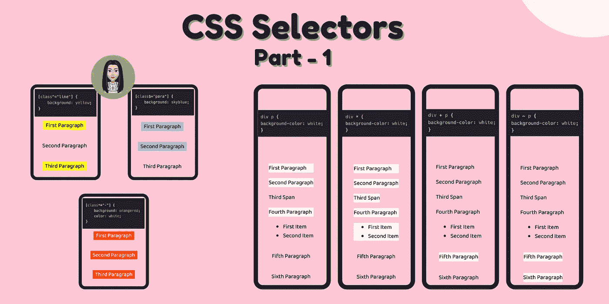

CSS 选择器第 1 部分

选择器用于选择 HTML 文档中的元素，以便为它们附加(样式)属性。

最常用的 CSS 选择器是 by `class`和 by `id`，然而，有许多选择器可以让你简单而公平地将样式添加到一组元素中。

A.**组合子**

B.**属性选择器**

C.**伪选择器**

D.**伪类**

在这篇文章中，我将讨论除了类和 id 之外的不同的选择器，并将涵盖**组合子**和**属性选择器**。

我们将对所有属性选择器使用下面的 HTML 代码片段:

```
<div>
    <p>First Paragraph</p>
    <p>Second Paragraph</p>
    <span>Third Span</span>
    <p>Fourth Paragraph</p>
    <ul>
        <li>First Item</li>
        <li>Second Item</li>
    </ul>
</div><p>Fifth Paragraph</p>
<p>Sixth Paragraph</p>
```

# A.组合子

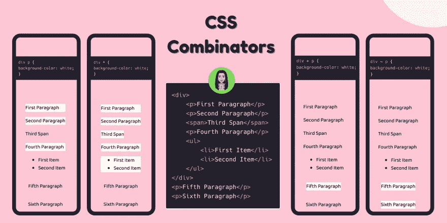

1.  后代选择器
2.  通用选择器
3.  相邻兄弟选择器
4.  通用兄弟选择器
5.  子选择器

# 1️.后代选择器

它选择另一个元素中的一个元素。这将选择 div 中的所有 p 元素。

```
div p {
    background-color: #fdc7d5;
}
```

输出:

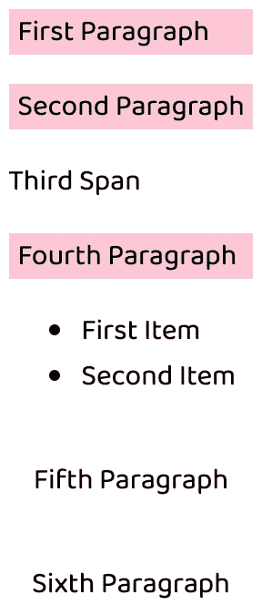

# 2️.通用选择器

您可以使用通用选择器选择所有元素。

```
div * {
  background-color: #fdc7d5;
}
```

div *选择所有 div 元素中的任意元素。

输出:

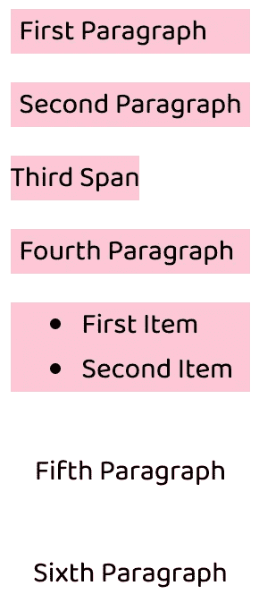

# 3️.相邻兄弟选择器

它选择直接跟在另一个元素后面的元素。

```
div + p {
  background-color: #fdc7d5;
}
```

这将选择直接跟在 div 标签后面的 p 元素。跟在另一个元素后面的元素称为兄弟元素。

输出:

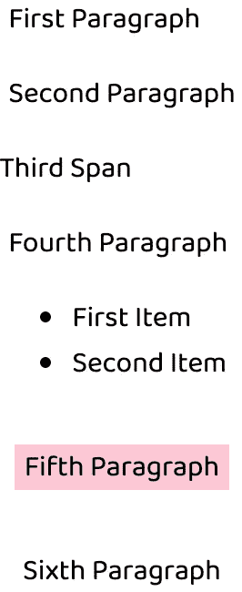

# 4️.通用兄弟选择器

您可以选择它后面的元素的所有同级元素。这类似于相邻的选择器(div + p ),但是这个选择器获得了以下所有元素，而不是一个。

```
div ~ p {
  background-color: #fdc7d5;
}
```

输出:

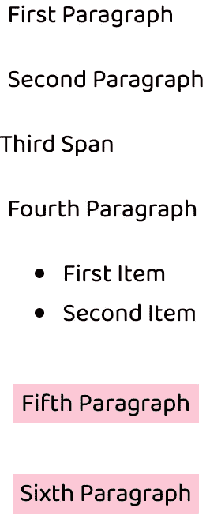

# 5️.子选择器

它选择元素的直接子元素。您可以选择其他元素的直接子元素。

```
div > p {
  background-color: #fdc7d5;
}
```

`div > p`选择所有`p`的直接子`div`。

输出:


# B.属性选择器

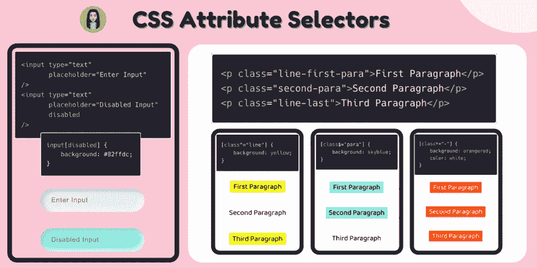

它通过将属性选择器添加到末尾，将属性选择器与另一个选择器组合在一起。

```
<input type="text" placeholder="Enter Input" />
<input type="text" placeholder="Disabled Input" disabled />
```

`input[disabled]`选择所有属性被禁用的输入元素。

```
input[disabled] {
    background: #82ffdc;
}
```

输出:

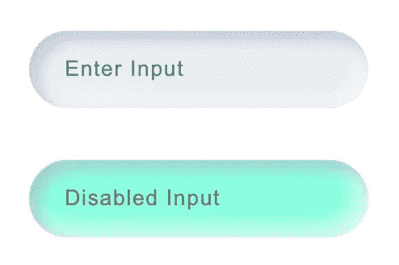

# 属性选择器的类型:

1.  属性值选择器
2.  属性以选择器开始
3.  属性以选择器结尾
4.  属性通配符选择器

**我们将使用下面的属性选择器 HTML 模板:**

```
<p class="line-first-para">First Paragraph</p>
<p class="second-para">Second Paragraph</p>
<p class="line-last">Third Paragraph</p>
```

# 1️.属性值选择器

`input[type="checkbox"]`选择所有复选框输入元素。

```
input[type="checkbox"] {
  font-size: 18px;
  margin-top: 3rem;
}
```

# 2️.属性以选择器开始

`[class^="line"]`用 class="line "和`class="line"`或`class="line-first-para"`选择元素。

```
[class^="line"] {
    background: yellow;
}
```

输出:

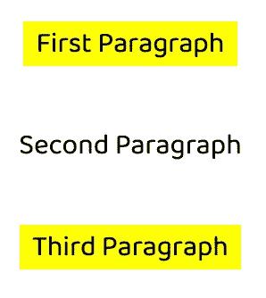

# 3️.属性以选择器结尾

`[class$="para"]`选择所有以`para`结尾的段落。

```
[class$="para"] {
    background: skyblue;
}
```

输出:

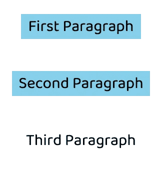

# 4️.属性通配符选择器

`[class*="-"]`选择类中所有带“-”的元素，如 class="second-para "或 class="third-para "。

```
[class*="-"] {
    background: orangered;
    color: white;
}
```

输出:

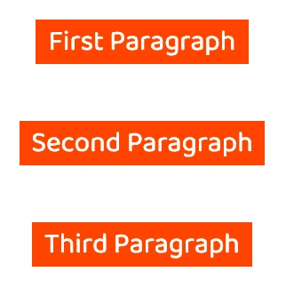

# 参考🧐

*   [组合子 MDN](https://developer.mozilla.org/en-US/docs/Learn/CSS/Building_blocks/Selectors/Combinators)
*   [属性选择器 MDN](https://developer.mozilla.org/en-US/docs/Web/CSS/Attribute_selectors)

🌟[推特](https://twitter.com/suprabhasupi) |👩🏻‍💻Suprabha.me 🌟 [Instagram](https://www.instagram.com/suprabhasupi/)